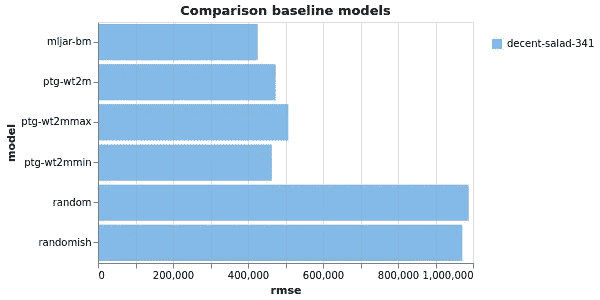
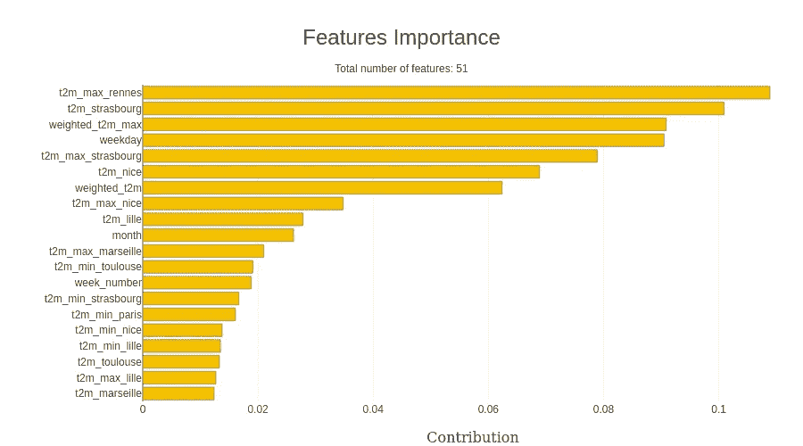
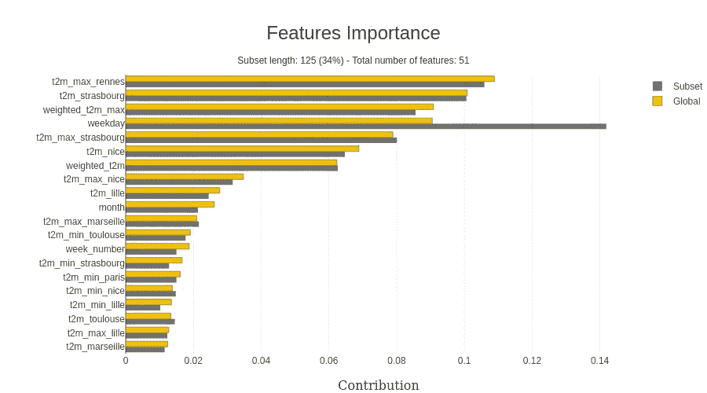
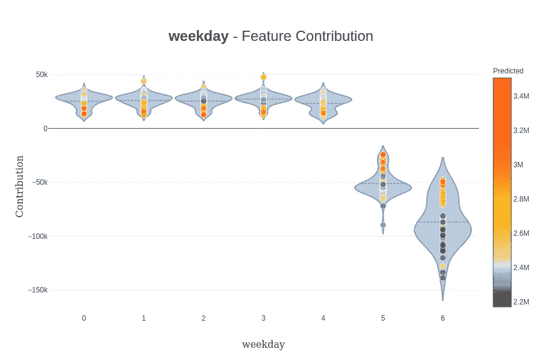
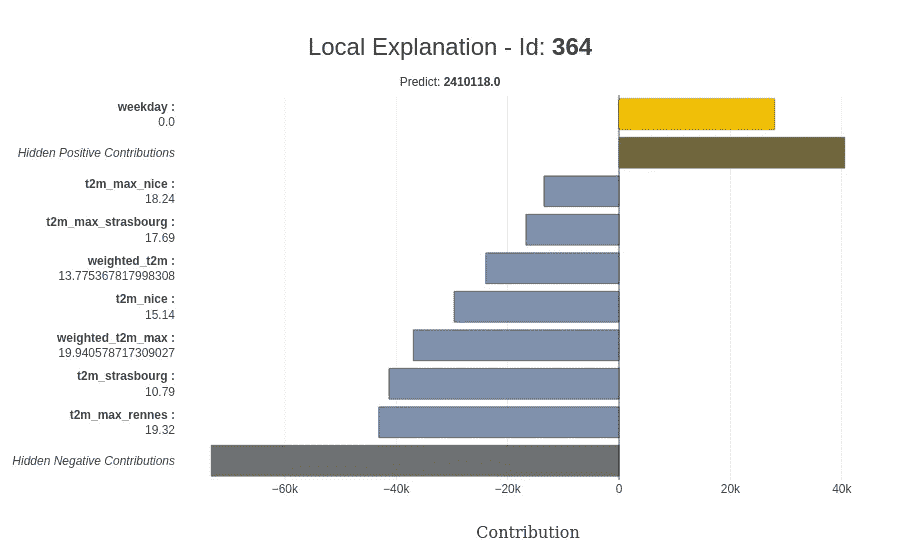
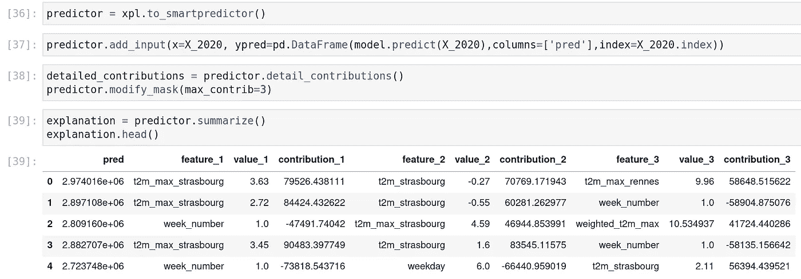
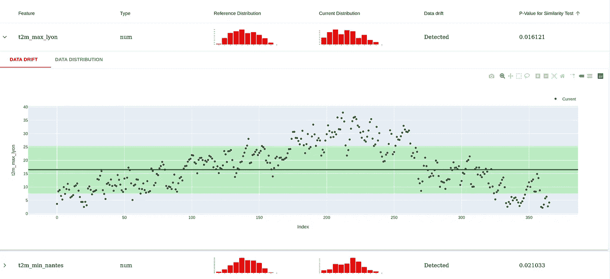
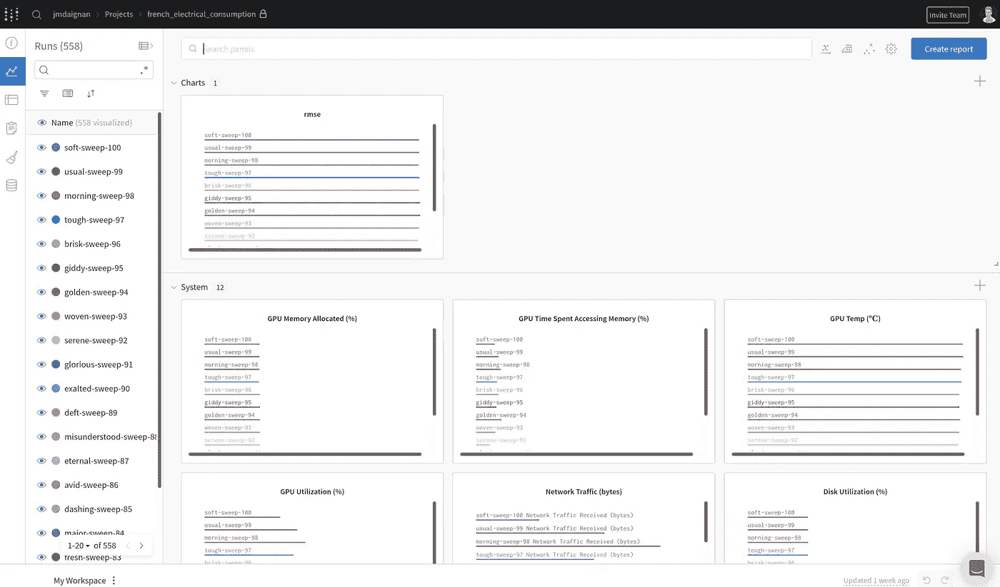
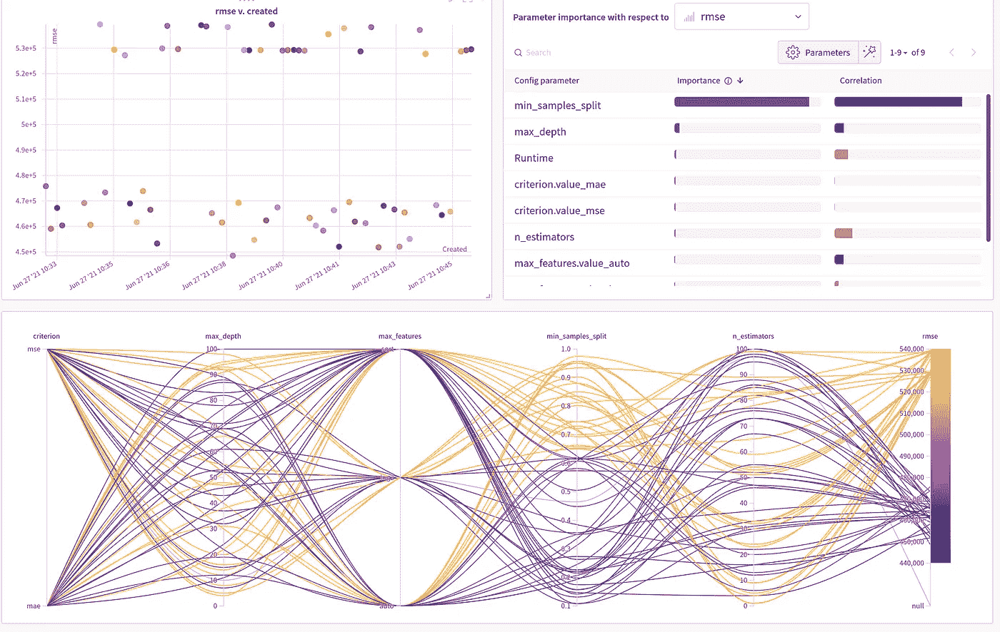
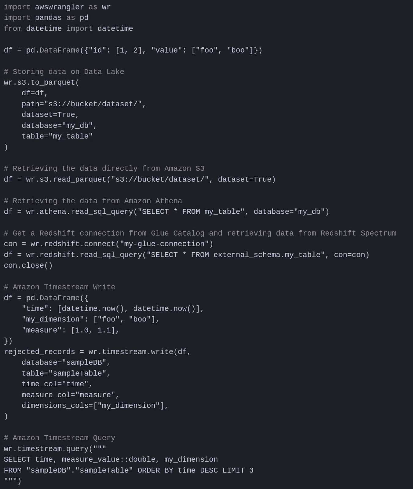

# 使用 weights and biases、mljar automl、hyperopt、shapash 和 appeally 调整您的机器学习工作流程

> 原文：<https://towardsdatascience.com/tune-your-machine-learning-workflow-with-weights-and-biases-mljar-automl-hyperopt-shapash-and-f0646500ea1f?source=collection_archive---------31----------------------->

## [实践教程](https://towardsdatascience.com/tagged/hands-on-tutorials)

## 在法国能源消耗的回归用例上发现紧急工具

我想用几周时间围绕 ml/ds 库写点东西，我有很多事情要做。每个库一篇文章可能太多了(而且不是很密集)，所以我决定将我的测试合并到一篇文章中，用于一个用例来测试它们，并对其进行快速总结。

在本文中，您将对以下库进行一个快速测试:

我将在一个简单的用例中应用这些库(以及我测试库的经典用例),并给出一些反馈。

本文的所有代码都可以在这个 [Github 库](https://github.com/jeanmidevacc/shotgun-20210627)中找到。

# ML 设置

在这一部分，将会有一个用于测试这些库的用例的描述。我的用例是我 2016 年在 Udacity 上做的 MOOC 的遗产，它是关于预测法国的日常用电量；你可以在[这篇文章](/make-a-forecast-system-of-the-french-national-energy-consumption-4f946b91381b)中找到关于这个实验的更多细节。

总结这篇文章，有几个要点:

*   电力消耗很大程度上取决于季节(法国主要使用电加热)
*   人们似乎在周日/周六比平日消耗更多的电力。

基于此，我只是用来自以下方面的更新数据来重建用例:

*   来自 [rte 门户](https://opendata.reseaux-energies.fr/explore/dataset/consommation-quotidienne-brute/information/)的电力消耗，我进行了转储，直到 1 月 1 日(并在每日级别汇总数据)
*   来自 [NASA POWER 数据源](https://power.larc.nasa.gov/data-access-viewer/)的天气数据集中在 11 个最大的城市，以及 2 米(摄氏度)的最低、平均、最高温度加上总降水量(毫米)

根据天气数据，我构建了四个特征，这些特征是基于城市人口的加权版本；你可以在[这本笔记本](https://github.com/jeanmidevacc/shotgun-20210627/blob/master/1_prepare_data.ipynb)里找到 ETL。

在准备方面，我建立了:

*   训练集+测试集，占 2015-2020 年间数据的 80%和 20%,随机选取
*   2020 年的数据集是 2020 年的数据

这个项目旨在看看我们如何能够建立一个良好的能源消耗预测器(以及如何利用这些库有效地做到这一点)。

# 使用 MLJAR automl 构建基线模型

构建预测器的第一步是构建易于实施的基线模型，这是构建更好的预测器的良好起点。对于这个项目，主要评估指标将是 [RMSE](https://scikit-learn.org/stable/modules/generated/sklearn.metrics.mean_squared_error.html) 。这些首批基线模型将会是:

*   随机预测值(在训练集周期的最小值和最大值之间随机选取一个值)
*   较少随机预测值(根据星期几和月份，在训练集的最小值和最大值之间选择一个值)
*   PTG: [从文献](https://github.com/jeanmidevacc/udacity_mlen/blob/master/capstone/report.pdf)来看，基于室外温度的分段回归是一个很好的预测器(所以我基于最小、平均、最大加权温度构建了三个版本)

最后，这也是本节的重点，另一种构建基线模型的方法是使用 automl 库来创建这些模型，这可能需要更多的时间，但也更具挑战性。对于那些可能不熟悉这个概念的人来说，Bojan Tunguz 有一篇关于这个主题的优秀的[文章。](https://medium.com/@tunguz/six-levels-of-auto-ml-a277aa1f0f38)

尽管如此，还是让一个 ML 库在数据集上做一些研究和测试来建立模型，有很多库可以做到这一点( [H20 automl](https://docs.h2o.ai/h2o/latest-stable/h2o-docs/automl.html) ， [auto-sklearn](https://automl.github.io/auto-sklearn/master/) ， [autokeras](https://autokeras.com/) )，但我想强调的是 [MLJAR autoML](https://mljar.com/) 。

您可以在我的存储库中找到我放在 palace 中用 mljar ( [笔记本](https://github.com/jeanmidevacc/shotgun-20210627/blob/master/2_build_baselines.ipynb)和[报告](https://github.com/jeanmidevacc/shotgun-20210627/tree/master/AutoML_1))构建基线模型的部分，但对我来说，这个包的关键点是:

在这种情况下，将选择最佳模型(它似乎是集合模型)

那么我们来看一下生产的各种基线模型的对比。

作者图片

仍然很高兴看到 PTG 仍然是一个很好的预测器，但是 mljar 输出的模型做得很好。

# 用 hyperopt 优化超参数

在模型开发中，执行网格搜索以找到模型的正确参数集需要时间，有多种方法可以在参数空间中导航:

*   全网格搜索:测试参数空间中的所有参数集(时间效率不高)
*   随机搜索:测试在空间中随机选择的特定数量的参数(节省时间，但是错过机会)

这些方法非常标准，并且非常有效，但是有时您有一些时间限制来做一些实验，此时，可以使用像 [hyperopt](http://hyperopt.github.io/hyperopt/) 这样的库。

该软件包旨在使用贝叶斯方法通过调整特定方向的参数来优化损失函数(在这种情况下，基于 rmse)。您可以在此找到此流程的更多详细信息:

*   一篇[论文](https://papers.nips.cc/paper/2011/file/86e8f7ab32cfd12577bc2619bc635690-Paper.pdf)支持在 hyperopt 包中使用的 TPE 方法
*   威尔·科尔森对贝叶斯过程进行超参数调整的[一般解释](/a-conceptual-explanation-of-bayesian-model-based-hyperparameter-optimization-for-machine-learning-b8172278050f)

在预测电力消耗的情况下，有基于包的文档构建的[笔记本](https://github.com/jeanmidevacc/shotgun-20210627/blob/master/3_hyperopt.ipynb)，这是对随机森林回归器的 100 次迭代的计算研究。

我的研究没有带来一个优秀的模型来构建基线(这不是我的目标)。

从专业的角度来看，它工作得很好，在工作中的一些项目上进行了测试，当您执行 Spark 应用程序时，我可能有一些保留，但如果您的研究时间有限，它仍然是一个很好的包(这不是唯一可以做到这一点的包，例如，您可以找到 [ray tune](https://docs.ray.io/en/master/tune/index.html) )。

让我们进一步探讨这个模型的可解释性。

# 用 shapash 让你的模型更容易解释

我最近在工作中增加的另一个方面是研究我的机器学习模型的可解释性。我的研究让我找到了 MAIF 保险公司开发的一个名为 [shapash](https://github.com/MAIF/shapash) 的软件包(我没想到会在我的博客上写这篇文章)。

如果我们回到我的随机森林回归器来预测电力消耗，这个包提供了在模型顶部构建解释器级别的能力，以帮助解释模型的可解释性和预测输出。

还有[这次探索沙帕什用的笔记本](https://github.com/jeanmidevacc/shotgun-20210627/blob/master/4_model_explainability_with_shapash.ipynb)。

我使用最好的模型，所有的功能都是预先计算好的；从 scikit learn 中，您可以很容易地提取出模型中特性的重要性(shapash 正在提供一个优秀的可视化)。

作者图片

通知预测器捕捉到建模中一周中某一天和温度的重要性。这个包的一个令人兴奋的特性是查看 x 数据集中的特定值，就像这个例子一样；我专注于周末。

作者图片

正如我们在这个例子中看到的，星期几比前面的表示更重要。另一个有用的特性如果你想直接挖掘某个特定特性的影响值，可以通过软件包设计贡献图(这里有一个例子)。

作者图片

(仍然很好地代表了周末对预测的影响)。

所有这些对影响的评估都受到用于评估这种影响的框架的影响。目前，可以使用两种框架:

*   [SHAP](https://github.com/slundberg/shap) :也就是用 Shapley 值来建立特征对预测的影响；有一篇很好的[文章](/explain-your-model-with-the-shap-values-bc36aac4de3d)正在阐述这个包
*   [LIME](https://github.com/marcotcr/lime/tree/ce2db6f20f47c3330beb107bb17fd25840ca4606) :另一种不基于 Shapley 值的方法，更多细节[此处](https://www.youtube.com/watch?v=hUnRCxnydCc)

如果你对模型的可解释性感兴趣，你应该考虑 Christoph Molnar 的作品。他在这个主题上做得非常出色(他在一个名为 [rulefit](https://christophm.github.io/interpretable-ml-book/rulefit.html) 的库后面，这个库对于构建基线模型非常有用)。

总结一下这个包，可解释性可以直接应用于预测级别，对于一个特定的预测可以有更多的细节；预测的可解释性有一种表现形式。

作者图片

一个很酷的特性是这个 explainer 元素可以被保存并用于实时预测的预测器对象；2020 年的数据上有个例子。

作者图片

其他功能可能会对你有所帮助(比如小的 web 应用程序或元素的预处理)，所以我会强烈邀请你来玩它(看看 MAIF 开源项目的网站[这里](https://maif.github.io/)他们在做很酷的东西)。

现在让我们继续评估模型和数据的漂移。

# 评估你的数据和模型

我正在做的另一个项目是监控 ml 管道。我主要把我的工作集中在模型漂移上。在我的 feed 中，由于我的一个同事，我看到了这个包，它正在围绕数据模型漂移开发一个开源库，显然叫做。

这个包后面有公司，但是是开源工具；你可以在这个[数据广播](https://datacast.simplecast.com/episodes/emeli-dral)中听到一位联合创始人的声音；这个软件包使用起来非常简单。如我之前所说，关注漂移数据和模型，你可以在[这本笔记本](https://github.com/jeanmidevacc/shotgun-20210627/blob/master/5_evidently_experiment.ipynb)中找到实验。

让我们深入研究一下数据报告；前面的笔记本产生了一个例子；这样做的目的是将一个参考数据集(在本例中为训练集)与另一个数据集(在本例中为 2020 年)进行比较，并查看是否存在大量差异(这可以解释预测中模型的变化)。最后有一张制作的报告截图。

作者图片

对于模型中使用的每个要素，都会在参考数据集和当前数据集之间的相似性测试中进行评估(如果 p 值小于 0.05，则有问题)，正如预期的那样，温度看起来有所不同，这是预期的，因为参考数据集中有五年的数据，而不是一年的数据)。还有一些图表可以更深入地了解数据集。

模型报告是相似的，但是报告是更进化的；这里有个例子[。本报告的关键点是:](https://github.com/jeanmidevacc/shotgun-20210627/blob/master/evidently_reports/model_report.html)

*   回归问题的传统评估指标显示在顶部。
*   预测值与实际值的多幅图比较
*   高估和低估的区别

该报告的输出不限于 HTML 文件；它可以以 JSON 格式提取。

这个包是最近的，但是里面有很多很好的可视化和习惯。因此，我建议人们看看它(它也不局限于分类的回归工作)，因为它可以启发他们的仪表板(或者可能喂养它)。

# 更有效地用权重和偏见来构建你的探索管道

最后，在这次探索中，我测试了另一个名为 weights and bias 的包，它在 ML 世界中制造了很多噪音(并且有一个很好的理由叫做[weights and bias](https://wandb.ai/site))。这个包是帮助数据科学家轻松处理 ml 实验的监控并帮助他们进入生产的包的一部分。

包的第一个方面是日志信息；您可以记录来自数据、模型、表格或模型的各种元素。有一个代码的快速快照，用于版本化数据帧和模型(也加载)。

这个特性在这种包中非常常见(正如你在我的[关于 mlflow](/be-more-efficient-to-produce-ml-models-with-mlflow-c104362f377d) 的文章中看到的)。尽管如此，其中一个优势是您可以在一个漂亮的 UI 中使用这些构件来设计带有数据的图表，并以中等风格编写报告。

作者图片

这个 UI 的一个显著特性是监视运行实验的机器的性能。

我发现的另一个非常有趣的特性是 sweep 特性，它混合了用于计算的远视视觉和非常好的界面。你可以在[这个笔记本](https://github.com/jeanmidevacc/shotgun-20210627/blob/master/6_wandb_sweep.ipynb)里找到实验，不过有 UI 截图。

作者图片

使用平行坐标图研究参数对优化损失的影响，用户界面很容易理解。但是我喜欢的这个 UI 的显著特征是右上角的重要性/相关性图表；关于参数对损失演变的重要性，你可以在这篇[文章](https://docs.wandb.ai/ref/app/features/panels/parameter-importance)中找到关于它们的方法的细节。

从全球来看，权重和偏差是一个很好的监控包；我可能不太喜欢项目中没有实验层的事实(项目>实验>运行对我来说可能更好)，但它非常有效。我可能只是为了专业用途而强调这一点；许可证需要按用户付费，所以做好准备(但在你的 ml 团队配置功能中可能是值得的)

# 额外:通过 data wrangler 轻松连接熊猫和 AWS 存储

有一个包我在这个项目中没有用到，但是我想在这里分享一下，因为我发现它非常有用。有一个 AWS 的[包帮助将 pandas dataframe 与 AWS 存储连接起来(有一个代码快照将 pandas 与各种 AWS 服务连接起来)](https://github.com/awslabs/aws-data-wrangler)

作者图片

没什么好说的；如果您的机器在 AWS 服务上有足够的权限可以调用，那么这是一个很好的接口包(对我来说，。唯一的缺点是 dynamodb 上缺少读取功能。

# 结论

我希望这篇文章激发了您测试这些包的好奇心，因为它们可以让您的 ML/DS 日常工作变得更加轻松。

*原载于 2021 年 6 月 27 日*[*【https://www.the-odd-dataguy.com】*](https://www.the-odd-dataguy.com/2021/06/27/tune-your-machine-learning-workflow-with-weights-and-biases-mljar-automl-hyperopt-shapash-and-evidently/)*。*