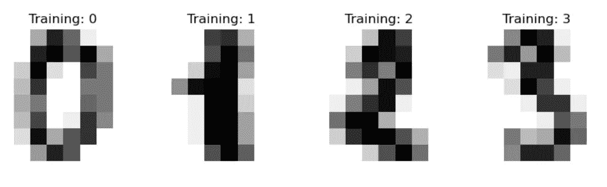
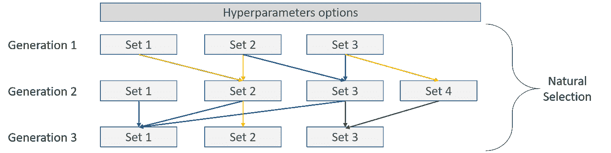
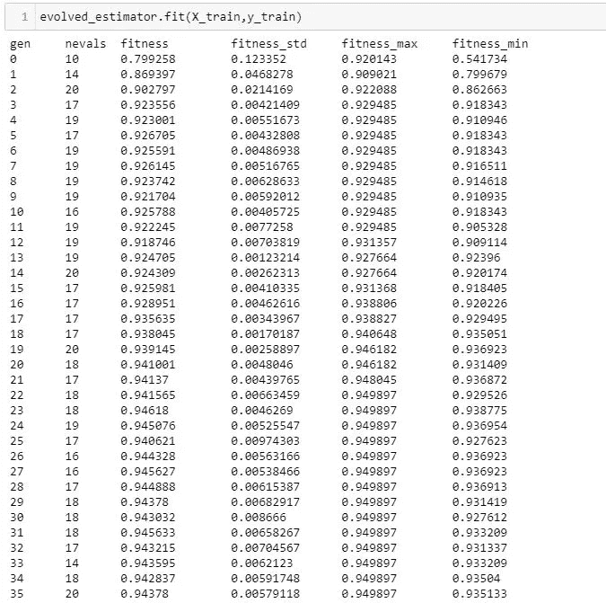
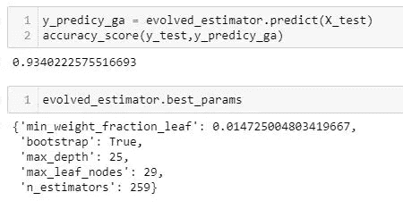
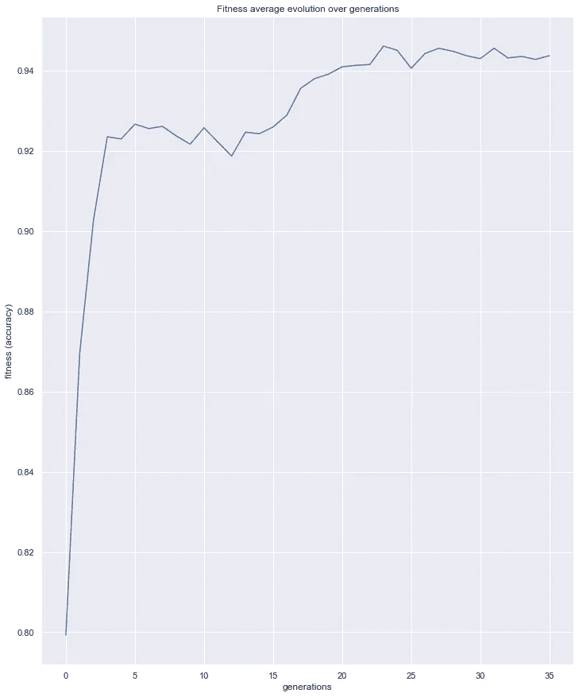
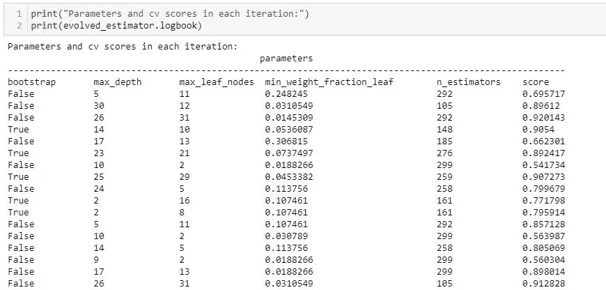
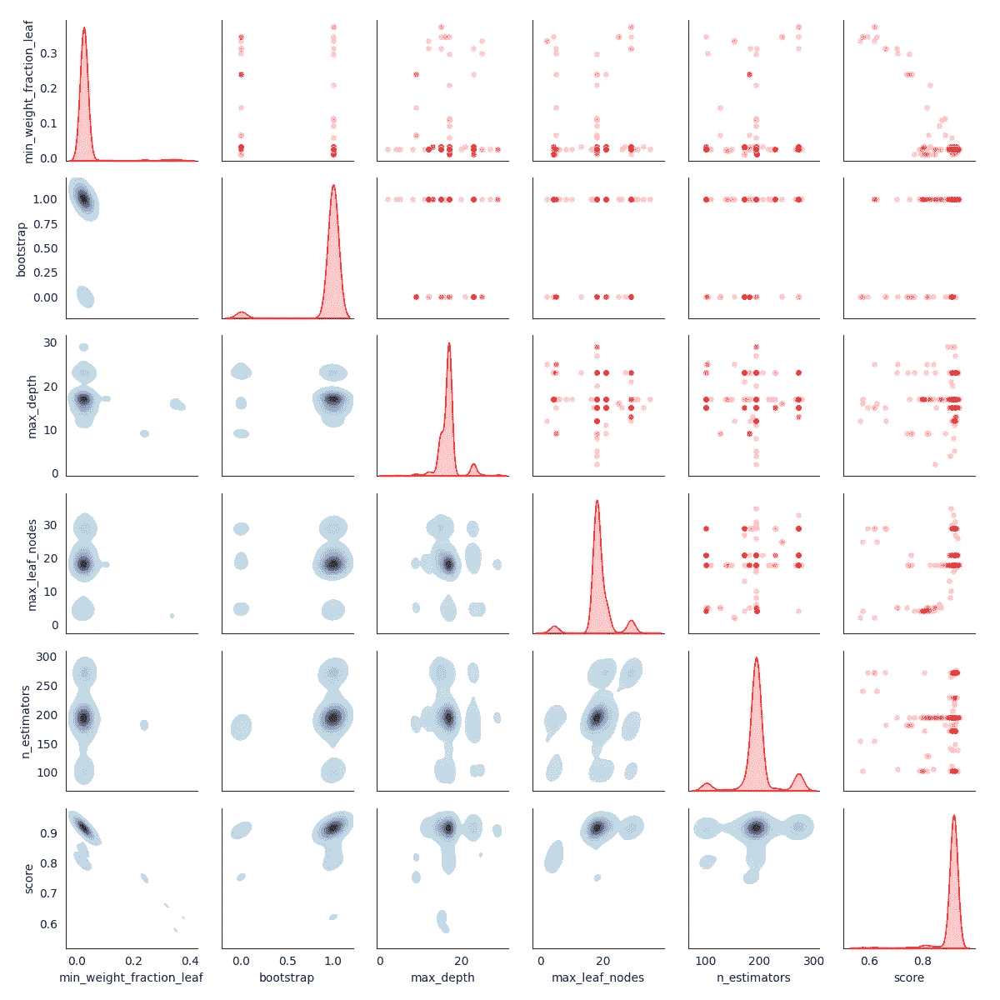
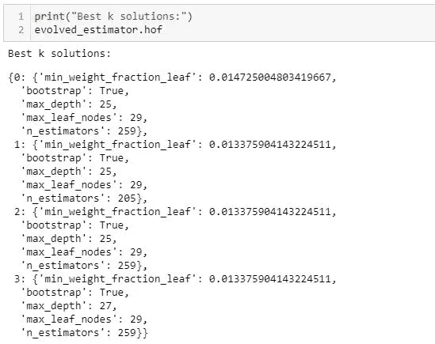

# 使用进化算法调整您的 Scikit-learn 模型

> 原文：<https://towardsdatascience.com/tune-your-scikit-learn-model-using-evolutionary-algorithms-30538248ac16?source=collection_archive---------10----------------------->

## sci kit-学习用进化算法和交叉验证进行超参数调整。


苏珊·Q·尹在 [Unsplash](https://unsplash.com/photos/Ctaj_HCqW84?utm_source=unsplash&utm_medium=referral&utm_content=creditShareLink) 上的照片

超参数调整是机器学习管道的一个重要部分——大多数常见的实现都使用网格搜索(随机或非随机)在一组组合之间进行选择。

本文将使用 python 包[**sk learn-genetic-opt**](https://sklearn-genetic-opt.readthedocs.io/en/stable/)中的进化算法来寻找优化我们定义的交叉验证度量的参数。这个软件包有一些功能可以简化这个过程:

*   用几种进化算法搜索超参数。
*   [回调](https://sklearn-genetic-opt.readthedocs.io/en/stable/api/callbacks.html)在满足标准时停止优化，将对象记录到本地系统，或者定制您的[逻辑。](https://sklearn-genetic-opt.readthedocs.io/en/stable/tutorials/custom_callback.html)
*   将功能记录到日志对象中或与 [MLflow 内置集成。](https://sklearn-genetic-opt.readthedocs.io/en/stable/tutorials/mlflow.html)
*   Utils 绘图了解优化过程。

# **数据集**

作为演示数据集，我们将使用来自 Scikit-learn 的数字数据；其思想是对 8×8 像素的图像的手写数字进行分类。数据示例如下:



数字数据集。图片由 [Scikit-learn](https://scikit-learn.org/stable/auto_examples/classification/plot_digits_classification.html#sphx-glr-auto-examples-classification-plot-digits-classification-py) (BSD 许可证)提供

# **进化算法**

大多数进化算法从一群个体开始；每一个都代表了在我们的机器学习模型中使用的一组超参数。

使用一些试图模拟种群进化方式的机制，该算法基于已经测试的参数的结果来复制、变异和选择新的超参数，使用一些度量来定义其适应性(例如，交叉验证准确性)，并在几代个体中重复这一过程，这里的[是对该过程的扩展解释。从视觉上看，它可能是这样的:](https://sklearn-genetic-opt.readthedocs.io/en/stable/tutorials/understand_cv.html)



进化交叉验证。图片由作者提供。

如果你想要更深入的解释，你可以查看我的[其他媒体帖子](/hyperparameters-tuning-from-grid-search-to-optimization-a09853e4e9b8)解释这个过程的理论方面。

# **实现**

该算法的工作方式可能听起来有点混乱，但已经有一些包，如 Python 中的 DEAP，已经为该算法优化了例程。

在这种情况下，我们将使用[**sk learn-genetic-opt**](https://sklearn-genetic-opt.readthedocs.io/)，这是一个构建在 DEAP 和 scikit-learn 之上的 python 包，使这个优化过程更加简单。

首先，让我们安装它:

```
pip install sklearn-genetic-opt
```

现在，让我们导入数据，在我们的训练和测试集中分割它，并创建任何 scikit-learn 分类器的实例；对于这个例子，我将使用随机森林分类器。

数据导入。作者代码。

现在，我们可以使用 sklearn-genetic-opt 来基于一个度量调整我们的分类器；在这种情况下，我将从具有三个分裂的分层交叉验证中选择准确度分数。

param_grid 类似于 scikit-learn，但是我们必须使用 space 类来让 sklearn-genetic-opt 知道使用哪种类型的数据来对参数进行采样。

为了定义这个和其他选项，我们必须使用包的主体类 GASearchCV。

GaSearchCV 设置。作者代码。

在本文的最后，我将解释所显示的参数，以便您可以根据需要更改它们。

估计量必须是 sckit-learn 分类器或回归器，cv 是交叉验证或交叉验证生成器中的分裂数，评分是选择用于优化的指标，它必须是与估计量兼容的 sklearn 指标之一。

现在我们可以拟合我们的模型，并在我们的测试数据中使用它；默认情况下，它将使用找到的最佳超参数集:

```
evolved_estimator.fit(X_train,y_train)
y_predicy_ga = evolved_estimator.predict(X_test)
accuracy_score(y_test,y_predicy_ga)
```

您应该会看到类似这样的内容:



训练啰嗦。图片由作者提供。

当算法运行时，它向我们展示了它在每一代所达到的指标；“适合度”指的是我们选择的度量标准，在这个例子中，是准确性。由于该算法每代使用一组以上的超参数，因此它显示了平均精度、标准偏差以及最大和最小单个值。

在这次特定的运行中，我们使用这组超参数在测试集中获得了 0.93 的准确度:



优化结果。图片由作者提供。

我们还可以看到优化例程的演变，使用命令:

```
plot_fitness_evolution(evolved_estimator)
plt.show()
```



健身进化。图片由作者提供。

如您所见，该算法在第 0 代中以大约 0.8 的精度开始，这随机生成超参数。但是当该算法使用进化策略选择一组新的超参数时，精确度提高了。该算法可能还没有完全收敛到它的最佳适应值，但已经达到了 0.94，所以你可以让它运行一些额外的世代，看看你是否可以获得更好的准确性。

我们还可以获得所有模型的超参数及其交叉验证分数的日志。



使用的超参数日志。图片由作者提供。

例如，您可以使用这些日志来绘制算法正在选择的参数的分布，以查看其探索和开发策略如何。

```
plot_search_space(evolved_estimator)
plt.show()
```



抽样超参数分布。图片由作者提供。

超参数组合的 k (keep_top_k=4)最佳集合:



名人堂。图片由作者提供。

原来如此！正如您所看到的，使用进化算法和 sklearn-genetic-opt 来实现这个优化例程非常简单；这是一个开源项目，可以帮助您选择超参数，作为 scikit-learn 的 RandomizedSearchCV 或 GridSearch 等方法的替代方法，这些方法取决于预定义的超参数组合。

作为软件包的作者，欢迎任何建议、贡献或评论。在这里，您可以看到更多示例和使用的源代码:

<https://sklearn-genetic-opt.readthedocs.io/en/stable/>  

以下是撰写本文时的定义，但请务必查看最新的文档以获取更新。

# 附录 1:空间定义

用参数“param_grid”定义搜索空间；它需要一个包含这些类的字典:

**分类:**表示分类变量，期望它可以采样的选项列表，以及可选地采样每个选项的概率

**Integer:** 表示整型变量，期望得到变量的上下限

**连续:**表示实值变量，期望变量的上下界，如果变量是正定义的，可以选择从对数均匀分布中抽取值

# **附录 GASearchCV 的参数**

**总体:**随机产生的候选超参数的初始数量。

**世代:**该算法将进行多少次迭代，每一代都会创建一个新群体

**精英主义:**如果为真，则使用锦标赛选择保留最好的 k 个个体；如果为假，则使用轮盘赌选择机制。

**锦标赛规模:**利用锦标赛操作员选择多少个人，仅在 elitism = True 时使用。

**crossover_probability:** 在特定的交配中发生交叉的概率。

**突变概率:**一个已经固定的个体，其某些超参数值发生随机变化的概率。

**param_grid:** 字典，关键字作为超参数的名称，值为 sklearn_genetic.space 中的分类、连续或整数

定义该参数可能取的值。

**标准:**“最大”如果选择“得分”指标，则认为其值越大越好，否则为“最小”。

**算法:**从包 deap 到使用的具体进化算法，sk learn-genetic-opt 0 . 5 . 0 版本支持*eas simple*、 *eaMuPlusLambda、*和*eamucommamlambda。*

**n_jobs:** 交叉验证步骤中要启动多少个并发作业

**verbose:** 如果为真，则在算法运行时显示优化的一些指标。

**keep_top_k:** 基于其最终的交叉验证得分，在优化结束时返回多少组超参数。该参数决定了 hof 的大小。

**log_config:** 如果您使用 [MLflowConfig](https://sklearn-genetic-opt.readthedocs.io/en/latest/api/mlflow.html) 设置该参数，则指标、超参数和模型会被记录到 MLflow 服务器中。