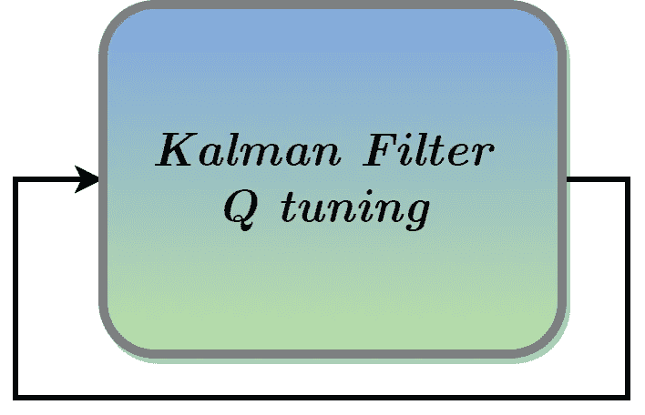
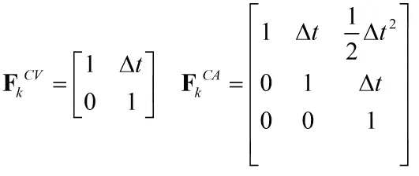
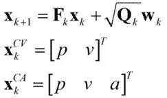
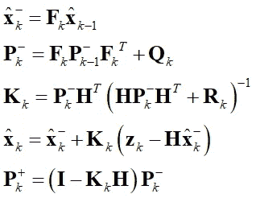
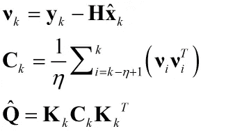
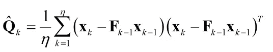
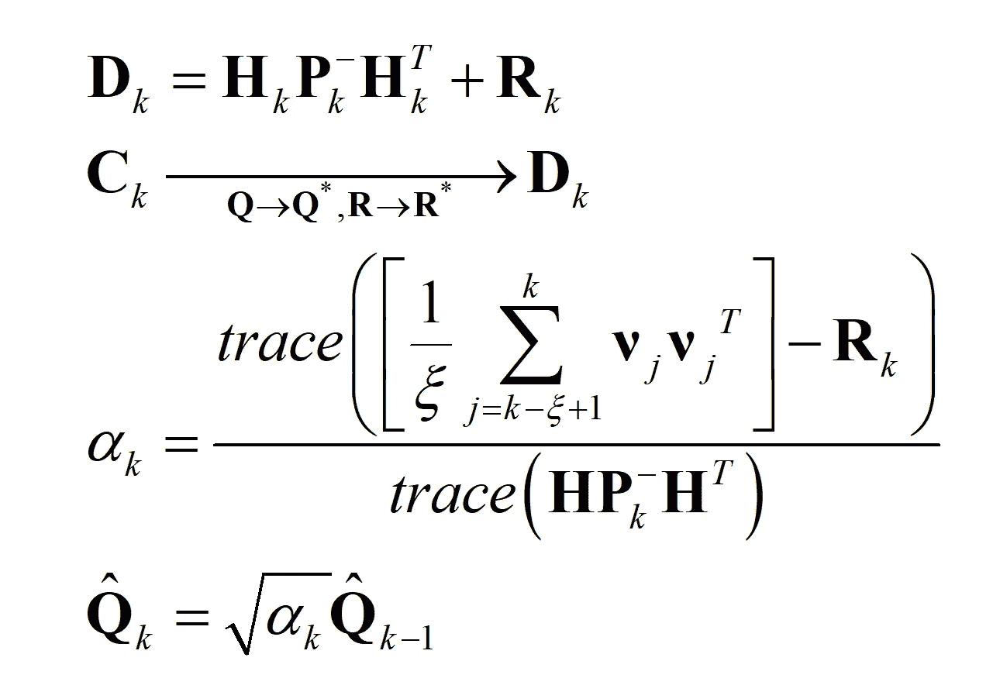

# 卡尔曼滤波中 CV 和 CA 模型的 Q 矩阵调整

> 原文：<https://towardsdatascience.com/tuning-q-matrix-for-cv-and-ca-models-in-kalman-filter-67084185d08c?source=collection_archive---------25----------------------->

# 介绍

卡尔曼滤波器(KF)广泛用于车辆导航任务，特别是用于车辆轨迹平滑。将 KF 应用于导航任务的相关问题之一是车辆轨迹的建模。为简单起见，对于大范围的跟踪问题，选择恒定速度(CV)模型或恒定加速度(CA)模型是方便的，其中位置导数确实是速度，并且速度(几乎)是恒定的(对于 CV 模型)。这个优点提供了处理线性和稳定系统的能力，这是这类跟踪问题的一个要求。除了 Q 调谐之外，设计师还应在 KF 中预先定义其他参数。测量噪声协方差 R、初始误差协方差和步长。KF 中最重要的矩阵是 Q 和 R。矩阵 R 可以直接从传感器中确定，而 Q 则不是这种情况

作者图片

# 形式化

考虑两个模型，具有位置( **p** )和速度( **v** )状态的 CV 模型，以及具有位置、速度和加速度( **a** )的 CA 模型。状态空间中的轨迹(系统)矩阵由下式给出

轨迹矩阵

状态空间本身是由

状态空间

其中 w 是白高斯离散噪声。提供了卡尔曼滤波算法(更多详细信息，请参考 Wiki):

卡尔曼滤波方程

# 讨论

我们(滤波器设计者)通常假设他们的系统行为符合轨迹模型，其中速度实际上是位置导数，加速度实际上是速度导数。然而，在现实生活中，我们要处理非高斯噪声、离散化误差、数值考虑、测量噪声、非线性等等。因此，建立使用卡尔曼滤波器的轨迹(系统)模型的正确方法是通过考虑物理关系，但是，添加一些白噪声来处理实际情况。这种噪声被注入到模型中(更具体地说，注入到卡尔曼滤波器中)，以补偿设计者对其模型的不确定性。例如，我们可以假设 CV 模型，其中真实生活中的速度变化很快。然后，应该定义一个适当的 Q 矩阵来处理这种情况。值得一提的是，为 Q 矩阵选择高值可能会导致滤波器发散，因为设计人员的建模存在巨大的不确定性。因此，每个场景都有一个最优矩阵 Q——这是很难找到的。

# 方法 1-试错法

反复试验。从大值开始，然后逐渐减小，直到收敛。这可能适用于离线设置，在离线设置中，设计师必须记住避免过度拟合。

# 方法 2-基于新息的自适应方法

实时调整 Q 的最常见的自适应方法是考虑卡尔曼滤波器的新息量。

基于创新的方法

# 方法 3-生成式

调谐滤波器参数的简单方法需要存储整个参数向量。如果可能的话，以下方法有时会有效:

生成方法

# 方法 4-比例因子

当 **R** 已知时，比例因子是一个很好的方法。核心思想是 Q 和 R 通过创新量的关系。它由下式给出:

缩放比例

# 摘要

有许多方法来调谐 Klaman 滤波器中的 Q。我们总结了 4 种应对这一挑战的常用技术。

# 关于作者

Barak 获得了以色列理工学院的航空工程学士学位(2016 年)、硕士学位(2018 年)以及经济和管理学士学位(2016 年，成绩优异)。他曾在高通工作(2019-2020)，在那里他主要研究机器学习和信号处理算法。巴拉克目前正在海法大学攻读博士学位。他的研究兴趣包括传感器融合、导航、机器学习和估计理论。

www.Barakor.com|[https://www.linkedin.com/in/barakor/](https://www.linkedin.com/in/barakor/)

[1] L. Zhang、D. Sidoti、A. Bienkowski、K. R. Pattipati、Y. Bar-Shalom 和 D. L. Kleinman，|关于噪声协方差和自适应卡尔曼滤波的识别:一个 50 年老问题的新观点，《IEEE Access》，第 8 卷，第 59362-59388 页，2020 年。

[2] P. Abbeel、A. Coates、M. Montemerlo、A. Y. Ng 和 S. Thrun，“卡尔曼滤波器的鉴别训练”机器人学:科学与系统，2005 年第 2 卷，第 1 页。

[3] R. Mehra，“关于方差识别和自适应卡尔曼滤波”，IEEE 自动控制汇刊，第 15 卷，第 2 期，第 175 页{184 页，1970 年。

[4] A. Mohamed 和 K. Schwarz，“用于 INS/GPS 的自适应卡尔曼滤波”，大地测量学杂志，第 73 卷，第 4 期，第 193 页{203，1999 年。