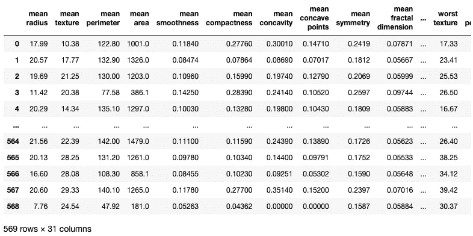
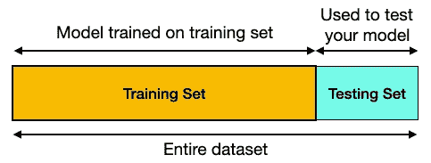
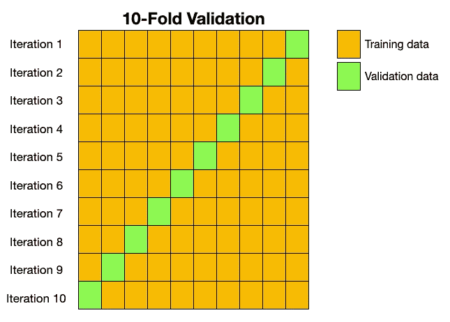
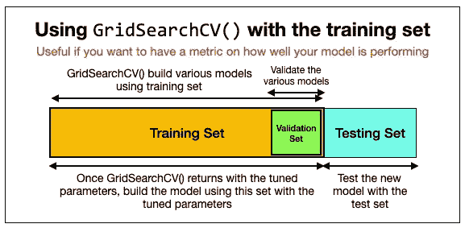
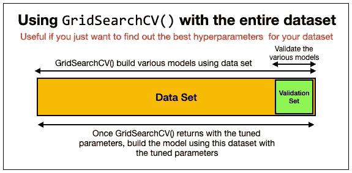

# 使用 GridSearchCV 调整机器学习模型的超参数

> 原文：<https://towardsdatascience.com/tuning-the-hyperparameters-of-your-machine-learning-model-using-gridsearchcv-7fc2bb76ff27?source=collection_archive---------1----------------------->

## 了解如何使用 sklearn 中的 GridSearchCV 函数来优化您的机器学习模型


罗伯塔·索奇在 [Unsplash](https://unsplash.com?utm_source=medium&utm_medium=referral) 上拍摄的照片

机器学习的两个关键挑战是找到正确的算法和优化你的模型。如果你熟悉机器学习，你可能用过线性回归、逻辑回归、决策树、支持向量机等算法。一旦您决定为您的机器学习模型使用特定的算法，下一个挑战就是如何微调您的模型的超参数，以便您的模型与您拥有的数据集很好地配合。在本文中，我想把重点放在后一部分——微调模型的超参数。尽管这个术语听起来可能很复杂，但是使用 **sklearn** 模块中的 **GridSearchCV** 函数可以非常容易地微调您的超参数。

# 使用逻辑回归进行分类

在你学习如何微调你的机器学习模型的超参数之前，让我们尝试使用 sklearn 附带的经典**乳腺癌**数据集来建立一个模型。由于这是一个分类问题，我们将使用逻辑回归作为例子。

> 对于分类问题，您还可以使用其他算法，如支持向量机(SVM)、K 近邻(KNN)、朴素贝叶斯等。但是对于本文，我将使用逻辑回归。

首先，让我们加载数据集，并将其加载到 Pandas 数据框架中:

```
import numpy as np
import pandas as pd
import matplotlib.pyplot as plt
from sklearn.datasets import load_breast_cancerbc = load_breast_cancer()df = pd.DataFrame(bc.data, columns = bc.feature_names)
df['diagnosis'] = bc.target
df
```



前 30 列是各种特征，最后一列是诊断(0 表示恶性，1 表示良性)。为了简单起见，我将使用 30 列进行训练，最后一列作为目标。

> 理想情况下，您应该执行要素选择来筛选出那些显示共线性的列以及与目标没有强相关性的列。

让我们提取特性和标签的值，并将它们保存为数组:

```
dfX = df.iloc[:,:-1]   # Features - 30 columns
dfy = df['diagnosis']  # Label - last columnX = dfX.values
y = dfy.valuesprint(X.shape)   # (569, 30); 2D array
print(y.shape)   # (569,);    1D array
```

将数据集分为训练集和测试集:

```
from sklearn.model_selection import train_test_splitX_train, X_test, y_train, y_test = train_test_split(X, y,
                                       test_size=0.25, 
                                       random_state=2)
```

下图显示了训练和测试数据集的用法:



接下来，标准化训练和测试数据集:

```
from sklearn import preprocessingscaler = preprocessing.StandardScaler()
X_train = scaler.fit_transform(X_train)
X_test = scaler.fit_transform(X_test)
```

**StandardScaler** 类重新调整数据，使平均值为 0，标准差为 1(单位方差)。

> 数据集的标准化是许多机器学习估计器的常见要求:如果单个特征或多或少看起来不像标准的正态分布数据(例如，均值和单位方差为 0 的高斯数据)，它们可能表现不佳。来源:[https://sci kit-learn . org/stable/modules/generated/sk learn . preprocessing . standard scaler . html](https://scikit-learn.org/stable/modules/generated/sklearn.preprocessing.StandardScaler.html)

最后，使用 sklearn 的 **LogisticRegression** 类，使用训练集建立一个模型，然后使用测试集获得测试集中所有项目的预测:

```
from sklearn.linear_model import LogisticRegressionlogreg = LogisticRegression()
logreg.fit(X_train,y_train)y_pred = logreg.predict(X_test)
```

要查看模型的执行情况，请获取其精确度:

```
from sklearn import metricsprint("Accuracy:",metrics.accuracy_score(y_test, y_pred))
# OR
print("Accuracy:",logreg.score(X_test, y_test))
```

> 您可以使用您刚刚构建的模型的 **score()** 函数，或者使用来自 **metrics** 模块的 **accuracy_score()** 函数来获得精确度。

上述代码片段的准确性为:

```
Accuracy: 0.9790209790209791
```

# 了解交叉验证

为了理解如何使用 GridSearchCV 优化您的模型，您需要理解什么是*交叉验证*。还记得在上一节中我们将数据集分为训练集和测试集吗？


作者图片

测试集用于评估您使用定型集定型的模型的性能。虽然这是评估模型的一个好方法，但它可能不会给出模型性能的真实指示。众所周知，测试集中的数据可能是有偏差的，使用它来评估模型可能会给出非常有偏差的结果。一个好得多的方法是将整个数据集分成 *k 倍*(或 k 份，即 k 倍意味着将数据集分成 10 等份)。在 k 折中，使用 *1* 折进行测试，使用 *k-1* 折进行训练:



作者图片

在每次迭代中，记录度量标准(比如准确度、精确度等)，并在所有迭代结束时，计算这些度量标准的平均值。这为您的模型提供了训练和测试数据的良好组合，并为您的模型提供了更好的性能基准。这个将你的数据分成 k 个折叠并使用 1 个折叠进行测试和 k-1 个折叠进行测试的过程被称为 **k 折叠交叉验证**。

# 使用 GridSearchCV 进行超参数调整

在我们之前的 **LogisticRegression** 类的例子中，我们创建了一个 **LogisticRegression** 类的实例，没有传递任何初始化器。相反，我们依赖各种参数的默认值，例如:

*   **惩罚** —指定惩罚的标准。
*   **C** —正则化强度的逆；较小的值指定较强的正则化。
*   **求解器** —在优化问题中使用的算法。
*   **max_iter** —求解器收敛所需的最大迭代次数。

虽然在某些情况下依赖这些参数的默认值是可以的(在机器学习中称为*超参数*)，但能够微调它们的值总是好的，以便算法最适合您所拥有的数据类型。不幸的是，找到能够完美拟合您的数据的超参数的完美组合并不是一项简单的任务。这就是 GridSearchCV 的用武之地。

**GridSearchCV** 是 **sklearn** 的 **model_selection** 包中的一个函数。它允许您为每个超参数指定不同的值，并在拟合模型时尝试所有可能的组合。它使用数据集的交叉验证进行训练和测试——因此 GridSearchCV 中缩写为“ **CV** ”。GridSearchCV 的最终结果是一组超参数，根据您希望优化模型的评分标准，这些超参数最适合您的数据。

让我们首先创建*参数网格*，它是一个字典，包含拟合模型时想要尝试的所有各种超参数:

```
from sklearn.model_selection import GridSearchCVimport warnings
warnings.filterwarnings('ignore')**# parameter grid
parameters = {
    'penalty' : ['l1','l2'], 
    'C'       : np.logspace(-3,3,7),
    'solver'  : ['newton-cg', 'lbfgs', 'liblinear'],
}**
```

> 注意，我已经关闭了警告，因为 GridSearchCV()函数倾向于生成相当多的警告。

然后，您可以使用正在使用的算法以及如下所示的各种参数来调用 GridSearchCV()函数:

```
logreg = LogisticRegression()
clf = GridSearchCV(logreg,                    # model
                   param_grid = parameters,   # hyperparameters
                   scoring='accuracy',        # metric for scoring
                   cv=10)                     # number of folds
```

**GridSearchCV()** 函数返回一个 **LogisticRegression** 实例(在本例中，基于您正在使用的算法)，然后您可以使用您的训练集对其进行训练:

```
clf.fit(X_train,y_train)
```

完成训练后，您现在可以打印出调整后的超参数以及训练精度:

```
print("Tuned Hyperparameters :", clf.best_params_)
print("Accuracy :",clf.best_score_)
```

以下是我运行上述代码片段获得的结果:

```
Tuned Hyperparameters : {'C': 0.1, 
                         'penalty': 'l2', 
                         'solver': 'liblinear'}
Accuracy : 0.983499446290144
```

**0.9835** 的精度现在比早期的 0.9790 精度好得多。

使用 GridSearchCV()函数返回的超参数值，您现在可以使用这些值通过训练数据集构建模型:

```
logreg = LogisticRegression(**C = 0.1**, 
                            **penalty = 'l2'**, 
                            **solver = 'liblinear'**)
logreg.fit(X_train,y_train)y_pred = logreg.predict(X_test)
print("Accuracy:",logreg.score(X_test, y_test))
```

下图总结了我们所做的工作:



作者图片

观察到:

*   GridSearchCV 使用**训练集**和**验证集**进行交叉验证。
*   一旦 GridSearchCV 找到了超参数的值，我们就使用调整后的参数值通过训练集建立一个新的模型。
*   有了**测试设备**，我们现在可以评估我们的新模型了。

> 这里采用的方法让我们有了一个衡量新模型性能的指标。

使用 GridSearchCV 的另一种方法是使用整个数据集来拟合它，如下所示:

```
parameters = {
    'penalty' : ['l1','l2'], 
    'C'       : np.logspace(-3,3,7),
    'solver'  : ['newton-cg', 'lbfgs', 'liblinear'],
}logreg = LogisticRegression()
clf = GridSearchCV(logreg, 
                   param_grid = parameters,
                   scoring = 'accuracy', 
                   cv = 10)
**clf.fit(X,y)**
```

上述代码片段返回以下结果:

```
Tuned Hyperparameters : {'C': 1000.0, 
                         'penalty': 'l1', 
                         'solver': 'liblinear'}
Accuracy : 0.9701754385964911
```

下图总结了我们刚刚完成的工作:



作者图片

在这种情况下，您让 GridSearchCV 使用整个数据集来导出调优的参数，然后使用新获得的值来构建新的模型。

> 这里采用的方法允许我们为我们的数据集找出最佳的超参数，但是不允许你精确地评估你的模型。

使用这种方法无法真正评估该模型，因为您不想传递任何用于预测训练的数据。为什么？因为模型已经在训练期间看到了数据，因此不会给你模型性能的准确度量。

[](https://weimenglee.medium.com/membership) [## 加入媒介与我的介绍链接-李伟孟

### 作为一个媒体会员，你的会员费的一部分会给你阅读的作家，你可以完全接触到每一个故事…

weimenglee.medium.com](https://weimenglee.medium.com/membership) 

# 摘要

使用 GridSearchCV 可以节省您在优化机器学习模型方面的大量精力。但是请注意，GridSearchCV 只会根据您在参数网格中提供的内容来评估您的超参数。当然，您可能希望为每个超参数指定所有可能的值，但是这样做的计算代价很高，因为所有的组合都将被评估。最后，不要把 GridSearchCV 作为优化模型的灵丹妙药——在考虑训练模型之前，一定要花时间进行适当的特征选择。

以下是我之前关于*功能选择*的文章链接:

[](/statistics-in-python-using-anova-for-feature-selection-b4dc876ef4f0) [## Python 中的统计数据-使用方差分析进行要素选择

### 了解如何使用 ANOVA 比较分类变量和数值变量

towardsdatascience.com](/statistics-in-python-using-anova-for-feature-selection-b4dc876ef4f0) [](/statistics-in-python-using-chi-square-for-feature-selection-d44f467ca745) [## Python 中的统计数据-使用卡方进行要素选择

### 在我之前的两篇文章中，我谈到了如何度量数据集中各列之间的相关性，以及…

towardsdatascience.com](/statistics-in-python-using-chi-square-for-feature-selection-d44f467ca745) [](/statistics-in-python-collinearity-and-multicollinearity-4cc4dcd82b3f) [## Python 中的统计数据-共线性和多重共线性

### 了解如何发现数据集中的多重共线性

towardsdatascience.com](/statistics-in-python-collinearity-and-multicollinearity-4cc4dcd82b3f) [](/statistics-in-python-understanding-variance-covariance-and-correlation-4729b528db01) [## Python 中的统计学-了解方差、协方差和相关性

### 理解你的数据之间的关系，知道皮尔逊相关系数和…

towardsdatascience.com](/statistics-in-python-understanding-variance-covariance-and-correlation-4729b528db01)