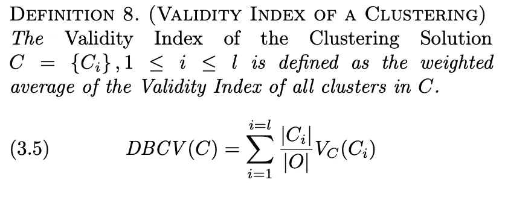
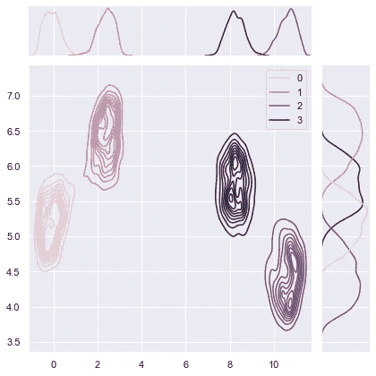
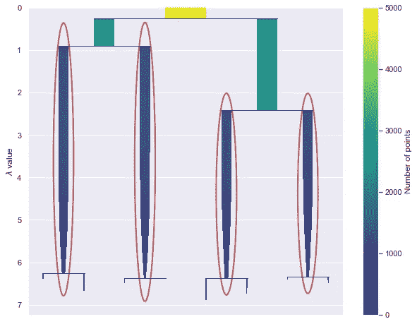
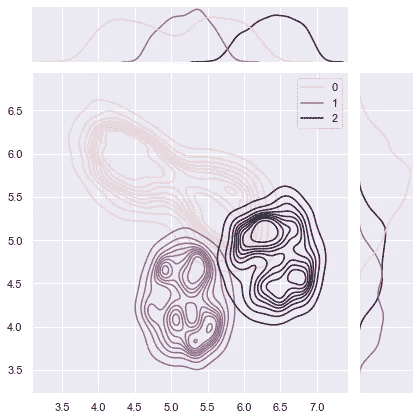

# 如何调整 HDBSCAN

> 原文：<https://towardsdatascience.com/tuning-with-hdbscan-149865ac2970?source=collection_archive---------3----------------------->

## 如何调整基于密度的沟道聚类的快速示例

聚类是一个非常困难的问题，因为当标签不存在时，永远不会有真正的“正确”答案。


Tengyart 通过 [Unsplash](https://unsplash.com/photos/DoqtEEn8SOo) 拍摄的照片

这是由各种技术和各种假设造成的。如果一项技术运行不正确，违反了一个假设，这将导致不正确的(完全错误的)结果。

在这篇博文中，我们将深入探讨为什么集群变得复杂，然后深入研究如何利用[亚马逊 DenseClus](https://github.com/awslabs/amazon-denseclus) 库在 [HDBSCAN](https://github.com/scikit-learn-contrib/hdbscan) 中适当地调优基于密度的集群。

# 背景:聚类是复杂的😬

聚类算法没有免费的午餐，虽然一种算法可能很适合某个数据集，但不能保证它会以完全相同的方式在不同的数据集上工作。同样，聚类“强烈依赖于研究人员的背景、目标和决策”，这为 Henning 在[什么是真正的聚类中指出的“普遍最优的方法只会产生自然的聚类”这一说法火上浇油。亨宁 2015](https://arxiv.org/abs/1502.02555) 。

例如，KMeans 等常用技术假设数据是数值型和球形的。当数据具有高维数并且包括分类值时，这些类型的假设不太合理。

违反假设的聚类数据以两种方式给从业者带来难题:

1.  如何形式化一个具体的特化方案？
2.  选择什么样的聚类技术？

这两者都必须公式化，以便不违反任何假设。实际上，这可能导致一个排除过程，不违反算法假设的算法和特征方案是唯一的选择。

# 警惕你的度量标准📈

当没有标签可用时，通常选择一个客观的度量，如[轮廓分数](https://en.wikipedia.org/wiki/Silhouette_(clustering))来评估，然后决定最终的聚类结果。剪影分数用介于-1 到 1 之间的指数来衡量集群的内聚性和分离性。它不*不*在指数计算中考虑噪音，并利用距离。距离不适用于基于密度的技术。在客观度量计算中不包括噪声违反了基于密度的聚类中的固有假设。

**这意味着剪影分数和类似的指数不适合测量基于密度的技术！！！**(我自己强调了这一点，因为我已经看到很多博客都在这么做——这很危险。)

# 基于密度的聚类验证对救援🌈

基于密度的聚类验证或 DBCV 适用于基于密度的聚类算法，因为它考虑了噪声，并通过密度而不是距离来捕获聚类的形状属性(参见[原始论文](https://www.dbs.ifi.lmu.de/~zimek/publications/SDM2014/DBCV.pdf)

正如论文所解释的，DBCV 的最终结果是聚类的“有效性指数”值的加权和。这会产生一个介于-1 到 1 之间的分数，该值越大，聚类解决方案越好。



来源:基于密度的聚类验证，Moulavi 等人，2014 年

深入的讨论超出了这里的范围，但请参阅原始文件的更多细节。

请注意，DBCV 确实有[缺点](https://github.com/scikit-learn-contrib/hdbscan/issues/283)。像所有其他度量和技术一样，DBCV 也不能避免前面提到的聚类中的复杂性和度量问题。

然而，除了有基础事实标签之外，它还提供了一个客观标准来判断基于密度的技术集群的分离程度。

# 真实的例子🚀

说够了，让我们深入一个真实的例子。

[笔记本](https://github.com/awslabs/amazon-denseclus/blob/main/notebooks/Validation%20For%20UMAP.ipynb)可以在[亚马逊 Denseclus 图书馆](https://github.com/awslabs/amazon-denseclus)中找到。

在本例中，您将使用一个虚构的电信公司的合成客户流失数据集，其结果是客户流失？标记为真(已搅动)或假(未搅动)。功能包括客户详细信息，如计划和使用信息。客户流失数据集是公开可用的，并在丹尼尔·t·拉罗斯的《从数据中发现知识》一书中提到。作者将其归功于加州大学欧文分校的机器学习数据集仓库。

这些数据包括数值和分类特征，但将使用 Denseclus 将其转换到低维、密集的空间，以在其上形成聚类。更多关于 DenseClus [的信息，请看这里](https://aws.amazon.com/blogs/opensource/introducing-denseclus-an-open-source-clustering-package-for-mixed-type-data/)。所有需要的转换都在幕后处理。你只需要打电话给`fit`。

```
# This runs in about a minute or two
from denseclus import DenseClus

import logging # to further silence deprecation warnings

logging.captureWarnings(True)
clf = DenseClus(
    random_state=SEED,
    umap_combine_method="intersection_union_mapper"
)

clf.fit(df)
```

在其他步骤中，Denseclus 使用 HDBSCAN 对数据进行聚类。

让我们看看数据是如何分割的。

```
embedding = clf.mapper_.embedding_
labels = clf.score()
clustered = (labels >= 0)

cnts = pd.DataFrame(labels)[0].value_counts()
cnts = cnts.reset_index()
cnts.columns = ['cluster','count']
print(cnts.sort_values(['cluster']))cluster  count
4       -1      9
3        0   1234
0        1   1265
1        2   1253
2        3   1239
```

经检查，正好有 4 个几乎均匀分布的聚类，其中-1 表示在数据中发现的噪声。

此外，为了简单地观察它们的分布，另一种评估集群的方法是将它们可视化。

```
_=sns.jointplot(
    x=embedding[clustered, 0], y=embedding[clustered, 1], hue=labels[clustered], kind="kde"
)
```



照片由 Auhtor 拍摄

如您所见，我们在这个数据切片中形成了 4 个不同的孤岛。在这些密度周围形成了团簇，这正是我们所期望的 DenseClus 的行为。

您可以通过绘制密度被分割的树来进一步确认结果。

这是我们看到的包含更多信息的计数的图形视图。例如，您可以看到双集群解决方案也是可行的，因为两个密度代表集群的基本分割。

```
_=clf.hdbscan_.condensed_tree_.plot(
    select_clusters=True,
    selection_palette=sns.color_palette("deep", np.unique(clusters).shape[0]),
)
```



作者照片

最后，让我们确认大部分数据点被我们的聚类(提示:只有 9 个没有)和 DBCV 分数覆盖。

```
coverage = np.sum(clustered) / embedding.shape[0]

print(f"Coverage {coverage}")
print(f"DBCV score {clf.hdbscan_.relative_validity_}")Coverage 0.9982
DBCV score 0.2811143727637039
```

在-1 比 1 的范围内，DBCV 系数为 0.28。

这不太好，但还可能更糟。让我们优化分数，找出要通过的最佳 HDBSCAN 超参数。

# 超参数调谐🦾

进一步改善结果的两个主要超参数是`min_samples`和`min_cluster_size`，如 [HDBSCAN 文档](https://hdbscan.readthedocs.io/en/latest/parameter_selection.html)中所述。

您将运行这些的多个组合，以找到产生高 DBCV 分数的结果。

除了查看这些超参数外，您还将查看具有大规模 eom 预期的聚类选择方法，以及使用树叶沿树分割聚类(详情请参见 hdbscan:麦金尼斯 j . Healy s . Astels 2017 中的基于分层密度的聚类)。

正如 HDBSCAN 的文档所指出的，eom 方法只从树中提取最稳定、最精简的集群，而 leaf 方法也从叶节点的底部选择集群。

这导致更小、更同质的集群，更有可能是细粒度的。

```
from sklearn.model_selection import RandomizedSearchCV
import hdbscan
from sklearn.metrics import make_scorer

logging.captureWarnings(True)
hdb = hdbscan.HDBSCAN(gen_min_span_tree=True).fit(embedding)

# specify parameters and distributions to sample from
param_dist = {'min_samples': [10,30,50,60,100],
              'min_cluster_size':[100,200,300,400,500,600],  
              'cluster_selection_method' : ['eom','leaf'],
              'metric' : ['euclidean','manhattan'] 
             }

#validity_scroer = "hdbscan__hdbscan___HDBSCAN__validity_index"
validity_scorer = make_scorer(hdbscan.validity.validity_index,greater_is_better=True)

n_iter_search = 20
random_search = RandomizedSearchCV(hdb
                                   ,param_distributions=param_dist
                                   ,n_iter=n_iter_search
                                   ,scoring=validity_scorer 
                                   ,random_state=SEED)

random_search.fit(embedding)

print(f"Best Parameters {random_search.best_params_}")
print(f"DBCV score :{random_search.best_estimator_.relative_validity_}")Best Parameters {'min_samples': 100, 'min_cluster_size': 300, 'metric': 'manhattan', 'cluster_selection_method': 'eom'}
DBCV score :0.48886415007392386
```

DBCV 得分现在已经从 0.28 上升到 0.488。

DenseClus 默认`min_samples`为 15，`min_cluster_size`为 100。随机搜索结果具有更大和更严格的聚类，这导致更高的密度和更高的分数:)城市街区距离或曼哈顿距离似乎也有助于增加。

在实践中，我们希望分数超过 0.45，以确保聚类被很好地分离，这个分数表明了这一点。

让我们通过观察集群是如何分裂的并再次可视化结果来确认这一点。

```
# evalute the clusters
labels = random_search.best_estimator_.labels_
clustered = (labels >= 0)

coverage = np.sum(clustered) / embedding.shape[0]
total_clusters = np.max(labels) + 1
cluster_sizes = np.bincount(labels[clustered]).tolist()

print(f"Percent of data retained: {coverage}")
print(f"Total Clusters found: {total_clusters}")
print(f"Cluster splits: {cluster_sizes}")

_=sns.jointplot(
    x=embedding[clustered, 0], y=embedding[clustered, 1], hue=labels[clustered], kind="kde"
)Percent of data retained: 1.0
Total Clusters found: 3
Cluster splits: [2501, 1236, 1263]
```


作者照片

有趣的是，足够没有发现噪音。两个星团完全相同，其中一个的大小几乎是它们的总和。

将同一切片上的数据可视化给了我们一个线索，让我们知道这里发生了什么。我们之前运行的编号为 3 和 2 的集群现在合并在一起了。

转移到不同的维度切片有时可以帮助解释这里的事情，下图显示了一个更好的视图。

```
_=sns.jointplot(
    x=embedding[clustered, 1], y=embedding[clustered, 2], hue=labels[clustered], kind="kde"
)
```



作者照片

# 总结🥂

我希望您喜欢仔细研究如何为 HDBSCAN 调优超参数！！！

在这篇文章中，您了解了为什么聚类和聚类指标会变得复杂，然后了解了作为客观指标的 DBCV，然后使用 Amazon Denseclus 和 HDBSCAN 应用了它。

我们在这里只讨论了表面。要深入了解，您可以查看以下内容:

*   你能使用什么其他类型的优化框架来代替随机搜索？
*   有哪些其他类型的超参数可以用于优化？
*   对于进一步的聚类验证，还有什么其他的方法？
*   Denseclus 中的任何其他底层超参数可以调整以获得更高的分数吗？

## 参考

“轮廓:聚类分析解释和验证的图形辅助”，Rousseeuw，1987 年

“基于密度的聚类验证”，Moulavi 等人，2014 年

“hdbscan:基于分层密度的聚类”，麦金尼斯，J. Healy，S. Astels 2017