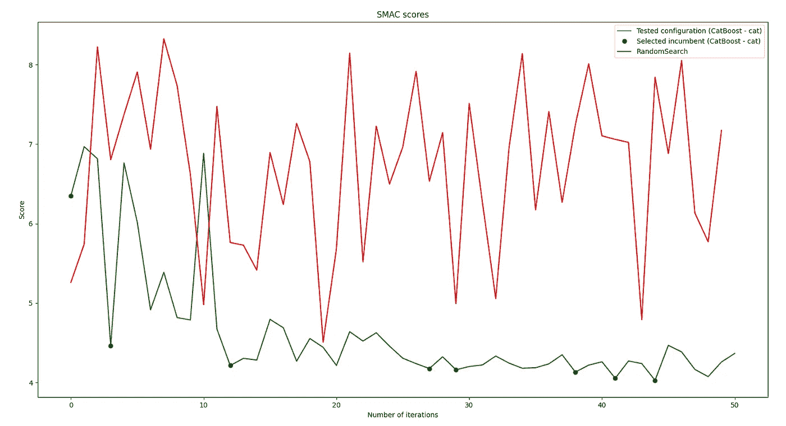
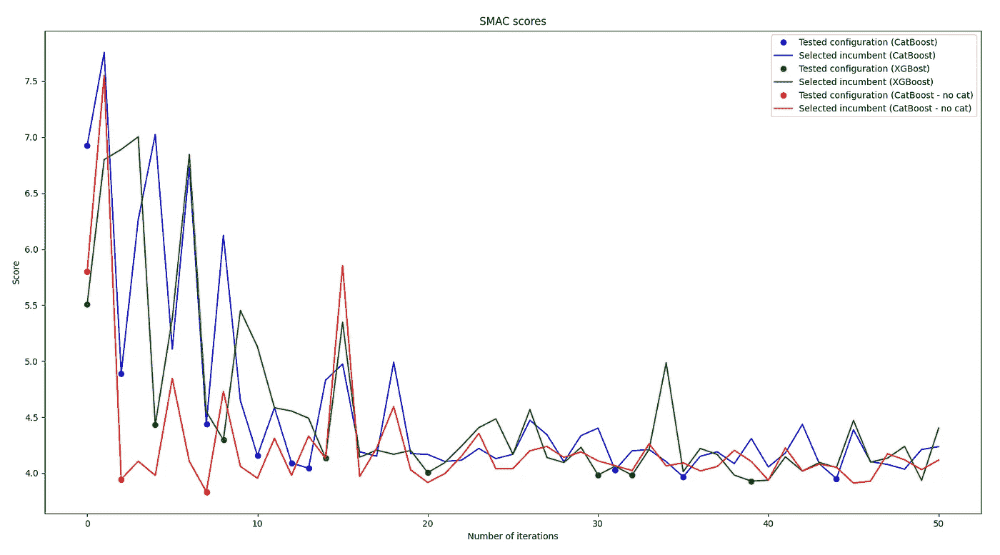
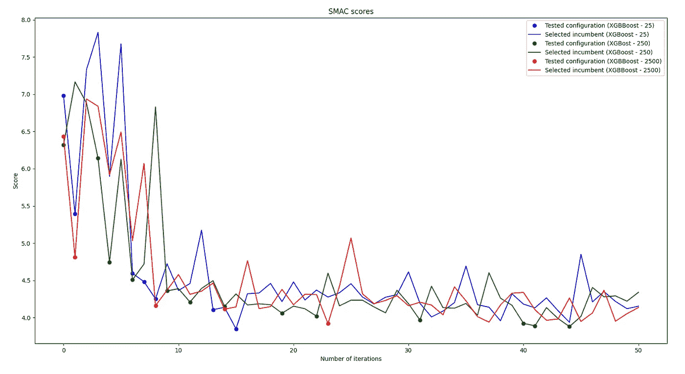
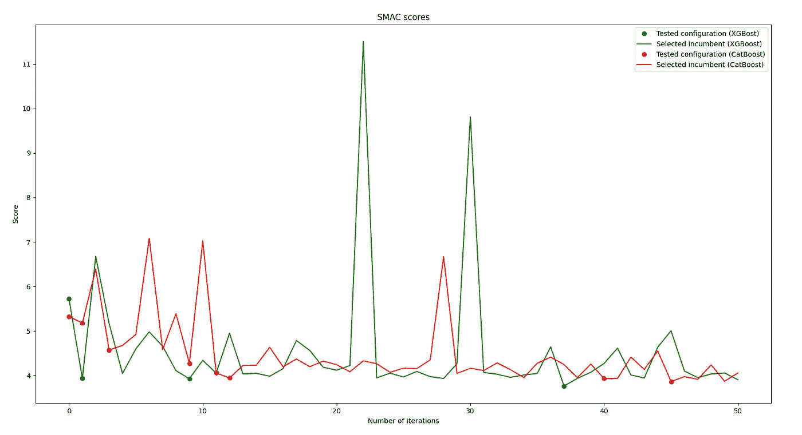

# 用 XGBoost 调优 XGBoost:编写自己的 Hyper Parameters 优化引擎

> 原文：<https://towardsdatascience.com/tuning-xgboost-with-xgboost-writing-your-own-hyper-parameters-optimization-engine-a593498b5fba?source=collection_archive---------7----------------------->

> **更新**:发现我关于渐变提升的新书，[实用渐变提升](https://amzn.to/3is9IwR)。这是用 python 中的许多例子对渐变增强的深入探究。

 [## 实用的渐变增强:深入探究 Python 中的渐变增强

### 这本书的梯度推进方法是为学生，学者，工程师和数据科学家谁希望…](https://www.amazon.com/dp/B0BJ82S916) 

**更新**:了解如何重用下面详述的方法来执行模型选择(向 AutoML 迈进的又一步):

 [## 黑掉惠普调优来执行自动型号选择

### 超参数调整可用于执行模型选择并加速高效的 ML 模型创建。

towardsdatascience.com](/hacking-hp-tuning-to-perform-automatic-model-selection-ef11d4c08ea2) 

照片由 [Unsplash](https://unsplash.com?utm_source=medium&utm_medium=referral) 上的 [Indra Utama](https://unsplash.com/@indraddd?utm_source=medium&utm_medium=referral) 拍摄

编写一个超参数调整引擎似乎是一个巨大的挑战。我们开始吧！

正如你可能知道的，如果你熟悉数据科学、机器学习、数据科学或我以前关于这个主题的文章，微调你的模型对获得最佳性能至关重要。你不能依赖默认值。

正如 [Satyam Kumar](https://medium.com/u/3d8bf96a415f?source=post_page-----a593498b5fba--------------------------------) 在他的上一篇[文章](https://satyam-kumar.medium.com/7-hyperparameter-optimization-techniques-every-data-scientist-should-know-12cdebe713da)中所说，有几种方法可以实现这种优化。它们的范围从手动调整、随机搜索、暴力到贝叶斯搜索。这些方法各有优缺点。

本文将重点介绍一种最近的执行 HP 优化的方法:基于模型的 HP 调优。

这种方法非常有趣，因为它使用 ML 方法来调优 ML 模型。我们可以重用我们熟悉的工具来优化我们熟悉的工具:)令人目不暇接，不是吗？

超参数可以被视为结构化的表格数据，对于结构化的表格数据，我们所知道的最通用的 ML 算法是什么？卡格尔竞赛的无争议冠军？XGBoost！

让我们看看我们可以用它做什么，并尝试使用它来调整自己。

# 基于模型的惠普调整

基于模型的调优背后的想法非常简单:为了加速收敛到给定用例的最佳参数，我们需要一种方法来引导超参数优化到最佳解决方案。事实上，训练一个模型可能很耗时，这取决于训练集的大小，以及通常非常大的配置空间的组合学。

这意味着我们需要一种方法来确定最有前途的配置进行评估。为什么不简单地使用一个模型来学习一个给定配置的分数估计值呢？每一次训练都将被用来改进潜在的模型，并给我们一些探索方向的洞察力。这是基于模型的超参数优化的主导思想。

如果你对这个想法背后的理论感兴趣，我强烈建议你阅读这篇学术论文。您可能也很想看看使用这种方法的 [SMAC](https://github.com/automl/SMAC3) 的实现。

# 总体方法

基于模型优化超参数的整体算法非常简单:

1.  随机选择 n 个配置
2.  使用对配置进行评分的内部评估器来评估这些配置
3.  保留给出最佳分数估计的配置，丢弃所有其他配置
4.  使用此配置训练模型
5.  将当前配置和分数存储到内部评估器的训练集中
6.  重新训练内部评估者
7.  回到步骤 1。如果尚未达到最大迭代次数或最小分数。

让我们看看如何实现这一点。

# 采样配置空间

我们要回答的第一个问题是:我们如何对配置空间进行采样？即:我们如何在配置空间中随机挑选一个合格的配置？

这不是一个非常困难的任务，我们可以自己编写一些代码来解决这个问题，但幸运的是，有一个库可以为我们处理所有的负担:[配置空间](https://automl.github.io/ConfigSpace/master/)。更具体地说，ConfigurationSpace 可以处理条件配置。我们在这里不会用到这个特性，但是它在很多情况下非常有帮助。

以下示例显示了如何使用 ConfigurationSpace 随机生成 RandomForest 配置:

在几行代码中，我们可以轻松地生成随机配置。作者的代码。

# 选择正确的模型

和数据科学一样，现在的下一个问题是:我们应该使用什么模型来构建一个可信的估计器？

最初，基于模型的优化使用[高斯过程](https://scikit-learn.org/stable/modules/gaussian_process.html)来估计配置得分，但是最近[的论文](https://medium.com/r?url=https%3A%2F%2Fml.informatik.uni-freiburg.de%2Fpapers%2F11-LION5-SMAC.pdf)显示基于树的模型是一个很好的选择。放弃高斯过程的主要原因是它们不支持分类特征。

正如上面几行所述，当谈到基于树的模型时，最直接的(但可能不总是最好的)答案是 XGBoost！

为什么使用 XGBoost？不仅因为 XGBoost 和梯度增强方法非常有效，是 Kaggle 竞赛中最常获胜的方法之一，还因为它们非常通用，不需要太多预处理:不需要特征归一化，缺失值可以自动处理，…

说实话，用 XGBoost 来优化 XGBoost 也很搞笑。然而，我们还会考虑另一个选项，它与 XGBoost 非常相似，但具有明显的原生支持类别的优势:C [atBoost](https://catboost.ai/) 。

处理分类特征是一个非常方便的功能，因为许多模型参数都是分类的。认为 XGBoost *目标*，*助推器*或 *tree_method* 参数为例。

LightGBM 也是一个完美的选择。

# 调整模型超参数

我们现在拥有创建我们自己的超参数优化引擎所需的所有元素。为此，我们创建一个由四个参数配置的**优化器**类:

*   *algo_score* :用于给给定配置的模型或算法评分的方法。
*   *max_iter* :要执行的最大训练次数
*   *max _ enhancement*:随机抽样的候选配置的最大数量
*   *模型*:用作分数估计器的内部模型的类别
*   *cs* :探索的配置空间

正如您在下面看到的，这不需要太多行:

这个类使用一个模型实现 HP 调优。来自作者的代码

上面代码的关键部分在于*优化*函数。这个函数做三件事:

*   它将探索的配置存储在列表*CFG 中。*
*   它将选择的配置存储在列表*轨迹*中
*   它使用内部模型*提供的分数估计选择候选配置进行探索。*
*   它使用过去的训练分数来训练估计器

# 性能分析

为了评估我们基于模型的超参数引擎的效率，我们将使用[波士顿](https://scikit-learn.org/stable/modules/generated/sklearn.datasets.load_boston.html)数据集。您可能已经知道，这个数据集包含波士顿房价的信息。我们的模型的目标是估计给定特征的房价。首先，我们将使用 RandomForest 作为我们的基本模型。我们将在这个模型上评估我们基于模型的方法。

首先，让我们确保我们的引擎确实有助于更快地收敛到更好的配置。为此，我们比较了使用 RandomSearch 和我们的引擎时的学习进度。在下面的代码中，我们使用 sci kit learn*RandomizedSearchCV*和我们的*优化器*来随机探索配置空间:

将 RandomizedSearchCV 与我们的引擎进行比较。作者代码。

看下图，毫无疑问，我们的引擎比随机搜索更有效。更准确地说，很明显，我们的引擎随着迭代不断学习和改进:

RandomizedSearchCV vs 我们的引擎。作者的情节。

随机搜索不出所料明显不稳定。

由于您的代码(相对)独立于用作分数估计器的模型，我们还可以比较 XGBoost 和 Catboost 的收敛速度。代码如下:

比较 CatBoost 与 categories、XGBoost 和 CatBoost 一起使用时的收敛性。作者代码。

生成的图显示在下图中:

CatBost(有和没有分类特征)与 XGBoost。作者的情节。

这两种情况下的表现看起来非常相似。请记住，score estimator 的 XGBoost 和 CatBoost Hyper 参数都没有优化:都使用默认配置。我们可以尝试使用另一个评分模型来调整评分模型，但是这篇文章看起来会像盗梦空间电影一样复杂；)

另一个值得分析的方面是强化步骤持续时间的影响。当在探索空间中挑选随机候选者时，我们可以增加候选者的数量。在下面的图中，我们分别用 25、250 和 2500 个强化候选对象来训练我们的模型。代码和前面的类似。我们只是对*优化器*进行了不同的配置:

比较不同程度的强化。作者代码

结果图如下:

强化步骤的数量似乎不影响收敛速度。作者的情节。

在这种情况下，强化似乎没有什么影响。

最后，正如承诺的那样，我们将使用 XGBoost 来调优 XGBoost。代码与 RandomForest 的代码完全相同，只是我们使用 XGBoost 作为主模型。参见下面的代码:

使用 XGBoost 调优 XGBoost。作者代码。

请注意，我们还使用 CatBoost 作为内部评分估计器，以便进行比较。看下面的图，似乎在这种情况下，XGBoost 比 CatBoost 略胜一筹:

使用 XGBoost 调优 XGBoost。图片由作者提供。

# 更进一步

我们已经在这篇文章中表明，建立一个像样的超参数优化引擎并不复杂。通过几行代码，有可能大大加快模型训练的速度。

可笑的是，你不需要使用外部库。重用现有的模型是可行的。XGBoost 可以用来调优 XGBoost，CatBoost 可以用来调优 CatBoost，RandonForest 可以调优 RandomForest。也可以混合使用。

虽然我们的模型工作得很好，但一个非常有趣的改进是更新随机样本，使用贝叶斯策略来生成候选人，使用学习分布而不是随机采样。