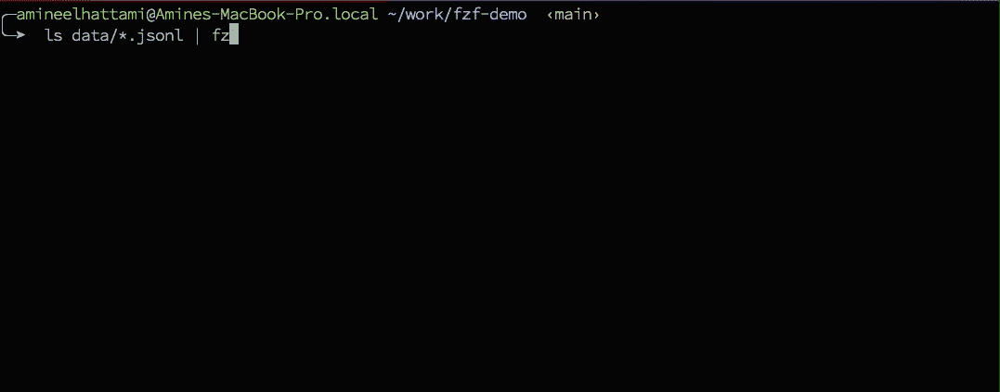

# 增强您的命令行游戏

> 原文：<https://towardsdatascience.com/turbocharge-your-command-line-game-3344b16bfeec?source=collection_archive---------11----------------------->

## 你的工具集中缺少的瑞士军用工具。


[维多利亚诺·伊斯基耶多](https://unsplash.com/@victoriano?utm_source=medium&utm_medium=referral)在 [Unsplash](https://unsplash.com?utm_source=medium&utm_medium=referral) 上拍摄的照片

在从事机器学习项目时，我通常通过 ssh 登录到某个服务器，其中终端是唯一可用的界面。然而，准系统工具非常有限，这降低了我的工作效率。

这篇文章将向你展示如何使用一个名为 [fzf](https://github.com/junegunn/fzf) 的模糊查找器来增强你的命令行游戏，从而显著提高工作效率。由于浏览 fzf 提供的所有特性会很冗长，所以我的目标是让您知道这个工具是存在的，您不需要成为一个高级程序员就可以使用它，最后，为您提供使它适应您的工作流的基本模块。

# 设置

首先，您必须使用您的包管理器或从 git 安装 fzf。对于其他操作系统，检查 [fzf 文档](https://github.com/junegunn/fzf)中的安装部分。

```
# Conda
conda install -c conda-forge fzf# Debian 9+ and Ubuntu 19.10+
sudo apt-get install fzf# Git
git clone --depth 1 https://github.com/junegunn/fzf.git ~/.fzf
~/.fzf/install# macOS
brew install fzf
$(brew --prefix)/opt/fzf/install
```

安装后，您可以通过在终端中键入`fzf`来检查它是否正常工作。它应该递归地显示当前文件夹中所有文件的列表。


Fzf 命令

此时，您可能会问自己这有什么用，因为命令返回文件路径，仅此而已。那么，让我们看一些用例。

# 使用

在我们开始之前，我强烈建议您在阅读本节内容时尝试一下您自己的命令。

## 基础

首先，让我们回顾一下如何与 fzf 交互的一些基础知识:

*   要上下移动列表，使用`<CTRL j/n>`和`<CTRL k/p>`。
*   一旦你找到你要找的文件，点击`<ENTER>`选择文件。
*   要进行精确匹配，请使用`'`。比如`'myfile`。
*   要匹配后缀，请使用`$`。比如`.py$`。
*   要匹配前缀，请使用`^`。比如`^test_`。
*   要匹配多个标准，请使用`|`。比如`.py$ | .json$`。
*   要退出，点击`<CTRL c>`。

## 命令历史

我们都遇到过这样的情况，你想执行一个以前用过的命令，但是找不到。首先，本机 UNIX 搜索命令历史很难使用。第二，打 20 次箭头键不实用。所以现在你已经安装了 fzf，在你的终端点击`<CTRL r>`开始享受吧！


用 fzf 显示命令历史

## 更改目录

在处理深度嵌套的文件夹结构项目时，四处移动会变得非常乏味，尤其是在不熟悉的情况下。要使用 fzf 来改变目录，请在您的终端中点击`<ATL c>`，然后模糊查找您正在搜索的文件夹。


用 fzf 更改目录

## 显示文件内容

假设您想要显示一个特定文件的内容，但是您不记得确切的文件名和位置。蛮力解决方案将是`cd`到一堆文件夹试图找到它。另一个解决方案是使用搜索工具。但是，如果您不知道确切的文件名，您将需要使用 regexp。最后，打开 IDE，等待它启动，打开项目，然后找到文件。

现在让我们看看使用 fzf 这个工作流会是什么样子。举个例子，我想显示`myfile.txt`的内容，但是假设我只记得文件名中包含了`my`。


用 fzf 显示文件内容

我在上面使用的命令是`cat`，因为我想显示文件的内容。但是，您可以使用任何将文件路径作为参数的命令。此外，您可以使用`$(fzf)`或`**<TAB>`获得相同的结果，如下所示:

```
<YOUR COMMAND> $(fzf)/`fzf`# or
<YOUR COMMAND> <CTRL t># or
<YOUR COMMAND> **<TAB>
```

## 选择多个文件

假设你想删除三个不同目录下的文件，但是你不知道它们的具体位置。从我们所看到的，解决方案将是一个接一个地选择和删除文件。

```
# For file 1
rm <CTRL t># For file 2
rm <CTRL t># For file 3
rm <CTRL t>
```

但是，fzf 使用`<TAB>`键提供了多选功能。在下面的例子中，我使用多重选择删除三个不同目录中的三个文件。


用 fzf 删除文件

## 过滤命令的输出

在上面的所有例子中，我们使用 fzf 为命令(cd、rm 等)提供参数。).但是，fzf 也可以过滤命令的输出，这在命令输出很长的情况下非常有用。在下面的例子中，我使用 fzf 在`ps`命令输出中搜索，使用`ps aux | fzf`检查一些进程的状态。


用 fzf 对 ps 输出进行滤波

# 构建您自己的

在上面所有的例子中，我们使用了 fzf 默认提供的界面和快捷键。但是，您可以创建自己的。本节将展示如何使用 fzf 构建符合您需求的定制实用程序。我选择了一个我经常使用的简化版本的工作流，但是您可以很容易地修改它来创建您自己的工作流。

## 使用案例

在许多机器学习项目中，我依赖 JSON lines 格式的数据集。在我的工作流程中，我通常需要先看一眼文件，然后再将它们用作我的训练脚本的参数，特别是因为其中一些文件是自动生成的，可能包含错误。

下面是简化的项目结构。`train.py`是 python 训练脚本，`data`是包含数据文件的文件夹。此外，训练脚本接受一个表示要使用的数据文件的参数。

```
fzf-demo
├─ train.py
├─ data/
├─── dataset_1.jsonl
├─── dataset_2.jsonl
...
├─── dataset_n.jsonl
```

此外，我还创建了一个演示库，您可以克隆它来自己复制演示。

```
git clone [git@github.com](mailto:git@github.com):Am1n3e/fzf-demo.git
```

## 列出数据集文件

首先，我们需要列出可用的数据集文件，然后使用 fzf 选择一个。

```
ls data/*.jsonl | fzf
```

上面命令的输出应该如下所示:



Fzf 列表文件

在这个例子中，我只使用`ls`命令列出了本地文件。但是，您可以将 fzf 用于任何命令或应用程序的输出。例如，您可以列出 S3 存储桶中的文件。

## 添加预览

正如我前面解释的，在开始培训之前，我需要快速浏览一下文件(可能是前两行)。此外，我不想打开整个文件，因为有些文件很大，需要花时间打开。最后，我希望在不退出 fzf 的情况下选择数据文件时看到预览。

首先，我将使用`head`读取前两行，并使用`jq`(参见[此处的](https://stedolan.github.io/jq/)了解更多关于`jq`命令的信息)格式化输出。例如，`head -n 2 data/dataset_1.jsonl | jq .`将输出以下内容:


数据集预览示例

然后，我可以使用`--preview`参数将其添加到 fzf，如下所示。

```
ls data/*.jsonl | fzf --preview 'head -n 2 {} | jq .'
```

下面是上面命令的输出。正如您所看到的，当我选择数据文件时，预览得到了更新。


带预览的 Fzf 列表文件

`--preview`参数的值可以包含任何命令。如果预览更复杂，您甚至可以调用自己创建的脚本。你唯一需要记住的是 fzf 会用当前选中的行替换`{}`。在我们的例子中，它是文件路径。

## 绑定命令

在我的用例中，我还想删除不存在 fzf 的包含错误的文件。为此，我们可以使用`--bind`参数绑定一个命令，如下所示:

```
ls data/*.jsonl | \
  fzf \
  --preview 'head -n 2 {} | jq .' \
  --bind 'tab:execute(rm {})'
```

在这里，我将`<TAB>`映射为运行`rm`。与`--preview`参数类似，`{}`包含所选行的内容。请注意，您可以映射多个命令。但是，有一组您可以使用的快捷方式(详见`man fzf`)。

## 临时演员

fzf 提供了多个选项来定制界面，如颜色、边框、帮助、布局、大小等。以下是我使用的选项:

```
ls data/*.jsonl | \
  fzf \
  --preview 'head -n 2 {} | jq .' \
  --bind 'tab:execute(rm {})' \
  --layout=reverse \
  --border \
  --prompt "train_file> " \
  --header $'Press TAB to delete the selected file\n\n'
```


自定义 fzf 实用程序

有关更多详细信息，请查看[文档](https://github.com/junegunn/fzf/blob/master/ADVANCED.md)。

## 把它放在一起

现在我们已经准备好了 fzf 命令，我们可以使用它的输出作为`train.py`脚本的参数，如下所示。为了方便起见，我创建了一个函数，并将其添加到我的`~/.zshrc`或`~/.bashrc`文件中。

```
train() {
    data_file=$(ls data/*.jsonl | \
        fzf \
        --preview 'head -n 2 {} | jq .' \
        --bind 'tab:execute(rm {})'  \
        --layout=reverse \
        --border \
        --prompt "train_file> "  \
        --header $'Press TAB to delete the selected file\n\n') && \
        python train.py $data_file
}
```


最后，如果您想为任何知名工具构建一个 fzf 实用程序，首先检查这个[库](https://github.com/junegunn/fzf/wiki/examples)。它包含多个实用程序，您可以按原样使用或作为示例使用。

# 结论

在这篇文章中，我讲述了一些基本的 fzf 用法，并向你展示了如何构建自己的 fzf。然而，我只是刷了一下使用 fzf 可以完成的事情的表面。我的目标是让你知道这个工具是存在的，并且不难使用。

**除非另有说明，所有图片均出自 Amine El hattami 之手。*

# 在你走之前

在推特上关注我，我经常在推特上发布关于软件开发和机器学习的消息。