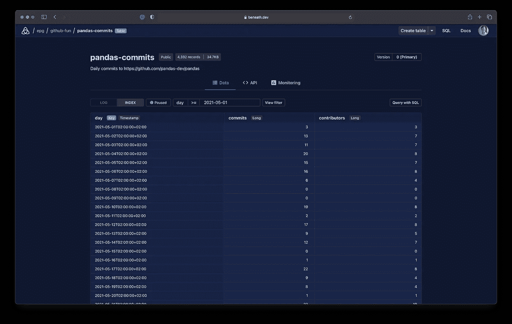

# 将熊猫数据帧转换成 API

> 原文：<https://towardsdatascience.com/turn-a-pandas-dataframe-into-an-api-ac56eaefe11b?source=collection_archive---------10----------------------->

## 与他人共享数据框架或将数据集成到前端。

熊猫数据框是我最喜欢的用 Python 操作数据的方式。事实上，我的许多小型分析项目的最终产品只是一个包含我的结果的数据框架。

我过去常常将我的数据帧转储到 CSV 文件中，并保存到 Github 中。但是最近，我一直在使用下面的[，一个我正在构建的数据共享服务，来保存我的数据帧，同时将它们转化为一个完整的 API 和一个网站。当我需要将数据集移交给客户端或将数据集成到前端时，它非常有用。](https://about.beneath.dev)

在这篇文章中，我将向你展示这是如何工作的！我将获取 GitHub 提交，分析它们，并使用 before 将结果转换成 API。

# 下的**设置**

要开始，你需要安装 under`pip`模块，并使用免费 under 帐户登录。这很简单，医生已经做好了准备。只要按照[这些步骤](https://about.beneath.dev/docs/quick-starts/install-sdk/)就可以了。

请务必记住您的用户名，因为您马上就要用到它了！

# 让我们分析一些数据

我认为 Github 活动是一个迷人的、未被充分开发的数据源。让我们揭开表面，看看对…熊猫的承诺！这里有一个快速脚本来获取`pandas`源代码，并汇总一些关于提交和贡献者数量的每日统计数据:

现在，`df`变量包含了我们的洞察力。如果您正在跟进，您可以更改`repo`变量来抓取另一个 Github 项目。只是要小心一些主要的回购可能要花很长时间来分析(我看着你， [torvalds/linux](https://github.com/torvalds/linux) )。

# 将数据框保存到下方

首先，我们将创建一个新项目来存储我们的结果。我将从命令行完成，但是您也可以使用 web [控制台](https://beneath.dev/-/create/project):

```
beneath project create USERNAME/github-fun
```

只需用你自己的用户名替换`USERNAME`。

现在，我们准备发布数据框架。我们在 Python 中直接用一个简单的一行程序来实现它(好吧，我把它分成了多行，但它仍然只是一个调用):

这里发生了一些事情。让我们浏览一下:

*   `table_path`给出了输出表的完整路径，包括我们的用户名和项目。
*   我们使用`records`参数来传递我们的数据帧。
*   我们为数据提供一个`key`。自动生成的 API 使用键[索引数据](https://about.beneath.dev/docs/reading-writing-data/index-filters/)，这样我们可以快速过滤记录。默认情况下，index 将使用 DataFrame 的索引作为键，但我更喜欢手动设置它。
*   `description`参数向数据集添加了一些文档，这些文档将显示在表页面的顶部。

就是这样！现在让我们来探究结果。

# 探索您的数据

您现在可以前往 [web 控制台](https://beneath.dev/?noredirect=1)并浏览数据及其 API 文档。我的名字在[https://beneath.dev/epg/github-fun/table:pandas-commits](https://beneath.dev/epg/github-fun/table:pandas-commits](https://beneath.dev/epg/github-fun/table:pandas-commits))(如果你使用相同的项目和表名，你可以把我的用户名`epg`替换成你自己的)。



在下面的控制台中浏览您的数据

您还可以共享或发布数据。权限是在项目层管理的，所以只需进入项目页面添加成员或将项目设置切换到`public`。

# 使用 API

既然数据在下面，任何有权限的人都可以使用这个 API。在表格页面的“API”选项卡上，我们获得了用于集成数据集的自动生成的代码片段。

例如，我们可以将数据帧加载回 Python:

或者我们可以在 2021 年 5 月的每一天查询 REST API 并获取提交信息:

或者使用 React 钩子将数据直接读入前端:

在下面的控制台中查看我的数据框架的 [API 标签](https://beneath.dev/epg/github-fun/table:pandas-commits/-/api)以查看使用数据的所有方法。

# 好了

就是这样！我们使用 used 将熊猫数据帧转换成 API。如果您有任何问题，我大部分时间都在线，在 under 的 [Discord](https://discord.gg/f5yvx7YWau) (我喜欢谈论数据科学，所以也欢迎您只是打个招呼👋).让我知道你是否发布了一个很酷的数据集，我可以在特色项目中聚焦！