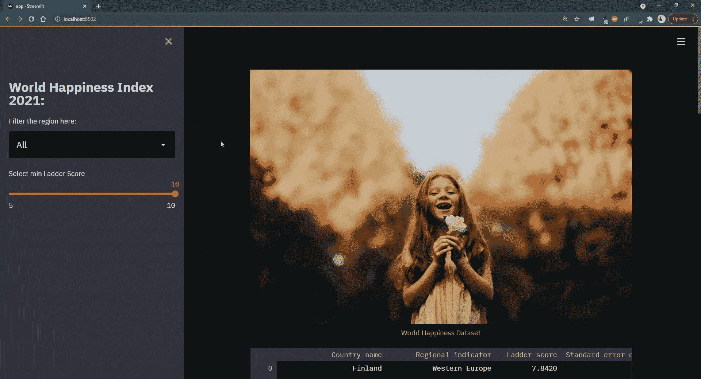
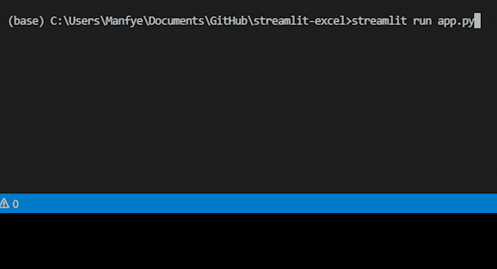
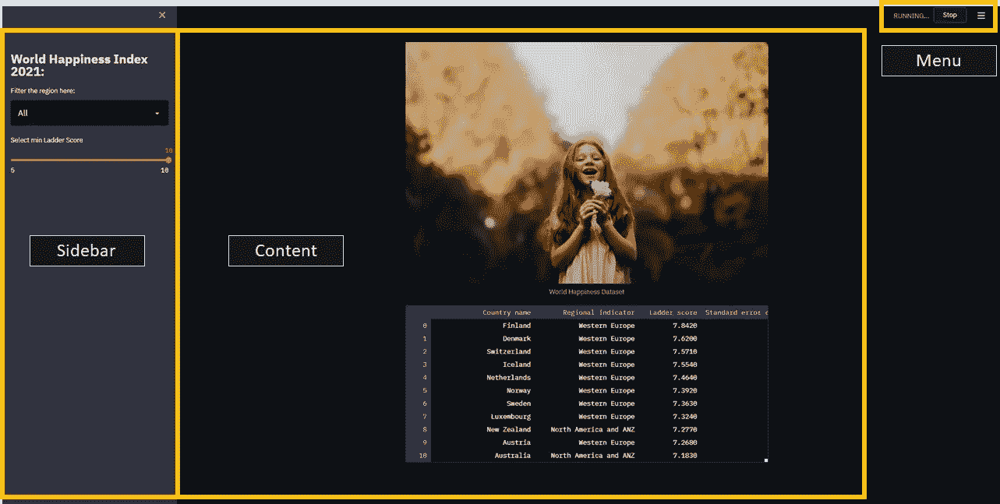
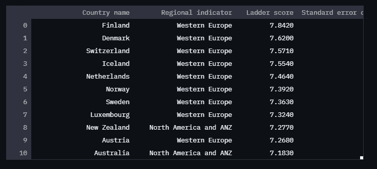
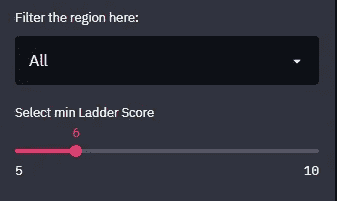
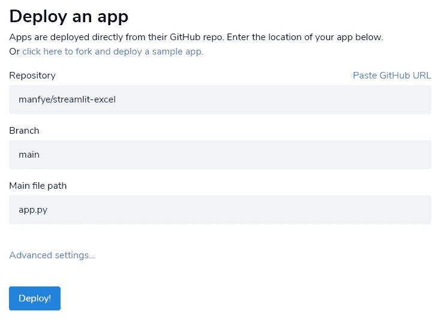
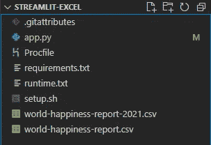

# 使用 Streamlit 将 Excel 变成漂亮的 Web 应用程序

> 原文：<https://towardsdatascience.com/turn-excel-into-a-beautiful-web-application-using-streamlit-7a18516ca01a?source=collection_archive---------4----------------------->

## 细流系列

## 使用 python 库 Streamlit 将您的 excel 电子表格呈现为交互式仪表盘 web 应用程序


马修·贝尔泰利从[派克斯](https://www.pexels.com/photo/girl-holding-white-flower-573259/?utm_content=attributionCopyText&utm_medium=referral&utm_source=pexels)拍摄的照片

# 什么是 Streamlit？

Streamlit 是一个开源的 Python 库，可以轻松地为机器学习和数据科学项目创建和共享漂亮的定制 web 应用程序[1]

Streamlit 的一个主要特性是它为你提供了一个类似 Jupyter 笔记本的环境，当你保存你的脚本时，你的代码会实时更新。这很有帮助，尤其是对于初期的 app 开发阶段。


图片来自 Streamlit.io. GIF 作者

# 电子表格和数据科学项目的问题

excel 和数据科学项目存在的问题是**缺乏一种简单的方式来呈现结果**(也称为生产部署)。对于要呈现的 excel 文件，您需要将它与可视化工具(如 Power BI、Tableau 或 Powerpoint)链接起来。

然而，要实现一个数据科学项目，您需要实现一个后端服务器，如 Django、Flask，以及一个前端 UI，如 React 和 Vue.js。

*这些复杂性使得用电子表格和数据科学项目共享数据变得极其枯燥和乏味。*

幸运的是，在 Streamlit 的帮助下，我们可以轻松地从 Excel 电子表格中创建一个交互式 web 应用程序，并轻松地部署数据科学项目。🙌

> 在本文结束时，您将能够创建一个交互式的 excel dashboard web 应用程序，使用户能够过滤数据、可视化图形并使用 URL 轻松访问。或者，您可以访问 web 应用程序[这里](https://share.streamlit.io/manfye/streamlit-excel/main/app.py)和存储库[这里](https://github.com/manfye/Streamlit-App)



交互式 excel 仪表板。作者图片

# 开始使用:

我们将使用 Kaggle 的《2021 年世界幸福报告》*作为本文的数据集，请随意下载:*

*<https://www.kaggle.com/ajaypalsinghlo/world-happiness-report-2021>  

通过 pip 安装安装 Streamlit

```
pip install streamlit
```

通过在命令提示符下键入 Streamlit CLI 来验证您的安装

```
streamlit hello
```

就是这样！在接下来的几秒钟内，示例应用程序将在您默认浏览的新选项卡中打开。

要制作自己的应用程序，创建一个空白的 python 文件 *app.py* ，并使用 streamlit CLI 运行它。然后，单击 localhost URL 进入您的第一个 streamlit web 应用程序！

```
streamlit run app.py
```



启动 streamlit web 应用程序。作者图片

# 了解用户界面

默认情况下，Streamlit 已经有两个地方可以放置代码和小部件，分别是侧边栏和内容。您可以在内容区域添加元素和小部件，只需使用:

```
import streamlit as st
st.**[element_name]**
```

您可以在侧边栏中添加元素和小部件，只需使用:

```
import streamlit as st
st**.sidebar.**[element_name]
```

您可以根据内容区域在侧边栏中放置任何元素，在撰写本文时唯一不支持的元素是`st.echo`和`st.spinner`。



Streamlit 应用程序的区域。作者图片

## 加载数据

使用 pandas 可以从 Excel 和 CSV 加载数据:

```
import pandas as pd#For Excel File
df = pd.read_excel("world-happiness-report-2021.xlxs")#For CSV File
df = pd.read_csv("world-happiness-report-2021.csv")
```

## 显示部件

显示小部件非常简单，您想要一个*文本*，只需将它写成:

```
st.**title**(“World Happiness Index 2021:”)
```

如果您希望它出现在侧边栏中，只需将代码编写为:

```
st**.sidebar.**title(“World Happiness Index 2021:”)
```

如果你想要一个*图像*，只需写下:

```
st.**image**(“https://images.pexels.com/photos/573259/pexels-photo-573259.jpeg?cs=srgb&dl=pexels-matheus-bertelli-573259.jpg&fm=jpg", caption=’World Happiness Dataset’)
```

如果你想显示一个*数据帧*，只需写:

```
st.**write**(filtered_df)
```



打印数据框。作者图片

这就是它在 Streamlit 中的工作原理！

## 控制器部件

Streamlit 有一个“类似状态”的组件功能，用户与小部件的交互将改变变量的状态。然后，变量的新值将用于重新渲染整个项目的组件。

在这个项目中，我们将创建一个 ***选择框小部件*** 用于过滤国家和***一个滑块*** 用于过滤侧边栏中的阶梯分数。

```
**#Country Select Filter**
country_list = ["All","Western Europe", "South Asia", "Southeast Asia", "East Asia", "North America and ANZ","Middle East and North Africa", "Latin America and Caribbean","Central and Eastern Europe","Commonwealth of Independent States","Sub-Saharan Africa"]select = st.sidebar.selectbox('Filter the region here:', country_list, key='1')if select =="All":
filtered_df = df
else:
filtered_df = df[df['Regional indicator']==select]**#Ladder Score Slider**
score = st.sidebar.slider('Select min Ladder Score', min_value=5, max_value=10, value = 10) # Getting the input.
df = df[df['Ladder score'] <= score] # Filtering the dataframe.
```

您将获得可以过滤数据框的小部件，如下所示:



控制器小部件。作者图片

## 可视化小部件

Streamlit 支持几个不同的图表库，如 Matplotlib、Seaborns、Ploty、Altair 图表。它还提供了一些本地图表，如折线图和面积图，可以通过一行代码调用，例如:

```
**#Line Chart**
st.line_chart(data=None, width=0, height=0, use_container_width=True)**#Area Chart**
st.area_chart(data=None, width=0, height=0, use_container_width=True)
```

但是，在本教程中，我们将对散点图和条形图使用 Plotly express。然后，我们将 seaborn 用于热图，如下所示:

```
import plotly.express as px
import seaborn as sns**#Scatter Chart**
fig = px.scatter(filtered_df,
x="Logged GDP per capita",
y="Healthy life expectancy",
size="Ladder score",
color="Regional indicator",
hover_name="Country name",
size_max=10)st.write(fig)**#Bar Chart**, you can write in this way too
st.write(px.bar(filtered_df, y='Ladder score', x='Country name'))**#Seaborn Heatmap**
#correlate data
corr = filtered_df.corr()#using matplotlib to define the size
plt.figure(figsize=(8, 8))#creating the heatmap with seaborn
fig1 = plt.figure()ax = sns.heatmap(corr,
vmin=-1, vmax=1, center=0,
cmap=sns.diverging_palette(20, 220, n=200),
square=True
)ax.set_xticklabels(
ax.get_xticklabels(),
rotation=45,
horizontalalignment='right'
);st.pyplot(fig1)
```

注意:对于 Seaborn 来说，它是一个 axes 组件，所以不能直接使用 *st.write* 来呈现图表，而必须使用 *st.pyplot* 来呈现组件。* 

# *通过简化 it 共享进行部署*

*Streamlit 还有另一个独特的功能，称为 streamlit 共享，他们可以帮助你在他们的网站上托管你的 streamlit 应用程序。只需在与 app.py 相同的文件夹中准备一个***requirements . txt***文件就行了。*

*requirements.txt 文件告诉系统应用程序将使用什么 python 包，在我们的例子中，它将是:*

```
*streamlit==0.83.0
numpy==1.18.5
pandas==1.2.4
matplotlib==3.4.2
plotly-express==0.4.1
seaborn==0.11.1*
```

*单击部署，您将获得您的 web 应用程序的 URL。🎉🎉*

**

*简化 it 共享部署共享。图片作者。*

***在撰写本文时，Streamlit 分享需要 Streamlit 的邀请。他们花了大约 2 个工作日批准我的账户**

# ***经由 Heroku 的部署***

*除了推荐的功能，您还可以将您的应用程序托管在 Heroku 或任何其他自定义主机上，如 digital ocean、AWS 或 google cloud。我将展示 Heroku 的托管方法，因为这是一个免费的解决方案。*

*要在 Heroku 中托管，您需要在完全相同的位置使用与上面完全相同的 requirement.txt。除此之外，您还需要另外两个文件，它们是:*

*a) Procfile:*

```
*web: sh setup.sh && streamlit run app.py*
```

*b)设置. sh:*

```
*mkdir -p ~/.streamlit/echo "\
[general]\n\
email = \"<youremail>\"\n\
" > ~/.streamlit/credentials.tomlecho "\
[server]\n\
headless = true\n\
port = $PORT\n\
enableCORS = false\n\
\n\
" > ~/.streamlit/config.toml*
```

*复制与上面完全相同的设置，您将得到如下的文件夹结构:*

**

*项目文件夹结构。作者图片*

*我在 [Heroku](https://streamlit-excel.herokuapp.com/) 和 [Streamlit Sharing](https://share.streamlit.io/manfye/streamlit-excel/main/app.py) 主持过同一个项目，你可以亲自查看并比较速度和功能。在我看来，这两种方式各有利弊，Streamlit Sharing 提供免费主机服务，Heroku 的主机服务每个账户只能有 2 个免费主机服务。*

# *最终想法*

*在本文中，我们介绍了 Streamlit 的基础知识，包括安装、在 Streamlit 中编写脚本的基本概念、仪表板设计、图表可视化和 web 应用程序的部署。*

*Streamlit 是数据表示工具的新范例，具有巨大的潜力。它解决了数据科学中的最后一英里问题，即将项目轻松交付给最终用户，无论是外行还是同行数据科学家。我花了不到一个小时的时间理解了 Streamlit 的概念，并带着它来到了❤️，我希望我的分享也能激发你对 Streamlit 的兴趣！*

*最后，非常感谢您阅读我的文章。*

## *旁注:*

*这里有一段视频介绍什么是 100 秒内简化:*

*100 秒内简化*

*如果您对 excel 自动化感兴趣，这篇文章是必读的:*

*</automate-excel-with-python-7c0e8c7c6256> [## 使用 Python 自动化 Excel

towardsdatascience.com](/automate-excel-with-python-7c0e8c7c6256) 

我的其他文章包括:

</automate-google-sheet-reporting-in-5-minutes-8bbdc1f8e293> [## 5 分钟内自动完成谷歌表单报告

towardsdatascience.com](/automate-google-sheet-reporting-in-5-minutes-8bbdc1f8e293) </predicting-hepatitis-patient-survivability-uci-dataset-71982aa6775d>  

# 参考资料:

[1][https://streamlit . io](https://streamlit.io)

[2][https://doc.streamlit.io/](https://discuss.streamlit.io/)*