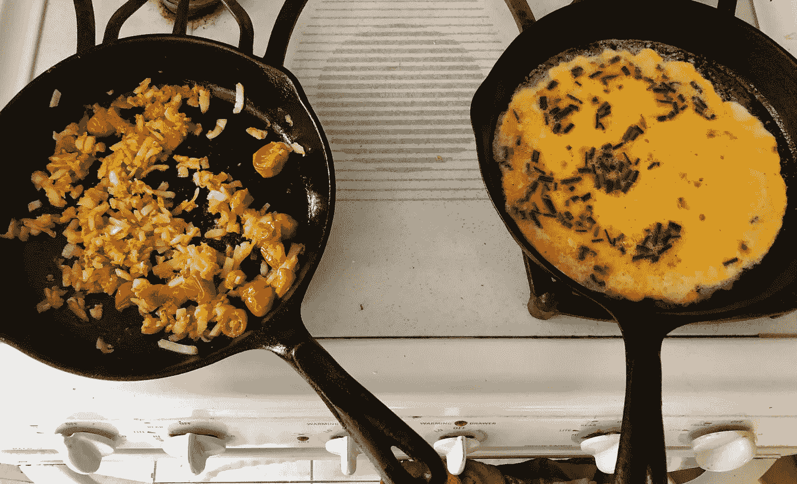
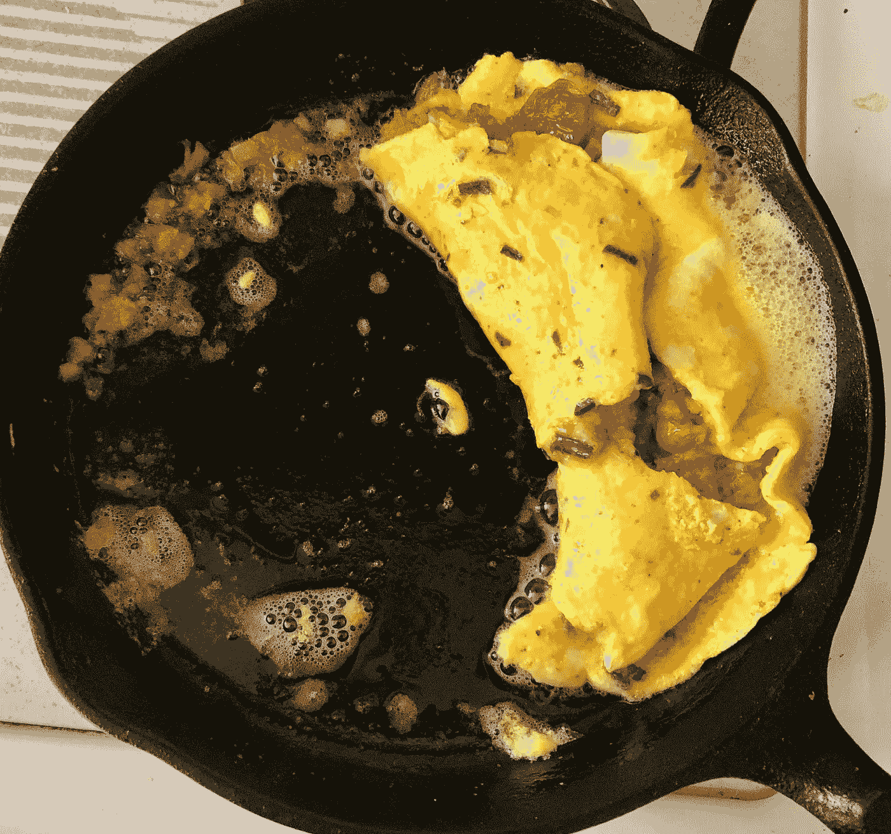

# 将 JSON 转化为可操作的数据—午餐

> 原文：<https://towardsdatascience.com/turn-json-into-actionable-data-lunch-fb5a2834212f?source=collection_archive---------29----------------------->



作者照片

心理学认为，在我们的短期记忆中，人类一次能够处理多达 7 条信息。这就是为什么我们很难快速处理 JSON 对象。信息太多了，我们小小的大脑容纳不下。要将 JSON 转换成可操作的数据，我们需要将其加载到表中，并使用 SQL 缩小范围。

这里有一些有趣的 JSON 资源，其中的食谱比我能理解的还要多。我想总结一下这些数据，找出一些好吃的东西来做——最好是在午饭前，因为我饿了。我将使用 JSON 解析把它加载到 Snowflake 中。

*   阿特金斯标签中的食谱
*   [公开菜谱](https://github.com/fictivekin/openrecipes)

我可以看到像 https://schema.org/Recipe[这样的 JSON 模式，但是我的小脑袋就是不能理解它。这就是为什么我会使用像雪花数据库这样的工具将数据转换成表格，并将其总结成小块。](https://schema.org/Recipe)



作者照片

在 Snowflake 中存放数据的最佳方式是使用存储集成来避免密码共享并正确利用角色。

*   [创建存储集成](https://docs.snowflake.com/en/sql-reference/sql/create-storage-integration.html)

一旦你有了一个合适的存储集成，把上面的食谱复制到 S3 的 stage 文件夹中，然后为每个文件夹创建一个 stage。

```
create or replace stage owlmtn.stage.recipes
storage_integration = azrius_data
url = 's3://my-s3-data-bucket/stage/recipes';
```

从查询将普通 JSON 转换成表开始。

```
create or replace table tab_atkins_recipes as
select t.KEY as ID, value:name::String name, value:tags tags_variant, value:ingredients ingredients_variant
from **@owlmtn.stage.recipes** (
                        pattern =>'.*.json',
                        file_format => stage.json_file_format) s,
     table(flatten((s."$1"))) t;
```

该表为我提供了一种快速查询数据库的方法，以找出午餐做什么。我们吃素吧。当然，还有…我要用完鸡蛋了。

```
select *
from tab_atkins_recipes
where tags_variant like '%vegetarian%'
and ingredients_variant like '%eggs%';
```

这产生了 28 个结果。太多了，我的小脑袋无法理解。煎蛋卷怎么样？

```
select *
from tab_atkins_recipes
where tags_variant like '%vegetarian%'
and ingredients_variant like '%eggs%'
and name like '%omelet%';
```

通过查看表格，我可以很容易地理解做出选择所需的信息。我想我会选择墨西哥马铃薯煎蛋卷。

# 结论

将 JSON 数据转换成表格是理解、交流和决策的强大工具。表格布局在我们的大脑中组织数据，并允许我们快速进行关联。

将雪花实例上的 JSON 转换放在手边，并在需要生成可操作的事件时使用 JSON 数据上的转换，即使该事件只是午餐。