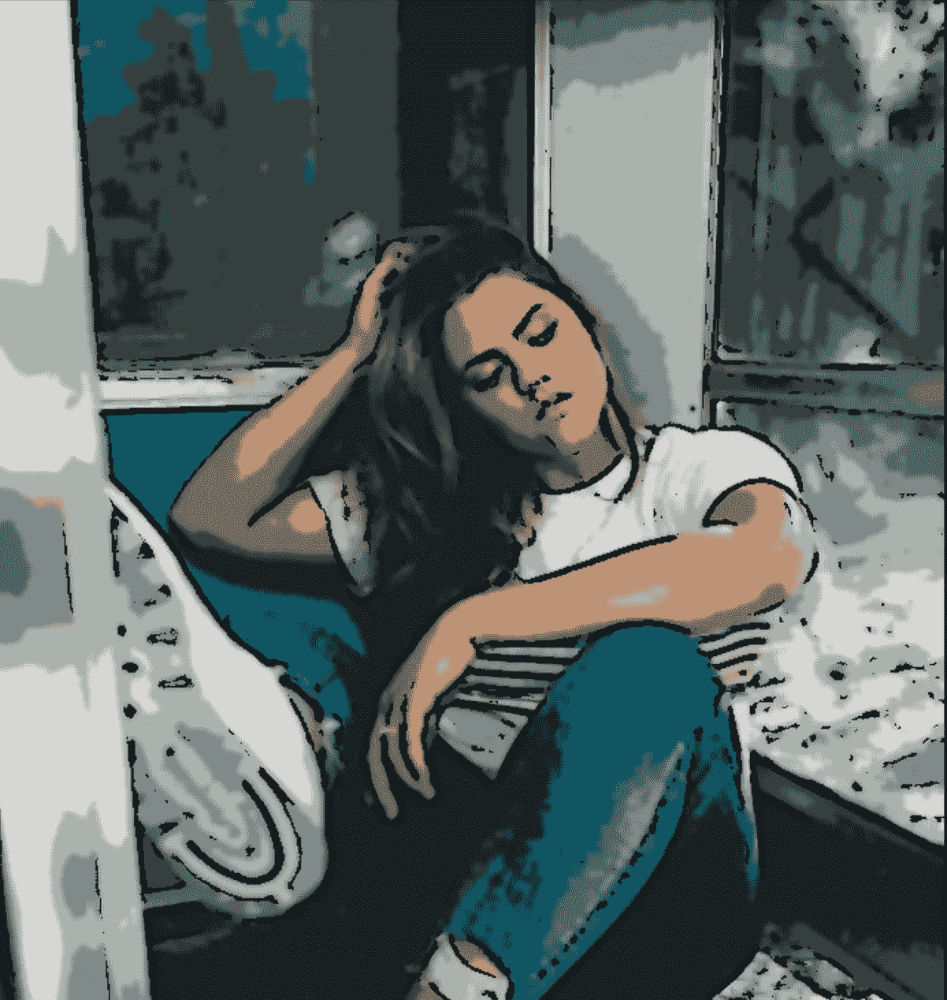
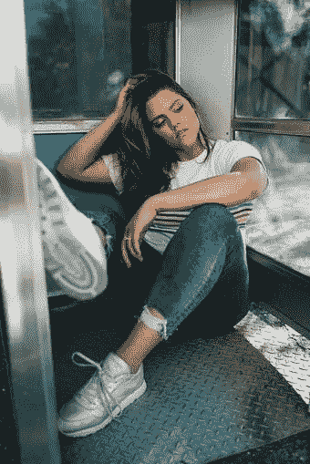
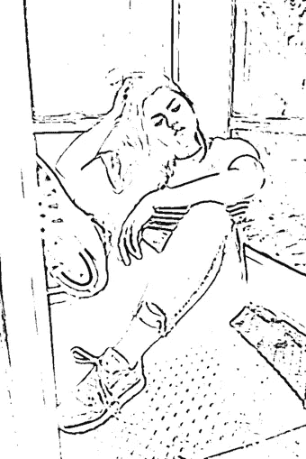
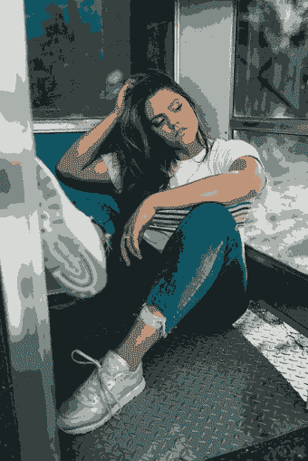
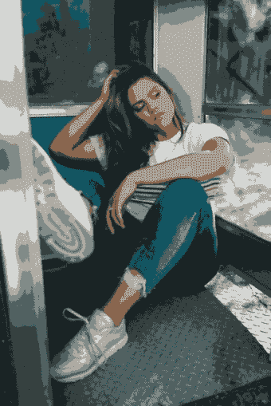
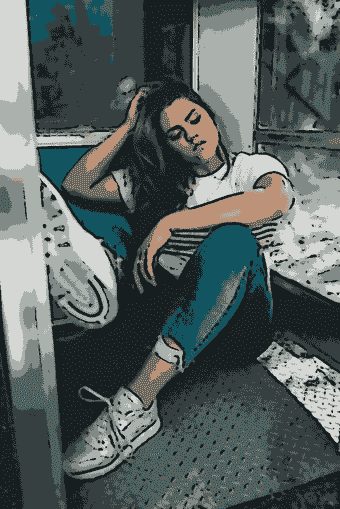

# 使用 Python 将照片变成卡通

> 原文：<https://towardsdatascience.com/turn-photos-into-cartoons-using-python-bb1a9f578a7e?source=collection_archive---------1----------------------->

## 你可以通过在 Python 中实现机器学习算法来给一张照片赋予卡通效果。



凯特·温吉尔特在 [Unsplash](https://unsplash.com/photos/g14V7_SQyrw) 上的原始图片，由作者编辑

你可能知道，画草图或创作一幅漫画并不总是需要手动完成。现在很多 app 都可以把你的照片变成漫画。但是如果我告诉你，你可以用几行代码创建你自己的效果呢？

有一个名为 [OpenCV](https://opencv.org/about/) 的库，它为计算机视觉应用程序提供了一个公共基础设施，并拥有优化的机器学习算法。它可用于识别物体、检测和生成高分辨率图像。

在本教程中，我将向你展示如何利用 OpenCV 在 Python 中给一幅图像赋予卡通效果。我使用 Google Colab 来编写和运行代码。**你可以在这里** 访问 Google Colab [**中的完整代码**](https://colab.research.google.com/drive/1lV5oJ_hI8PsSV1WDVWWfL18-tMm4vnxe?usp=sharing)

创造一个卡通效果，需要注意两点；**边缘**和**调色板**。这就是照片和漫画的区别。为了调整这两个主要组件，我们将经历四个主要步骤:

1.  加载图像
2.  创建边缘遮罩
3.  减少调色板
4.  将边缘遮罩与彩色图像结合

在跳转到主要步骤之前，不要忘记导入笔记本中需要的库，尤其是 **cv2** 和 **NumPy。**

```
import cv2
import numpy as np**# required if you use Google Colab**
from google.colab.patches import cv2_imshow
from google.colab import files
```

# 1.加载图像

第一个主要步骤是加载图像。定义 **read_file** 函数，该函数包括 **cv2_imshow** 来加载我们在 Google Colab 中选择的图像。

调用创建的函数来加载图像。

```
uploaded = files.upload()
filename = next(iter(uploaded))
img = read_file(filename)
```

我选择了下面的图片来转换成一幅漫画。



Kate Winegeart 在 [Unsplash](https://unsplash.com/photos/g14V7_SQyrw) 上拍摄的图片

# 2.创建边缘遮罩

通常，卡通效果强调图像边缘的厚度。我们可以通过使用`cv2.adaptiveThreshold()` 函数来检测图像中的边缘。

总的来说，我们可以将 **egde_mask** 函数定义为:

在这个函数中，我们将图像转换成灰度。然后，我们通过使用`cv2.medianBlur`来降低模糊灰度图像的噪声。较大的模糊值意味着图像中出现的黑色噪点较少。然后，应用`adaptiveThreshold`功能，定义边缘的线条尺寸。较大的线条尺寸意味着图像中强调的边缘较厚。

定义函数后，调用它并查看结果。

```
line_size = 7
blur_value = 7edges = edge_mask(img, line_size, blur_value)
cv2_imshow(edges)
```



边缘掩模检测

# 3.减少调色板

就颜色而言，照片和图画的主要区别在于每张照片中不同颜色的数量。图画的颜色比照片少。因此，我们使用**颜色量化**来减少照片中的颜色数量。

## 颜色量化

为了进行颜色量化，我们应用了 OpenCV 库提供的 K-Means 聚类算法。为了使接下来的步骤更容易，我们可以将 **color_quantization** 函数定义如下。

我们可以调整 ***k*** 值来确定我们想要应用到图像的颜色数量。

```
total_color = 9
img = color_quantization(img, total_color)
```

在这种情况下，我使用 9 作为图像的 ***k*** 值。结果如下所示。



色彩量化后

## 双边过滤器

在进行颜色量化之后，我们可以使用双边滤波器来减少图像中的噪声。这会给图像带来一点模糊和降低清晰度的效果。

```
blurred = cv2.bilateralFilter(img, d=7, sigmaColor=200,sigmaSpace=200)
```

您可以根据自己的偏好调整三个参数:

*   **d** —每个像素邻域的直径
*   **sigmaColor** —参数值越大，表示半等色区域越大。
*   **sigma space**–较大的参数值意味着较远的像素会相互影响，只要它们的颜色足够接近。



双边过滤的结果

# 4.将边缘遮罩与彩色图像结合

最后一步是将我们之前创建的边缘蒙版与经过颜色处理的图像结合起来。为此，使用`cv2.bitwise_and`功能。

```
cartoon = cv2.bitwise_and(blurred, blurred, mask=edges)
```

就在那里！下面我们可以看到原图的“卡通版”。



决赛成绩

现在你可以开始玩代码来创建你自己版本的卡通效果。除了调整我们上面使用的参数值，你还可以添加另一个来自 **OpenCV** 的函数来给你的照片添加特殊效果。图书馆里还有很多东西我们可以探索。快乐尝试！

**参考文献:**

1.  [https://www . program creek . com/python/example/89394/cv2 . k means](https://www.programcreek.com/python/example/89394/cv2.kmeans)
2.  [http://data hacker . RS/002-opencv-projects-how-to-cartonize-a-image-with-opencv-in-python/](http://datahacker.rs/002-opencv-projects-how-to-cartoonize-an-image-with-opencv-in-python/)