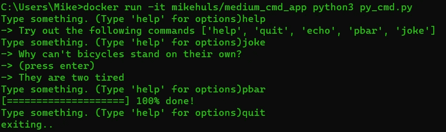

# 把你的代码变成一个真正的程序:使用 Docker 打包、运行和分发脚本

> 原文：<https://towardsdatascience.com/turn-your-code-into-a-real-program-packaging-running-and-distributing-scripts-using-docker-9ccf444e423f?source=collection_archive---------15----------------------->

## 在 Docker 容器中轻松共享和运行代码


你的打包代码正在交付(图片由 [Kira auf der Heide](https://unsplash.com/@kadh) 在 [Unsplash](https://unsplash.com/photos/IPx7J1n_xUc) 发布)

有了 Docker，很容易把你的代码打包成我们可以随时随地运行的镜像；不管你的硬件还是软件。它可以在笔记本电脑、Raspberry Pi、服务器、Mac、Linux 或 Windows 上运行。本文将详细介绍将您的脚本打包成可以共享和运行的 Docker 映像的过程。它特别关注如何运行 Docker 映像中的程序。

顺便问一下:你是 Docker 的新员工吗？查看 [**这篇文章**](https://mikehuls.medium.com/docker-for-absolute-beginners-what-is-docker-and-how-to-use-it-examples-3d3b11efd830) 对 Docker 进行了清晰、简要的介绍，而 [**这篇文章**](https://mikehuls.medium.com/docker-compose-for-absolute-beginners-how-does-it-work-and-how-to-use-it-examples-733ca24c5e6c) 对如何使用 Docker 进行了撰写。

# 1 目标和准备

我编写了两个程序:一个 Python 命令行应用程序和一个 bash 文件。你不局限于 Python 和 bash，你可以使用 Docker 运行任何你喜欢的程序。

bash 文件名为`testbash.sh`，只是 echo 的“hello world”，没什么特别的。Python 文件叫做`py_cmd.py`，是一个简单的命令行应用，可以给你讲笑话。我们稍后将对此进行测试。目标是将这些程序打包成 Docker 镜像，运行镜像并调用特定的程序。

首先，我们将检查项目结构和用于将程序打包成映像的 Dockerfile 文件，然后我们将运行映像并使用程序。最后，我们可以通过将我们的图片上传到 Docker Hub 来进行发布；一种 Docker 图片的 YouTube。


我们的目标:包装良好的代码(图片由 [Kira auf der Heide](https://unsplash.com/@kadh) 在 [Unsplash](https://unsplash.com/photos/BkigsnKJK34) 上提供)

# 2 包装成 Docker 图像

把图像想象成一张 CD。它包含所有代码和使用代码的说明。CD 可以像运行图像一样播放。运行的图像称为容器。我们的目标是将所有的源代码打包成一个映像。

## 项目结构

我们的项目目录中只有 4 个文件:

*   `py_cmd.py`包含我们的 Python 命令行应用程序
*   其中包含我们的 bash 脚本
*   `requirements.txt`,它包含了我们对 python 使用的依赖列表(查看 [**这篇文章**](https://mikehuls.medium.com/virtual-environments-for-absolute-beginners-what-is-it-and-how-to-create-one-examples-a48da8982d4b) 以获得更多信息)
*   `Dockerfile` 里面有我们的包装说明

前三个文件的内容并不重要，但是你可以在这里 查看 [**。**](https://github.com/mike-huls/medium_cmd_app)

## Dockerfile 图像的包装说明

档案在这里是最重要的。让我们一行一行地检查一下。

打包我们的代码只需要 3 个步骤:

*   第 1 行:我们安装 Debian，它在我们的映像中安装了 Python 3.9
*   第 3–6 行:我们将需求复制到映像中，并告诉 pip 进行安装
*   第 8–10 行:我们确保图像中有一个名为`app`的文件夹，并将其设置为当前目录。然后，我们将笔记本电脑中的所有源代码复制到映像中。`. .`意味着从我们笔记本电脑的当前目录到我们在图像中设置的工作目录(即`/app`)

这些简单的步骤构建了我们的映像，安装了所有的依赖项，并复制了我们的源代码。

## 实际上将代码打包成图像

Dockerfile 仅包含包装说明*和*。我们仍然需要实际执行它们来建立一个图像。为此，我们需要使用一个终端。如果你对使用终端不熟悉，可以看看 [**这篇文章**](https://mikehuls.medium.com/terminals-consoles-command-line-for-absolute-beginners-de7853c7f5e8) 中的一些简单说明。

打开一个终端和 cd 到包含 docker 文件的目录。然后执行以下命令:`docker build . -t medium_cmd_app`。

*   `docker build .`部分告诉 docker 在当前目录中检查您的 docker 文件。另一种方法是使用`docker build -f path/to/Dockerfile`。这样，您可以从另一个目录执行，并且您的 Dockefile 可以有另一个名称。
*   `-t medium_cmd_app`告诉 docker 用`medium_cmd_app`标记图像。这只是给它一个名字，这样我们以后就可以调用它了。

# 3 运行映像

如果一切顺利，我们现在有一个建立的形象。是时候让它旋转起来并使用我们的程序了！我们可以简单地使用下面的两个命令。这些将运行映像并执行它包含的一个脚本。

```
docker run -it medium_cmd_app python3 py_cmd.py
docker run -it medium_cmd_app bash testbash.sh
```

*   告诉 docker 在交互模式下运行
*   `medium_cmd_app`是我们图像的名称，我们用这个名称(`-t medium_cmd_app`)标记它
*   `python3 py_cmd.py`就跟 normale 一样:用 python 3 执行 py_cmd.py。轻松点。

如果一切顺利，当执行`testbash.sh`脚本时，你会看到*“来自 bash 文件*的问候”。执行 Python 程序时，您会看到一个命令行界面，如下图所示:



我们的 Python 命令行程序会开玩笑！每次键入“笑话”都会听到一个新笑话。

# 4 分发我们的图像

一旦我们的映像构建完成，我们就可以在任何安装了 Docker 的机器上运行它。但是我们如何在机器上得到图像呢？一个简单的方法是将你的图片上传到 Docker Hub。可以把这想象成 Docker 图片的 YouTube 任何人都可以在上面上传和下载任何图片。


Docker Hub 堆满了图像(图像由 [Chuttersnap](https://unsplash.com/@chuttersnap) 放在 [Unsplash](https://unsplash.com/photos/fyaTq-fIlro) 上)

## 推到码头中心

首先我们需要创建一个账户:去[https://hub.docker.com](https://hub.docker.com/)注册。然后我们需要创建一个存储库；这是一个你的形象将去的地方。我把我的名字命名为[*medium _ cmd _ app*](https://hub.docker.com/repository/docker/mikehuls/medium_cmd_app)。

下一步是打开一个终端，登录 Docker Hub，推送(上传)你的图片。以下是如何做到这一点:

1.  打开终端
2.  CD 到您的项目目录
3.  `docker login` →输入您的凭证
4.  再次构建图像，但是使用下面的标签:
    `docker build . -t [your_dockerhub_username]/[your_respo_name]`

5.`docker push [your_dockerhub_username]/[your_respo_name]`

现在图像被上传到 Docker Hub。任何安装了 Docker 的人现在都可以执行`docker run [your_dockerhub_username]/[your_repos_name]`来下载并运行映像！

## 从码头中心拉出

我已经把我们之前的图像上传到 Docker Hub 了。您可以下载它并通过执行下面的代码来运行它:

```
docker run -it mikehuls/medium_cmd_app python3 py_cmd.py
docker run -it mikehuls/medium_cmd_app bash testbash.sh
```

这将在你的机器上寻找一个名为`mikehuls/medium_cmd_app`的图像，如果找不到:从 Docker Hub 下载它，如果它存在的话。


是时候开始分发这些图片了！(图片由[凯皮尔格](https://unsplash.com/@kaip)在 [Unsplash](https://unsplash.com/photos/tL92LY152Sk) 上拍摄)

# 结论

正如我们所看到的，在 Docker 镜像中分发代码保证了它可以在任何安装了 Docker 的地方运行。我希望我已经阐明了如何以这种容器化的方式打包、分发和运行您的代码。另外，看看这篇文章 中的[是一个很好的实际例子。](https://mikehuls.medium.com/getting-started-with-postgres-in-docker-616127e2e46d)

如果你有建议/澄清，请评论，以便我可以改进这篇文章。同时，看看我的其他关于各种编程相关主题的文章，比如:

*   [Docker 适合绝对初学者](https://mikehuls.medium.com/docker-for-absolute-beginners-what-is-docker-and-how-to-use-it-examples-3d3b11efd830)
*   [Docker 为绝对初学者编写](https://mikehuls.medium.com/docker-compose-for-absolute-beginners-how-does-it-work-and-how-to-use-it-examples-733ca24c5e6c)
*   [使用 git 子模块在 docker 映像中安装私有的定制 python 包](https://mikehuls.medium.com/use-git-submodules-to-install-a-private-custom-python-package-in-a-docker-image-dd6b89b1ee7a)

编码快乐！

—迈克

页（page 的缩写）学生:比如我正在做的事情？[跟我来](https://mikehuls.medium.com/membership)！