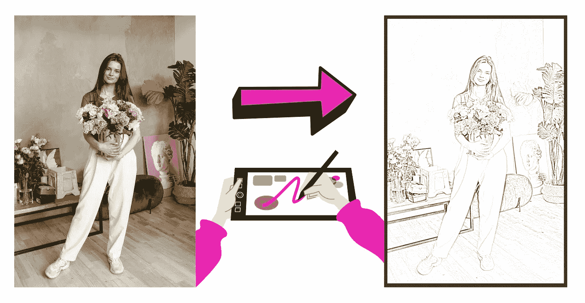
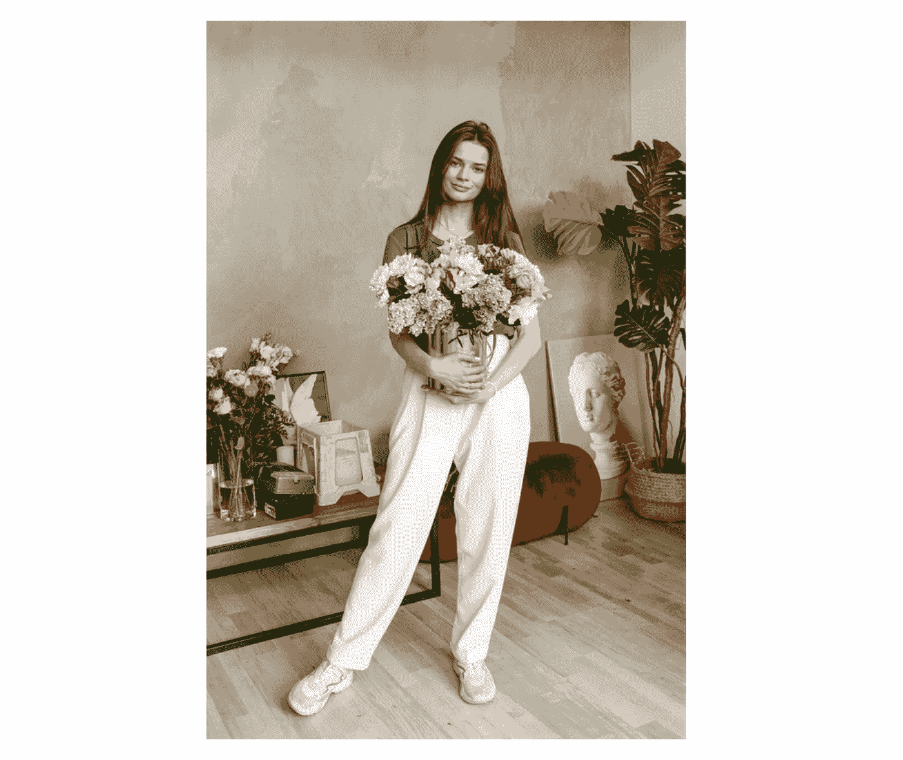
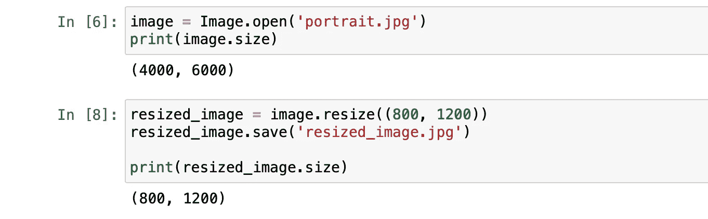
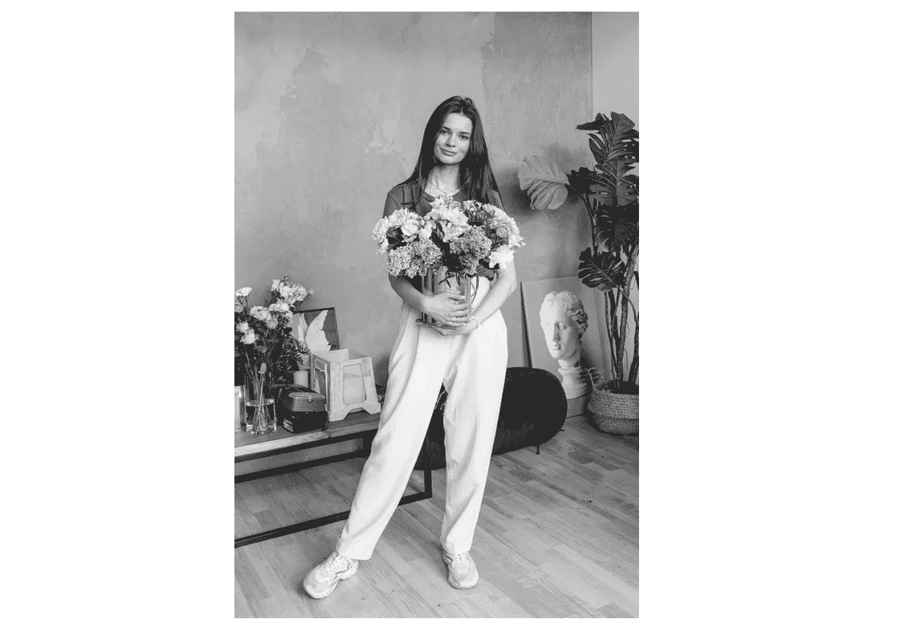
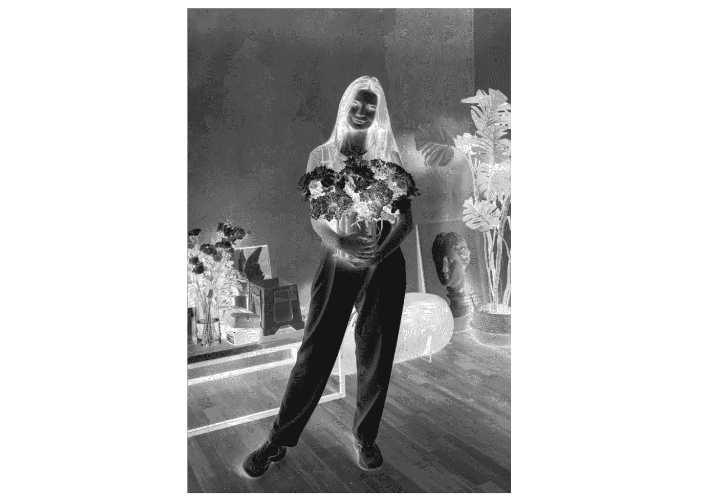
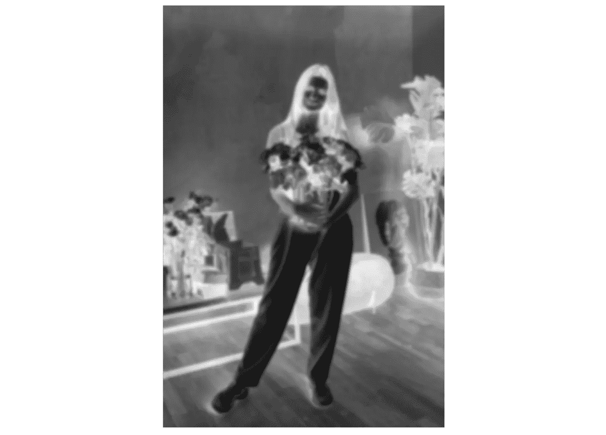
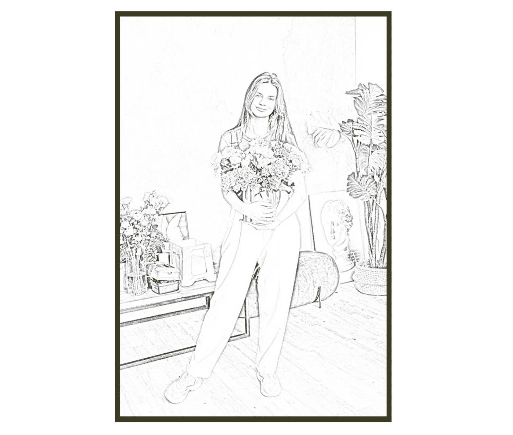

# 用代码把你的照片变成艺术草图

> 原文：<https://towardsdatascience.com/turn-your-photos-into-artistic-sketches-with-code-6694522fa349?source=collection_archive---------28----------------------->

## 计算机视觉编程实践项目——Python for Art


照片由[雷·皮德拉](https://www.pexels.com/@craytive?utm_content=attributionCopyText&utm_medium=referral&utm_source=pexels)从[派克斯](https://www.pexels.com/photo/person-sketching-dress-on-printer-paper-with-clip-board-1478477/?utm_content=attributionCopyText&utm_medium=referral&utm_source=pexels)拍摄

在本文中，我将向您展示如何使用 python 代码将您的照片转换成手绘艺术作品。作为一名艺术和技术爱好者，我决定在一个简单的项目中结合这两个领域。这个项目将向你展示编程不仅仅是寻找编码问题的解决方案。编程也可以用来在行动中展示你的创造力，例如，通过创建铅笔素描外观的艺术品。

完成这个项目后，你将对如何在 python 项目中使用 OpenCV(计算机视觉库)有所了解。我希望你读完这篇文章后会喜欢并学到一些新的东西。

抓紧时间，让我们开始吧！

## 目录:

*   *巨蟒*
*   *入门*
*   *步骤 1—定义图像*
*   *步骤 2—图像预处理*
*   *步骤 3 —混合作品*
*   *最后一步——导出结果*



Anthony Shkraba 的照片|作者设计

# 计算机编程语言

Python 是一种通用编程语言，在分析数据方面越来越受欢迎。Python 还能让您快速工作，更有效地集成系统。世界各地的公司都在利用 Python 从他们的数据中收集知识。官方 Python 页面如果你想[了解更多](https://www.python.org/about/)。

# 入门指南

在这个项目中，我们将使用两个 python 库。主要库是 OpenCV，这是一个著名的计算机视觉项目。我们需要的第二个库是 PIL，它是一个图像处理库。

## 开源计算机视觉

> *OpenCV 是一个开源的计算机视觉和机器学习软件库。OpenCV 旨在为计算机视觉应用提供一个公共基础设施，并加速机器感知在商业产品中的应用。作为一个 BSD 许可的产品，OpenCV 使得企业利用和修改代码变得很容易。*
> 
> *参考:*https://opencv.org

## 安装库

我们可以使用 python 包/库管理器 *pip* 来安装库。安装完成后，我们可以将它们导入到项目文件中。

OpenCV 安装为“opencv-python”，PIL 安装为“pillow”

```
pip install opencv-python pillow
```

## 导入库

现在，我们可以打开代码编辑器了。我将在 Jupyter 笔记本上工作，但是可以随意使用不同的代码编辑器。我喜欢在这个项目中使用笔记本，因为这样会更容易回去更快地看到变化。

```
import cv2
from PIL import Image
```

太好了！现在，我们可以进入下一步，在这里我们将定义图像，我们想把铅笔素描作品。

# *第一步——定义* *图像*

在这一步，我们将开始调整我们想要使用的图像的大小。然后，我们将图像导入到我们的程序中。如果您对图像大小满意，可以跳过这个调整大小的过程。

## 图像



安东尼·什克拉巴摄于 [Pexels](https://www.pexels.com/photo/fashion-love-people-woman-4612248/?utm_content=attributionCopyText&utm_medium=referral&utm_source=pexels)

## 调整图像大小

首先，让我们检查图像的原始大小。

```
image = Image.open('portrait.jpg')
print(image.size)#Result
(4000, 6000)
```

现在，让我们调整它的大小。我建议在调整大小时保持高度/宽度比例不变。这样，我们就不会丢失照片的任何部分。

```
resized_image = image.resize((800, 1200))
resized_image.save('resized_image.jpg')print(resized_image.size)#Result
(800, 1200)
```



作者图片

## 读取图像

我们已经在前一行中保存了调整后的图像。现在我们将使用 *imread* 来读取它。确保文件名和文件格式正确。我已经将其定义为 *img* ，但是可以随意使用不同的变量名。

```
img = cv2.imread(‘resized_image.jpg’)
```

# 步骤 2 —图像预处理

完美！让我们玩玩我们的形象。为了能够得到铅笔素描的最终外观，我们的图像必须经过一些过程。你可以把它想象成一层不同的过滤器。我们将使用 OpenCV 预定义模型。

## 转换为灰度

[这里的](https://docs.opencv.org/3.4/db/d64/tutorial_js_colorspaces.html)是 *cvtColor* 方法的官方文档。

```
grayed = cv2.cvtColor(img, cv2.COLOR_BGR2GRAY)
```



灰色|作者图片

## 反转像素

这个过程有助于找到照片中的阴影区域。阴影在铅笔素描中起着重要的作用。[这里的](https://docs.opencv.org/master/d2/de8/group__core__array.html#ga0002cf8b418479f4cb49a75442baee2f)是官方文档，如果你想了解 *bitwise_not* 方法是如何工作的。

```
inverted = cv2.bitwise_not(grayed)
```



倒置|作者图片

## 添加模糊度

这里的是*高斯布鲁*方法的官方文档。*高斯模糊*使用高斯滤镜模糊图像。这将给最终的作品带来素描效果。

```
blurred = cv2.GaussianBlur(inverted, (19, 19), sigmaX=0, sigmaY=0)
```



模糊|作者图片

# 步骤 3-混合作品

表演时间到了！你准备好看最后的结果了吗？在这一步，我们将混合灰色和模糊的图像。为了完成这个操作，我们将编写一个函数来组合这些图像。

用 OpenCV 混合图像超级容易；我们将使用*除以*的方法。其基本上划分图像的像素值。你把它想象成一个矩阵除法过程。

```
def blend(x, y):
    return cv2.divide(x, 255 - y, scale=256)
```

现在，让我们通过传入我们想要混合的图像来调用这个函数。

```
final_result = blend(grayed, blurred)
```

# 最后一步—导出结果

我们快完成了！

让我们导出结果。我们将使用 *imwrite* 方法将结果作为图像文件保存到我们的文件夹中。这样，我们可以有一个最终工作的记录。

```
cv2.imwrite("my_artwork.jpg", final_result)
```

太好了！现在，我来分享一下最终的结果。就我个人而言，我对此感到非常惊讶。也让我知道你的想法。

## **结果**



最终结果|作者图片

## 结论

恭喜你。我们已经创建了一个用 Python 绘制的铅笔素描图片。正如我前面提到的，编程不仅仅是解决问题。我们也可以把它用于像这样有趣的艺术项目。这些类型的项目将帮助你找到新的想法来实施。谈到计算机视觉项目，OpenCV 是我的最爱之一。

我希望你喜欢读这篇文章，并且今天学到了一些新的东西。从事动手编程项目是提高编码技能的最佳方式。如果您在执行代码时有任何问题，请随时[联系我](https://sonsuzdesign.blog/)。我会尽我所能来回报大家。

> 我们来连线。查看我的[博客](https://medium.com/@lifexplorer)和 [youtube](https://www.youtube.com/watch?v=7I9eg3G1mnE&list=PLudLCLvpppAJ7OsgrQxqY-n8Ok9Nt-Rtr) 以获得灵感。谢谢你，

## 更多计算机视觉相关项目:

</building-a-face-recognizer-in-python-7fd6630c6340>  </building-a-color-recognizer-in-python-4783dfc72456> 