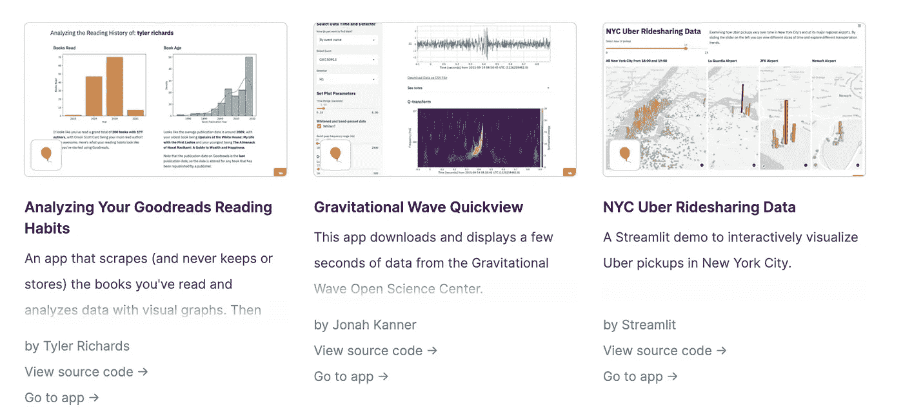

# 使用 Streamlit 和 Altair 将您的 Python 脚本转换为 Web 应用程序

> 原文：<https://towardsdatascience.com/turn-your-python-script-into-a-web-app-using-streamlit-and-altair-627c70c56f4?source=collection_archive---------26----------------------->

## 2020 年东京奥运会奖牌表现分析

*在本文中，我将给出一个快速教程，介绍如何使用*[*Streamlit*](https://streamlit.io/)*和*[*Altair*](https://altair-viz.github.io/)*——这两个库提供了一个快速简单的框架来创建交互式仪表盘和数据发现工具。*

*我们将使用 2020 年东京奥运会*<https://olympics.com/tokyo-2020/olympic-games/en/results/all-sports/medal-standings.htm>**的数据来计算哪些国家获得了最多的奖牌，并比较男女运动员如何为他们的团队取得成功做出贡献。我在教程中使用的数据集可以在*[*ka ggle*](https://www.kaggle.com/jamieeeee/tokyo-2020-olympics-medal-count)*上找到。**

*但是在我们开始之前，先介绍一下这两个库:*

*[1。***Streamlit***](https://streamlit.io/)是一个开源库，可以帮助你将 Python 代码转化为定制的 web 应用。易于使用和共享，它可以与大多数流行的数据科学和机器学习包一起工作。*

*细流变成了简单的。将脚本复制到现成的 web 应用程序中，您可以在本地使用，也可以部署到服务器上与其他人共享。Streamlit 甚至提供免费的网络应用托管服务([点击这里](https://streamlit.io/sharing))。*

**

*来自[https://streamlit.io/](https://streamlit.io/)的 Streamlit 应用示例*

*2. [***牛郎星***](https://altair-viz.github.io/) 是 Python 的可视化库，基于 [Vega](http://vega.github.io/vega) 和 [Vega-Lite](http://vega.github.io/vega-lite) 。它将简单和用户友好的图形语法与强大的功能相结合，可以创建几乎任何类型的复杂交互式图形。*

*从我个人的经验来看，与 pyplot 相比，这个库提供了更清晰的语法，并且更容易直接处理数据库中的数据，不需要额外的转换。这就是为什么我们将在本教程中使用它。*

**

*来自 https://altair-viz.github.io/[的 Alltair 可视化示例](https://altair-viz.github.io/)*

# *第一步。研究数据和画草图*

*我在 Kaggle 上找到的数据有两种类型的数据集。第一个数据集包含按类型(金牌、银牌和铜牌)划分的每个国家队的奖牌总数，第二个数据集或多或少是相同的数据，但增加了一个维度——运动员的性别(这排除了一些无法提供此信息的学科，因此第二类数据集中的奖牌总数较低)。在[原始源代码](https://www.kaggle.com/jamieeeee/tokyo-2020-olympics-medal-count)中，男女运动员被列在两个单独的文件中，但是对于我们的用例，我将两个合并成一个文件，该文件可用于 [Github](https://github.com/mariapaskevich/Tokyo2020) 上的所有其他代码。*

*我们有了数据，现在我们需要考虑仪表板看起来会是什么样子！这是我们开始释放内心艺术家、视觉设计师、UI 或 UX 专家，或者隐藏在这个坚韧的数据科学家表面下的任何人的部分。*

**

*正在绘制草图。作者图片*

*有两种不同类型的信息，所以最好为每一种信息分别绘制图表。拥有按国家分类的数据几乎迫切需要使用地图作为可视化形式，而按性别分类的数据是为用户创建探索性图表的好机会。*

*经过一些草图，这是我想看到的最终结果:*

*   *一个按国家显示奖牌总数的交互式地图，带有奖牌类型过滤器(金、银、铜)。我想根据每个国家的奖牌数量对地图进行颜色编码，并且有一个工具提示，提供鼠标悬停时的附加信息*
*   *一个散点图，以男女运动员获得的奖牌数为轴，每种奖牌类型使用不同的颜色。此外，让用户能够在图表上添加(或删除)更多的国家将会很有趣*

*让我们看看如何使用 Altair 创建这些图表。*

# *第二步。使用 Altair 创建可视化*

*为了使事情变得简单，我们将从按性别统计开始，而把地图留到以后。在这里，我们将以男女运动员获得的奖牌数为轴，用不同的颜色表示每种奖牌类型。*

*让我们先阅读文件*medal _ count _ by _ gender . CSV*并查看数据集:*

**

*作者图片*

*每个国家队都有一栏，列有奖牌类型、国名以及获得奖牌的男女运动员人数。*

*在图表上尽可能多地保留这些信息是非常好的。因此，我们将创建一个散点图，X 轴和 Y 轴代表男女运动员。这个图上的颜色将代表不同类型的奖牌，我们将添加工具提示，以便用户可以看到这是哪个国家，以及其他有用的信息。*

*所以我们先画一个散点图，以 count_male 为 X 轴，count_female 为 Y 轴。功能 [**alt。Chart()**](https://altair-viz.github.io/user_guide/generated/toplevel/altair.Chart.html) 以数据集为自变量，创建一个基本的牛郎星图。您可以根据想要显示的图形类型选择不同的方法:mark_line()、mark_bar()等等。对于散点图，我们使用**指定图表的类型。mark_circle()** 。*

*方法**。encode()** 负责绘图看起来到底是什么样的:什么样的数据进入轴和颜色，如果你想将图形分割成单独的行或列也是如此。现在我们只使用 **alt 来指定 X 和 Y。X()** 和 **alt。Y()** 以列名作为参数(数据集中的列名需要是字符串):*

*上面的代码生成了这个图形:*

**

*作者图片*

*数据集中的每个国家有 3 行(每种奖牌类型一行)，现在不可能看到每个点代表的类型，所以让我们用颜色编码。为了用不同的颜色标记不同的奖牌，我们需要给**添加参数“颜色”。encode()** 指定显示什么颜色。该参数由 **alt 定义。Color()** 从数据集中提取一个列名(在本例中为“奖牌类型”)，并相应地在图表上指定颜色。*

*如果图表使用直观上与奖牌相关的颜色，就会更容易阅读:橙色代表金色，灰色代表银色，棕色代表青铜色。为此，我们需要再添加一个参数 **scale=alt。Scale()** 具有指定的域(彩色元素及其顺序的可能选项)和范围(域中每个对应元素的颜色):*

**

*作者图片*

*现在好多了！唯一缺少的是:我们不知道每个位置上是哪个国家，所以让我们使用 **tooltip** 参数将它添加为用户的交互式工具提示:*

**

*作者图片*

*这看起来像一个很好的图表，但仍然缺少一件事:我希望有一条对角线将图表分为两部分(更多的男性和更多的女性奖牌)。为此，我们需要在代码中再添加一个 Altair 对象，并为这两个对象命名:散点图和新对象。新对象将是一条线，因此我们使用 **mark_line()** 方法进行显示，并在方法中指定颜色、样式(在本例中为虚线)和不透明度:*

**

*作者图片*

*这或多或少是最终的代码，唯一剩下的是添加过滤国家的能力，以显示和包装成一个函数的一切，所以我们可以很容易地调用它，当需要为某些国家绘制图表。让我们把所有东西放在函数**的奖牌 _ 性别()中。**该函数只有一个参数——国家——用于过滤 *medal_count_by_gender* 数据帧。loc[]。此外，由于我们在图上有更少的点，我将使用*将它们的大小从 60 增加到 300。mark_circle(size=300)* ，这样看起来更好看:*

*举例来说，这就是美国队的结果。我们看到，在所有三种类型的奖牌中，女运动员都领先于男运动员:*

**

*作者图片*

*我们可以将更多的国家添加到函数输入中，以获得多个国家队的结果。例如，我们可以如下添加中国和日本:*

**

*作者图片*

*现在，当散点图可以使用时，让我们开始绘制地图吧！我们有一个名为 *olympic_medal_count.csv，*的数据集，其中包含列表中每个国家的代码。但是为了在牛郎星地图上使用它，我们还需要为每个国家准备一个[ISO 3166-1 数字代码](https://en.wikipedia.org/wiki/ISO_3166-1_numeric)。我们在另一个文件( *country_codes.csv* )中有这个数据，所以第一步是合并两个数据集:*

*结果看起来如下:*

**

*作者图片*

*从这里，我们可以继续使用 Altair 创建地图。和以前一样，我们使用 **alt。Chart()** 来创建图形，但现在用**。mark_geoshape()** 方法和使用 Altair 的方法**alt . topo _ feature(data . world _ 110m . URL*、【国家】*)从 Vega _ datasets*data . world _ 110m . URL*创建的新数据源。通过这样做，我们添加了一个带有国家的地图，但是它还没有附加任何值。***

*在 **alt 之后。图表()**有一个**。编码()**方法带有颜色和工具提示的参数。颜色和工具提示都使用来自 *olympic_medal_map* 数据集的数据，我们仍然需要加入这些数据。为了做到这一点，在。encode()还有一个方法——**。transform_lookup() —** 在 *olympic_medal_map* 中搜索正确的国家 id，并将“Team/NOC”和“Total”列中的值添加到地图背景中。*

*之后，我们可以添加更多的方法来控制图形的外观:**。configure_view()** 为图形框架(我们将其设置为零)**，。图片尺寸的属性()**和**。project()** 定义地图应该是什么样子。*

*下面是它在脚本中的样子:*

*上面的代码将生成这张漂亮的图片，当鼠标悬停在一个国家上方时会出现工具提示:*

**

*作者图片*

*作为一个额外的功能，我希望地图根据奖牌类型(金牌、银牌或铜牌)而改变，所以我们创建了一个名为 *draw_map()* 的函数，将奖牌类型作为参数。该参数将定义应该显示的列以及颜色主题，因此对于金牌，地图将具有橙色等级，而对于银牌，地图将具有蓝色等级。*

*这就是它在函数中的样子:*

*现在两个图表都准备好了，是时候把东西包装成一个漂亮的 Streamlit 应用程序了。*

# *第三步。使用 Streamlit 将 Altair graphs 转化为 web 应用程序*

*我们已经有了在 Altair 中显示所有图表的代码，现在只需要将所有内容打包到 streamlit 命令中，以便将其转换为 web 应用程序！*

*我们想在我们的 streamlit 应用程序中添加两个视图:按国家分类的奖牌总数(地图)和按性别分类的统计数据(散点图)。*

*为此，我们需要创建一个 Python 脚本。py，并添加函数 **draw_map()** 和 **medals_by_gender()** 以及读取数据集的代码。完成后，我们可以使用 **st.write()** 方法添加几行代码，在 Streamlit 应用程序页面上显示 Alrair 图形:*

*现在，我们将脚本保存在名为 olympic_medal_tokyo2020.py 的文件中，并在终端中运行以下命令:*

> *streamlit run Olympic _ medal _ Tokyo 2020 . py*

*Streamlit 负责一切，我们在 localhost 上获得了这个交互式仪表板:*

**

*作者图片*

*这已经是一个仪表板，但它不允许我们选择国家或挑选不同类型的奖牌。为此，我们需要添加交互式小部件。*

*函数 **draw_map()** 将奖牌类型作为参数，一次只能使用一个，因此使用 st.selectbox()从四个不同类型(总、金、银或铜)中进行选择是有意义的:*

*现在，用户将能够从选项中进行选择，显示的地图将根据选择而变化:*

**

*作者图片*

*对于性别统计，我们希望允许用户选择显示哪些国家队。这是一个多项选择，所以我们可以使用 **st.multiselect()** 。我们还可以为选择器设置一个默认值，这样默认情况下将显示三个国家:日本，因为它是奥运会的主办国，ROC(又名俄罗斯)，因为它是我可爱的祖国，还有瑞典，因为我正舒舒服服地坐在斯德哥尔摩的公寓里写这段代码。:)*

**

*作者图片*

*现在我们在同一个屏幕上显示了所有的东西，但是给用户一个选择地图或者散点图的选项会更好。因此，让我们使用 **st.sidebar.radio()** 在侧边菜单中添加一个开关，并根据选择显示一个或另一个图形。此外，我们将在每个带有 **st.table():** 的图表下以数据表的形式显示所有国家的值*

*结果，我们将得到一个漂亮的图表，左侧边栏中有一个选择，主页上有过滤器:*

**

*作者图片*

*快好了！*

*最后一件事是使用奥运标志的 **st.write()、st.title()** 和 **st.image()** 在页面上添加一些测试说明:*

*这就是最终结果的样子:*

*作者图片*

*这是完整的代码:*

# *第四步。共享简化仪表板*

*现在，一旦你有了自己的应用程序，你可能想让其他人也能使用它，也就是把它部署在某个地方。有几个我知道的选项(但是如果你知道其他的，请留下评论:):*

*   *[Streamlit](https://share.streamlit.io/) 允许用户在 Streamlit 平台上托管他们的应用，就像添加你的 github 库 URL 一样简单。例如，这里的[是我们在本文中创建的仪表板的链接](https://share.streamlit.io/mariapaskevich/tokyo2020/main/olympic_medal_tokyo2020.py)*
*   *RStudio Connect 还为用户提供了上传和分享代码的机会，即使代码是用 Python 编写的*
*   *当然，你可以使用你自己的服务器！*

# *有用的链接*

1.  *[牛郎星文档](https://altair-viz.github.io/index.html)*
2.  *[简化](https://docs.streamlit.io/en/stable/)文档和[备忘单](https://discuss.streamlit.io/t/streamlit-cheat-sheet/4912)*
3.  *Tokyo2020 仪表板代码的 [Github repo](https://github.com/mariapaskevich/Tokyo2020)*
4.  *[Tokyo2020 dahboard](https://share.streamlit.io/mariapaskevich/tokyo2020/main/olympic_medal_tokyo2020.py)*

*数据发现快乐！*