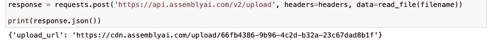
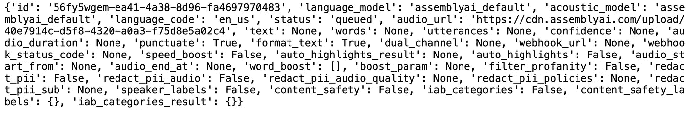
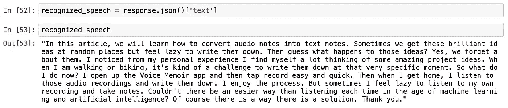
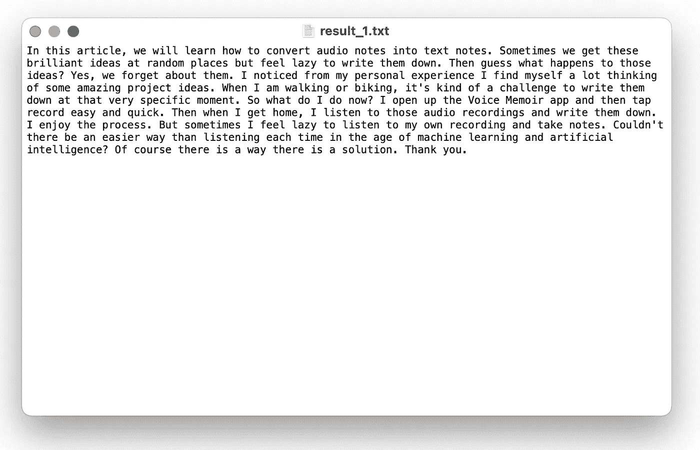

# 使用 Python 将语音备忘录转换成书面笔记

> 原文：<https://towardsdatascience.com/turn-your-voice-memos-into-written-notes-using-python-c78a97847160?source=collection_archive---------22----------------------->

## 动手机器学习项目


沃洛季米尔·赫里先科在 [Unsplash](https://unsplash.com/s/photos/speech?utm_source=unsplash&utm_medium=referral&utm_content=creditCopyText) 上的照片

在本文中，我们将学习如何将音频笔记转换为文本文档。有时我们在随机的地方得到这些绝妙的想法，但却懒得写下来。猜猜这些想法会发生什么？我们忘记了他们。这是我亲身经历的体会。

通常当我走路或骑自行车的时候，我会有奇妙的项目想法。但是在那个特定的时刻把它们写下来是一种挑战。那么，我该怎么办？

我打开语音备忘录应用程序，然后点击录音。又快又简单。

然后，当我回到家，我听那些录音，并把它们写下来。我很享受这个过程，但有时我会懒得听我的录音和做笔记。难道没有比每次都倾听更简单的方法吗？在机器学习和人工智能的时代，当然有。

然后，让我们建立我们的语音到文本的程序，使这个过程更好。我们将在本实践教程中学习如何操作。

我们开始吧！

## 目录:

*   *入门——汇编 AI*
*   *第一步——库*
*   *步骤 2 —录音*
*   *步骤 3 —语音转文本转录*
*   *最后一步——导出结果*

# 入门— AssemblyAI

有许多语音到文本，或者说语音识别云服务和 API 可用。以下是一些著名的例子:

*   谷歌云语音转文本
*   自动气象站转录
*   汇编语音到文本
*   卡尔迪
*   Meta 字母

在今天的教程中，我们将使用 AssemblyAI 的[语音转文本](https://www.assemblyai.com/) API。它是一个训练有素的人工智能 API。免费使用。创建帐户后，您将获得一个唯一的 API 密钥。我们将使用该 API 密钥来使用服务和功能。

而作为编码环境，我准备用 [Jupyter](https://jupyter.org/) Notebook。如果你对数据科学和机器学习项目感兴趣，我肯定你用过它。

# 步骤 1 —库

创建新笔记本后，我们准备导入我们的库。Python 有优秀的库；有些是语言本身内置的，有些是第三方库。

库是完成特定任务的好方法，而不需要重新发明轮子。有一些优秀的程序员创建了库并使它们开源。是不是很酷？这也是我喜欢编程的原因之一。

无论如何，回到我们的项目。我们将需要的库是内置库。我们不需要安装任何东西。下面是将它们导入我们程序的代码块。

```
import sys
import time
import requests
```

# 步骤 2 —录音

在这一步中，我们将把一段录音导入到程序中。这个录音可以是任何东西；一个简短的语音备忘录或一个长的演讲录音。对于这个项目，我将使用我阅读这篇文章介绍的简短录音。

由于我们使用 API 服务进行语音识别，录音必须上传到云存储。这个云存储可以是 AWS，Google Cloud，也可以是 AssemblyAI 的存储。我会用他们的云存储，把东西放在一个平台上。

我会将录音移动到我的 Jupyter 笔记本所在的文件夹中。然后在程序中定义它。

```
filename = "voice_memo_1.m4a"
```

现在，让我们写一个函数来读取这个录音文件。顺便说一下，文件格式应该是音频格式，以便我们的阅读功能正常工作。苹果的语音备忘录应用程序以 *m4a* 格式保存录音。您可以在以下文章中了解不同的视频和音频格式:

</extracting-speech-from-video-using-python-f0ec7e312d38>  

```
def read_audio_file(filename, chunk_size=5242880):
    with open(filename, 'rb') as _file:
        while True:
            data = _file.read(chunk_size)
            if not data:
                break
            yield data
```

是时候把我们的录音上传到 AssemblyAI 的云存储了。

```
headers = {
    "authorization": "Your API Key"
 }response = requests.post('[https://api.assemblyai.com/v2/upload'](https://api.assemblyai.com/v2/upload'), headers=headers, data=read_audio_file(filename))print(response.json())
```

太好了！运行完这段代码后。我们将从 API 获得响应。响应消息将包括上传文件的 url 链接。



图片由作者提供。

# 步骤 3 —语音转文本转录

表演时间到了！让我告诉你使用云 API 的很大一部分；一切都发生在云中。您的笔记本电脑或 PC 不需要花费任何电力来进行识别。

您所需要的只是一个 API 令牌，它将建立一个从您的设备到云的连接。你可能知道，甚至游戏行业也在向云平台发展。我觉得这太酷了！

[这里的](https://docs.assemblyai.com/overview/getting-started)是官方文档，如果你想了解更多。

好了，我们开始语音转文字转录吧？我们需要定义三个变量:一个字符串和两个字典。

```
speech_to_text_api = "[https://api.assemblyai.com/v2/transcript](https://api.assemblyai.com/v2/transcript)"json = {
  "audio_url": "The upload url link from the previous step"
}headers = {
    "authorization": "Your API Key",
    "content-type": "application/json"
}response = requests.post(speech_to_text_api, json=json, headers=headers)print(response.json())
```

运行这个代码块后，我们的请求将进入云中，等待处理。这是我得到的回应:



图片由作者提供。

id 键是请求的 id。这就是我们将如何跟踪它。它基本上就像一个订单跟踪号码。然后，状态键显示请求的状态。如您所见，它显示它正在“排队”

# 最后一步—导出结果

快到了！在这最后一步中，我们将检查我们之前提出的语音到文本请求的状态。我们将检索返回的结果，并将其导出到文本文档中。

让我们跟进我们的请求。

```
request_url = "[https://api.assemblyai.com/v2/transcript/](https://api.assemblyai.com/v2/transcript/56fy5wgem-ea41-4a38-8d96-fa4697970483) request id goes here"headers = {
    "authorization": "Your API Key",
}response = requests.get(request_url, headers=headers)
```

我们将拥有一个包含许多键和值的长字典。其中一个键会有可识别的语音。它被称为“文本”键。让我们看看我们得到了什么。

下面是从字典中访问特定键值的代码:

```
recognized_speech = response.json()['text']
```



作者截图。

现在，让我们使用一些基本的 python 编程来导出识别的语音。

```
with open('result_1', mode ='w') as file: 
   file.write(recognized_speech) 
   print("ready!")
```

让我们看看我们保存的文本文档。



图片由作者提供。

恭喜你。在这个实践教程中，我们学习了如何使用编程将我们的录音转换成文本文档。我喜欢创建这种项目，因为它们是我们日常生活中机器学习和人工智能的真实例子。希望你喜欢读它，并在今天学到一些新的东西。如果您有任何问题，请随时[联系我](https://sonsuzdesign.blog)。

> 我是[贝希克·居文](https://medium.com/u/a073b4360020?source=post_page-----c78a97847160--------------------------------)，我喜欢分享关于编程、教育和生活的故事。[订阅](https://lifexplorer.medium.com/membership)我的内容，保持灵感。泰，

如果你想知道我写的是什么样的文章，这里有一些:

*   [使用 Python 构建人脸识别器](/building-a-face-recognizer-in-python-7fd6630c6340)
*   [分步指南—用 Python 构建预测模型](/step-by-step-guide-building-a-prediction-model-in-python-ac441e8b9e8b)
*   [使用 Python 构建语音情感识别器](/building-a-speech-emotion-recognizer-using-python-4c1c7c89d713)