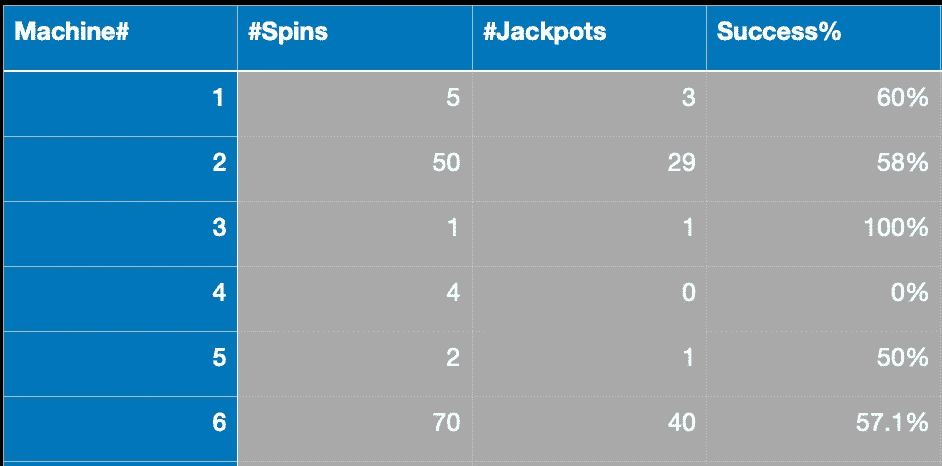
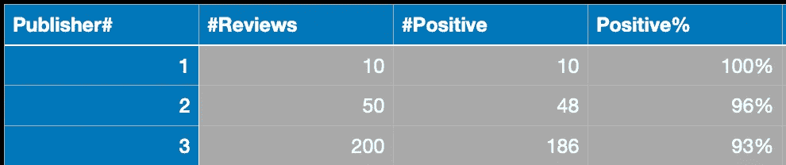
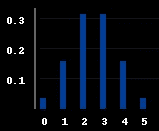
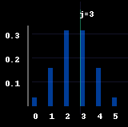
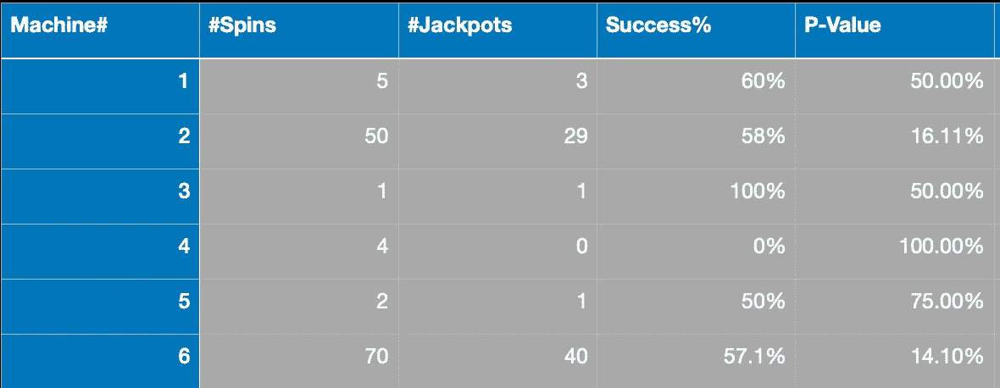
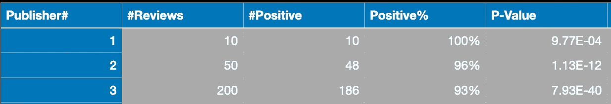

# 将各种问题转化为一个样本的二项式检验

> 原文：<https://towardsdatascience.com/turning-a-two-sample-event-rate-test-into-a-one-sample-binomial-test-23fbfb9d1df6?source=collection_archive---------20----------------------->

## 即使没有硬币，也有掷硬币的活动。

图片由 [Upsplash](https://unsplash.com/) 上的[克拉拉-科瓦奇斯-苏斯特恩](https://unsplash.com/@clarettephoto)拍摄

本文的目的是通过一个简单的例子来激发简单的单样本二项式检验，然后通过将它应用于其他不同的场景来展示它的通用性。

# 0)基础知识

1.  **假设检验:**一种收集数据并进行“矛盾统计证明”的方法，我们首先做出一些假设(称为“零假设”)，然后试图证明我们收集的数据并不支持它。在“完成证明”和“拒绝无效”方面，我们可能成功，也可能失败。
2.  **一个样本对两个样本:**最好通过一个例子来描述。假设我们的无效假设是南极企鹅的平均身高超过 21 英寸。我们需要捕捉一群它们，测量它们的高度，然后放生。我们从收集的样本中估算了平均身高。这是一个单一样本测试。现在，假设我们的零假设是，雄性企鹅的平均高度并不比雌性企鹅的平均高度大。我们现在需要收集两个样本；一些雄性企鹅测量他们的身高，一些雌性企鹅也测量他们的身高。因此，这是一个双样本测试。因此，如果你从一组中收集数据并与一个静态值进行比较，这是一个单样本测试，如果你将两组数据进行比较，这是一个双样本测试。

# 1)一个样本二项式检验

## 1.1)游戏

考虑一个激励单样本二项式测试的游戏。

你被邀请参观赌场，玩不同的老虎机。吃角子老虎机的旋转成本为 1 美元，如果你中了头奖，则返回 2 美元(因此，如果你中了头奖，则赚 1 美元，如果你没有中，则输 1 美元；当然，这些机器的累积奖金将比传统吃角子老虎机更有可能成为值得考虑的游戏)。

前一天晚上，你可以进去做几个小时的吃角子老虎机“测试旋转”,不涉及现金(赢或输),但你可以看到结果。因为你和它们在一起的时间有限，所以你会随意的旋转它们并记下结果。特别是，你要记下你旋转任何一台机器的次数以及它产生累积奖金的次数。这是您收集的数据的样子:

表 1:我们能够在赌场测试旋转的一些机器的数据。每台机器旋转的次数、您获得的累积奖金数和估计的成功率(#累积奖金/#旋转数)。

回到蝙蝠洞，你需要决定第二天要尝试哪台老虎机并加倍下注。如果有一个它们的优先列表也不错，这样如果你最喜欢的一个不可用，你可以去玩下一个最好的，以此类推。

如果你必须为一台吃角子老虎机做出二元决策(玩或不玩)，很明显，如果正面概率(真实的正面概率，而不是根据少量投掷估计的正面概率)超过 50%，你应该玩这个游戏。这将确保你在预期的意义上赚钱，因此长期来看几乎是肯定的。赢得累积奖金的机会越高，你就能赚到越多的钱。

然后，第一个冲动可能是简单地从上表中选择具有最高估计累积奖金机会的机器。但是仔细观察就会发现这个策略的问题。我们最终选择的机器是#3，它有最高的累积奖金概率， *100%* 。但是，我们只转了一次，就中了头奖。很可能这台机器中头奖的实际机会远低于 *100%* ，我们只是碰巧在一次旋转中中了头奖(一次侥幸)。很明显，我们应该选择一台经过多次投掷证明其可靠性的机器。事实上，挑选具有最高*估计*头奖率的机器的策略将很可能选择具有少量旋转但由于随机机会而具有高估计率的类似实例。例如，如果有 *10 台*机器，每台都有 *40%* 的累积奖金机会，并且我们正好旋转所有这些机器一次，那么很有可能在我们旋转它的时候，其中至少有一台会给我们累积奖金，从而将它的估计比率提升到 *100%* 高于所有其他机器。

减轻样本大小影响的一个显而易见的方法是要求机器具有较高的估计头奖比率*和*，该比率是在超过一些最小投掷次数的情况下计算的(例如:仅考虑我们旋转 *10* 或更多次的机器)。但是，没有什么好办法想出这个门槛。这也只是稍微缓解了问题，并没有完全解决问题(例如:一台带有 *100* 投掷*19】的机器应该比一台带有 *11* 投掷的机器更有优势)。这就是假设检验的用武之地，它为我们提供了一个数字(p 值),这个数字无缝地将估计的头奖率以及它所基于的样本量考虑在内。*

关于一个非常相似的激励例子，请看 3B1B 视频[ [2](https://www.youtube.com/watch?v=8idr1WZ1A7Q) ]，他在视频中提出了一个与亚马逊评论类似的难题。他视频中的例子是:

表-2:来自 3B1B 视频关于二项分布和亚马逊评论的数据。

我有点惊讶他没有提到假设检验，因为纳入样本大小带来的不确定性正是它的目的。

## 1.2)工作原理

假设检验是一种统计“矛盾证明”的形式，所以让我们首先假设任何给定的老虎机有 50%或更少的机会给你头奖。这是默认的假设；“零假设”，机器有责任说服我们去玩它(通过我们从它那里收集的数据)。

对于任何给定的机器，假设我们设法让它旋转 *n* 次，并获得 *j* 累积奖金。上表-1 中第一台机器的 *n* 和 *j* 值为 *5* 和 *3* 。基于这个数据的头奖概率是 *3/5 = 60%* 。看起来很有希望。第二台机器具有来自 *50* 旋转的 *29* 累积奖金。这里头奖的概率是 *29/50 = 58%* 。这个比第一个小。但是你会选择第一个吗？第二台机器在成功的机会方面稍差，但有更多的数据支持这些机会。为了量化第二台机器更好的原因，尽管成功的机会较低，我们考虑这两台机器能够“有多好地”反驳零假设(头奖的机会低于 *50%* ，因此它们不值得一掷)。事实上，让我们尽可能提高门槛，说即使累积奖金率为 *50%* ，我们也不会碰一台机器。这简化了我们的零假设，也设立了一个高门槛(对于一台机器来说，让我们相信它的头奖概率超过 40%比让我们相信它超过 50%更容易)。

对于任何一台机器，我们都有两个数字， *n* 和 *j.* 无效假设是，它在每一次旋转中都有一个 *50%* 的累积奖金变化。首先，我们忽略 *j* (这个数字通常被称为检验统计量)并考虑在零假设下我们会期望观察到什么。然后，我们观察我们观察到的实际情况，并考虑观察到比它“更极端”的情况的可能性。我们感兴趣的是机器让我们相信它们的头奖概率大于 50%；这就是“极端”对我们的意义。如果我们掷一枚硬币，正面概率为*50%*n*n*次，我们得到的正面数量(本例中的测试统计)是一个参数为 *n* 和*5*的二项分布。我们以第一台机器为例，这里 *n=5* 。零假设下 *j* 分布的概率质量函数如下:

图 1:n = 5，p=0.5 的二项式分布的概率质量函数。使用[https://github.com/ryu577/pyray](https://github.com/ryu577/pyray)为本文创建

现在，让我们在这个质量函数上叠加我们观察到的实际的 *j* :

图 2:根据零假设和我们实际观察到的 j 的概率质量函数。为本文创建使用:【https://github.com/ryu577/pyray】T4

假设检验的最终产品是 p 值，p 值被定义为看到“与实际观察一样或更极端”的事物的概率。这自然对应于下面绿色显示的区域:

图 3:假设检验的 p 值将是观察到 j 的概率，实际的检验统计量以及可能更极端的值。为本文创建，使用:[https://github.com/ryu577/pyray](https://github.com/ryu577/pyray)

为什么我们将 p 值定义为观察到“与观察到的测试统计一样或更极端”的概率，而不仅仅是“与测试统计一样极端”。在这种情况下，这里的 p 值将只是在 *j=3* 处的概率质量函数，而不是跨越 *j=3，4，5* 的总和。首先，如果 p 值是我们在观察检验统计时感到惊讶的量度(从零的角度来看)，则更高的值( *4* 和 *5* )将更加令人惊讶，因此值得包括在 p 值中。第二，如果测试统计恰好是一个连续的随机变量而不是离散的(就像上面的二项式一样)，仅仅说“与观察值一样极端”甚至不是一个选项。在这种情况下，观察到任何一点的概率都变为零，所以如果我们将其定义为“极端情况”，p 值将始终为 *0* 。将它定义为“等于或大于极限”可以确保我们仍然得到一个有用的数字。

## 1.3)实施

从上面的图 3 中我们可以看到，单边二项式检验的 p 值只是一些二项式概率的总和。这使得它非常容易在几乎任何地方实现(甚至像 Excel 或 Numbers 这样的电子表格软件)。从 Python 开始，它在库 scipy 中实现。对于上述情况，其中零假设是头奖率为 *50%* ，并且我们在 *5* 次投掷中观察到 *3* 个头奖，p 值可以计算为:

使用 scipy 计算二项式检验的 p 值。

这正好给了我们 *50%* 。这还没有低到让大多数人的风险偏好来玩这个机器(你通常希望 p 值至少低于 *20%* ，要求它低于 *5%* 是一个标准)。

对于我们在这里考虑的单边测试，计算非常简单。它只是 PMF， *j* 和更高的概率的总和。这个总和被称为分布的生存函数，只有一个警告:生存函数不包括 *j* 本身，从 *j+1* 开始。考虑到这一点，我们简单地计算在 *j-1* 而不是在 *j* 的生存函数，这使得结果与假设检验的 p 值完全一致。

对于单侧检验(具有更大的可选性)，p 值可以从生存函数中获得。

由于单边测试非常简单，它甚至可以与电子表格软件(如 Excel 文件)中的原生公式一起使用。如果在某些单元格中存储 *n* 和 *j* ，则 p 值会变成(最后一个参数告诉 Excel 计算生存函数而不是概率质量函数):

> BINOMDIST(j-1，n，. 5，真)

## 1.4)如何使用

p 值的传统用法是通过对其应用阈值(称为显著性阈值)来进行二元决策(如果 p 值低于该显著性阈值，则我们拒绝空值)。在我们的例子中，它将决定是否玩任何给定的吃角子老虎机。

这个阈值通常设置为 *5%* (只有 1/20 的机会机器不满足我们的标准)，但是你可以选择任何你喜欢的。你的重要性阈值越大，你拒绝零的次数就越多(在这种情况下是玩吃角子老虎机)，使你成为一个更积极的赌徒，不那么厌恶风险。相反，降低显著性阈值会让你更加厌恶风险，也不太可能去碰运气。

首先，我们取所有 p 值满足我们的显著性阈值(比如说 *20%* )的机器。这些才是值得玩的。我们根据它们的 p 值对它们进行排序，这是我们正在寻找的优先级列表(我们想要玩的机器)。

## 1.5)结果

现在，我们可以为不同的老虎机在表 1 中添加一个 p 值列。p 值最低的是第六台机器，它非常接近机器-2，因此应该优先考虑。

表 3:来自我们激励例子的表(表 1)，但是增加了 P 值(最后一列)。

而对于我们从 3B1B 视频中得到的亚马逊评论例子(在 *50%* 正评论几率*的零假设下；*注意，p 值采用科学记数法):

表 4:亚马逊 3B1B 视频中的各种书籍，用科学记数法中的二项式检验得出 P 值。

结果似乎是第三家出版商胜过前两家，因为他们的结果是基于更大的样本量。

## 1.6)最强大

好的，所以使用 p 值对于无缝地考虑样本大小和估计头奖率是很好的。但是这是计算 p 值的唯一方法吗？我们能不能用其他方法估算一下？为了恰当地考虑这个问题，我们必须考虑一种量化测试性能的方法。最合理的方法是权衡测试的假阳性和假阴性率。这在[ [4](/hypothesis-testing-visualized-6f30b18fc78f) ]中有深入的介绍和可视化。由于测试的统计功效被定义为(1-假阴性率)，如果一个测试对于任何假阳性率具有更好的假阴性率，则该测试被认为比另一个测试“更有效”。

我们可以用两种不同的方法计算 p 值:

1.  使用相同的检验统计量，但是找到它在其他分布上的 p 值。在这里，这将意味着仍然对 *j* (累积奖金数)的分布进行推理，但是使用二项式分布以外的东西来计算 p 值。令人惊讶的是，这根本不会影响测试的性能(统计功效)。
2.  我们可以使用完全不同的测试统计数据(而不是累积奖金的数量， *j* )。例如，我们可以使用 *j、*或头奖率( *j/n* )。这对测试的统计功效(性能)有直接影响。

事实证明，对于某些无效假设，我们可以通过 Neyman-Pearson 引理[ [5](https://en.wikipedia.org/wiki/Neyman–Pearson_lemma) ]从理论上保证假设检验具有任何检验的“最佳可能”性能。上面描述的二项式检验确实保证是推理二项式分布的“最佳可能”。在接下来的部分中，我们将描述一些其他的场景，在这些场景中，不仅单样本二项式检验是适用的，而且它是“最佳可能”检验的理论保证也同样适用。

# 2)两样本二项式检验

现在考虑一下，你不是在和庄家玩，而是和一个特定的对手玩。对手先选择一台可用的机器，然后你可以选择任何剩余的机器。然后，你们双方尽可能多的旋转几次，累积奖金多的一方获胜。

你也知道这个对手有一个他一直喜欢的机器(他的“明星机器”)。

你想看看是否有其他机器和这个明星机器一样好或者更好。现在，我们要将赌场中的所有其他机器与这台“明星”机器进行比较。回头看表-1，假设第二台机器是明星机器。虽然我们之前将标准设定为静态的 *50%* ，但现在无论这台明星机器的头奖率是多少，它本身都是根据有限的数据样本估算的。因此，我们有为我们正在考虑的任何机器收集的数据样本，也有我们将与之进行比较的这台明星机器的样本；总共制作两个样品和两个样品测试。现在无效的假设是，我们正在考虑的任何机器的累积奖金率小于或等于明星机器的累积奖金率(而不是 50%)。任何给定的机器都有责任向我们展示它的数据不符合零假设，并且它可能比明星机器有更高的头奖率。像以前一样，我们设置了可能的最高标准，并假设默认情况下，所考虑的任何机器都与起始机器具有相同的速率。

从表面上看，这比我们的单一样本测试更复杂。但是忘记两个样本的复杂性；用这个简单的技巧将其转换回一个样本测试。

考虑我们想要评估的候选机器的数据( *n_1* 和 *j_1)* 和明星机器的数据( *n* 和 *j* )。

就像单样本测试一样，测试统计是从候选机器中观察到的累积奖金的数量( *j_1* )。

现在，候选机器和明星机器上的总累积奖金的条件: *k=(j+j_1)* 。仅给定我们在两台机器上获得的 *k* 个头奖的信息和零假设的假设(两台机器具有相同的头奖率)，我们观察到的每个头奖都有机会: *p=n_1/(n_1+n)* 属于候选机器。因此，*J1*的分布是一个参数为 *p* 和 *k* 的二项分布。现在，我们可以通过找到这个二项分布在*J1*的观测值处的生存函数来获得 p 值，就像我们对单样本测试所做的那样。

# 3)连续时间速率测试

为了证明二项式检验的广泛适用性，让我们抛开赌场，考虑一段高速公路(也许在摄像机的观察下)。这里时不时会发生事故。描述这些事故的随机过程是一个时间点过程，与二项式分布非常不同。

一段行驶着汽车的高速公路。照片由[石页·康让](https://unsplash.com/@omgitsyeshi?utm_source=unsplash&utm_medium=referral&utm_content=creditCopyText)在 [Unsplash](https://unsplash.com/s/photos/cars-dangerous?utm_source=unsplash&utm_medium=referral&utm_content=creditCopyText)

我们想看看雨天的事故发生率是否比非雨天高(如果是这样，可以进行投资来尝试和减轻这种情况)。首先，雨天的车可能会少一些，所以我们必须考虑到这一点。一种方法是根据每单位汽车小时的事故数量来考虑事故率。如果摄像机观察到一分钟内有一辆车飞驰而过，那就是一分钟一辆车。如果两辆车在另一分钟的时间内同时快速通过该路段，那就要在记录上再加 2 分钟的时间(这种计算时间可以用计算机视觉自动完成)。然后，我们可以计算在一天或适当的时间内累计的汽车总分钟数。然后，我们统计同一时期的事故数量(也可以用计算机视觉自动完成)。最后，用事故数除以总汽车小时数，得到每汽车小时的事故发生率。雨天开车时间可能会少一些，但是当我们谈论这个比率时，这个因素是受控制的。

为了回答我们最初的问题，我们可以标记所有有雨和无雨的区间。然后得到所有下雨时段的总事故数和车时数(*n1*和*t1*)以及所有非下雨时段的相同统计(*N2*和*T2*)。现在，雨天每小时的交通事故是否比非雨天多？雨天的比率为*ƛ_1 = n1/t1*，非雨天的比率为*ƛ_2 = N2/T2*。就看*ƛ_1>ƛ_2*对不对？我们必须记住 *ƛ_1* 和 *ƛ_2* 只是从有限的数据样本中估算出的事故率；不是*真实的*事故率。这意味着在他们的估计中会有一些噪声。因此，即使雨天和非雨天的真实事故率相同，也有 50%的几率观察到ƛ_1 ƛ_2.

## 3.1)转换为单样本二项式检验

我们可以考虑零假设，即雨天每小时的事故发生率与非雨天相同。然后，我们可以看到我们收集的数据与此有多么强烈的矛盾(通过我们的 p 值)。我们又经历了一次熟悉的过程:

1.  定义雨天的事件数， *n_1* 作为检验统计量。试着在零假设下得到它的分布。
2.  所见事件总数的条件: *n=n_1+n_2* 。如果雨天和非雨天每小时的事故率相同，那么任何观察到的事故都有概率*p = t1/(t1+T2)*归因于雨天。因此， *n_1* 的分布将是带有参数 *n* 和 *p* 的二项式分布。
3.  像之前一样，我们现在观察我们的实际 *n_1* ，计算 p 值作为上面二项分布的生存函数。然后，我们可以查看 p 值是否小于 5%，并得出结论，雨天的事故率不符合零假设(意味着它比非雨天高)。

通过这种方式，双抽样率测试也被映射为单抽样二项式测试。当两点过程是泊松过程时，得到的检验是“最有效”的理论保证成立。但即使不是这样，它也表现得很好。参见[ [1](https://arxiv.org/abs/2001.04045) ]。

_______________________________________________________

如果你喜欢这个故事，成为推荐会员:)

[https://medium.com/@rohitpandey576/membership](https://medium.com/@rohitpandey576/membership)

# 参考

[1]失败率的打破假设检验:[https://arxiv.org/abs/2001.04045](https://arxiv.org/abs/2001.04045)

[2]二项式分布|概率的概率，第 1 部分(3B1B):[https://www.youtube.com/watch?v=8idr1WZ1A7Q](https://www.youtube.com/watch?v=8idr1WZ1A7Q)

[3]假设检验:分布并不重要:[https://towards data science . com/Hypothesis-testing-the-distribution-that-matter-79882 ba 62 f 54](/hypothesis-testing-the-distribution-doesnt-matter-79882ba62f54)

[4]假设检验可视化:[https://towards data science . com/Hypothesis-testing-visualized-6f 30 b 18 fc 78 f](/hypothesis-testing-visualized-6f30b18fc78f)

[5]尼曼-皮尔逊引理(维基百科文章):[https://en.wikipedia.org/wiki/Neyman%E2%80%93Pearson_lemma](https://en.wikipedia.org/wiki/Neyman%E2%80%93Pearson_lemma)