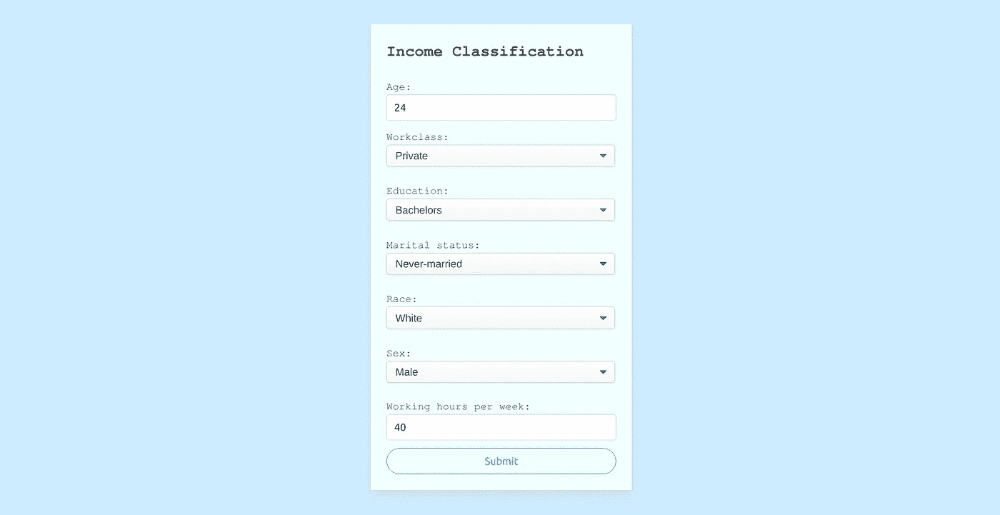

# 用 Flask 把机器学习模型变成产品

> 原文：<https://towardsdatascience.com/turning-machine-learning-models-into-products-with-flask-f8c2ccc210b3?source=collection_archive---------22----------------------->

## 使用 REST APIs 为您的模型构建应用程序


照片由[卡莱斯·拉巴达](https://unsplash.com/@carlesrgm?utm_source=medium&utm_medium=referral)在 [Unsplash](https://unsplash.com?utm_source=medium&utm_medium=referral) 上拍摄

# 介绍

1971 年，年仅 21 岁的史蒂夫·沃兹尼亚克已经是一名出色的计算机程序员和电子工程师。他真的很喜欢花时间创造奇怪的装置，并在他的领域寻找改进。1971 年，他遇到了一个 15 岁的男孩，这个男孩很快意识到了沃兹尼亚克所做工作的巨大潜力。这个人认为沃兹尼亚克发明的奇怪装置会对很多人有用。他们在接下来的几年里一起工作，6 年后，他们开始将当时最早也是最成功的个人电脑之一:Apple II 商业化。

说服沃兹尼亚克将他的设备转化为产品的人是史蒂夫·乔布斯。这很奇怪，因为每个人都知道史蒂夫·乔布斯是谁，但没有多少人听说过沃兹尼亚克。

这篇文章不是关于苹果背后的故事，而是关于将技术转化为产品。

当你花大量时间在笔记本和竞赛上时，机器学习的画面似乎非常简单:你创建抛出一个度量的模型。这个指标说明了你的模型有多好，所以你必须改进这个指标。有时候你有一个门槛。最终你达到了这个门槛。一旦你实现了，就意味着这个模型足够好，那么工作就完成了！

事实证明，在真实环境中，这一过程只是冰山一角。我们必须记住，归根结底，我们要做的是创造对人民有用的产品。

在这篇文章中，我将为机器学习模型开发一个 web 应用程序。我将使用 Flask，这是一个微框架，您可以用 Python 代码以简单的方式构建 REST API。

我们将使用[成人人口普查收入](https://www.kaggle.com/uciml/adult-census-income)数据集。我们将试图预测一个人的年收入是否超过 50k，因此我们有一个二元分类问题。作为解释变量，我们将使用年龄、性别、婚姻状况和每周工作时间等个人特征。

我们将使用 HTML 来构建 web 应用程序。我知道很多读到这里的人并不熟悉，所以如果你是其中之一，不要担心！我也不是专家，所以这里的代码没什么大不了的。同样值得一提的是，在这篇文章中，我将专注于开发 REST API，因此 web 开发将处于次要位置。

这篇文章的结构如下:首先，我们将以一种简单的方式定义在构建 REST API 之前我们必须知道的概念。然后，我会一步一步地解释代码。你可以在这个库中找到这个项目使用的所有代码。

话虽如此，还是说重点吧！

# REST API 背后的关键概念

为了把事情弄清楚，我认为首先我们必须回答一些关于 REST API 的典型问题，以便理解 REST API 到底是什么。这些是简短的问题和答案，即使您不熟悉 REST API 的概念，也应该不难理解，所以让我们开始吧！

*   **什么是 API？**

你可以把 API(应用编程接口)想象成连接程序的软件，允许它们通信(发送数据)。

*   **什么是休息？**

REST 可以定义为创建 API 时遵循的一组特定规则。它代表表述性状态转移，是一种无状态架构，通常运行在 HTTP 上。

*   **REST 和 RESTful 有什么区别？**

REST 指的是架构，RESTful 指的是实现 REST 架构的 web 服务。

*   **RESTful API 如何工作？**

RESTful API 本质上做的是发送**请求**以获得**资源**。

*   请求到底是什么？

当你在 HTTP 中发出请求时，你是在向服务器请求某些东西。对于请求，你使用 HTTP 方法。最重要的方法如下:

`GET`取数据。

`PUT`更改(上传)数据。

`POST`创造数据。

`DELETE`删除数据。

举个例子，当你去[http://www.google.com](http://www.google.com)的时候，你发送如下:

```
GET / HTTP/1.1 
Host: [www.google.com](http://www.google.com)
```

这是一个 GET 请求，其中:

1.  `GET`是动词
2.  `/`是路径
3.  `HTTP/1.1`是协议

*   资源到底是什么？

资源本质上是数据。例如，如果您要求您的模型预测，预测，可以是某种数据，如 JSON 文件，将是资源。

我认为记住这个关键概念后，我们现在就可以用 Flask 构建一个 REST API 了，所以让我们开始工作吧！

# 用 Flask 实现 REST API

在进行编码之前，我认为有必要先设定计划:

本质上，我们希望创建一个应用程序，它将个人的不同特征作为输入，输出给定这些特征时个人年收入超过 50k 的概率。

因此，在主页中，我们需要指定输入:



作者图片

一旦我们提交了它们，应用程序会将我们发送到一个页面，在那里我们可以看到输出:


作者图片

[存储库](https://github.com/Adricarpin/Flask-REST-API.git)中的主要文件是 Python 脚本。在`model.py`我们将构建我们的模型，而在`server.py`我们将构建 REST API。

我在下面解释这两个脚本。

## 构建模型

第一步是创建一个进行预测的模型。为此，我们首先处理数据:

一旦我们有了处理过的数据，我们就可以拟合一个模型。我选择了逻辑回归(它工作得很好)。

📒注:如果你想针对这个问题开发更复杂的模型，可以看看这个 [Kaggle 笔记本](https://www.kaggle.com/adro99/from-na-ve-to-xgboost-and-ann-adult-census-income)。

一旦我们有了合适的模型，我们必须创建一个函数来执行以下操作:

它将每个解释变量的单个值作为**输入**，即个体的特征。

它**输出**在给定个人特征(输入)的情况下，个人收入超过 50k 的概率。

您可能已经注意到，我们的 web 应用程序具有相同的输入和相同的输出，因此这个功能是这个项目的关键。

## 构建 REST API

在脚本`server.py`中，我们将开发 REST API。

我们首先导入一些库并创建`Flask`类和`Api`类的实例。

然后我们将创建两个类。它们都继承了`Resource`类，并且都由一个名为`get`的函数组成。如果你还记得，在开始的时候我们说过 RESTful API 基本上是使用请求来获取资源的。正如您可能猜到的，名为`get`的函数是使用 GET 方法的请求，它们都将返回资源。

第一个非常简单:它基本上返回用于创建应用程序页面的 HTML 代码，我们在这个页面上设置输入。

第二个函数获取我们在 web 应用程序中定义的输入，并将它们传递给返回概率的`predict_probability`函数。最后，`get`函数返回用于制作显示概率的应用程序页面的 HTML 代码。

然后我们必须添加类作为资源。为此，我们使用`add_resource`方法，指定类名和它们要去的 URL。

在脚本的最后，我们运行应用程序。

📒注意:如果你不知道`if(__name__=='__main__')`是做什么的，这里有一个解释:Python 在一个脚本执行的时候给它分配了名字`__main__`。如果该脚本是从另一个脚本导入的，则该脚本保留其给定的名称(不是`__main__`)。因此，使用`if(__name__=='__main__')`语句，我们确保应用程序仅在执行`server.py`脚本时运行。因此，如果我们在另一个脚本上，并从`server.py`脚本中导入一些东西，应用程序就不会运行。这是避免代码意外执行的常见做法。

除了 Python 脚本，存储库还有其他值得一提的文件:

*   `adult.csv`

这是原始数据。您也可以在 [Kaggle](https://www.kaggle.com/uciml/adult-census-income) 中访问它。

*   `requirements.txt`

在这个文件中，你可以看到我在我的环境中用来运行代码的包。不一定要有完全相同的版本。

*   `templates`文件夹

这里我存储了构建 web 应用程序的 HTML 代码。`index.html`有构建主页面的代码(在这里我们设置输入)，而`output.html`有构建输出页面的代码(在这里我们看到概率)。

📒注意:我对 HTML 的了解有限，所以我确信代码可以在许多方面得到改进！

*   `static`文件夹

这里我存储 CSS 代码。

📒注意:如果你没有听说过 CSS，它是用来为你的 web 应用程序定义样式的，所以它帮助 HTML 代码使 web 应用程序看起来更好。

# 测试应用程序

一旦我们了解了以上所有内容，我们就可以运行我们的应用程序了。为此，在您拥有`server.py`脚本的根文件夹的路径中打开一个终端。写入`python service.py`运行`service.py`。

运行之后，您应该会在输出中看到这样一行:

```
* Running on [http://127.0.0.1:5000/](http://127.0.0.1:5000/) (Press CTRL+C to quit)
```

`http://127.0.0.1:5000/`是你申请的方向。

127.0.0.1 是本地主机的 IP，5000 是端口。端口 5000 是默认的，但是您可以使用`server.py`中的`app.run()`方法指定任何其他端口。

如果您单击 URL，您应该会在浏览器中看到 web 应用程序。现在你可以玩它，并检查一切工作！

# 结论

在这篇文章中，我们将一个机器学习模型变成了一个最终产品，因此每个人都可以与它互动并提取价值。作为未来的工作，我建议改进应用程序，增加新的功能，如在数据库中存储数据的选项(用 SQLAlchemy)，或用户登录系统(用 Flask-JWT)。

希望你学到了很多！感谢阅读！

# 参考

[用 Flask 和 Python 休息 APIs】，何塞·萨尔瓦蒂耶拉](https://www.udemy.com/course/rest-api-flask-and-python/)