# 通过生存分析将网页浏览活动转化为产品评级

> 原文：<https://towardsdatascience.com/turning-web-browsing-activity-into-product-ratings-with-survival-analysis-5d5842af2a6d?source=collection_archive---------8----------------------->

## 在推荐策略中考虑用户的浏览数据，并通过一个实际的 Python 示例了解 UI 元素的有效性

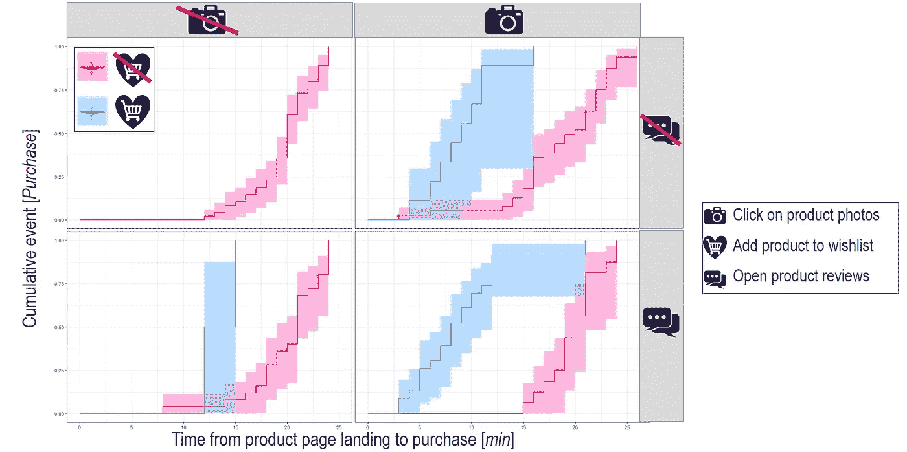

图片作者。

# 介绍

推荐引擎是我们建立客户体验的坚实支柱。从应用内推送通知到个性化邮件列表，我们习惯于滚动浏览智能系统设计的建议，以引起我们的兴趣。尽管主题复杂且方法多样，但任何推荐系统的基础至少存在于三个实体中:

*   用户
*   制品
*   等级

虽然用户和产品是简单的概念，但评级隐藏了更多的微妙之处，因为它们的实施取决于几个因素，如业务领域、背景、用户体验(UX)和数据可用性。

从高层次来看，评级可以分为**显性**(喜欢、评分……)或**隐性**(购买、点击……)。

现在，让我们想象一个**电子商务网站**销售各种各样的产品。随着网站收集**浏览活动**，该公司希望利用它来获得**可解释的洞察力**关于用户与网页的互动如何影响**购买**。此外，该公司希望通过评分系统将这些**互动转化为评级**，旨在提高推荐质量和用户体验。

这篇文章通过一个实际例子描述了如何利用**生存分析**来实现这两个目标。

# 数据集

我们导入所需的库:

我们加载了一个为分析目的而合成的样本数据集:

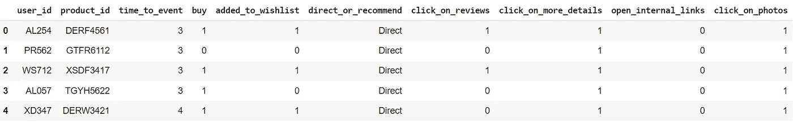

图片作者。

每个观察描述了一个 web 会话，即从登录到产品页面到一个事件的浏览活动，该事件可以是购买或退出。特别是:

*   *用户标识*:用户标识。
*   *产品标识*:产品标识。
*   *added_to_wishlist* :产品是否被添加至愿望清单。
*   *direct_or_recommend* :用户是直接登陆产品页面，还是从上一页选择内部推荐。
*   *点击评论*:如果用户按下*评论*按钮，阅读其他顾客对产品的评论。
*   *click_on_more_details* :如果用户按下“*更多细节*”按钮阅读更多产品细节。
*   *open_internal_links* :如果用户从页面内选择链接到其他内部资源，即其他产品页面。
*   *点击照片*:用户是否点击产品照片。
*   *购买*:产品是否购买。
*   *time_to_event* :从登陆产品页面到事件发生所经过的时间，无论是购买还是退出，以分钟表示。

我们可以想象这些数据是从与网页的交互开始收集的，如下所示:

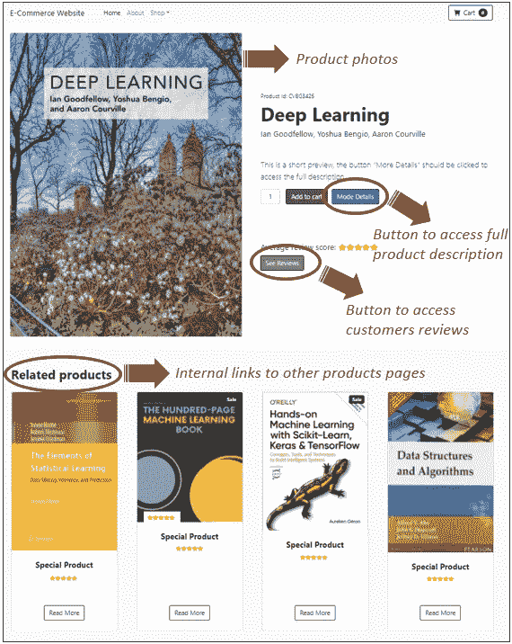

虚构电商产品页面。图片作者。

我们的数据集包括 163 个网络会话，其中 156 个以购买结束，而 7 个以客户放弃而没有购买任何产品结束。

我们可以显示和比较按两个事件组分组的汇总统计数据和协变量分布(0 =放弃，1 =购买):

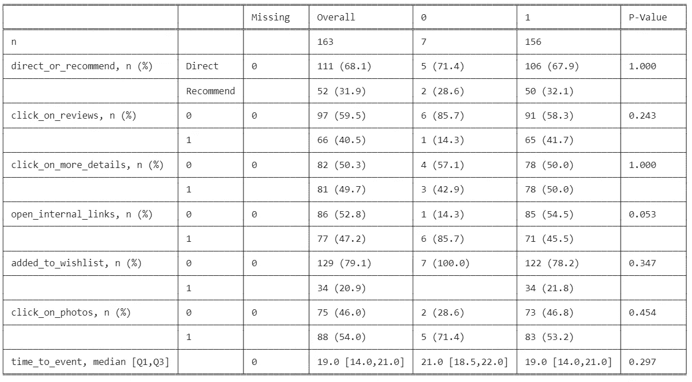

图片作者。

# 生存分析

生存分析包括一系列描述**事件发生时间数据**的统计方法。它在临床研究中被广泛采用，尽管它在不同的领域(例如预测性维护)中有合适的应用。

在我们的例子中，我们感兴趣的是浏览活动如何影响事件发生的时间。我们知道，一些用户进行了购买，而其他用户在一定时间后放弃了网站(正确审查):

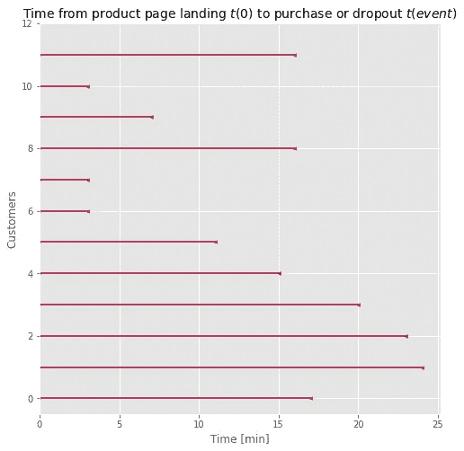

图片作者。

## 卡普兰-迈耶估计量

我们用**卡普兰-迈耶曲线**来估计**生存函数 *S(t)*** 。生存函数给出了顾客在登陆产品页面后一定时间内存活(不购买)的概率。特别地，直到时间 *t* 的无条件生存概率被估计为生存到不同事件时间的条件概率的乘积:

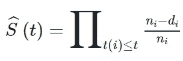

其中:

*   生存函数的 S^(t):卡普兰-迈耶估计。
*   t(i):当我们在离散时间尺度上观察事件时，至少一次购买(事件)发生的时间。
*   nᵢ:在时间 t(i)既没有购买产品也没有离开网站的顾客数量。
*   时间 t(i)时的 dᵢ:事件(购买)数。

我们可以对给定条件下的 Kaplan-Meier 曲线进行分层，从而验证该条件是否会影响生存率估计值。

例如，将产品保存到意愿列表中是否会影响在给定时间段内购买它(事件)的概率？

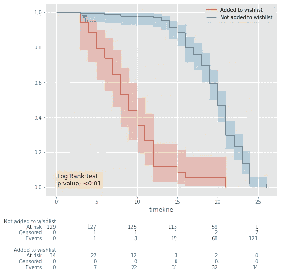

图片作者。

我们一眼就能看出将产品添加到愿望清单中对购买的积极影响(或对免购买生存的消极影响)。

执行**对数秩统计检验**以评估两条曲线之间的差异，p 值允许我们拒绝零假设(H₀:曲线是相同的)，确认存在*与*无意愿列表使用的存活率之间的统计学显著差异。

同样，我们可以评估点击“*更多详情*”按钮的效果:

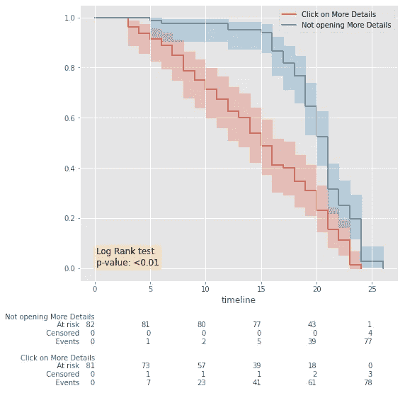

图片作者。

同样，我们有证据表明，用户的浏览行为可以提供对所浏览产品的评价的有价值的见解。

但是，我们如何建立一个考虑到多个变量影响的模型呢？我们如何将与网页元素的交互转化为风险或评级的衡量标准？

## Cox 比例风险模型

Cox 比例风险模型可用于评估变量和生存率之间的关系，其定义为:

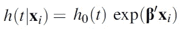

该公式表明，风险函数 h(t| **xᵢ** )与基线风险函数 h₀(t 和相对风险指数(T2)成比例。

作为潜在危险函数 h₀(.的形式)未指定，则模型是半参数的。此外，可以在不估计 h₀(.的情况下估计 **β** ).

此外，Cox 模型提供了其系数的**可解释性**的额外优势。举个例子，我们可以只考虑一个协变量 **xᵢ作为点击“*评论*”按钮**，其中 xᵢ=1 表示用户访问了产品评论，而 xᵢ=0 表示用户没有选择该按钮，Cox 模型可以表示为 h(t|xᵢ)= h₀(t)exp(βxᵢ)，其中 **exp(β)表示点击“*评论*按钮相对于没有点击**按钮的相对购买风险:

*   点击*评论*按钮给出的风险(xᵢ=1):h₀(t)exp(β⋅xᵢ)= h₀(t)exp(β⋅1)=h₀(t)exp(β)
*   未点击“*评论*按钮的风险(xᵢ=0):h₀(t)exp(β⋅xᵢ)= h₀(t)exp(β⋅0)= h₀(t)
*   相对风险=点击按钮的风险/不点击按钮的风险=h₀(t)exp(β/h₀(t)= exp(β)

我们可以拟合 Cox 模型并检验所得结果:

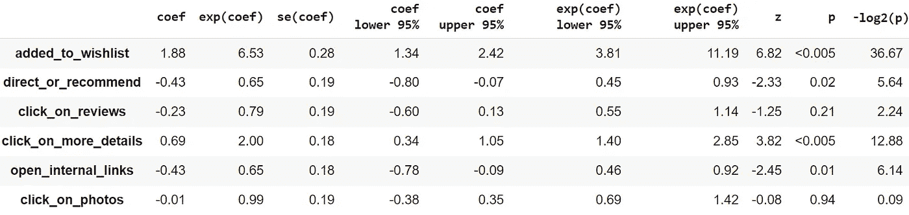

图片作者。

对于每个协变量 xᵢ，我们可以观察其相对风险 exp(β)及其置信区间:

*   exp(β)>1(或β>0)表示购买的风险**增加。**
*   exp(β) <1 (or β<0) a **降低了**购买风险。

上表中对特征效应的一些解释如下:

*   将**产品添加到意愿列表**中显著增加了购买风险(p 值< 0.005)，从最低 3.81 倍(预期(β)下 95%置信区间)增加到最高 11.19 倍(预期(β)上 95%置信区间)。
*   **通过内部推荐访问产品页面**(p 值=0.02) **与直接访问页面**相比，购买风险从最低 0.93 倍(exp(β)上 95% CI)降至最高 0.45 倍(exp(β)下 95% CI) **。**
*   **点击商品照片** **并没有**(p 值=0.94) **增加也没有减少购买风险**:事实上，我们可以注意到 exp(β) CI 在 1 附近振荡(下 95%=0.69，上 95%=1.42)。

我们可以通过绘制它们来进一步观察系数β:

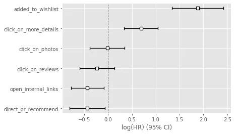

βᵢ>0 表示购买产品的风险增加(将产品添加到意愿列表，点击更多详情)，而βᵢ <0 indicates reduced risk to product purchase (access the product by recommendation over direct landing, open internal links from within the page). Image by author.

Among Cox model assumptions, we should make sure to fall under the hypothesis of proportional hazards:

Image by author.

In conclusion, thanks to survival analysis we can gain interpretable hazard measures that provide insights on the association between customers interaction with the web pages and survival rate.

For a given web browsing session, we may calculate the **部分危险**为 exp( **β'xᵢ** )，因此忽略了基线危险 h₀(t)，因此估计与产品购买相关的相对风险:

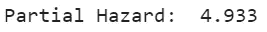

我们可以将其与同一产品页面上不同 web 会话的危害进行比较:

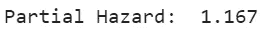

我们注意到第一个会话与比第二个会话(1.17)更高的**部分风险** (4.93)相关联，这表明第一个用户**隐含地表现出比第二个用户对该产品**更高的偏好，并且他可能更有可能购买它。

事实上，我们可能会使用部分风险作为对评级的**天真估计**，从而将我们的浏览活动数据集转变为用户、产品和评级的三元组，这对任何推荐策略都至关重要:

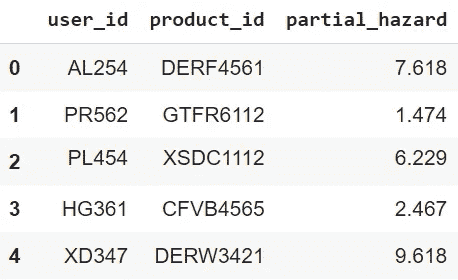

作为隐含评级的部分危险。图片作者。

# 结论

在这篇文章中，我们应用生存分析技术来浏览一个虚构的电子商务网站收集的信息。

这种方法可以提供以下好处:

*   将网页浏览活动(用户行为)纳入评估计算中，以改进推荐。
*   可解释的危险能够解释什么样的与 UX 的相互作用可能导致事件(购买)。
*   网络浏览活动独立于用户的身份，而用户的身份是未知的。
*   突出现有用户界面的潜在改进领域(例如，客户和新网页元素之间的交互与购买风险的降低相关)。

重要的是要记住:

*   在这篇文章中，我们模拟了一次网络会话观察，定义为从登陆产品网页到购买或退出之间的时间。比如，我们没有考虑同一个用户是否在不同的场合多次登陆同一个页面。我们也没有考虑用户是否从之前推荐的结果(内部跳转)购买了产品。不同的问题定义方法会导致不同的假设，从而需要考虑不同的生存分析方法。
*   我们还假设我们的协变量**不会随着时间**而改变，因为我们将 web 会话数据作为一种“基线条件”来理解客户对产品的偏好和购买倾向。然而，我们可以通过修正考克斯 model⁴:来考虑时变协方差

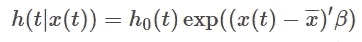

*   在实现方面，由于我们使用了 lifelines⁵ Python 包，采用 Cox 时变比例风险模型将意味着适合 *CoxTimeVaryingFitter* ⁶对象，而不是*coxp fitter*⁷.尽管该对象仍然公开了在已知观测值下计算风险值的方法，但预测的含义并不简单:由于协变量会随时间而变化，因此从 t₁观测时间到 t₂时间的预测需要知道 t₂协变量假定的值，而这些值原则上是未知的。
*   我们选择通过利用部分风险来推断评级方法，exp( **β'xᵢ** )。其他方法可能是 pursued⁷.
*   Cox 比例风险回归模型可能无法捕捉数据之间复杂的非线性关系。为此，可以研究不同的模型，如生存随机 Forests⁸或神经 Networks⁹(在 sci kit-生存⁰和皮考克斯软件包中有实现)。
*   关于隐式评级条件下的推荐策略的进一步信息可以在例如这里找到。

# 参考

[1] S. M. Al-Ghuribi，S. Noah，《推荐系统与情感分析综述》， [arXiv:2109.08794](https://arxiv.org/abs/2109.08794) ，2021。

[2] E. L. Kaplan 和 Paul Meier，“来自不完全观测值的非参数估计”，《美国统计协会杂志》，第 53 卷，第 282 期，第 457- 481 页，1958 年。

[3] D. R. Cox，“回归模型和生命表”，皇家统计学会杂志。B 系列(方法学)，第 34 卷，第 2 期。，第 187-220 页，1972 年。

[4]张中恒，贾科雷尼凯宁，卡泽姆·阿德达约·阿德莱克，马塞尔·e·皮耶特塞，凯瑟琳娜·g·m·格罗图伊斯-奥德索恩，“Cox 回归模型中的*时变协变量和系数*”，《转化医学年鉴》，6(7): 121，2018。

[5][https://lifelines.readthedocs.io/en/latest/](https://lifelines.readthedocs.io/en/latest/)

[6][https://lifelines . readthedocs . io/en/latest/fitters/regression/coxtimevaryingfitter . html](https://lifelines.readthedocs.io/en/latest/fitters/regression/CoxTimeVaryingFitter.html)

[7][https://lifelines . readthedocs . io/en/latest/fitters/regression/coxf fitter . html](https://lifelines.readthedocs.io/en/latest/fitters/regression/CoxPHFitter.html)

[8] Hemant Ishwaran，Udaya B. Kogalur，Eugene H. Blackstone，Michael S. Lauer，“随机生存森林*”，《应用统计年鉴》，第 2 卷，第 3 期，第 841-860 页，2008 年。*

[9] Jared L. Katzman，Uri Shaham，Alexander Cloninger，Jonathan Bates，姜婷婷和 Yuval Kluger，“ *Deepsurv:使用 Cox 比例风险深度神经网络的个性化治疗推荐系统*”，BMC 医学研究方法，18(1)，2018 年。

[10][https://sci kit-survival . readthedocs . io/en/stable/user _ guide/random-survival-forest . html](https://scikit-survival.readthedocs.io/en/stable/user_guide/random-survival-forest.html)

[11][https://github.com/havakv/pycox](https://github.com/havakv/pycox)

[12]胡一帆，耶胡达·科伦，克里斯·沃林斯基，“隐式反馈数据集的*协同过滤*”，第 8 届 IEEE 数据挖掘国际会议论文集(ICDM 2008)，意大利比萨，2008。