# 教程:打破关于人工智能公平性的神话

> 原文：<https://towardsdatascience.com/tutorial-breaking-myths-about-ai-fairness-the-case-of-biased-automated-recruitment-9ee9b2ecc3a?source=collection_archive---------7----------------------->


Christophe Hautier 在 [Unsplash](https://unsplash.com?utm_source=medium&utm_medium=referral) 上拍摄的照片

## [公平与偏见](https://towardsdatascience.com/tagged/fairness-and-bias)

## **有偏见的自动化招聘案例**

在无数关于人工智能偏见的丑闻(例如，[这个](https://www.bbc.com/news/business-50365609)、[这个](https://www.theguardian.com/technology/2016/dec/16/google-autocomplete-rightwing-bias-algorithm-political-propaganda)和[这个](https://techcrunch.com/2017/04/25/faceapp-apologises-for-building-a-racist-ai/?guccounter=1&guce_referrer=aHR0cHM6Ly93d3cuZ29vZ2xlLmNvbS8&guce_referrer_sig=AQAAABTIl6vbepbH-V6xjpwHV1uPA29YRD8pPwMOymTlk1xlVxGCWbvtdarPfnm2O68SSIeHfHTuqaQtNp5CBm8_cl9ezEJmWmG7kOucPOIwPvt6dq5pWIzGIF6iAlgprl16bkLSdV4yOK0Trz_mU6woo-Ft1UJA0IKxJOeVduYdqb_o))之后，人工智能的公平似乎是该领域的主要挑战之一。但是，AI 公平很难理解，也很难实现。在本教程中，我们构建并分析了一个特定的用例:自动化招聘，这在过去曾成为头条新闻。

在本教程中，我们将利用 IBM Research 的 AIF360 库。

# **让我们从头开始创建一个有偏差的数据集**

假设目标是招聘给定工作的人员(例如数据科学家)。基本上有两种截然不同的人群:男性和女性。

我们有意引入三种不同的偏见:

*   代表性偏差:女性比男性少三倍，
*   **社会偏见:**女性期望薪水比男性低(错！)，平均每年少 6 000 美元，但技能相似，
*   历史偏见:招聘在过去一直对女性有偏见，与期望的工资或技能水平无关。

(关于数据集中偏见的详尽列表，请参见 [Mehrabi et al. 2019，关于机器学习中偏见和公平的调查](https://arxiv.org/abs/1908.09635)。)

真正的历史模型是一个逻辑回归，由以下因素构成:

*   𝑋𝑠𝑘𝑖𝑙𝑙:技能水平，0 到 20 分之间的一个等级，
*   𝑋𝑠𝑎𝑙𝑎𝑟𝑦:期望的薪水，一年几千美元，
*   𝑋𝑠𝑒𝑥:性别是一个二元变量，女性为 0，男性为 1，
*   𝑌:应聘者是否以预期的薪水被录用，0 表示否，1 表示是。

高技能水平低预期工资最大化招聘。无论这两个特征是什么，男人总是被系统地偏爱。这被转化为具有系数𝛽的逻辑模型，使得:

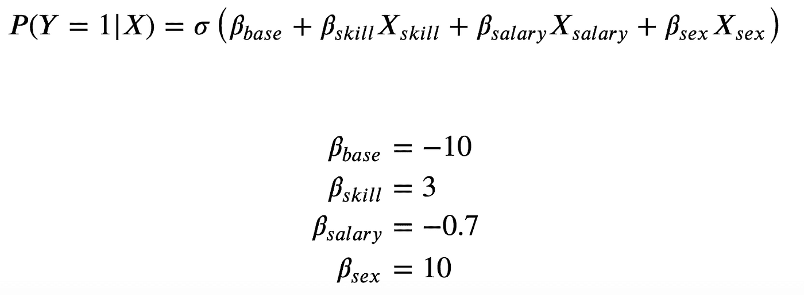

图片由作者提供。

下面是允许我们利用 AIF360 库的代码。

```
from sklearn.model_selection import train_test_split
from aif360.datasets import BinaryLabelDatasetdf = create_dataset()     **# this is our simulated dataset**df_train, df_test = train_test_split(df, test_size=0.2)attributes_params = dict(
    protected_attribute_names=[“sex”],
    label_names=[“recruited”]
)dt_train = BinaryLabelDataset(df=df_train, **attributes_params)
dt_test = BinaryLabelDataset(df=df_test, **attributes_params)
```

模拟这样的招聘策略，我们获得以下训练集:

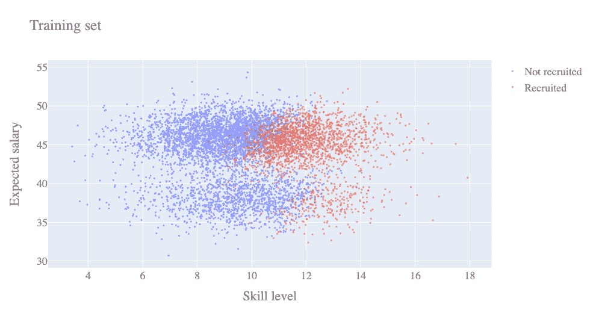

有偏见的招聘培训集。图片由作者提供。

在这个技能/工资层面，我们仍然可以通过社会偏见来猜测性别:女性躺在较低的云层中，期望较低的工资，而男性躺在较高的云层中。更高的技能会导致更频繁的招聘，而更高的薪资期望(对于固定的技能水平)会导致更多的拒绝。

到目前为止，一切顺利。

然而，你可以看到女性不受欢迎，因为女性的决策边界(在较低的云上)向右移动:对于给定的技能水平，女性比男性获得聘用的机会少。这正是我们在本文中要解决的历史偏见。

> ***关键要点:*** *在解决一个偏见之前，你必须选择考虑哪个偏见。你不能简单地“纠正偏见”，当然也不能一下子纠正所有的偏见。*

# **衡量公平性**

在本教程中，我们选择不同的影响(DI)作为歧视的衡量标准。不同的影响定义如下:

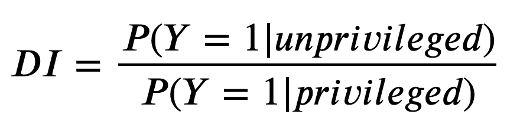

过去标签不同影响的定义。图片由作者提供。

**完全不同的影响有几个优点:**

*   计算起来很简单，
*   这很容易解释:没有歧视意味着人人平等，
*   在美国法律中，它被定义为一种法律约束:任何具有 DI < 0.8 can be legally fined.

**不同影响的流程也有缺点:**

*   它假设敏感属性和目标之间没有影响，但事实并非总是如此。

在我们的案例中，我们假设没有根本的原因让女性比男性被雇佣的少，因此坚持用完全不同的影响作为公平的衡量标准。

(关于公平指标和不同影响的更多信息，请参见 [Caton 和 Haas 2020，机器学习中的公平:调查](https://arxiv.org/abs/2010.04053)。)

那么，过去招聘政策的不同影响是什么？下面是答案。

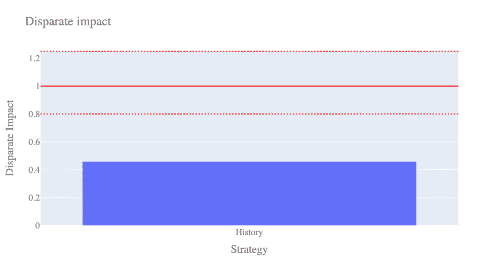

过去招聘的不同影响。虚线代表在美国法律中被认为是合法的。图片由作者提供。

我们看到不同的影响接近 0.5，这意味着女性被录用的机会比男性少两倍。现在让我们回顾一下不同的偏差缓解策略。

# 策略 1:什么都不做

嗯，严格来说这不是一种策略…这只是人们在没有意识到公平时所做的事情。让我们对𝑋𝑠𝑘𝑖𝑙𝑙、𝑋𝑠𝑎𝑙𝑎𝑟𝑦、𝑋𝑠𝑒𝑥进行逻辑回归，看看会发生什么。

```
from sklearn.pipeline import Pipeline
from sklearn.compose import ColumnTransformer
from sklearn.preprocessing import RobustScaler
from sklearn.dummy import DummyClassifier
from sklearn.linear_model import LogisticRegressionpreprocessing = ColumnTransformer(
    [(“scaler”, RobustScaler(), [0, 1])],
    remainder=”passthrough"
)lr = Pipeline([
    (“preprocessing”, preprocessing),
    (“lr”, LogisticRegression(C=1e9))
])lr.fit(
    dt_train.features,
    dt_train.labels.ravel()
);
y_pred = lr.predict(dt_test.features)
```

首先，模型在测试集上的精确度是多少？

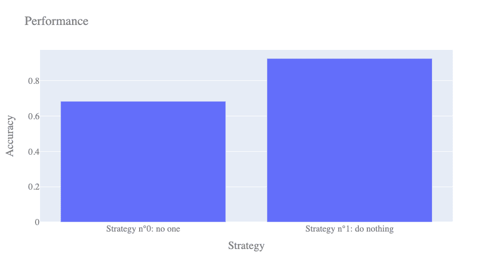

测试基线“无人招募”模型的准确性，以及对公平性“无所作为”的简单逻辑回归。图片由作者提供。

我们将我们的模型与一个非常天真的基线进行比较:拒绝每个候选人的“无人”模型(是的，非常天真……)。这个基线有 68%的准确率，只是意味着过去有 68%的候选人被拒绝。相比之下，我们的第一个逻辑模型做出了更好的预测，达到了令人瞩目的 93%的准确率，万岁！

哦，等等…我们的模型已经产生了什么不同的影响？我们通过转换真实标签和预测标签，稍微修改了不同影响的定义:

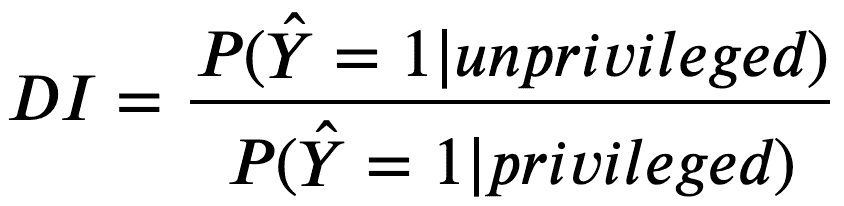

自动化招聘决策的不同影响。图片由作者提供。

现在，我们可以将我们的模型与测试集上的历史流程进行比较:


图片由作者提供。

啊哦…我们有一个高度精确的模型，但是当然我们只是学到了和历史过程中的那个一样的偏差。我们与有偏见的招聘过程本身有着几乎相同的不同影响。

我们有偏分类器的决策边界是什么？

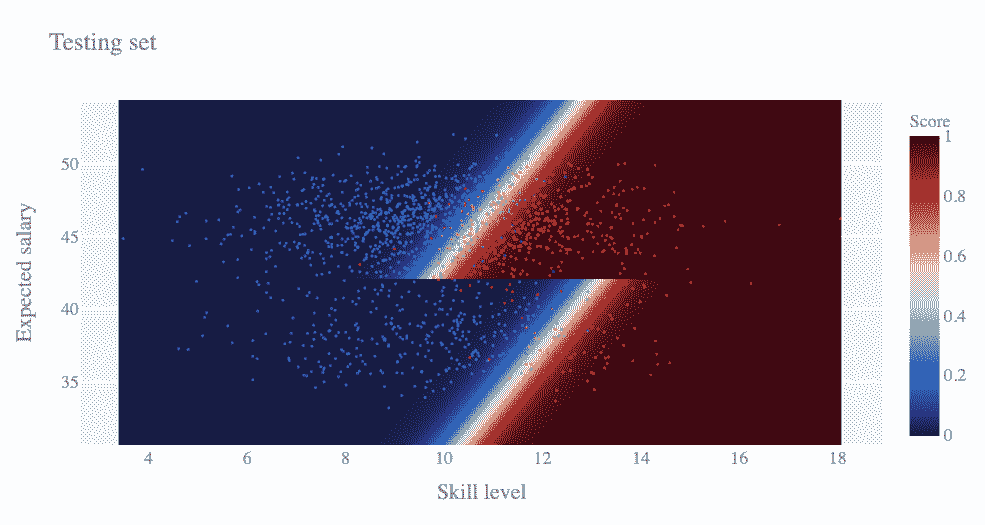

基于历史数据集训练的简单逻辑模型的决策边界。上半部分是男性的决定边界，下半部分是女性的边界。图片由作者提供。

在这个图表中，我们将决策边界分为两部分:顶部是男性的，底部是女性的。毫不奇怪，我们看到我们的模型完美地再现了对女性的偏见，女性应该比男性拥有更多的技能。

> ***关键外卖:*** *如果你对公平什么都不做，你的模型就和你的训练数据一样公平。*

# 策略 2:删除敏感属性

这是最流行和最容易实现的策略:我们简单地阻止模型使用敏感属性(在我们的例子中是𝑋𝑠𝑒𝑥),并希望不同的影响得到改善。

```
lr.fit(
    dt_train.features[:, 0:2],  **# this is how we remove X_sex**
    dt_train.labels.ravel()
);
y_pred = lr.predict(dt_test.features[:, 0:2])
```

就不同的影响而言，这是我们在测试集上获得的结果:

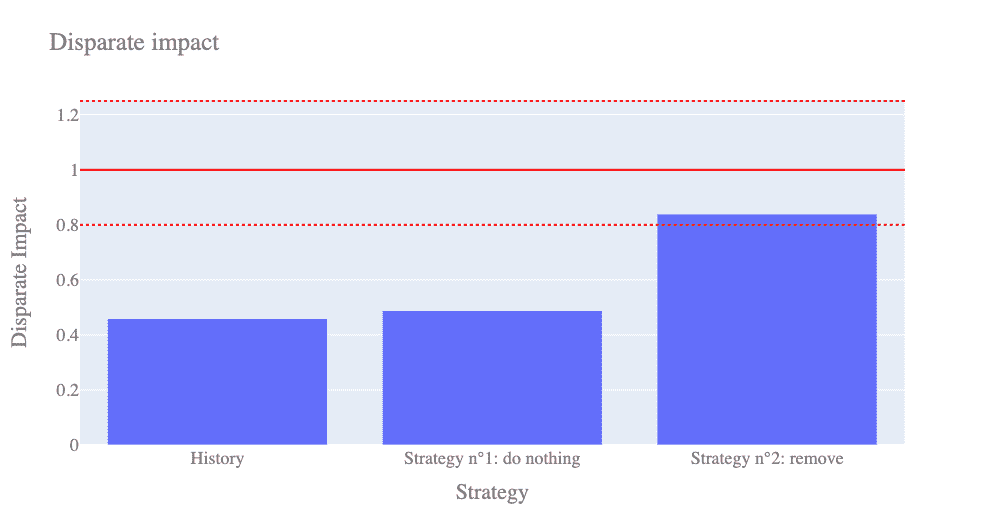

图片由作者提供。

哇！这是一种进步！似乎我们的算法现在符合美国法律。让我们想象一下我们新的决策边界。

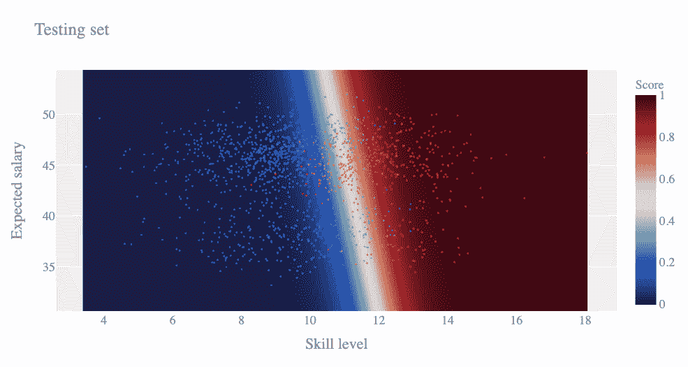

用敏感属性删除训练的简单逻辑模型的决策边界。图片由作者提供。

哦，等等…这是意料之外的…我们现在有了一个独特的男性和女性的决策界限。但现在似乎有一个新问题:要求更高的薪水才能被录用！要是我知道就好了…

这种对薪水的偏见当然不利于女性，因为她们倾向于期望较低的薪水，因此你的不可忽视的不同影响！

这就是我们的模型如何学会忽略性别的…尽管有这些数字，仍然有一个由这个决定边界引起的基本歧视。模型在一定程度上再现了历史偏见，为了歧视女性而用期望工资作为性别的代理，哪怕是逻辑上的扯淡！

> ***关键外卖:*** *去掉敏感属性并不一定让你的模型变得公平。*
> 
> ***关键外卖:*** *具有接近一的异类影响是公平的必要但非充分条件。*

# 策略 3:通过重新称重进行预处理

这种策略非常简单，它只关注训练集，并试图通过重新加权实例来消除不同的影响。基本上，具有有利结果的非特权群体(被招募的妇女)被给予较大的权重。这促使模型以与现有偏差相反的方式重新调整其决策边界。

让我们假设在训练集中没有偏差。这意味着𝑌和𝑋𝑠𝑒𝑥是独立的。所以我们*期望*那:

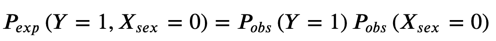

左手边:独立假设下 Y 和 X 的期望联合概率。右边:作者观察到的 Y 和 x 的边际概率的乘积。

然而，在有偏差的数据集中，我们观察到𝑃𝑜𝑏𝑠(𝑌=1,𝑋𝑠𝑒𝑥=0)，这与上述等式的右侧不同。那么让我们来定义𝑊:的权重

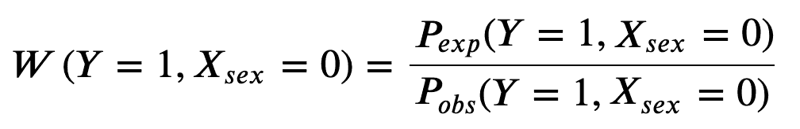

图片由作者提供。

就是这样！构造对 now 1 中重新加权数据集的不同影响:

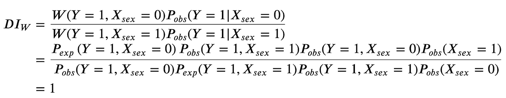

图片由作者提供。

在我们的二进制𝑌和二进制𝑋𝑠𝑒𝑥的例子中，只需要计算四个权重，非常简单！

(更多详细信息，请参见 [Kamiran 和 Kalders 2012，无歧视分类的数据预处理技术](https://link.springer.com/article/10.1007/s10115-011-0463-8))

所以让我们实例化一个重新称重的[对象](https://aif360.readthedocs.io/en/latest/modules/generated/aif360.algorithms.preprocessing.Reweighing.html#aif360.algorithms.preprocessing.Reweighing)。

```
from aif360.algorithms.preprocessing import Reweighingprivileged_groups_params = dict(
    privileged_groups=[{‘sex’: 1}],
    unprivileged_groups=[{‘sex’: 0}]
)RW = Reweighing(**privileged_groups_params)dt_train_reweighed = RW.fit_transform(dt_train)
weights = dt_train_reweighed.instance_weights
```

让我们想象一下新的、重新称重的训练集。

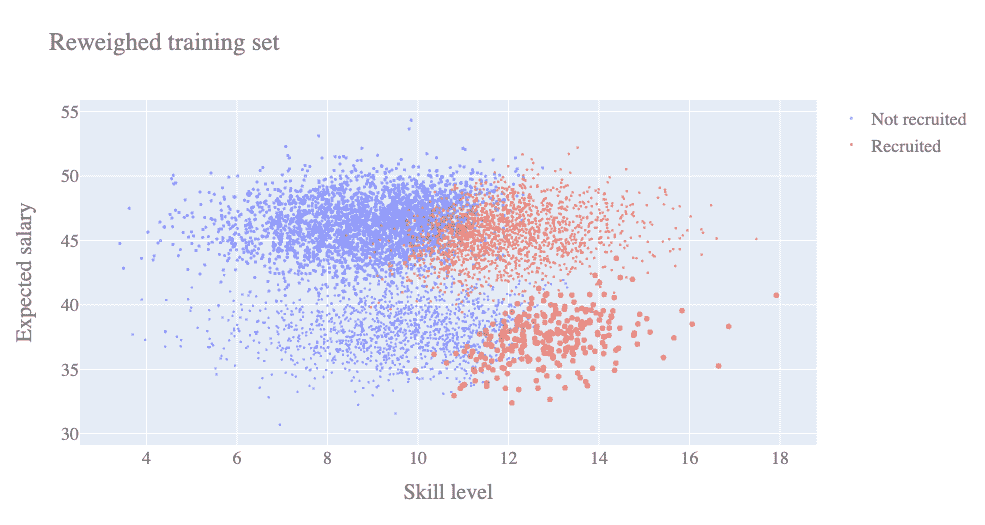

重新加权的训练集。点的大小反映了个体的权重。图片由作者提供。

让我们在这个平衡的数据集上训练一个新的逻辑回归。这可以简单地通过向我们的管道的 fit 方法添加一个 *sample_weight* 选项来完成。请注意，我们一直在删除敏感属性。

```
lr.fit(
    dt_train.features[:, 0:2],
    dt_train.labels.ravel(),
    lr__sample_weight=weights        **# this is how we use weights**
);
y_pred = lr.predict(dt_test.features[:, 0:2])
```

以下是之前所有策略的不同影响:

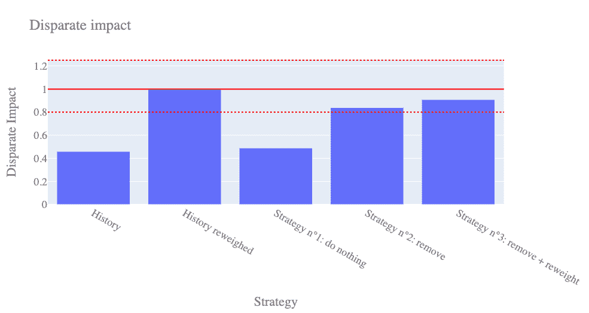

图片由作者提供。

有两件有趣的事情需要注意:

*   首先，重新称重的历史具有一个完全不同的影响，直至机器精度。这是上面讨论的定理的结果。
*   第二，即使对训练集的不同影响是一个，对其训练的模型的不同影响也不是一个。

让我们通过对所获得的判定边界的视觉检查来研究这个案例:

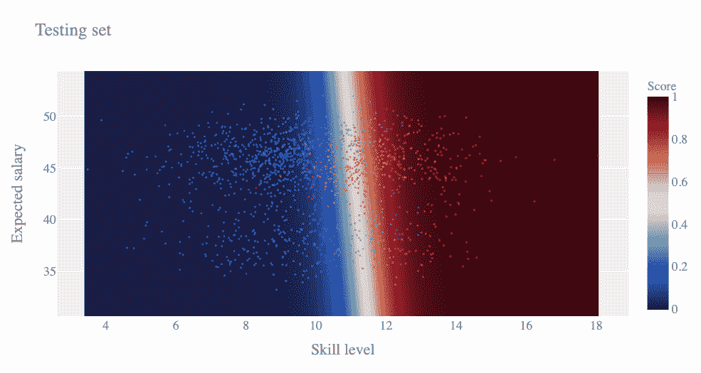

通过敏感属性删除和训练集重新加权训练的简单逻辑模型的决策边界。图片由作者提供。

对…这看起来像是一个比以前更容易接受的决策函数，而且确实有更多的女性被录用了。但是……给更高的期望工资更高的分数在逻辑上是没有意义的，对女性的歧视通过社会偏见普遍存在:在固定的技能水平上，女性得到的雇佣更少，因为她们要求更低的工资。这就是历史偏见如何潜入我们的模型，尽管我们尽一切努力重新平衡历史偏见。

> ***关键要点:*** *在训练集中去除偏差并不一定会让你的模型无偏。*

# 策略 n 4:通过剔除进行后处理

这个策略相当简单:每当模型对决策不确定时，就实施积极的区别对待。换句话说，每当分数接近 0.5 的时候，系统地招收女性，拒绝男性。

因此，让我们首先在原始训练集(未重新加权)上重新训练一个模型。

```
lr.fit(
    dt_train.features[:, 0:2],
    dt_train.labels.ravel()
);
y_prob = lr.predict_proba(dt_test.features[:, 0:2])[:, 1]
```

现在，我们定义拒绝余量𝜃，以便:

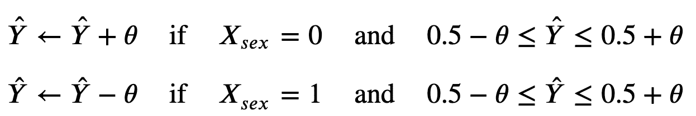

图片由作者提供。

这仅仅意味着男性在决策边界附近不受欢迎。这个想法是，当候选人之间没有明显的区别时，歧视更容易发生。

(详见 [Kamiran 等人 2012 年的《歧视感知分类决策理论》](https://www.semanticscholar.org/paper/Decision-Theory-for-Discrimination-Aware-Kamiran-Karim/5f6eb092fa114bd257d3f670b7c88366536cc7b7)。)

所以让我们实例化一个 RejectOptionClassification [对象](https://aif360.readthedocs.io/en/latest/modules/generated/aif360.algorithms.postprocessing.RejectOptionClassification.html#aif360.algorithms.postprocessing.RejectOptionClassification) (ROC)。

我们指定两个参数:

*   分类阈值
*   中华民国边境𝜃.

```
from aif360.algorithms.postprocessing import (
    RejectOptionClassification
)ROC = RejectOptionClassification(**privileged_groups_params)
ROC.classification_threshold = 0.5
ROC.ROC_margin = 0.15dt_test.scores = y_prob.reshape(-1, 1)
y_pred = ROC.predict(dt_test).labels
```

我们获得了以下不同的影响(右边的栏) :

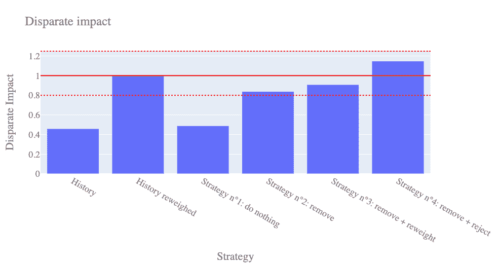

图片由作者提供。

哈哈！似乎我们又获得了一个可以接受的完全不同的冲击。我们甚至把男人变成了弱势群体…哦！

对决策边界意味着什么？

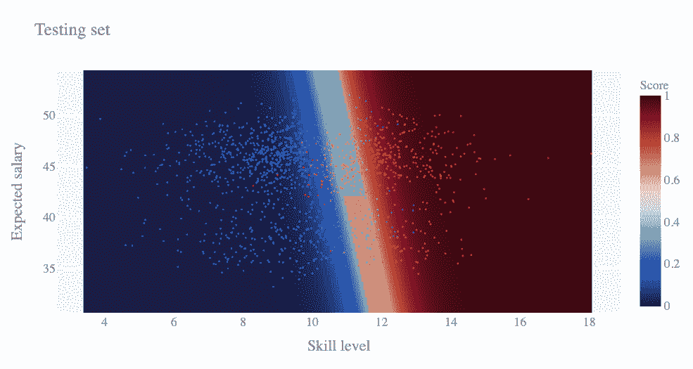

在历史数据集上训练的简单逻辑模型的决策边界，具有敏感属性移除和拒绝选项后处理。上半部分是男性的决策边界，下半部分是女性的决策边界。图片由作者提供。

看到我们如何实施积极的区别对待了吗？在接近决策界限时，男性的得分较低，因此系统性地不受欢迎，而女性则相反。

但是该死的！分数和期望工资之间仍然存在这种不一致:即使男女之间存在抵消，双方都会通过要求更高的工资来最大限度地增加被聘用的机会。

现在，让我们来研究一下𝜃参数。该参数对阳性识别的数量进行编码。准确性和完全不同的影响是如何演变的？

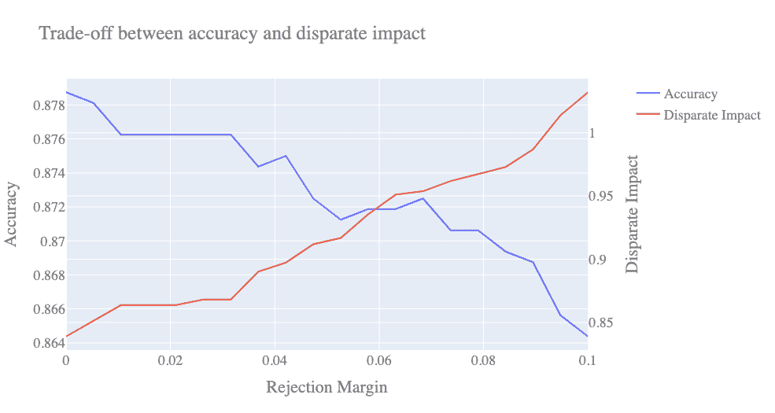

测试准确度(蓝色)和测试不同影响(红色),作为拒绝余量𝜃.的函数较大的拒绝余量会导致较低的精度和较大的不同影响。图片由作者提供。

这就是所谓的公平效用权衡:改善不同的影响必然会降低准确性。

但是！回想一下，精度最大化并不是我们一开始想要的:**欢迎评价偏差！**最大限度地提高准确性仅仅意味着我们完美地再现历史偏差，这不是我们的首要目标。

> ***关键外卖:*** *这里有一个公平-效用权衡:你不可能做到公平准确。不过没关系！最大化精确度最多是学习预先存在的偏差的最好方法。准确性降低并不意味着你会亏钱，只是你会以不同的方式赚钱。*

# 策略 n 5:带约束的在制品

这种策略只不过是一种逻辑回归，带有对算法产生的偏见进行编码的附加惩罚。偏见指数𝑃𝐼被定义为预测和敏感属性𝑆(在我们的例子中是𝑋𝑠𝑒𝑥)之间的互信息:

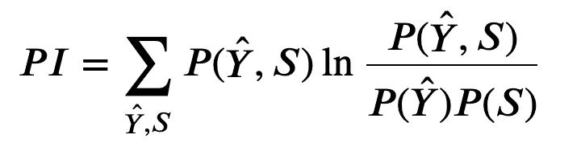

偏见指数(PI)定义。图片由作者提供。

在实施中，这一项与标准对数损失成本函数相加，具有系数𝜂.

(详见 [Kamishima 等人，2012，带有偏见消除器正则化器的公平感知分类器](https://link.springer.com/chapter/10.1007/978-3-642-33486-3_3))。

让我们看看𝜂=100.会发生什么

```
from aif360.algorithms.inprocessing import PrejudiceRemoverpr = PrejudiceRemover(eta=100.0)dt_train.features = preprocessing.fit_transform(dt_train.features)
dt_test.features = preprocessing.transform(dt_test.features)pr.fit(dt_train);
y_pred = pr.predict(dt_test).scores >= 0.5
```

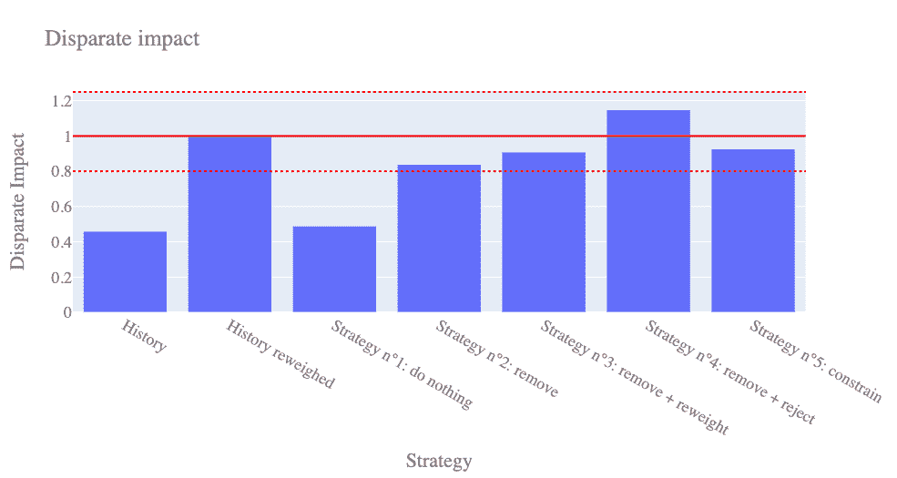

图片由作者提供。

同样，不同的影响似乎是可以接受的。但是让我们保持批判的头脑。决策边界是什么样的？因为我们的算法使用了性别变量(希望是以积极的方式？)，我们再次把图拆分成两部分:男性的决策边界(上)和女性的决策边界(下)。

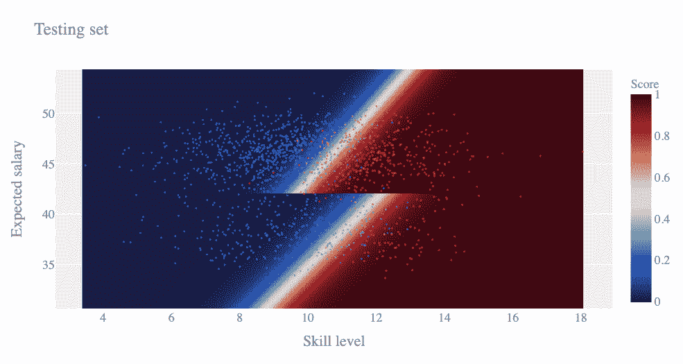

用偏见惩罚训练的简单逻辑模型的决策边界。图片由作者提供。

嗯…相对于我们“什么都不做”的策略，女性的决策边界被平移到了左边，有点倾斜，以便让更多的女性被招募进来。

然而，如果你仔细观察图表，你会发现一个技能水平为 10，期望工资为 40 的女性没有被录用，而一个技能和工资水平相同的男性肯定会被录用！这是由于偏见(即互信息)主要依赖于𝑌和𝑋𝑠𝑒𝑥的列联表，这只是数据的汇总视图:**欢迎汇总偏见！**

而且，想象一下，以后女性往往会要求越来越高的薪水(那就太好了！)，然后女性云会稍微向高层转化，越来越少的女性会被算法雇用，最终降低你的不同影响:**欢迎人工智能模型生命周期！**

所以你明白了:**公平不仅仅是另一个需要优化的指标！**

这种情况下的公平效用权衡呢？让我们来玩玩𝜂惩罚参数:

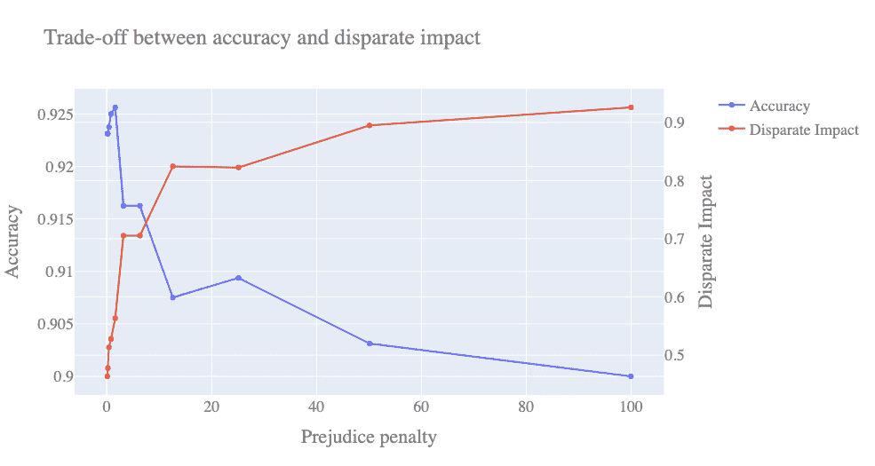

测试准确性(蓝色)和测试不同影响(红色)作为偏见的函数𝜂.更大的偏见惩罚导致更小的准确性和更大的不同影响。图片由作者提供。

这是公平-效用权衡的另一个例子:公平模型的准确性较低。但是，当数据集本身有偏差时，性能的概念本身也有偏差。

> ***关键提示:*** *消除偏差的技术有几种，但没有一种是完美的。*

# 策略 6:你的策略

如果你可以用手画一个决策界限，你会如何塑造它以达到准确、公平和一致？

此后是一个命题。让我们实例化一个定制的 *FairModel* 类，看看它说了什么。

```
fm = FairModel(lr) **# Our custom fair model (what is it? suspense!)**
fm.fit(
    dt_train.features[:, 0:2],
    dt_train.labels.ravel()
);
y_prob = fm.predict_proba(dt_test.features[:, 0:2])
```

以下是我们的定制策略与所有其他策略在准确性和不同影响方面的比较:

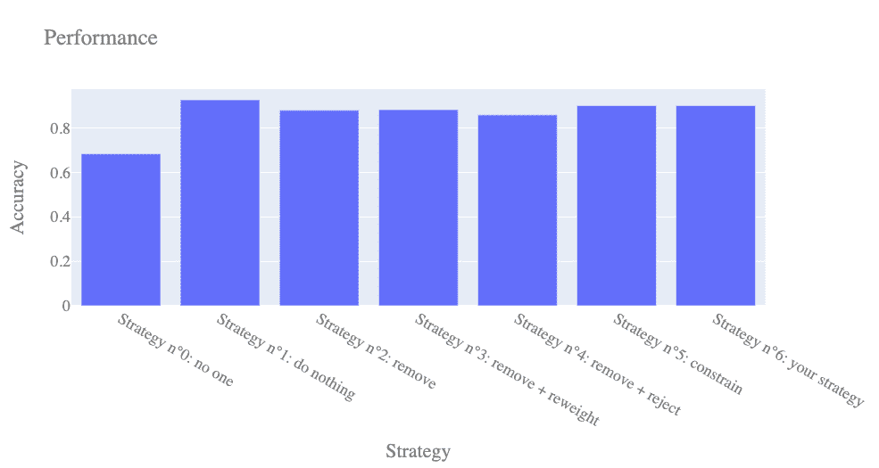

测试本文中所有建模策略的准确性。图片由作者提供。


测试本文中所有建模策略的不同影响。图片由作者提供。

我们的策略在准确性和不同影响方面表现相对较好。但是既然我们已经被数字愚弄了，那就让我们仔细看看决策边界。


结合简单业务规则的简单逻辑模型的决策边界。图片由作者提供。

Tadaa！看到我们做了什么吗？我们只是在最初的逻辑回归中应用了一个业务规则:

*“如果工资高，靠历史数据。别的，干脆无视薪资。*

因此，这一模式似乎对男性和女性都是公平的，不受代表性、社会和历史偏见的影响。此外，即使社会发生变化，女性倾向于逐步要求更高的工资，我们的模式将保持公平和一致。这就是我们所说的稳健性。

**我们是如何应对这三种偏见的？**

*   代表性偏差:我们的逻辑模型只适用于男性，它代表了技能和薪水方面的基本事实。
*   **社会偏见:**低期望工资对招聘没有影响，因此性别也没有影响。
*   **历史偏见:**女性的界限决定根本没有优化准确性:它与男性的界限决定是连续的(一致性)，并且忽略了工资。

> ***关键外卖:*** *在业务逻辑、性能和公平性方面的最优解，可能是机器学习和业务规则的混合。*

# 让我们消除模型中的偏见！

在本教程中，我们遇到了五种不同的偏见:

*   **代表性偏差:**没有足够多的女性单独依赖不同的影响测量(更不用说同样有缺陷的统计测试)。
*   **社会偏见:**女性和预期薪资强相关，这削弱了敏感属性移除等天真偏见缓解方法。
*   **历史偏见:**女性在训练集中已经被歧视了。
*   **评估偏差:**女性在测试集中也会受到歧视，因此单独考虑准确性度量是没有意义的。
*   **聚合偏倚:**完全不同的影响、互信息和所有相关的显著性检验依赖于数据集的粗略汇总，即列联表。这些数字可以被人为夸大，而不抑制歧视。

在本教程中，前三种偏见被一个简单的业务规则抵消了。后两种偏见被可视化和高度可解释的模型所抵消。

# **关键要点**

算法偏差是微妙而普遍的。公平是很难实现的，并且对“绩效”这个概念本身提出了质疑。没有神奇的指标可以优化，也没有神奇的库可以解决这个问题。

永远都不会有。

透明度是关键。人在回路中是至关重要的。

# 加入

我在量子力学公司工作。Quantmetry 自 2011 年成立以来一直是先驱和独立的公司，是法国领先的纯人工智能咨询公司。在提供卓越的数据治理和最先进的人工智能解决方案的愿望的驱动下，Quantmetry 的 120 名员工和研究顾问将他们的热情投入到为所有行业的公司提供高业务成果的服务中。

*阅读我们最新的白皮书:*[https://www.quantmetry.com/lp-ia-de-confiance/](https://www.quantmetry.com/lp-ia-de-confiance/)

# 参考

[1] Mehrabi 等人，[关于机器学习中的偏见和公平的调查](https://arxiv.org/abs/1908.09635)，2019，arXiv
【2】Caton 和 Haas，[机器学习中的公平:一项调查](https://arxiv.org/abs/2010.04053)，2020，arXiv
【3】kami ran 和 Calders，[无歧视分类的数据预处理技术](https://link.springer.com/article/10.1007/s10115-011-0463-8)，2012，知识与信息系统

[4] Kamiran 等人，[区分感知分类的决策理论](https://www.semanticscholar.org/paper/Decision-Theory-for-Discrimination-Aware-Kamiran-Karim/5f6eb092fa114bd257d3f670b7c88366536cc7b7)，2012，IEEE 第 12 届数据挖掘国际会议

[5] Kamishima 等人，[带有偏见消除器正则化器的公平感知分类器](https://link.springer.com/chapter/10.1007/978-3-642-33486-3_3)，2012，关于数据库中机器学习和知识发现的欧洲联合会议。