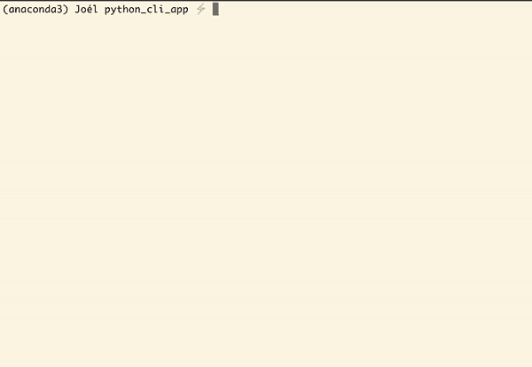

# 教程:通过 Traitlets 创建 Python CLI 包

> 原文：<https://towardsdatascience.com/tutorial-create-a-python-cli-package-a2410b47af35?source=collection_archive---------13----------------------->

## 使用`traitlets`开发一个简单的、面向对象的命令行包


照片由[黑脸田鸡岛崎](https://www.pexels.com/@sora-shimazaki?utm_content=attributionCopyText&utm_medium=referral&utm_source=pexels)从 [Pexels](https://www.pexels.com/photo/crop-cyber-spy-hacking-system-while-typing-on-laptop-5935794/?utm_content=attributionCopyText&utm_medium=referral&utm_source=pexels) 拍摄

**如果你像我一样…**

*   您喜欢编写脚本来加快工作流程
*   你的 Python 很流利，其他基本不会。

令人恼火的是，python 在终端中感觉有点笨拙。

如果您想从命令行运行 python 脚本，您需要…

*   给每个不可能记住的脚本*分配一个不同的命令(通常是 bash 别名*
*   使用`sys` python 包从头开始解析命令行参数 *gross*
*   用`argparse`解析命令行，用`if/else`检查激活每个功能。*亦作 gross*

好在这个问题有解决的办法！它叫做`traitlets`。

## 什么是 traitlets？

Traitlets 由 IPython 创建，用于验证数据类型、监控变量的变化、解析和实现配置文件中的应用程序设置，以及从命令行激活 Python 代码。对于 IPython 和 Jupyter 项目生产的许多软件来说，它充当了一种幕后引擎的角色。现在，我们将关注 traitlets 的两个元素。

1.  从命令行激活 python 代码
2.  可配置变量

# 目标

在本文中，我将逐步构建一个简单的`traitlets`应用程序。有了这些知识，你将能够编写一个命令行程序

*   完全是用 python 写的。
*   为单个 CLI 命令分配多个工具。
*   可以通过命令行或系统配置文件轻松配置。(您不必编写代码来解析配置数据🤩)
*   具有直接面向对象的编程结构。

***项目代码:***

*   如果你想自己编写项目代码，[这个 github 库](https://github.com/joelsewhere/traitlets_cli_blog)包含了所有的项目文件。每个文件中的代码已被替换为指导性注释。
*   完成的项目代码可在处[找到。(代码存储在 github 库的`solution`分支上。如果您已经克隆了存储库，那么您可以运行`git checkout solution`来访问您计算机上的代码。)](https://github.com/joelsewhere/traitlets_cli_blog/tree/solution)

# 我们在建造什么？

首先让我们看看成品是什么样的…



这个应用程序有两个命令。

`**greet**`

当这个命令运行时***“Hello，World！”被打印到*端子**。

该命令有**参数** `--greeting`、`--name`和`--punctuation`，允许您更改打印的信息。

`**abs**`

当运行此命令 ***时，提供的文件名的绝对路径被打印到终端。***

该命令有**标志**T7。使用该标志时， ***除了绝对路径外，还打印文件大小(以字节为单位)。***

该项目的**目录结构**如下所示:

```
subapps/ <------------- All "command" code-files are placed here
     AbsApp.py  <------ Code for the `abs` command
     GreetingApp.py <-- Code for the `greet` command
     __init__.py <----- Set up for easy importing
CLIapp.py <------------ Code for CLI activation
```

好吧，我们来写点代码。

# GreetApp.py

导航到项目文件夹的`subapps/`目录，打开`GreetApp.py`文件。

我们将需要这个文件的两个导入。

1.  `from traitlets.config import Application`
2.  `from traitlets import Unicode`

在继续之前，让我们快速分解一下这两个导入。

**导入#1 —应用**

是我们将在这个项目中编写的每个类的“父类”。`Application`对象提供了大量有用的工具，例如[解析命令行](https://github.com/ipython/traitlets/blob/f24879c16059b34b89c3fe5cb34cf72001fa9b18/traitlets/config/application.py#L670)、[加载配置文件](https://github.com/ipython/traitlets/blob/f24879c16059b34b89c3fe5cb34cf72001fa9b18/traitlets/config/application.py#L772)、[生成配置文件](https://github.com/ipython/traitlets/blob/f24879c16059b34b89c3fe5cb34cf72001fa9b18/traitlets/config/application.py#L824)、[自动生成代码文档](https://github.com/ipython/traitlets/blob/f24879c16059b34b89c3fe5cb34cf72001fa9b18/traitlets/config/application.py#L544)等等。在本教程中，我们将关注`Application`对象解析命令行和激活应用程序代码的方法。

**导入#2 — Unicode**

`Unicode`是一款 traitlets **型。**

*   C [ode 类型的例子。](https://traitlets.readthedocs.io/en/stable/using_traitlets.html)
*   所有可用类型的列表。

Traitlets 类型是[类属性](https://www.tutorialsteacher.com/articles/class-attributes-vs-instance-attributes-in-python#:~:text=Class%20attributes%20are%20the%20variables,are%20defined%20in%20the%20constructor.)，当被定义时，防止属性被分配给不正确的数据类型。当参数`config=True`被添加到类型中时，变量变得可配置，这意味着属性的默认值可以通过命令行参数或通过在配置文件中设置所需的默认值来更改。

# 定义可配置变量。

在下面的代码单元格中，我们…

1.  导入`Application`和`Unicode`对象
2.  定义`GreetApp`类
3.  从`Application`父类继承
4.  用默认设置定义类型变量。
5.  将变量标记为可配置的

**现在让我们创建** `***start***` **方法**

`start`方法是激活应用程序功能的地方。

**在下面的代码块中，我们……**

1.  定义一个`start`方法
2.  激活应用程序功能

# 命令行别名

从技术上来说，我们*可以*让应用程序像这样运行，但是改变可配置变量对用户来说有点烦人。

现在，用户不必运行`--greeting='Hi'`来将问候配置变量更改为`'Hi'`，而是必须运行:

```
--GreetApp.greeting='Hi'
```

为了使这更容易，我们必须创建一个`aliases`类属性。该属性由`Application`父类在解析命令行时使用。

**在下面的代码块中，我们……**

1.  定义包含我们别名的字典
2.  将字典键设置为我们想要使用的命令行参数
3.  将值设置为我们想要配置的`Application`孩子的名字
4.  阐明我们想要改变的可配置变量
5.  将`aliases`类特征设置为别名字典

**`**GreetApp**`**搞定了！****

> **我们还可以向这个应用程序添加一些其他的东西，这些将在后续文章“如何自动生成文档”中介绍如果你正在处理自己编写的文件，现在跳过未填写的部分。对于本文，它们不是必需的。**

# **主要功能**

**现在我们已经完成了一个应用程序，我们需要设置激活代码的`main`函数。这个过程将由`CLIapp.py`文件处理。**

**导航到`CLIapp.py`文件。**

**对于这个文件，我们将需要以下导入。**

1.  **`from traitlets.config import Application`**
2.  **`from subapps import GreetApp` *(我们刚刚写的应用对象！)***

**`Application`对象有一个名为`subcommands`的属性，允许你附加激活特定应用程序的命令。在这个文件中，我们将定义一个名为`CLIapp`的应用程序，它包含一个子命令字典，以及一个用于激活*子命令的* `start`方法的启动方法。***TL；DR***`CLIapp`是一个应用程序，其唯一目的是激活*其他*应用程序的代码。**

**让我们把这个写出来**

****在下面的代码块中，我们……****

1.  **导入`Application`和`GreetApp`对象**
2.  **定义`CLIPapp`应用程序**
3.  **用以下格式定义字典:**

```
{command : (application object, application description)}
```

**4.定义一个`start`方法**

**5.检查以确保用户提供了子命令。如果他们没有打印出可用的子命令**

**6.激活`Application.start` [方法](https://github.com/ipython/traitlets/blob/f24879c16059b34b89c3fe5cb34cf72001fa9b18/traitlets/config/application.py#L337)，依次激活子应用的`start`方法。**

**好吧！那就是`CLIapp`**

**现在我们需要做的最后一件事是定义一个主函数来激活所有的代码。**

****在下面的代码块中，我们……****

1.  **在之外定义一个`main`函数**
2.  ***通过`launch_instance` [方法](https://github.com/ipython/traitlets/blob/f24879c16059b34b89c3fe5cb34cf72001fa9b18/traitlets/config/application.py#L839)激活代码。*这是命令行被解析的地方****
3.  ***添加`if __name__ == "__main__"`检查，允许我们从命令行调用`main`功能。***

***我们现在有了一个可用的应用程序！ 🥳***

***在您的终端中，导航到项目目录的顶层并运行***

*   ***`python CLIapp.py greet` *“世界你好！”将被打印****
*   ***`python CLIapp.py greet --greeting="Hi"` *“嗨，世界！”将被打印****
*   ***`python CLIapp.py greet --name="Joel"` *“你好，乔尔！”将被打印****

# ***AbsApp.py 添加新命令***

***现在让我们看看通过创建`abs`命令向现有应用程序添加新工具的过程。***

***在`AbsApp.py`文件中，我们将运行以下导入***

```
*from traitlets.config import Application
from traitlets import Bool
import os*
```

*****这两个新导入的是** `**Bool**` **和** `**os**` **。*****

*****Bool** 是另一种[traitles 类型](https://traitlets.readthedocs.io/en/stable/trait_types.html#traitlets.Bool)。在这种情况下，它确保变量被设置为`True`或`False`***

*****os** 是一个[基础 Python 包](https://docs.python.org/3/library/os.html)，代表“操作系统”。它是一个标准软件包，用于生成文件路径、列出文件夹中的文件以及与计算机操作系统交互。在我们的例子中，我们将使用`os`来生成文件的绝对路径，并计算文件使用了多少字节。***

***好，接下来我们将构造我们的`AbApp`类。***

***在下面的牢房里，我们…***

1.  ***定义`AbsApp`应用程序***
2.  ***定义一个 traitlets 类型为`Bool`的可配置`size`变量***
3.  ***定义一个`start`方法***
4.  ***通过`extra_args` [属性](https://github.com/ipython/traitlets/blob/34f596dd03b98434900a7d31c912fc168342bb80/traitlets/config/application.py#L280)访问用户提供的文件名***
5.  ***通过 os `isfile`功能确保用户提供的文件是有效文件。***
6.  ***打印所提供文件名的绝对路径***
7.  ***如果用户将`size`可配置变量设置为`True`，文件大小也会被打印。***

***现在，我们将为 AbsApp 创建一个**标志**，允许用户简单地运行…***

```
*--size*
```

***…而不必显式地将`size`设置为真或假。为此，我们将定义一个由`Application`父类在解析命令行时使用的`flags`类变量。***

***在下面的牢房里，我们…***

1.  ***定义一个名为`flags`的`dict`变量***
2.  ***将顶层密钥设置为将在命令行中使用的标志***
3.  ***将键的值设置为一个`tuple`***
4.  ***向元组添加一个字典，其中键是应该由标志配置的应用程序的名称***
5.  ***将键的值设置为另一个字典，其中键是可配置变量的名称，值是要分配给变量的数据。***
6.  ***将标志的描述添加为元组中的第二项。如果用户使用`--help`参数，这将被打印出来！***
7.  ***通过`Application.flags`属性将标志添加到应用程序中。***

****值得注意的是:在更新配置时，标志非常强大。二级字典可以包含多个应用程序，三级字典可以包含多个可配置变量！****

*****ABS app 完成了！** ✅***

***现在最后一步是将 app 添加到`CLIapp.py`文件中！***

***在下面的代码块中，我们…***

1.  ***将`AbsApp`对象导入到`CLIapp.py`文件中***
2.  ***向`CLIapp`对象添加一个`abs`子命令***

***就这样，一个新的命令被添加到您的应用程序中！***

***在您的终端中，导航到项目目录的顶层并运行***

*   ***`python CLIapp.py abs CLIapp.py` *将打印 CLIapp.py 文件的绝对路径****
*   ***`python CLIapp.py abs CLIapp.py --size` *将打印 CLIapp.py 文件的绝对路径和文件大小****

***根据我自己用 traitlets 编写应用程序的经验，编写新应用程序和向现有工具添加新命令的便利性是最好的好处之一。因为这个过程根植于面向对象编程，所以有时编写一个全新的应用程序就像从现有的应用程序继承然后编辑一行代码一样简单！***

***好了，现在就这样。**我的下一篇文章一定要点击 follow 按钮:**trait lets 配置文件和如何自动生成代码文档的演练！***