# 教程:使用 Google 登录进行 MongoDB 用户认证

> 原文：<https://towardsdatascience.com/tutorial-mongodb-user-authentication-with-google-sign-in-fcc13076799f?source=collection_archive---------13----------------------->

## 简化应用程序访问控制和个性化用户体验的分步指南。

照片由[弗兰克](https://unsplash.com/@franckinjapan?utm_source=medium&utm_medium=referral)在 [Unsplash](https://unsplash.com?utm_source=medium&utm_medium=referral) 上拍摄

MongoDB 因其高性能、广泛的开发人员支持和慷慨的免费层而迅速成为我的非关系数据库平台选择。与许多数据库引擎一样，用户管理和访问控制可能会变得非常复杂，尤其是当软件堆栈使用其他资源时，如微服务或云存储。幸运的是，我们可以利用所谓的“联合身份提供商”，如谷歌、脸书和亚马逊，将用户身份验证与应用程序的其余部分分离开来。

在本教程中，我们将从头开始构建一个基于 MongoDB 的安全应用程序的所有必要步骤。用户将需要登录他们的谷歌帐户从数据库中读取。

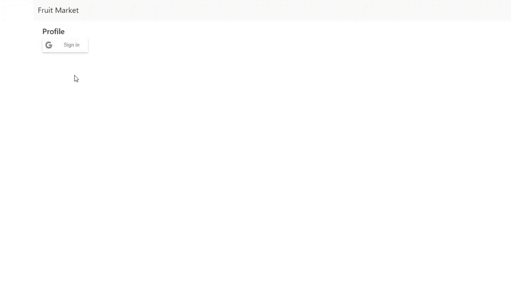

到本教程结束时，我们将有一个简单的 web 应用程序，允许用户通过使用他们的 Google 帐户登录来查看水果市场。

在我们可以编写一行代码之前，我们必须设置我们基于云的认证流程，这涉及到 Google Identity、AWS IAM，当然还有我们的 MongoDB 集群之间的协调。

## 注册 Google 应用程序

我们需要做的第一件事是向 Google 注册我们的应用程序。除了利用现有的安全基础设施(并通过熟悉的界面使登录页面合法化)，这将使我们能够通过查看客户的个人资料信息来个性化用户体验。

首先，登录到[谷歌云控制台](https://console.cloud.google.com/getting-started)，创建一个新项目，并给它一个描述性的名称。

在谷歌云控制台中创建新项目(图片由作者提供)。

一旦您的新项目初始化，搜索“APIs & Services”，导航到侧边栏中的“OAuth 同意屏幕”选项卡，然后单击“创建外部用户”。在设置向导的第一页，您需要提供应用程序名称和电子邮件地址，以便获得用户支持。

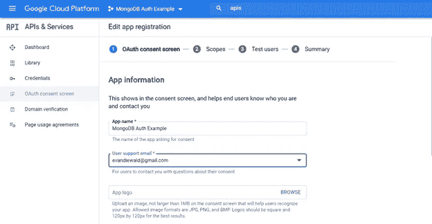

配置 OAuth 同意屏幕，它将通知用户我们的应用程序正在请求什么权限(图片由作者提供)。

下一页是我们将定义应用程序范围的地方，它确切地规定了我们将有权阅读或修改用户 Google 帐户的哪些方面。这是整个过程中最重要的步骤之一，因为我们可以请求用户的联系信息、日历、位置或其他个人内容。在这个演示中，我们的应用程序将能够读取用户的电子邮件地址和个人资料，其中包括他们的姓名和头像。

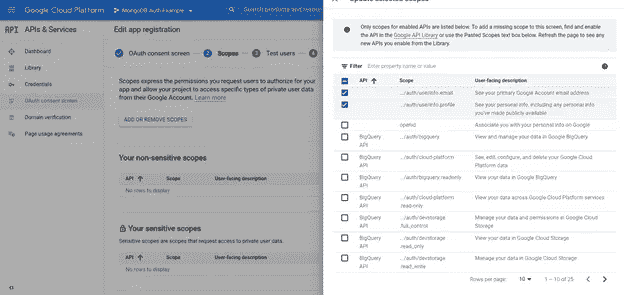

应用程序的启用范围-在这种情况下，读取用户电子邮件和个人资料的访问权限(按作者分类的图像)。

**重要提示**:在生产环境中，您需要提供隐私政策和其他法律文件，以准确定义这些个人信息的使用方式。

接下来，分配至少一个测试用户。在我们的应用程序被谷歌正式批准公开访问之前，登录权限将仅限于这些帐户。

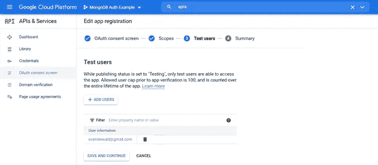

在我们的应用程序被谷歌正式发布之前，分配测试用户是必要的。

一旦我们建立了 OAuth 同意屏幕，我们需要为我们的 Google 应用程序生成一个客户端 ID。仍然在 APIs & Services 中，导航到侧栏中的“Credentials”选项卡。在“创建凭据”下，选择“OAuth 客户端 ID”。

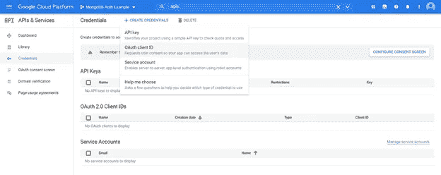

在凭证选项卡上创建 OAuth 客户端 ID(图片由作者提供)。

将客户端初始化为 web 应用程序，并添加 [http://localhost:8000](http://localhost:8000) 作为授权的 JavaScript 源，因为登录请求将从我们的本地开发服务器发出(稍后将详细介绍)。

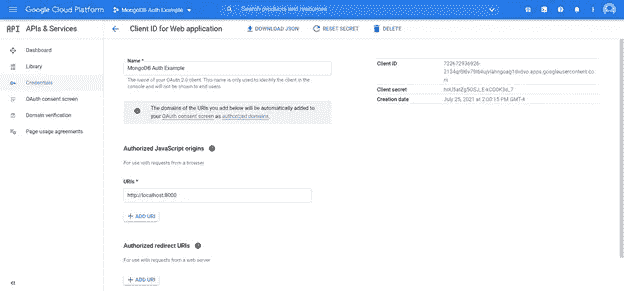

配置客户端 ID 凭证(图片由作者提供)。

这将生成您的应用程序的客户端 ID(类似于 1234567890 . apps . Google user content . com)。我们将在几个不同的地方需要它，所以把它粘贴到容易访问的地方。

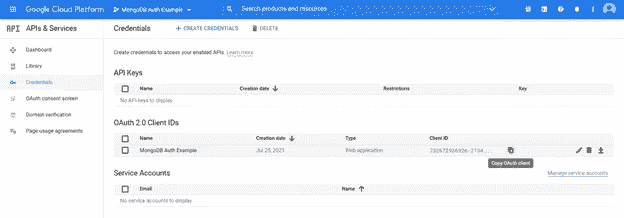

复制客户端 ID(图片由作者提供)。

这就完成了谷歌控制台的过程。现在转到 AWS。

## 在 AWS 中创建 IAM 角色

一旦你的应用在谷歌注册，登录你的 [AWS 控制台账户](https://console.aws.amazon.com/)。搜索“IAM”，在侧边栏选择“角色”，点击“创建角色”。对于受信任实体的类型，选择“Web Identity”并选择 Google 作为身份提供者(您会注意到，我们可以对脸书、亚马逊和其他联合身份提供者使用类似的流程)。将您的 Google 客户端 ID 粘贴到受众下。接受其余角色设置的默认值。

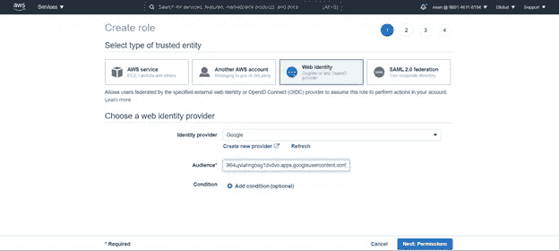

在 AWS IAM 中，创建一个新角色，使用 Google 作为身份提供者(图片由作者提供)。

一旦创建了您的角色，记下角色 ARN(例如，arn:AWS:iam::AWS _ ACCOUNT:Role/roleName)，我们将在下一步中用到它。

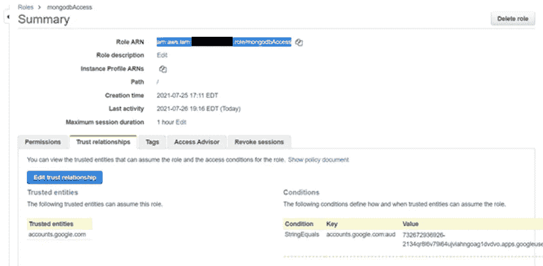

一个可以找到 ARN 这个角色的地方。

这就完成了这个演示所需的 AWS 设置，但是我要注意，通过调整附加到这个角色的策略文档，我们可以将我们的应用程序连接到其他 AWS 资源，比如 S3 桶和 Lambda 函数。

## 配置 MongoDB 数据库

接下来，我们需要启动并配置我们基于云的 MongoDB 集群。登录 [MongoDB Atlas](https://account.mongodb.com/account/login) 创建一个组织。

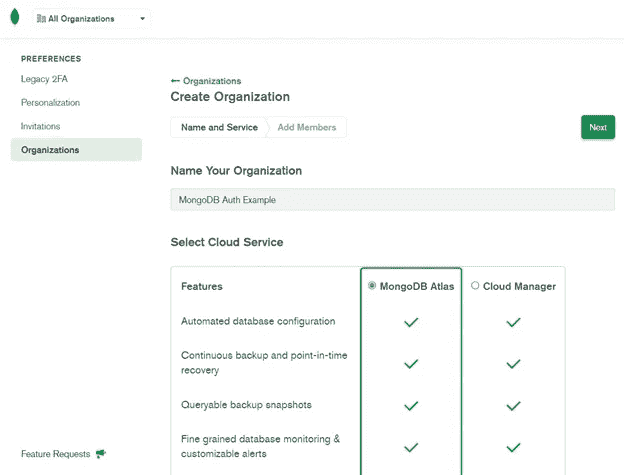

在 MongoDB Atlas 中初始化一个新组织(图片由作者提供)。

在您的 Atlas 组织内，创建一个新项目并为其命名。

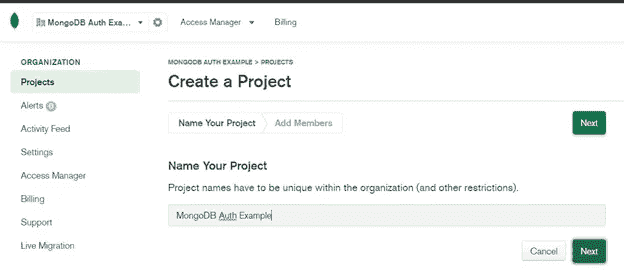

创建新项目(图片由作者提供)。

最后，创建一个数据库。在这个演示中，我将使用一个免费的共享集群。

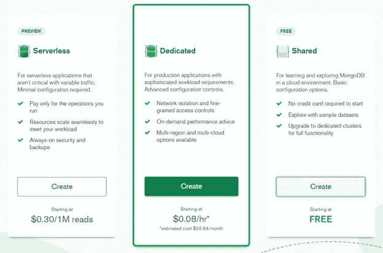

我选择了(免费)共享层(最右边的选项)。

确保选择 AWS 作为该集群的云提供商和 M0 沙盒层(也是免费的)。除非您选择升级容量，否则您不必连接信用卡，这在我们的简单演示中是不必要的。

将集群部署到您选择的 AWS 区域，并确保使用 M0 沙盒层来免费使用数据库(图片由作者提供)。

在部署集群时，喝杯咖啡。准备好后，点击“收藏”标签。如果您不熟悉 MongoDB 语法，“集合”类似于 SQL 表，“文档”可以被认为是表中基于 JSON 的条目或行。首次创建新集合时，您可以选择使用样本数据集或添加自己的数据集。我们会选择后者。

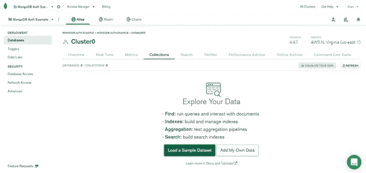

创建新的数据库和收藏(图片由作者提供)。

假设我们的应用程序是一个水果市场，它存储各种商品的名称、价格和剩余数量。我们将在“test”数据库的“marketplace”集合中插入一些文档。最快的方法是直接在 web 界面中完成，但是你也可以通过 [MongoDB shell](https://docs.mongodb.com/mongodb-shell/) 或者[他们支持的驱动](https://docs.mongodb.com/drivers/)中的一个来执行批量插入。由于本教程更侧重于身份验证，所以我不会详细讨论 MongoDB 中的模式或用法。

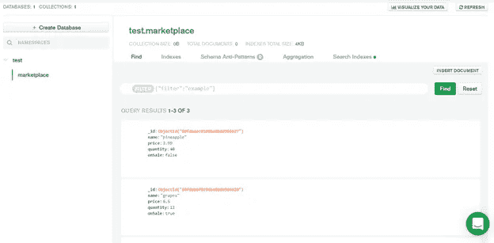

在 web 界面中将文档插入到 MongoDB 集合中。你也可以从这个页面测试查询(图片由作者提供)。

最后，让我们将数据库连接到我们的 IAM 角色。在侧边选项卡上，转到“数据库访问”并添加一个新的数据库用户。对于身份验证方法，选择“AWS IAM ”,并在“AWS IAM 类型”下拉菜单中选择“IAM 角色”。将角色 ARN 粘贴到所需的输入中。

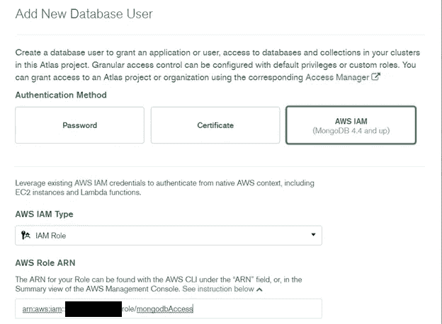

使用 AWS IAM 凭据添加新的数据库用户(图片由作者提供)。

调整用户权限是另一个复杂的主题，完全有理由拥有自己的博客。我们将授予该用户对我们刚刚创建的“marketplace”集合的只读访问权限。

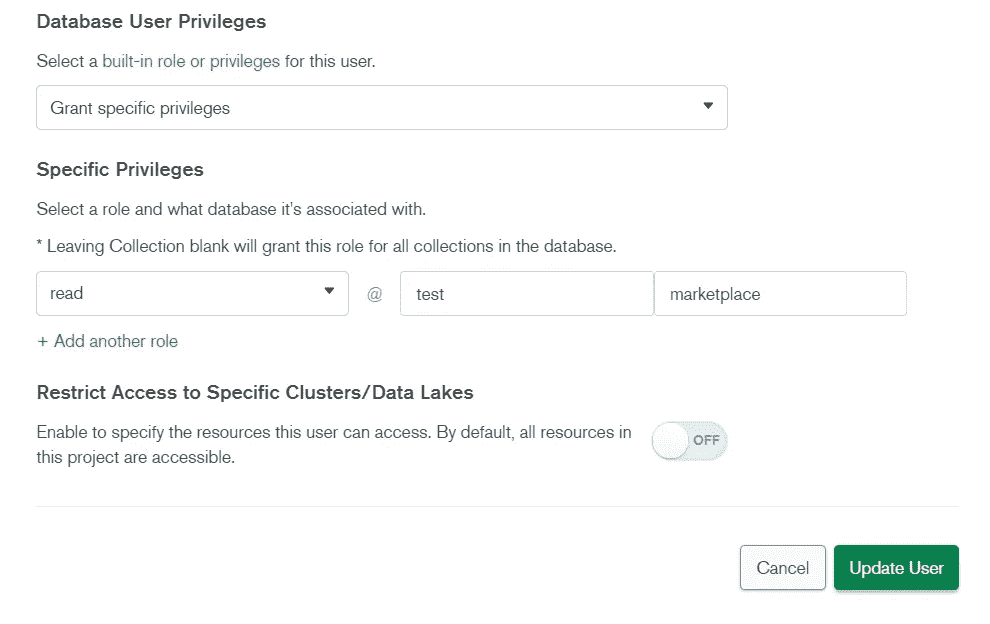

将此用户的权限限制为只读访问 test.marketplace 集合(图片由作者提供)。

除了基于用户的身份验证，MongoDB 还可以限制对特定 IP 地址的访问。在生产环境中，我们只想允许来自应用服务器的请求，以帮助阻止 DDoS 攻击等威胁。由于我们将在本地运行演示应用程序，在“网络访问”下，**只添加您当前的 IP 地址**，遵循最小特权的[原则。](https://en.wikipedia.org/wiki/Principle_of_least_privilege)

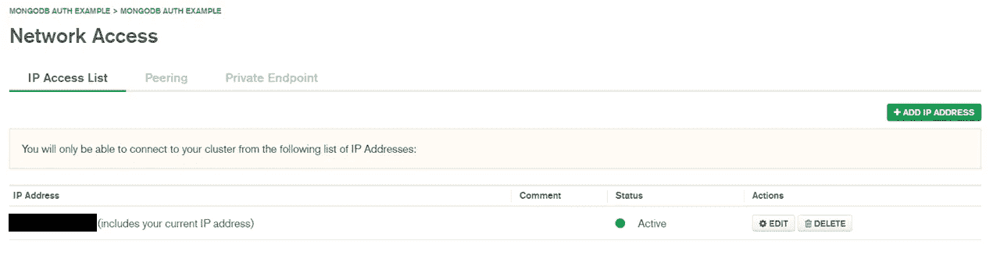

将网络访问限制在绝对需要的 IP 地址上(图片由作者提供)。

## 将所有这些放在演示应用程序中

设置完成后，我们终于准备好编写一些代码了。如果一切顺利，用我们的 Google 帐户登录将返回一个 ID 令牌，该令牌可用于检索 AWS IAM 角色的凭证。我们应用程序的服务器将使用这些凭证从数据库中读取数据。

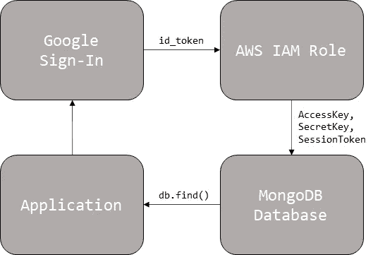

我们应用程序流程的 30，000 英尺视图(图片由作者提供)。

在客户端，我们登录，检索凭证，将它们发送到我们的后端，并使用响应来更新网页(以下片段摘自我们的 index.html[文件](https://github.com/evandiewald/mongodb-google-auth/blob/main/templates/index.html))。

注意，在 signinCallback 函数中，我们将包含 AWS 凭证的 POST 请求发送到/fruits 端点(同样，我们通过使用 HTTP 服务器简化了本演示——在生产中，您可能希望在与 HTTPS 的传输中加密此连接)。该请求将由我们基于 FastAPI 的 web 服务器处理，如下所示:

如前所述，虽然我选择了 Pythonic 实现，但 MongoDB 支持许多编程语言的驱动程序，因此您可能更喜欢用 Go、Node.js 或 Rust 构建可伸缩的服务器。

我们劳动的“成果”:一个简单，但个性化和安全的应用程序(图片由作者提供)。

现在你知道了！虽然这只是一个简单的演示，但是可以轻松地扩展该基础设施，以支持其他身份提供者或其他 AWS 资源。

完整的示例代码可以在我的 Github 页面上找到。

***注来自《走向数据科学》的编辑:*** *虽然我们允许独立作者根据我们的* [*规则和指导方针*](/questions-96667b06af5) *发表文章，但我们不认可每个作者的贡献。你不应该在没有寻求专业建议的情况下依赖一个作者的作品。详见我们的* [*读者术语*](/readers-terms-b5d780a700a4) *。*

## 参考

[1]“欢迎使用 MongoDB 文档— MongoDB 文档。”[https://docs.mongodb.com/](https://docs.mongodb.com/)(2021 年 7 月 28 日访问)。

[2]“将 Google Sign-In 集成到您的 web 应用中。”https://developers.google.com/identity/sign-in/web/sign-in(2021 年 7 月 28 日访问)。