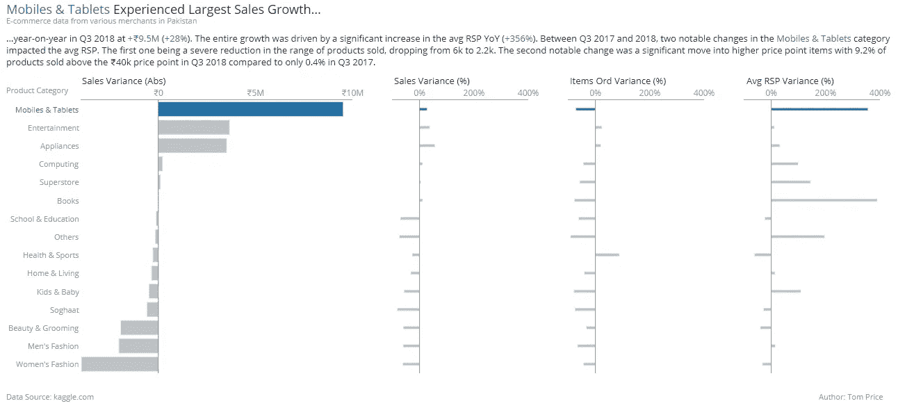

# 用 Plotly Python 构建专业条形图的教程

> 原文：<https://towardsdatascience.com/tutorial-on-building-a-professional-bar-graph-in-plotly-python-ba8e63fda048?source=collection_archive---------9----------------------->

## [实践教程](https://towardsdatascience.com/tagged/hands-on-tutorials)

## 创建高质量条形图的分步指南

本教程的最终图形迭代|作者图片

作为我上一篇文章“关于用 Plotly Python 构建专业散点图的[教程”的续篇，我已经用 Python 编写了另一个 Plotly 教程，介绍如何构建一个视觉上令人惊叹的条形图。](/tutorial-on-building-professional-scatter-graphs-in-plotly-python-abe33923f557)

本文旨在将 Python 中的 Plotly 图形提升到一个新的水平，假设您已经对这种语言有所熟悉。我将应用一种逐步迭代的方法来帮助简化这个过程。如果你想提高视觉效果，请继续阅读。

我将使用的数据集是巴基斯坦的电子商务销售额。您可以从 [Kaggle](https://www.kaggle.com/zusmani/pakistans-largest-ecommerce-dataset) 或我的 [Git](https://github.com/tomgprice90/Medium_Article_Tutorial_Bar_Plotly_Python) 库下载数据，以及本教程的其余代码。注意:从 Kaggle 版本中删除了缺少值的行，以便上传到 Github。

我们将逐步完成同一图表的六个不同版本。从 Plotly 提供的最基本的图表开始，到最后完全定制和注释的图表。我将解释每一步的基本变化。

# 在我们开始编码之前

值得一提的是 Plotly 是如何组成它的图形对象的。一种简单的思考方式是描绘由四层构成的图表。

*   层 1-创建一个空白图形对象。
*   第 2 层-添加并自定义您的数据点。
*   第 3 层—定制您的视觉效果。
*   第 4 层—注释您的视觉效果。

当可视化数据时，理解我们想对数据提出什么问题总是至关重要的(假设我们正在进行解释性分析而不是探索性分析)。

我们想从数据集中找出的问题是:

**2018 年第三季度，哪个品类同比增长最大，是什么推动了这一增长？**

# 索引

1.  [**第一步:数据操作**](#495f)
2.  [**第二步:创建标准条形图**](#5a78)
3.  [**第三步:造型变化**](#c813)
4.  [**第四步:展示多个指标**](#f2d6)
5.  [**第五步:减少杂乱**](#948e)
6.  [**第六步:引导读者的注意力**](#9c8d)
7.  [**第七步:添加解说词**](#0317)
8.  [**结论**](#c84c)

# 步骤 1:数据操作

我们想要操作我们正在使用的数据集，这样我们就可以创建我们的初始图表。我们需要制作几个我们想要显示的变量，并过滤掉不必要的数据。***说出我要添加的变量***我决定去掉大量的 NA，这可能不总是最好的决定，但对于本文来说是可以接受的。

我不会解释数据操作过程，因为这本身就是一个教程，而本文主要关注在 Plotly 中创建一个条形图。然而，我在下面的代码中注释了每一步。

第 1 步:数据操作—代码|作者图片

# 步骤 2:创建标准条形图

对于第 1 层，用`go.Figure()`创建一个空白图形对象。

对于第 2 层，使用`add_trace(...)`添加一层数据点到你的空白画布上。这个命令是我们执行所有数据定制的地方，比如颜色、大小、透明度。

为了研究增长，我选择显示销售的绝对差异，而不是百分比。

步骤 2:创建一个标准的条形图—代码|作者图片

第二步:创建一个标准的条形图——图表|作者图片

在上面的图形中，您会注意到图形标题和轴标题丢失了。默认情况下，Plotly Graph 对象不会生成这些，因此必须显式定义它们。

# 第三步:改变造型

可视化数据的一个最重要的概念是突出显示您想要显示的数据点，并减少来自不太重要的元素的干扰。尽管如此，还是要清楚地标注图表中的所有特征，这样读者就不会去猜测如何解读图表。

对于这个迭代，我们将把第 3 层添加到我们的图中。我们将使用`update_layout(...)`自定义我们的图形框架的外观。这将是您更新除数据点之外的所有内容的地方，如标题、轴、刻度格式、网格线等。我们将使用颜色将不太重要的特征推到后面，例如轴线、轴标记标签、轴标题和绘图背景。

对于此迭代，我们将进行以下更改:

*   添加标题
*   添加轴标题
*   对类别排序
*   将轴的线条颜色从白色更改为浅灰色
*   将背景颜色改为白色
*   将图表上所有文本的颜色改为浅灰色
*   向 x 轴刻度添加货币前缀

步骤 3:样式更改—代码|作者图片

步骤 3:样式更改—图表|作者图片

我们已经按照我们想要的顺序创建了一个类别列表，从最大正方差到最大负方差，然后将它传递给类别数组参数。这可能看起来很冗长，但是我们将在下一步中引入关于补充图的其他度量。类别顺序将在每个地块中保持不变。

在上图中，您现在可以清楚地看到哪个品类同比增长最为显著。接下来，我们将找出导致这种增长的原因。

# 步骤 4:展示多个指标

将尽可能多的信息压缩到可视化中并不总是一个好主意。只包括额外的细节，如果它支持你想要讲述的故事。你还要考虑话题的复杂程度，受众是谁；有时候，把故事分成几个画面可能更容易。

在这种情况下，我们将通过子图在图表上显示额外的指标。这是因为它需要回答我们最初的问题，并且消息不会过于复杂。在后面的步骤中，我们将使用技巧将读者的注意力集中在重要的事情上。

在这一步，我们使用`make_subplots(...)`而不是`go.Figure()`来创建空白图。由于我们正在处理子图，我们将在数据框中创建两列来保存每个指标在每个子图中的行和列位置。然后我们使用循环`for metric in df2["metric"].unique():`在给定的行和列坐标为子情节中的每个指标生成一个图形。

当在 Plotly 中处理支线剧情时，我们可以选择用`xaxis = dict(...)`、`xaxis2 = dict(...)`等更新单个 x 轴。，或者用`fig.update_xaxes(...)`更新所有 x 轴。我们将使用前一个代码进行特定于轴的格式化，后一个代码进行所有轴通用的格式化。对于 y 轴也可以这样做。

对于此次迭代，我们将进行以下更改:

*   向图形中添加子图以显示其他指标
*   给每个支线剧情添加标题
*   将 y 轴移动到 x = 0

第 4 步:呈现多个指标—代码|作者图片

步骤 4:呈现多个指标—图表|按作者分类的图像

默认情况下，支线剧情的引入使得图表更加繁忙。有几个重要的问题凸显出来。

**太多杂物**

上面的图太重了，包含了重复的信息，比如第二和第三个支线剧情的图例和 y 轴。为了创建一个专业的图表，我们希望对我们纳入的元素非常有选择性。包括尽可能少的信息，这使得图表能够被理解并且仍然回答问题。

**支线剧情之间断开**

“物品 Ord 差异”和“平均 RSP 差异”支线剧情的加入使这个视觉信息变得复杂。这是因为与“销售差异”子情节相比，它们的规模完全不同。

# 减少杂乱

减少杂乱会降低读者的认知负荷，使信息更容易消化。为了帮助减少混乱，我们将在`make_subplots(...)`命令中设置`shared_yaxes = True`。

我们将通过删除“物品 Ord 差异”和“平均 RSP 差异”支线剧情来解决支线剧情之间不同比例的问题，并添加销售差异(%)指标。

我们还将把 x 轴移到图表的顶部，这样子情节标题也可以作为轴标题。这更务实，因为重点是在顶级类别。由于移动了 x 轴，我们将不得不移除支线剧情标题，这样它们就不会重叠，并使用`fig.add_annotation(...)`手动添加支线剧情标题。

为了用最少的代码为每个子情节添加标题，我们将创建一个数据框`df_subplot_titles`来保存标题、子情节 x 轴列和最小 x 轴范围。然后我们可以循环这个数据框中的每个标题，将它们添加到子情节中。

对于此次迭代，我们将进行以下更改:

*   将 x 轴移动到图表顶部
*   对于附加图，使用百分比变化而不是绝对差异
*   移除图例
*   移除重复的 y 轴
*   手动添加支线剧情标题

第五步:减少混乱——代码|作者图片

第五步:减少混乱——图表|作者图片

我们已经达到了这样一种状态，图表回答了我们最初的问题，“什么类别同比增长最大，是什么推动了这一增长？”。上面的条形图显示，手机和平板电脑的增长最为可观，这是由于平均 RSP 的增长。但是仍然有一些明显的缺陷。

**支线剧情之间断开**

与上一步相比，这张图中的支线剧情更加一致。但是，右侧的三个图和绝对销售差异图之间仍然存在脱节，因为它们保持在不同的比例上。

**没有焦点**

目前，图表中没有真正吸引读者注意力的元素。我们需要突出视觉传达的信息，这样读者就能立即知道去哪里看。

# 第六步:引导读者的注意力

正如“ [*用数据讲故事:商业人士数据可视化指南*](https://www.amazon.co.uk/Storytelling-Data-Visualization-Business-Professionals/dp/1119002257) ，*”**中所讨论的，在读者决定是否继续阅读之前，我们有大约 3-8 秒的时间与他们交流。这意味着我们的视觉信息需要尽可能清晰。*

*引导读者注意力的两种简单方法是通过颜色和尺寸。我们将使用这些来解决上一步结束时讨论的两个问题。颜色将被用来突出手机和平板电脑的重要性，这是绝对销售增长最可观的类别，同时将所有其他群体推到背景。使用大小，我们可以通过使后面的条形变细来区分绝对和百分比刻度上的图。*

*在 Plotly Graph 对象中，没有一种简单的方法来给条形图中的各个条形着色。相反，我们需要创建两个独立的数据框。一个由蓝色的手机和平板电脑数据组成，另一个由灰色的所有剩余数据组成。在循环`for metric in df3["metric"].unique():`中，我们将用`fig.add_trace(go.Bar(...))`创建两条轨迹。对于每个指标，这段代码现在基本上将两个图形重叠在一起。*

*我们将使用`make_subplots(...)`中的`column_widths = [...]`命令来设置每个图的宽度，突出‘销售差异(Abs)’图。*

*对于此次迭代，我们将进行以下更改:*

*   *突出显示“手机和平板电脑”类别为蓝色，其他类别为灰色*
*   *拓宽“销售差异(Abs)”图*
*   *使百分比方差图上的条形变细*

*第六步:引导读者的注意力——代码|作者图片*

*第六步:引导读者的注意力——图表|作者图片*

*在这张图表中，我们通过使用颜色成功地将读者的注意力吸引到了手机和平板电脑类别的表现上。右边的三个支线剧情与最左边的支线剧情的比例不同。这很好，因为条形大小不同，表明它们显示不同的信息。*

*我们可以做一些小的改进来进一步改善这种视觉效果，但两个明显的增强将使图形更上一层楼。*

***解说***

*我们使用了几种技巧来引导读者关注手机和平板电脑类别的表现。为了使我们的信息尽可能简单明了，我们还应该包括注释，以准确描述我们的图表所显示的内容。这也将让我们对 avg RSP 支线剧情有更多的了解。356%的增长看起来很可疑，在商业环境中几乎肯定会受到质疑。*

***真知灼见标题***

*图表标题是图表中最有价值的不动产之一。不管读者先看哪里，他们都会在某个时候阅读标题来理解图表。如果视频中有一个突出的明确信息，那么我倾向于用标题来描述它。*

# *第七步:添加评论*

*为了使你的视觉效果看起来专业，你应该在你的图表上提供评论和见解。这是第 4 层的添加，可以用`add_annotation(...)`来实现。*

*我倾向于将评论放在图表上，而不是放在图表的下面或旁边。这使得页面上有更多的空间用于你的视觉，同时，文本也更接近数据。*

*我们将在评论中使用颜色，新改进的标题将我们在视觉上讨论的内容联系在一起。文本和图表中的任何指标都被赋予相同的颜色，蓝色。*

*对于此次迭代，我们将进行以下更改:*

*   *更改标题，使其更具洞察力*
*   *为情节添加副标题*
*   *为视觉效果添加评论*
*   *更改子图/x 轴标题的文本颜色*
*   *更改手机和平板电脑类别标签的颜色*
*   *添加数据源和作者*
*   *修复所有文本的对齐方式*
*   *更改坐标轴标题和标签的大小*
*   *改进悬停标签的外观*

*第 7 步:添加注释—代码|作者图片*

*第 7 步:添加评论—图表|作者图片*

*在这个图表中，我尝试了一些新的标题，将它作为一个见解，同时也作为评论的开始，使用省略号(…)来连接标题和评论。*

*在这次迭代中，所有的文本大小和对齐方式的改变都让图形看起来更加整洁。添加评论和改变标题，使之更有洞察力，使这种视觉效果看起来更专业。*

*对我来说，这张图表完整地向读者传达了一个清晰的信息，并附有支持这一信息的评论，并围绕这一发现提供了进一步的解释。*

# *结论*

*Plotly 图形对象的灵活性非常突出；到目前为止，我已经能够以我想要的方式定制任何图形。当您试图创建令人惊叹的视觉效果时，灵活性越大越好，使 Plotly 成为理想的软件包。*

*我发现用`add_annotation(...)`定制文本可能是一个费力的过程。尤其是在对齐和定位方面，但这只是一个小小的代价。*

*希望这篇关于用 Python 中的 Plotly 构建专业条形图的教程对你有所帮助。*