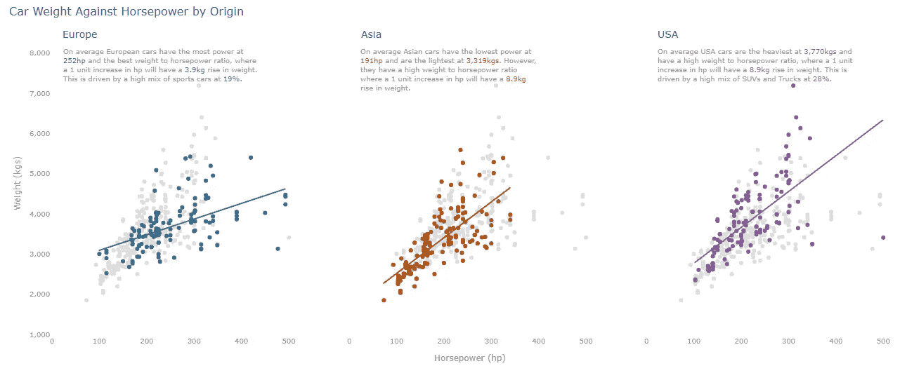

# 使用 Plotly Python 构建专业散点图教程

> 原文：<https://towardsdatascience.com/tutorial-on-building-professional-scatter-graphs-in-plotly-python-abe33923f557?source=collection_archive---------13----------------------->

## 创建高质量散射可视化的分步指南

本教程的最终图形迭代|作者图片

在过去的 7 年里，我一直从事可视化展示数据和信息的工作，在我的时间里，我遇到过一两个显示效果很差的图表。我仍然害怕回想起我在职业生涯开始时展示的视觉效果。我现在的目标是帮助别人创造美丽的视觉效果。

如果您已经对 Python 有所熟悉，本文旨在提高 Python 绘图的质量。如果你想让你的视觉效果更上一层楼，请继续阅读。

在我创造更好视觉效果的旅程上，科尔·努斯鲍默·克纳弗利克的两本书；[用数据讲故事:商业人士的数据可视化指南](https://www.amazon.co.uk/Storytelling-Data-Visualization-Business-Professionals/dp/1119002257/ref=sr_1_1?dchild=1&keywords=storytelling+with+data&qid=1623420552&sr=8-1)和“[用数据讲故事:让我们实践](https://www.amazon.co.uk/Storytelling-Data-Cole-Nussbaumer-Knaflic/dp/1119621496/ref=sr_1_5?dchild=1&keywords=storytelling+with+data&qid=1623421312&sr=8-5)”是一个非凡的信息来源。我强烈推荐任何专业人士定期制作图表。这两本书相辅相成。他们都清楚地阐明了是什么构成了一幅引人入胜的图表，并一步一步地描述了这一过程，对每一个变化都做了解释。

在这个 Plotly 教程中，我将使用书中实践的逐步迭代方法，并专门针对 Python Plotly 定制指南。我将使用关于汽车特性的数据集，可以从我的 [Git](https://github.com/tomgprice90/Medium_Article_Tutorial_Scatter_Plotly_Python/tree/main) 库或 [Kaggle](https://www.kaggle.com/ljanjughazyan/cars1) 下载。本教程的其余代码包含在我的 Git 中。

您将浏览同一图表的六个不同版本。首先从 Plotly 提供的最基本的图表开始，最后是完全定制的带注释的图表。每一步都提供了基本变化的解释。

Plotly 有两个版本:

Plotly Express 比 Graph Objects 更容易、更快速使用的高级图形包，但功能较少。

plotly Graph Objects(GO)——一个较低级的图形包，通常需要更多的编码，因为它更容易定制。

这个图形教程将只侧重于建立一个散点图在 Plotly 图形对象。这个软件包在改变图表的任何方面提供了完全的自由，而 Plotly Express 没有。

我们想从数据集中找出的问题是:

**马力和重量的关系如何因产地而异？**

# 在你开始编码之前

值得一提的是 Plotly 是如何组成它的图形对象的。一种简单的思考方式是描绘由四层构成的图表。

*   层 1-创建一个空白图形对象。
*   第 2 层-添加数据点。
*   第 3 层—定制您的视觉效果。
*   第 4 层—注释您的视觉效果。

# **步骤 1:创建标准散点图**

第一步，按照下面的代码实现上面的前两层。

对于第 1 层，用`go.Figure()`创建一个空白图形对象。

对于第 2 层，使用`add_trace(...)`添加一层数据点到你的空白画布上。您将在此命令中执行所有数据点定制，如颜色、大小、透明度等。对于更高级的图表，您几乎肯定需要将多个数据点图层添加到同一个图表中(稍后将详细介绍)。

汽车重量与马力代码—迭代 1 |作者图片

汽车重量与马力图—迭代 1 |作者图片

在上图中，你会注意到一些事情。Plotly 图形对象不会生成图形标题或轴标题。这些必须明确定义，这将在下一步中解释。

# 第二步:改变造型

可视化数据的一个最重要的概念是清楚地突出显示您显示的数据点，并减少来自不太重要的元素的干扰。例如，我通常使用白色背景绘制图，浅灰色用于轴标题和文本。

对于这个迭代，我们将对第 3 层进行样式上的修改。使用`update_layout(...)`来完全定制你的图形框架的外观和感觉。这将是您更新除数据点之外的所有内容的地方，如标题、轴、刻度格式、网格线等。

对于这个迭代，我们将进行以下更改:

*   添加图形标题和轴标题
*   以更好的格式放置 y 轴刻度
*   确保每个轴的测量清晰
*   将轴的线条颜色从白色更改为浅灰色
*   将背景颜色改为白色
*   将图表上所有文本的颜色改为浅灰色
*   将数据点的颜色更改为较暗的蓝色，使它们更加突出

汽车重量与马力代码—迭代 2 |作者图片

汽车重量与马力图—迭代 2 |作者图片

您还会注意到，我没有将值传递给 color 参数，而是选择在数据框上创建一个新列来保存变量。因此，我们将颜色参数转换为一个列表，并且只使用了第一个元素。这似乎是一种冗长的方法，但是当 color 列有下一步所需的许多类别时，这是一种简单得多的方法。

# 步骤 3:展示多个类别

在 Plotly Graph 对象中可视化类别数据不像将变量传递给显示类别的参数那样简单(Plotly Express)。相反，我们必须为我们想要分组的变量中的每个值创建单独的数据层(或轨迹),并将它们覆盖到同一个图形上。

要为汽车原点变量创建单独的分组，我们需要为以下每个值生成不同的数据点图层:美国、欧洲和亚洲。这可以通过使用 for 循环轻松实现，该循环使用`for area in df["Origin"].unique():`遍历每个原始列的惟一值。在每个循环中，都会创建一个新的数据帧，其中只包含一个带有`df_plot = df.loc[df["Origin"] == area].copy()`的类别的数据。

因为我们正在向图表中引入类别，所以我们必须将类别名称传递给 name 参数，以正确标记图例。

对于此次迭代，我们将进行以下更改:

*   根据原点变量将数据点分成不同的类别
*   为“来源”列中的每个值选择颜色

汽车重量与马力代码—迭代 3 |作者图片

汽车重量与马力图—迭代 3 |作者图片

这张图看起来很繁忙，尤其是在左下象限。我们将在下一次迭代中解决这个问题，将每个类别显示在它自己的子图上。

# 第四步:为每个类别创建一个支线剧情

目前，区分每个类别的趋势并不容易。我们将创建一个子情节，这意味着我们必须将 x 轴和 y 轴变量传递给`update_xaxes(...)`和`update_yaxes(...)`，而不是`update_layout(...)`。这是因为现在有三个 x 轴和三个 y 轴，而我们之前的代码只更新了一个 x & y 对。或者，我们可以用`xaxis2 = dict(...)`、`yaxis2 = dict(...)`等更新每个单独的轴。

对于这个迭代，我们将进行以下更改:

*   在原点中为每个类别创建一个支线剧情

汽车重量与马力代码—迭代 4 |作者图片

汽车重量与马力图—迭代 4 |作者图片

图表现在太忙了，坐标轴标题和轴线把注意力从数据上转移开了。为了创造一个专业的视觉效果，我们需要大大减少混乱。

# **第五步:减少杂乱**

> "简单是最高级的复杂。"
> 
> -莱昂纳多·达芬奇

减少杂乱会降低读者的认知负荷，使信息更容易消化。

如果你要定制你的标题和轴标题，那么最好通过`add_annotation(...)`来添加。我发现自己通常使用这种方法来创建 x 轴和 y 轴标题，因为它可以完全控制文本的位置、对齐方式、颜色和大小。

我们将只在`make_subplots(...)`命令中设置`shared_yaxes = True`，因为只有沿着同一轴的支线剧情可以共享，而不是所有支线剧情。为了克服这个问题，我们在`update_xaxes(...)`命令中固定 x 轴范围。

我们将删除图例，因为添加了支线剧情标题，这些信息是多余的。我尽量避免使用图例，而是在图上标出类别。如果做得正确，这就减少了读者对你视觉上的类别进行解码的需要。

对于此次迭代，我们将进行以下更改:

*   移除图例
*   移除重复的轴标题
*   移除轴线
*   确保所有子图显示两个坐标轴的一致范围

汽车重量与马力代码—迭代 5 |作者图片

汽车重量与马力图—迭代 5 |作者图片

剧情现在清晰了很多，看起来也更专业了。我们很容易看到 origin 中每个类别的趋势；然而，确定与整个样本相关的趋势是具有挑战性的。我们将在下一次迭代中解决这个问题，并在图表上提供一些注释，以便读者更好地理解信息。

# 第六步:添加评论

为了让你的视觉效果更上一层楼，你还应该用`add_annotation(...)`为你的图表提供评论和见解。

大部分附加代码是为了在每个子情节上面生成评论。通过在图表上添加注释，我们可以清楚地显示出每条真知灼见指的是哪个子图，并通过将关键文本与具有相同颜色的数据点联系起来来显示。这使得数据更容易阅读，因为他们不必经常在注释和图表之间寻找。

所有数据点都已添加到每个子图中，并通过颜色和透明度推到背景中，只有一个来源类别的数据点高亮显示。当您想要显示单个类别的趋势以及它们与整个数据集的关系时，这是在散点图中使用的一种强大的技术。

我们还引入了一条最佳拟合线，为图表提供了一些关于汽车重量和马力之间关系的额外背景。

对于此次迭代，我们将进行以下更改:

*   将所有数据点添加到每个子图中
*   为每个图添加注释，以便更深入地了解数据
*   修复悬停信息标签(对于交互式版本)
*   让标题看起来更好
*   减小坐标轴刻度的字体大小
*   添加最佳拟合线

汽车重量与马力代码—迭代 6 |作者图片

汽车重量与马力图—迭代 6 |作者图片

在这个图的最后一次迭代中增加了很多东西，但是最终版本感觉很干净，同时显示了很多信息。

# 结论

从最后一次迭代的代码长度可以看出，Plotly Graph Objects 是一个冗长的包。创造令人惊叹的视觉效果比使用现成的图形要花更多的时间。

如果你想要一个快速团队会议的图表，那么这不是要走的路线。然而，如果你要向利益相关者、高级经理或一大群人展示，并希望以尽可能清晰的方式传达你的信息，我强烈推荐这个包。制作漂亮的视觉效果是最好的方法之一。

希望这篇关于用 Python 中的 Plotly 构建专业图形的教程对你有所帮助。