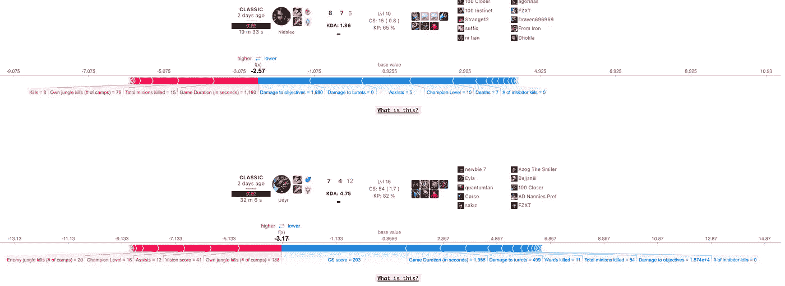
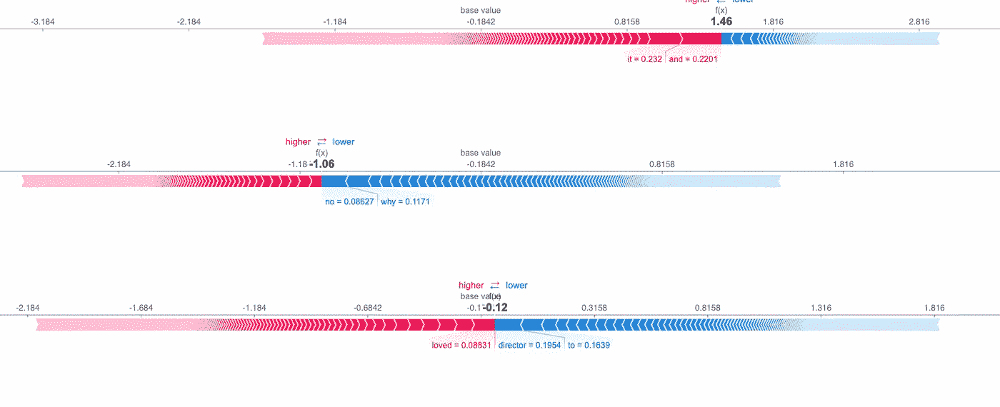

# 在 Python HTML 中显示 SHAP 力图的教程

> 原文：<https://towardsdatascience.com/tutorial-on-displaying-shap-force-plots-in-python-html-4883aeb0ee7c?source=collection_archive---------7----------------------->

## 使用 Flask 在网络上绘制 SHAP 力图

[这里是本教程的](https://github.com/yi-ye-zhi-qiu/shaphtml)源代码，这样你就可以跟着做了，你可以运行`app.py`来查看结果。

## 这样做的动机

SHAP 图对于模型的可解释性非常有用(见[这里](https://www.youtube.com/watch?v=ngOBhhINWb8)有一个关于它们的精彩演讲)。

作为最近使用 SHAP 显示英雄联盟数据的逻辑回归项目的一部分(你可以在这里看到项目 web 应用[和下面的截图)，我努力寻找一种在页面加载中显示 SHAP 图的方法，而不必先保存图像。我非常习惯于在笔记本或类似的东西上使用 SHAP 的绘图，但我真的想在网络应用程序上显示它。](http://liamisaacs.com/league)

由于这对我来说是一个很大的痛点，我想巩固我所学到的东西，并在这里写下来。我将介绍我在尝试`base64`、`plt.savefig()`时遇到的一些问题，以及这些方法的问题，最后我将介绍使用 HTML iFrames 的解决方案。

为了直观显示这一结果，最终结果示例是在 Flask web 应用程序中显示 SHAP 力图:



将力图动态合并到用户界面中(您可以在[源](http://liamisaacs.com/league)上搜索“100 Closer”查看相同内容)

## 方法 1: Base64 编码

Base64 是一种二进制到文本的编码方法。使用这个，我们可以定义我们的`force_plot`并使用`plt.savefig()`将它存储在变量`buf`中，稍后我们可以将它解码为 ASCII。在我看来，理解其功能并不重要，但是*结果*是你的电脑会保存每一张单独的图片，然后以 HTML 格式显示出来。这意味着您的`img`标签的`src`变量将必须在本地定位每个保存的图像。

## 使用 XGBoost 的 Base64 编码示例

```
"""
Example implementation of XGBoost algorithm and base64 approach to save the SHAP force plot and later display in HTML.If you're doing this in Flask, the ML is in app.py and you pass the SHAP force plot as a *variable* which you can index in your HTML page."""#Train test split#Let's assume you have some X_, y_...Xt, Xv, yt, yv = train_test_split(X_,y_, test_size=0.2, random_state=10)dt = xgb.DMatrix(Xt, label=yt.values, enable_categorical=True)
dv = xgb.DMatrix(Xv, label=yv.values)#Tuned hyperparameters via hyperopt Bayesian optimization
params = {
   "eta": 0.5,
   "max_depth": 8,
   "min_child_weight": 1,
   "objective": "binary:logistic",
   "verbosity": 0,
   "base_score": np.mean(yt),
   "eval_metric": "logloss",
   "colsample_bytree": 0.7434869381604485,
   'gamma': 1.1053886968419446,
   'reg_alpha': 49.0,
   'reg_lambda': 0.9997899615065826
}#Run model
model = xgb.train(params, dt, 35, [(dt, "train"), (dv, "valid")], early_stopping_rounds=5, verbose_eval=35)#SHAP explainer values (NumPy array)
explainer = shap.TreeExplainer(model)
shap_values = explainer.shap_values(Xv)#The SHAP *force* plot itself (using this method, I think you can 
#also do Beeswarm plots but I have not tried it)shap_plot = shap.force_plot(explainer.expected_value, 
    shap_values[-1:], features=Xv.iloc[-1:], 
    feature_names=Xv.columns[0:20],
    matplotlib=True, show=False, plot_cmap=['#77dd77', '#f99191'])#Encode into base64,
#Answer inspiration: [https://stackoverflow.com/questions/60621103/is-there-a-way-to-render-shap-or-lime-output-from-flask-to-react/60669449#60669449](https://stackoverflow.com/questions/60621103/is-there-a-way-to-render-shap-or-lime-output-from-flask-to-react/60669449#60669449)buf = BytesIO()
plt.savefig(buf,
            format = "png",
            dpi = 150,
            bbox_inches = 'tight')
dataToTake = base64.b64encode(buf.getbuffer()).decode("ascii")
return dataToTake#Example HTML integration

```

## 这种方法的问题

虽然这对于单个图的生成很方便，但在生产环境中是不可行的，因为这意味着您将保存每个图。

## 方法 2: plt.savefig()

使用`plt.savefig()`我们缩短了工作时间(Base64 并不是完全必要的)，但结果是一样的，必须保存每个力图，并在我们的``标签中将其索引为一个文件。

```
#Just using the same XGBoost model from above def shap_plot(ind): 
    explainer = shap.TreeExplainer(model)
    shap_values = explainer.shap_values(Xv)
    p = shap.force_plot(explainer.expected_value, shap_values[ind], Xv.iloc[[ind]])
    plt.savefig('temp.svg')
    plt.close()
    return pshap_plot(3)
```

是的，更容易理解，但是在生产环境中同样不可用:您仍然保存每个图像。

## 方法 3:使用。html()选项(我最终使用的)

通过这种方法，我们利用了 **HTML iFrames** ，它可以将我们的 SHAP `force_plot`嵌入到我们的主 HTML 中。

```
#works in Dash
#taken from here: [https://stackoverflow.com/questions/54292226/putting-html-output-from-shap-into-the-dash-output-layout-callback](https://stackoverflow.com/questions/54292226/putting-html-output-from-shap-into-the-dash-output-layout-callback)def _force_plot_html(*args):
    force_plot = shap.force_plot(*args, matplotlib=False)
    shap_html = f"<head>{shap.getjs()}</head><body>{force_plot.html()}</body>"
    return html.Iframe(srcDoc=shap_html,
                       style={"width": "100%", "height": "200px", 
                       "border": 0})
```

这并不完全翻译成我所使用的，虽然，这是烧瓶。我把上面的想法用在一个烧瓶的环境中:

## 集成到 Flask web 应用程序的示例:

让我们假设您有这样一个逻辑回归模型:

```
Xt, Xv, yt, yv = train_test_split(X_, y_, test_size=0.2, random_state=10)model = LogisticRegression(penalty='l2', solver='liblinear', max_iter=900, C=0.1).fit(Xt, yt)explainer = shap.Explainer(model, Xt, feature_names=Xt.columns)
shap_values = explainer(Xv)
```

基本思想是在`app.py`中创建一个`_force_plot_html`函数，该函数使用`explainer`、`shap_values`和`ind`输入返回一个`shap_html` srcdoc。我们将使用`render_template`将那个`shap_html`变量传递给我们的 HTML，并且在 HTML 文件本身中，我们将在一个嵌入式 iFrame 中显示`shap_html`。

这是一个我们循环遍历`ind`的例子，创建各种 SHAP 图，并在我们的 HTML 中显示为 iFrames。

```
#in app.pyfrom flask import *import shap
from shap.plots._force_matplotlib import draw_additive_plotfrom model import give_shap_plotapp = Flask(__name__)[@app](http://twitter.com/app).route('/')def displayshap(): explainer, shap_values = give_shap_plot() def _force_plot_html(explainer, shap_values, ind):
        force_plot = shap.plots.force(shap_values[ind], 
                     matplotlib=False)
        shap_html = f"<head>{shap.getjs()}</head><body>{force_plot.html()}</body>"
        return shap_html shap_plots = {} for i in range(10): #how many plots you want
        ind = i
        shap_plots[i] = _force_plot_html(explainer, shap_values, ind)

    return render_template('displayshap.html', shap_plots = shap_plots)if __name__ == '__main__':
    app.run()#EXIT app.py
###<!-- HTML -->
<!-- in displayshap.html -->
    <iframe srcdoc="{{shap_plots[i]}}" style={"width": "2000px"; "height": "200px"; border: none;} ></iframe>

```

`shap.getjs()`非常重要，因为如果没有它，你的 HTML 就会出现“可视化被忽略，Javascript 库没有被加载！问题。



这篇博文的教程存储库的示例结果。运行逻辑回归的代码是从 SHAP 的文档“用逻辑回归进行情感分析”中借用的。你也可以得到同样的悬停效果，所有的 javascript 都被保留下来。

## 缺点

这种解决方案的一些缺点是*只对力图*有效。

*   我无法得到这样的蜂群/条形图:

```
#TYPES OF PLOTS THAT WORK: 
force_plot = shap.plots.force(shap_values[ind], matplotlib=False)#TYPES OF PLOTS THAT DO NOT WORK:
force_plot = shap.plots.beeswarm(shap_values)
force_plot = shap.plots.bar(shap_values[ind])#I think no .html() method is written for these? I'm not quite sure
```

# 谢谢你

感谢您的阅读！我希望这对任何想将 SHAP 集成到 web 应用程序中的人有所帮助。你可以在这里找到这个教程[的源代码](https://github.com/yi-ye-zhi-qiu/shaphtml)。

你可以在[我的网站](http://liamisaacs.com/)、 [LinkedIn](https://www.linkedin.com/in/liam-isaacs-7018b9197/) 或 [github](https://github.com/yi-ye-zhi-qiu) 上找到我。你可以在这里阅读更多我的文章。