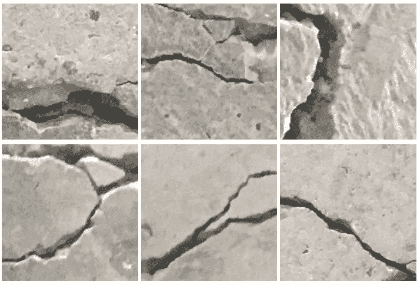
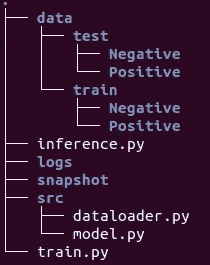
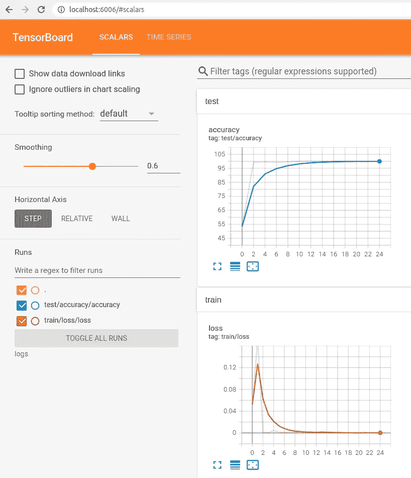

# 表面裂纹分类及直观解释教程(一)

> 原文：<https://towardsdatascience.com/tutorial-on-surface-crack-classification-with-visual-explanation-part-1-14542d2ea7ac?source=collection_archive---------19----------------------->

## 用 Pytorch 开发可解释的人工智能对表面裂纹图像进行分类的分步指南。这是 2 部分系列的第 1 部分。

# **简介**

我们处在人工智能时代。许多技术的发展使工程师的生活变得更加轻松。然而，土木工程领域似乎仍在努力跟上这一发展的步伐。

基础设施迅速恶化，接近其设计寿命。因为基础设施经常在恶劣的环境中运行。例如，在道路和桥梁上有持续的负载和振动。此外，还有多种灾害，如地震、洪水、飓风、龙卷风或海啸一年到头都会发生。如果只考虑美国的桥梁，全国桥梁库存中有 60 多万座公路桥。39%超过了 50 年的设计寿命。国家桥梁检查标准要求桥梁每两年检查一次，以确保没有裂缝、生锈或其他损坏。这意味着，每天都有数百座桥梁需要检查。当前的基础设施检查系统存在许多问题。例如，数据收集非常耗时，可能需要使用许多重型设备进行危险的野外活动。有时，对于高架桥梁结构来说，可达性是一个问题。此外，人类视觉检查可能存在偏见。因此，视觉检查的结果在不同的检查员之间会有很大的不同。

一种可能的解决方案是使用机器人平台来收集检查视频数据。使用空中平台收集检查视频数据减少或消除了劳动密集型的现场检查过程，并允许检查员从更安全的位置评估桥梁。

照片由[雅各布·欧文斯](https://unsplash.com/@jakobowens1?utm_source=medium&utm_medium=referral)在 [Unsplash](https://unsplash.com?utm_source=medium&utm_medium=referral) 上拍摄

然而，机器人检测平台的使用仅仅解决了上述问题的一部分，高效、可靠的检测视频分析是另一项重要任务。让检查员观看收集的视频几个小时甚至几天来寻找漏洞是低效的。希望能够开发一种工具来帮助检查员从视频或图像中提取不同类型的裂纹。

为了自动化这个检查过程，本文将使用人工智能对图像进行分类，以找到图像中的裂缝。更具体地说，我们将使用 Pytorch 建立和训练一个深度神经网络来寻找图像中的裂缝，以取代人类对结构中的裂缝进行分类的繁琐任务。

好了，今天的动力足够了。现在，让我们直奔主题。我们要做以下三件事:

1.  使用 PyTorch 从头开始创建深度神经网络
2.  实现一个可解释的人工智能工具来解释深度神经网络做出的决定

为了不把博客写得太长，我把上面的两个内容分成了两个系列。这是这个系列的第一部分。另一部分的链接在这个博客的末尾。

# **1。深度神经网络与 Pytorch**

现在，让我们使用 PyTorch 创建一个深度神经网络。我将向您展示创建用于图像分类的深度神经网络的所有步骤。作为一个应用程序，我将对图像中的表面裂纹进行分类。阅读完博客后，你将能够使用与本文相同的步骤，为你选择的任何不同应用领域进行图像分类。所以请原谅我。

要创建分类器，我们将遵循 4 个步骤:

1.  数据准备
2.  构建模型
3.  培养
4.  测试和推理

# 数据准备

首先，我们要为我们的分类准备一个数据集。正如我已经提到的，我们将从图像中对表面裂缝进行分类，我们将使用裂缝数据集。我们将使用 Mendeley [1] (License: CC BY 4.0)数据集的子集。你可以从这个[链接](https://drive.google.com/drive/folders/1HMhZR9erch7OHL3X-HCrdU3-JCxxPDcx?usp=sharing)下载数据集。如果你愿意，你可以从他们的网站上下载，直接使用门德利数据集。

阳性门德利[1]数据。图片作者。

无论如何，我们将使用这个数据集的小子集，因为我们的主要目标是建立一个神经网络。该数据集总共有 1200 张(600 张正片+ 600 张底片)大小为 227 x 227 的图像。然后将其分成 80%训练数据和 20%测试数据。请下载数据集，并将其放在您的工作目录中。最初的文件夹结构将是这样的，蓝色的是文件夹，白色的是文件(我们稍后会添加更多的文件和文件夹)。

文件夹结构。图片作者。

为了加载数据，我们将创建一个名为“dataloader.py”的 python 文件，如您在“src”文件夹中所见。

首先，我们需要导入一些必需的包:

**torch.utils.data** 导入创建和使用数据集和数据加载器所需的函数。

PIL 是一个流行的计算机视觉库，用于在我们的 python 程序中加载图像。

现在让我们创建一个自定义数据集类，我们将该类命名为 CrackDataset。

**类 crack Dataset(Dataset):***创建一个名为‘crack Dataset’的类。我们可以在任何地方调用这个类。它将被传递给我们之前导入的“数据集”模块。*

***def __init__(self，data_path，phase，transform):** 初始化类后我们需要传递三个变量。data_path 是我们数据集的目录。我们将通过阶段=训练或测试。转换来执行输入数据转换。当我们将这些信息传递给我们的类 CrackDataset 时，我们将对此进行更多的讨论。我们创建一个名为 self.data 的列表，其中包含图像路径对及其各自的标签。我们还希望将所有负类映射为 0，正类映射为 1。*

***def __len__(self):** 该函数返回标签的长度。*

****def __getitem__(self，idx):***py torch 的数据集模块使用该函数获取样本并构造数据集。初始化时，它将循环通过该函数，从数据集中的每个实例创建一个样本。它定义了(x，y)或(图像，标签)对。pytorch 内部使用 Index (idx)来跟踪所有数据并创建批处理。它还跟踪所有的批次。简单地说，它负责我们定制数据集的所有簿记工作。这里，self.data 是包含图像路径及其类名的列表。对于每个索引，我们将有一对 img_path 和 class_name。然后使用 PIL 图书馆，我们加载图像，并将其转换为 RGB 格式。之后，我们使用 self.transform 将图像转换为张量和其他一些东西(稍后你会看到我们将使用什么转换)。PyTorch 损失函数的一个要求是，在馈送到 CNN 网络之前，输入必须是张量形式，所以我们将其转换为浮点和张量。*

*现在，我们已经创建了自定义的数据加载器。编译文件“dataloader.py”中的所有代码，并将该文件放在文件夹“src”中。*

# *构建模型*

*现在，让我们在 model.py 文件中创建我们的模型，并将其放在“src”文件夹中。*

*我们将使用迁移学习。你可能知道迁移学习。这是一种技术，我们使用预先训练的模型，这些模型已经在大型数据集上进行了训练。我们将使用训练过的重量来开始我们的训练。我们唯一要做的事情是，我们需要修改模型的最后几层，并且只更新这些层的权重。*

*Torchvision 有许多内置的 CNN 模型，如 VGG16、ResNet、Inception 等等。我们只需要导入它们。这里我们要用 ResNet 架构。*

*我们将创建一个名为 CrackClassifier 的类。它将使用 nn。PyTorch 的模块。self.resnet 将从 torchvision 下载预训练的 resnet50 模型。从代码中可以看出，我们修改了 self.resnet.fc，依次添加了两个线性图层一个 ReLU 和一个 LogSoftmax。您可以看到，在最后一个线性图层中，我们将输入要素映射到 num_classes。这意味着我们的输出节点将等于我们的类的数量。如果您想使用自己的 CNN 架构，只需用它替换 self.resnet 即可。*

*def forward 函数定义了我们的模型在接受输入后将如何运行。这里，在我们的例子中，它将接受输入特征(x ),并将通过我们已经定义的 self.resnet。*

# *训练网络*

*我们将创建一个名为 train.py 的文件，并将其保存在主目录中，如图文件夹结构所示。首先，让我们导入所需的库:*

*如果你看看代码，从第 1–4 行我们从 torch 导入了一些我们以前见过的库。在第 6 行和第 7 行，注意我们使用了“来自 src.model”和“src.dataloader”。请记住，在“src”文件夹中，我们已经创建了两个 python 文件 model 和 dataloader。我们将分别从这两个文件中导入 class CrackClassifier 和 class CrackDataset。在第 8 行中，我们导入了 tqdm，它将用于显示训练进度。操作系统模块将用于定义目录。我们将使用 tensorboardX 的 SummaryWriter 来可视化我们的培训和测试性能。第 12 行确保如果我们有 GPU，那么它将使用 GPU，否则将使用 CPU 进行计算。*

*torchvision.transform 库帮助我们对输入图像进行大量处理。例如，这里的 Resize 选项确保我们所有的图像都是 64 x 64 的。然后，我们使用 to tensor 选项将图像转换为张量。最后，我们归一化图像。这里，在归一化选项中，第一个元组是平均值，第二个元组是所有批次的三个 RGB 通道的标准偏差。您还可以在这里使用不同的数据扩充技术。*

*接下来，我们需要为我们的训练定义超参数。例如，时期数、学习率、批量大小。之后，我们需要设置数据集和数据加载器。对于训练和测试，我们使用 CrackDataset 类分别设置两个数据集。设置完这两个数据集后，我们使用 pytorch 的数据加载器来创建我们的训练和测试数据加载器，分别命名为 train_dataloader 和 test_dataloader。*

*现在，在我们进入训练循环之前，首先创建一个函数来检查我们模型的准确性。我们将调用训练循环中的函数来检查测试数据集的准确性。*

*使用我们的模型，我们将得到输出，该输出将与该图像的地面真实标签进行比较，以计算准确性。这非常简单，看代码就能很容易理解，所以我跳过了详细的解释。*

*现在我们将创建两个更简单的函数来使用 tensorboard 的 summary writer。这样我们可以用图表的形式直观地显示每个时期的损失和精度。*

*现在，让我们创建一个训练循环:*

*从第 2–8 行，创建我们的目录来保存训练好的模型和我们的日志。第 9 行在我们的日志目录中创建了一个摘要编写器。*

*第 11 行，使用我们创建的名为 CrackClassifier 的类来创建我们的模型。标准是损失函数。我们将使用 pytorch 模块 nn 中的 CrossEntropyLoss 函数。然后，我们定义优化器，使用梯度下降优化网络。我们使用 torch.optim 中流行的 Adam 优化器。*

*回想一下，我们的模型中有两个完全连接的层。我们只想更新这两层的权重。我们可以冻结其余层的权重。第 16–22 行将为我们做这些。我们的 fc.0 和 fc.2 是两个完全连接的层。我们希望更新这两层的权重和偏差项。因此，对于这两个层，我们设置 param.requires_grad= True。对于其余的层，它是假的。那就是我们冻结了其余的层。*

*第 24 行开始训练。然后我们循环遍历历元数。对于每个时期，我们在训练装载器中迭代所有批次的图像和标签。在每两个时期之后，我们使用 test_loader 检查测试数据集的准确性，并使用我们之前创建的 write_test_scalars()函数将准确性写入记录器。我们使用模型的输出，并使用预定义的损失函数计算损失。在我们进行反向传播以计算梯度之前，我们必须执行 optimizer.zero_grad()操作——这将清空前一批的梯度张量，以便重新计算新一批的梯度。现在，为了执行反向传播，我们使用 loss.backward()。注意，我们使用了 tqdm。这用于通过进度条显示训练进度。然后使用 write_scalars()函数，我们写下每个时期的损失。当测试数据集上的精确度最高时，我们保存模型。最后，我们使用 logger.close()关闭摘要编写器。*

*现在，我们已经准备好了所有的代码。我们需要运行代码。要运行训练代码，在您的终端上键入:“python train.py”。它将训练网络，将训练好的模型保存在“快照”中，并将日志保存在“日志”文件夹中。*

*要可视化您的 tensorboard，请在您的终端上键入以下内容:*

*之后，进入你的浏览器，在地址栏输入:“localhost:6006”。然后，您可以在 tensorboard 中看到您的训练表现，如下所示:*

**

*作者图片*

*看，我们模型的性能逐渐提高。*

# *结论*

*在这一部分中，您已经了解了如何创建自定义数据加载器，如何使用迁移学习构建 CNN 模型，如何训练网络，以及如何使用 tensorboard 记录训练表现。在下一部分中，我们将看到如何使用我们训练好的模型来预测不同图像上的裂缝类别。这意味着我们将使用训练好的模型进行推理。最后，我们将使用 grad-cam 工具来解释我们网络的决策。请点击查看本博客的下一部分。*

*你可以在 [Github](https://github.com/monjurulkarim/crack_classification) 中找到完整的代码。下载[数据集](https://drive.google.com/drive/folders/1HMhZR9erch7OHL3X-HCrdU3-JCxxPDcx?usp=sharing)。*

*参考资料:*

1.  *奥兹杰内尔，恰拉尔·弗拉特(2019)，[“用于分类的混凝土裂缝图像”](https://data.mendeley.com/datasets/5y9wdsg2zt/2)，门德利数据，V2，doi: 10.17632/5y9wdsg2zt.2。(许可:CC BY 4.0)*