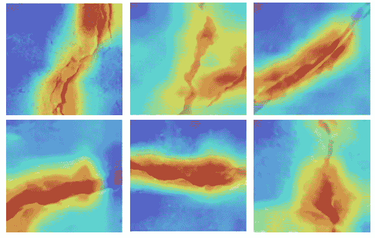
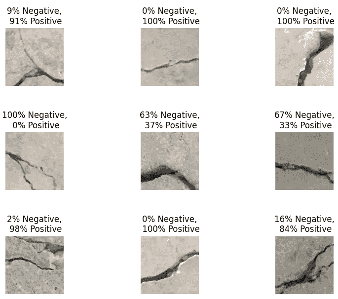
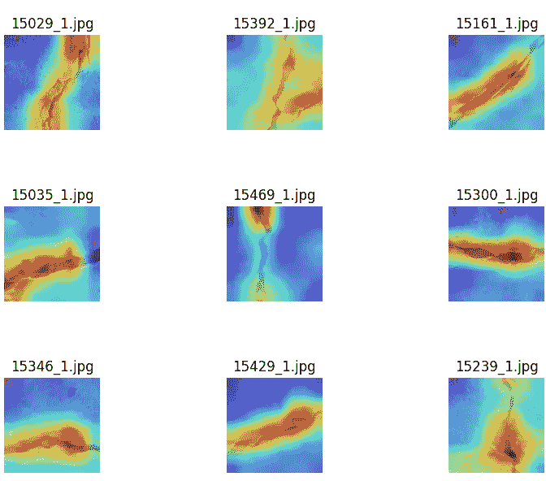

# 表面裂纹分类及直观解释教程(二)

> 原文：<https://towardsdatascience.com/tutorial-on-surface-crack-classification-with-visual-explanation-part-2-f8638960d0d7?source=collection_archive---------15----------------------->

用 Pytorch 开发可解释的人工智能对表面裂纹图像进行分类的分步指南。这是两部分系列的第二部分。

在上一部分( [Part 1](/tutorial-on-surface-crack-classification-with-visual-explanation-part-1-14542d2ea7ac) )中，您已经看到了如何使用迁移学习建立 CNN 模型以及如何训练网络。你看到了我们的网络可以很好地对裂纹图像进行分类。但是你可能会有疑问——我们的网络是如何做出决策的？我们的网络是否看到了图像的正确位置来做出决定？我们对此没有把握。我们的网络对我们来说是一个黑匣子。我们不知道我们的卷积神经网络在做出决策时看到和理解了什么。

在这篇博客中，我们将制作直观的解释热图，帮助我们理解我们的深度卷积神经网络算法是如何决定图像中是否有裂缝的。

在前面的部分([第一部分](/tutorial-on-surface-crack-classification-with-visual-explanation-part-1-14542d2ea7ac)，你没有看到如何可视化的预测结果。因此，在这一部分，我将做以下工作:

1.  使用我们训练好的网络(推理)预测不同图像上的裂缝类别
2.  使用 Grad-CAM [1]生成直观的解释热图，可以解释我们网络的决策

图片作者。

# **1。推理**

我们已经在第一部分中训练了我们的网络。现在我们只需要看看用我们训练好的网络预测一幅图像是什么样子。为了预测一个图像破解类，我们需要创建一个名为 *inference.py* 的 python 文件，并将其保存在工作目录中。

如果你看上面的代码，你可能会发现这部分和训练文件非常相似。在这里，我们导入了我们为培训导入的相同库。导入库之后，我们将创建帮助我们进行推理的助手函数。

我们将从验证数据目录中随机选择一些样本进行预测。在第 7 行，我们创建了一个名为 *random_image()* 的函数。在第 17 行，我们还创建了另一个名为 *save_image()* 的函数，将输出结果保存在磁盘中。

所以，我们已经准备好了我们的助手函数。现在我们需要一个函数，它获取输入图像，然后通过我们训练好的网络给出预测结果。为此，我们将创建一个名为*推论()*的函数。

在上面的代码中，第 2 行是我们的测试数据集的目录。在我们的测试目录中，有两个子文件夹:*正*和*负。我们可以从*阳性*或*阴性*文件夹中提取测试样本。在第 3 行，我们定义了从哪里选择我们的测试样本图像。请注意，在第 3 行中，有一个参数 *p.type* 传递了这个关于*正*或*负*文件夹的信息。此时请看第 25 行，我们调用了一个 *ArgumentParser()* 。当给出 bash 命令时，这个函数将传递一个参数。在第 26 行，我们添加了一个参数*类型*。这意味着我们要将信息*类型*传递给 bash。默认情况下，信息是*正*。然后我们在第 28 行将这个解析器参数命名为 *p* 。这意味着 *p* 保存着*类型*的信息。在*型*内，有信息*正*。当您在命令行提示符/bash 中运行一个命令时，您会更清楚。好了，现在让我们回到函数*推论()。*剩下的很简单，第 7–9 行，我们编译了我们的模型并加载了训练好的重量。然后，在第 11 行，我们用之前创建的辅助函数 *random_image()* 创建了一个随机图像列表。在第 14 行，我们转换了我们的测试图像，并堆叠在一起以通过我们的模型。对于第 16 行，我们将图像传递给我们的模型，并获得我们的预测 logit。下一行为测试图像创建一个 *softmax* 概率。现在我们已经有了预测概率。然后我们将保存第 20 行的结果。*

我们完成了可视化预测结果的编码。要运行代码，请在终端中输入以下命令。它将从*阳性*文件夹中提取 9 个样本，产生结果，并将其保存在您的磁盘中。

注意，我们输入*类型*为*阳性。*因此，它从文件夹中取出样品的正面。如果我们将*类型*输入为*阴性*，它将从文件夹*阴性*中提取样本。

当您运行该命令时，您将得到类似下图的内容。这是一个由 9 幅图像组成的网格，这些图像已经通过了我们的网络。预测概率在每个图像的顶部。结果还可以，但是你可以通过采用迁移学习轻松提高成绩。

可视化预测结果。作者图片

# **2。视觉解释**

现在，我们将生成直观的解释热图。为了生成热图，我们将使用 Grad-CAM[1]算法。热图确定了影响网络决策的图像区域。如果我们看看热图，我们可以很容易地理解哪些图像像素有助于网络的决策。

要使用 grad-cam，请在您的终端中键入以下内容，以便在您的本地计算机中安装 grad-cam:

现在，从这个 github [库](https://github.com/monjurulkarim/crack_classification)中，下载文件夹 *pytorch_grad_cam* 并把它放到你的工作目录中。你可以看到，文件夹里有 grad-cam 不同版本的源代码。一旦你把这个文件夹保存在你的目录中，你就可以使用 grad-cam 和它的一些变种算法了。

现在你可以使用 grad-cam 生成热图了。此时，你需要在主工作目录下创建一个 python 文件 *xai.py* 。

在 *xai.py* 中，首先让我们导入所需的库和我们的模型:

然后，我们需要导入 grad-cam 库:

在上面的代码中，请注意我们从文件夹 *pytorch_grad_cam* 中导入了 Grad-CAM 及其不同的变体。我们还导入了一些用于图像可视化的包。

上面的部分非常简单。在第 6 行，我们将所有导入的方法名保存在一个字典中。稍后我们可以从这里调用任何方法来生成热图。第 19 行是我们随机图像选择的辅助函数。

然后，我们需要创建主包装函数 *xai()* 来生成热图。

在第 2–4 行，我们编译了模型并加载了训练好的重量。我们需要选择一个目标层，从那里梯度将被用来产生热图。通过第 6 行，我们设置了卷积神经网络的目标层，这是我们架构中 ResNet 的最后一层。

我们还需要一个目标类别来生成热图。我们只有两节课。对于负类，我们的*目标类别*是 0，对于正类，它是 1。我们在第 13–16 行定义了这些。

然后我们需要选择一个我们想要使用的 grad-cam 方法。我们在第 18 行这样做，然后在第 19 行结束。然后在第 22 行，我们使用我们选择的方法循环遍历我们的图像来创建热图。

要运行代码，您需要在终端中键入以下内容:

这里，注意我们给出了两个参数，一个是*类型*，另一个是*方法*。使用*类型*我们从测试数据集中选择阳性样本，使用*方法*我们为热图生成设定一种方法。这里，我们将 gradcam 设置为我们的方法。您可以选择任何其他方法，例如 Xgrad-cam、Eigen-cam 等。也是。

如果您运行该命令，您将得到类似下图的内容。这是一个包含 9 幅热图图像的网格。这里，热区表示它们负责网络的正类决策。

正类热图。作者图片

如果你看这些图像，你可以看到热区与图像中的裂缝重叠。这意味着我们的网络正在正确地寻找正确的位置，即裂缝的位置，以做出决定。

# 结论

在这一部分中，您已经看到了如何使用训练好的模型来预测不同图像上的裂缝类别。您还了解了如何使用 grad-cam 工具生成热图来解释网络决策。看着热图，你很容易理解你的深度学习算法是如何做出决策的。您可以很容易地扩展这个示例，并在任何图像分类问题中使用它来解释您的网络的决策。

你可以在 [Github](https://github.com/monjurulkarim/crack_classification) 中找到完整的代码。如果你还没有看前面的部分，在这里找到它[。](/tutorial-on-surface-crack-classification-with-visual-explanation-part-1-14542d2ea7ac)

参考资料:

[1] Ramprasaath R. Selvaraju 等人，2019，“Grad-CAM:通过基于梯度的定位从深度网络进行视觉解释”，【https://arxiv.org/pdf/1610.02391.pdf 