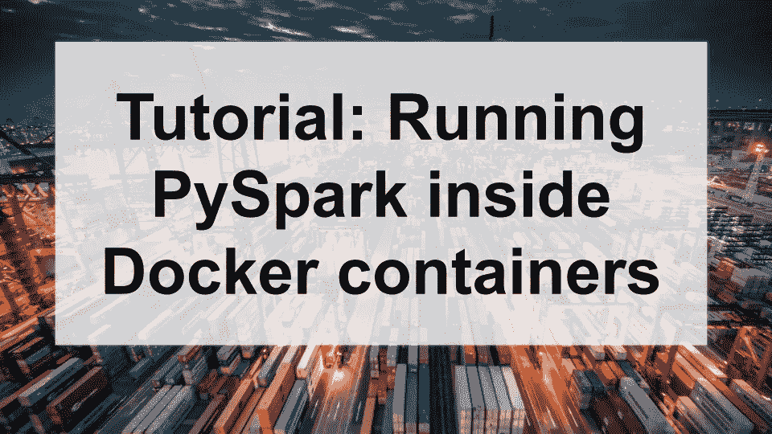

# 教程:在 Docker 容器中运行 PySpark

> 原文：<https://towardsdatascience.com/tutorial-running-pyspark-inside-docker-containers-84970d12b20e?source=collection_archive---------15----------------------->



由 [Unsplash](https://unsplash.com/photos/sWOvgOOFk1g) 拍摄的图像

在本文中，我们将向您展示如何开始在 Docker 容器中运行 PySpark 应用程序，通过一步一步的教程和代码示例([参见 github repo](https://github.com/datamechanics/examples) )。

在 Docker 容器中运行 Spark 应用程序有多种动机(我们在之前的文章 [*Spark & Docker 中讨论过——您的开发工作流程刚刚快了 10 倍*](https://www.datamechanics.co/blog-post/spark-and-docker-your-spark-development-cycle-just-got-ten-times-faster) ):

*   Docker 容器简化了依赖项的打包和管理，如外部 java 库(jar)或 python 库，它们可以帮助处理数据或连接到外部数据存储。添加或升级库可能会中断您的管道(例如，由于冲突)。使用 Docker 意味着您可以在开发时在本地捕获这个错误，修复它，然后发布您的映像，并且确信无论代码在哪里运行，jar 和环境都是相同的。
*   Docker 容器也是在集群(例如一个 [Kubernetes 集群](https://www.datamechanics.co/blog-post/pros-and-cons-of-running-apache-spark-on-kubernetes))上大规模运行 Spark 代码之前，在本地开发和测试 Spark 代码的好方法。

> 注意:我们维护着一系列 Docker 映像，这些映像内置了一系列有用的库，如数据湖、数据仓库、流数据源等的数据连接器。你可以在这里阅读关于这些图片[的更多信息，并在](https://www.datamechanics.co/blog-post/optimized-spark-docker-images-now-available.) [Dockerhub](https://hub.docker.com/r/datamechanics/spark) 上免费下载。

在本教程中，我们将带您完成从我们的一个基础映像构建一个新的 Docker 映像的过程，添加新的依赖项，并通过使用考拉库和将一些数据写入 postgres 数据库来测试您已经安装的功能。

# ‍Requirements

为了这个演示的目的，我们将创建一个简单的 PySpark 应用程序，它从公共数据集中读取每个国家的人口密度数据—[https://registry.opendata.aws/dataforgood-fb-hrsl](https://registry.opendata.aws/dataforgood-fb-hrsl)，应用转换来找到人口中值，并将结果写入 postgres 实例。为了找到中间值，我们将利用熊猫 API 的 Spark 实现[考拉](https://koalas.readthedocs.io/en/latest/)。

> 从 Spark 3.2+开始，熊猫库将自动与开源的 Spark 捆绑。在本教程中，我们使用的是 Spark 3.1，但在未来你不需要安装考拉，它会开箱即用。

使用 Spark 查找中间值可能非常繁琐，因此我们将利用 koalas 功能来获得一个简洁的解决方案(注意:要从公共数据源读取数据，您需要访问 AWS_ACCESS_KEY_ID 和 AWS_SECRET_ACCESS_KEY。桶是公共的，但是 AWS 需要用户创建才能从公共桶中读取)。

如果手头没有 postgres 数据库，可以使用以下步骤在本地创建一个:

```
docker pull postgres
docker run -e POSTGRES_PASSWORD=postgres -e POSTGRES_USER=postgres -d -p 5432:5432 postgres
```

# 码头工人形象‍Building

首先，我们将使用最新的数据力学基础映像—[gcr.io/datamechanics/spark:platform-3.1-latest](https://gcr.io/datamechanics/spark:platform-3.1-latest)构建我们的 Docker 映像。有几种方法可以在 Spark 应用程序中包含外部库。对于特定语言的库，您可以使用类似 python 的 [pip](https://docs.python.org/3/installing/index.html) 或 scala 的 [sbt](https://www.scala-sbt.org/) 这样的包管理器来直接安装库。或者，您可以将库 jar 下载到您的 Docker 映像中，并将 jar 移动到***/opt/spark/jars***。这两种方法可以达到相同的效果，但是某些库或包可能只能用一种方法安装。

要安装考拉，我们将使用 pip 将包直接添加到 python 环境中。标准惯例是创建一个列出所有 python 依赖项的需求文件，并使用 pip 将每个库安装到您的环境中。在您的应用程序 repo 中，创建一个名为 *requirements.txt* 的文件，并添加下面一行—***koalas = = 1 . 8 . 1***。将该文件复制到您的 Docker 映像中，并添加以下命令***RUN pip 3 install-r requirements . txt***。现在，您应该能够将考拉直接导入到您的 python 代码中。

接下来，我们将使用 jar 方法安装必要的 sql 驱动程序，以便 Spark 可以直接写入 postgres。首先，让我们将 postgres 驱动程序 jar 放到您的映像中。将下面一行添加到 Dockerfile 中—***RUN wget***[***【https://jdbc.postgresql.org/download/postgresql-42.2.5.jar】***](https://jdbc.postgresql.org/download/postgresql-42.2.5.jar)，并将返回的 jar 移动到***/opt/spark/jars***。当您启动 Spark 应用程序时，postgres 驱动程序将位于类路径中，您将能够成功地写入数据库。

# ‍Developing 你的应用代码

最后，我们将添加我们的应用程序代码。在上面的代码片段中，我们有一个简单的 Spark 应用程序，它从公共 bucket 源读取数据帧。接下来，我们通过对 country 列进行分组、将 population 列转换为字符串并进行聚合来转换 Spark 数据框架。然后，我们将 Spark 数据帧转换成考拉数据帧，并应用中值函数(Spark 中没有的操作)。最后，我们将考拉数据帧转换回 Spark 数据帧，并添加一个日期列，这样我们就可以利用 ***write.jdbc*** 函数将数据输出到 SQL 表中。‍

# ‍Monitoring 和调试

运行图像的脚本(注意，这是一个[just 文件](https://github.com/casey/just))

为了帮助在本地运行应用程序，我们已经包含了一个 justfile，其中包含一些有用的命令。

*   要在本地构建您的 Docker 映像，运行 ***只需构建***
*   要运行 PySpark 应用程序，运行 ***只需运行***
*   要访问 Docker 映像中的 PySpark shell，运行 ***just shell***

也可以通过运行***Docker run-it<image name>/bin/bash***直接执行到 Docker 容器中。这将创建一个交互式 shell，可用于探索 Docker/Spark 环境，以及监控性能和资源利用。

# 结论

我们希望你觉得这个教程有用！如果你想更深入地研究这段代码，或者探索其他的应用程序演示，请访问我们的 [Github 示例](https://github.com/datamechanics/examples) repo。