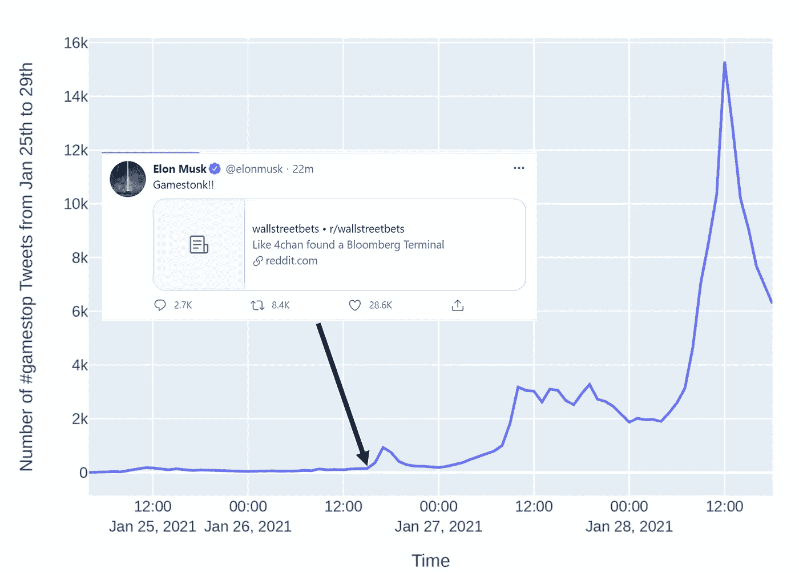
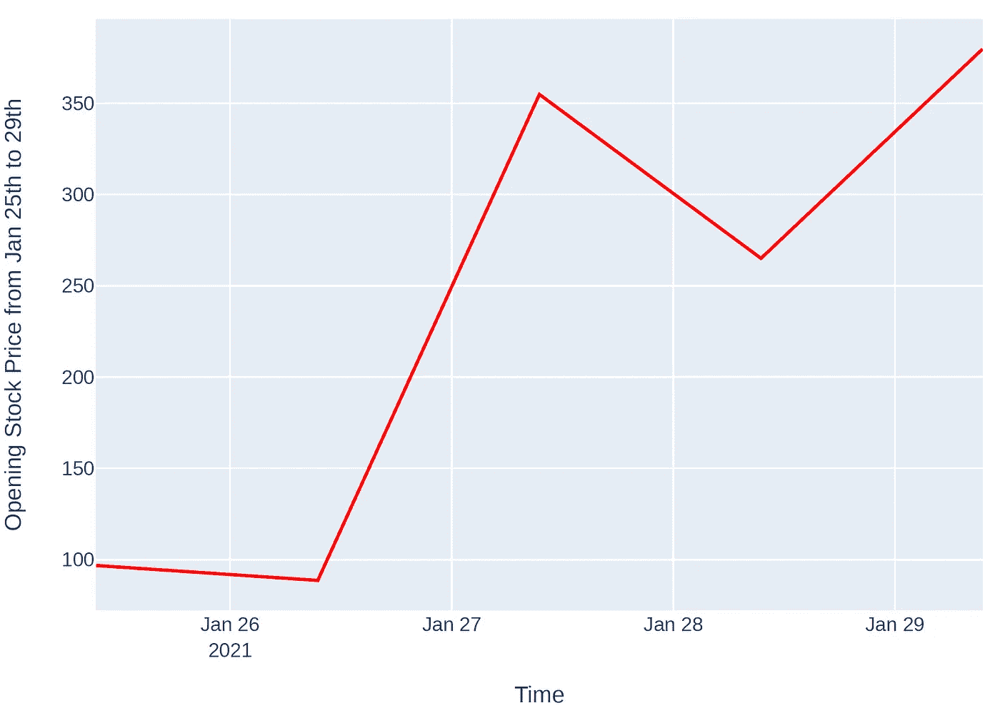
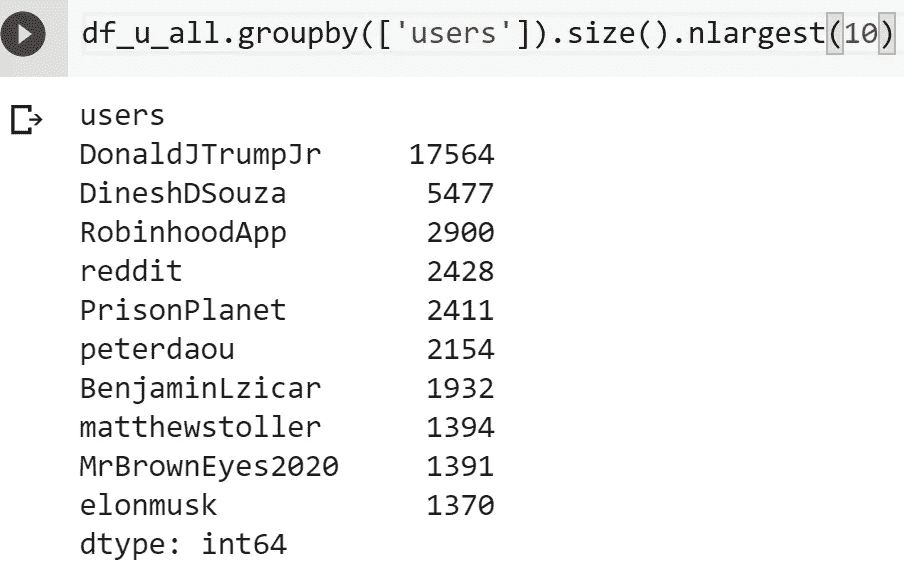
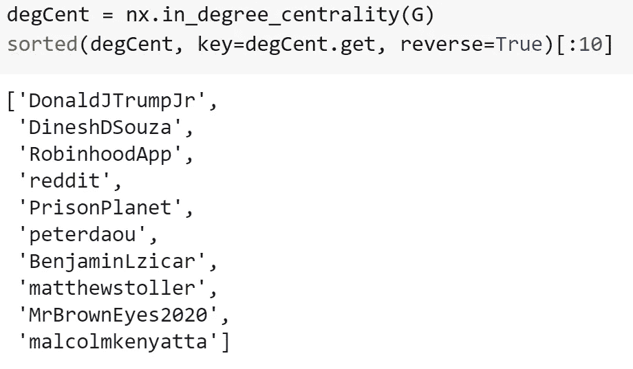
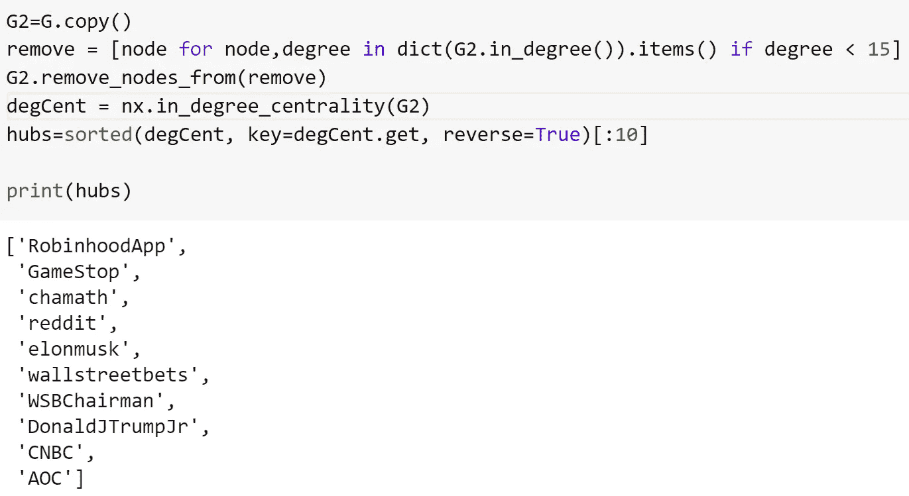
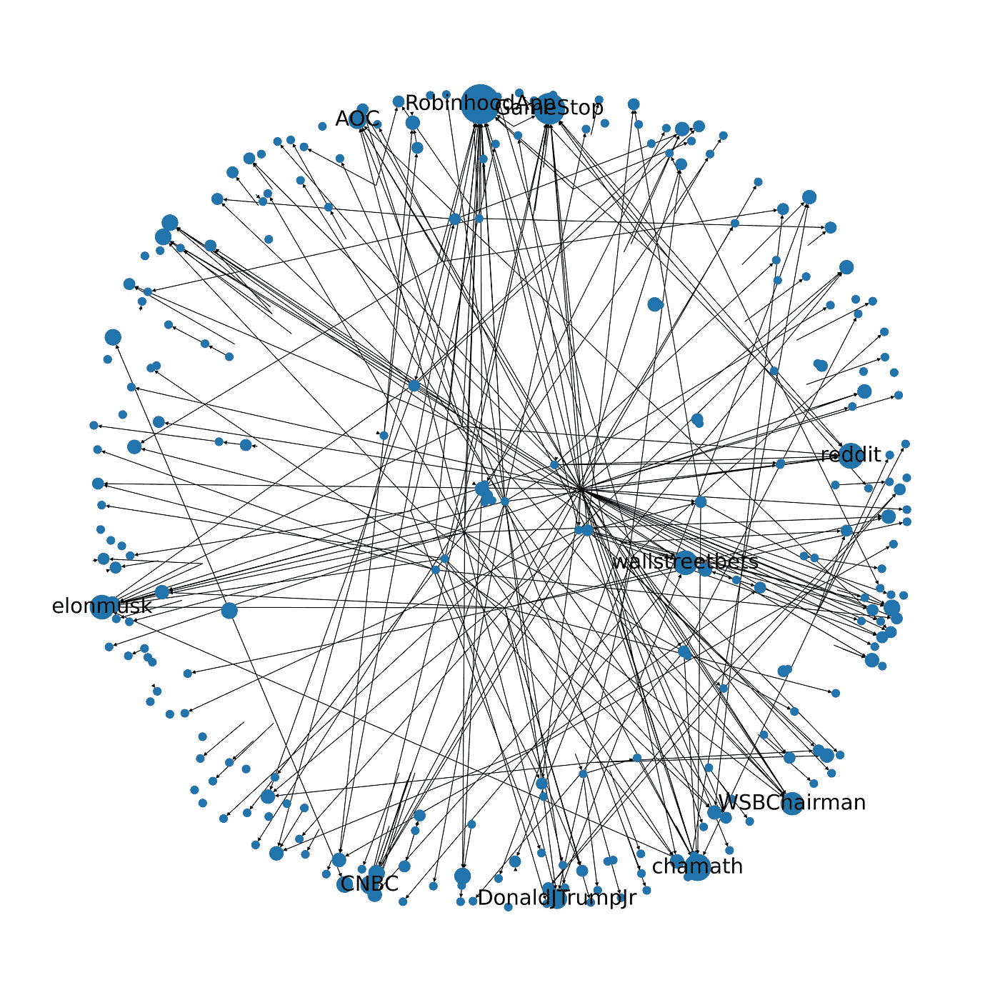

# 股票传奇期间#gamestop 的推文分析

> 原文：<https://towardsdatascience.com/tweet-analysis-of-gamestop-during-the-stock-saga-cc10ce6158fc?source=collection_archive---------32----------------------->

## [实践教程](https://towardsdatascience.com/tagged/hands-on-tutorials)

## 1 月 25 日-29 日的 17 万#gamestop 推文能否让我们洞察随之而来的市场混乱？

埃隆·马斯克现在著名的《Gamestonk！!'随着时间的推移发推文|塞犍陀·维维克

1 月 26 日美国东部时间下午 4:08，[埃隆·马斯克在推特上写道“Gamestonk！!"](https://twitter.com/elonmusk/status/1354174279894642703?lang=en)关于“华尔街赌注”的 Reddit 页面，该页面目前已有超过 900 万用户。有趣的是，这只是股市收盘后的几分钟，人们不得不怀疑马斯克是否对此进行了计时。第二天，Gamestop 的股票(纽约证券交易所代码:GME)上涨了 2.5 倍。我们知道股票市场对马斯克的反应，数据就在那里。只要谷歌一下纽约证券交易所:GME，你就会看到 Gamestop 股票每天的变化。

Gamestop 股票(纽约证券交易所:GME)1 月 25 日至 29 日的开盘价

但是我们知道马斯克的推特 ***实际上*** 是如何影响股票市场的吗，我的意思是，我们能否超越简单的相关措施，或者更糟的假设，来跟踪这种影响？朝着这个方向迈出的一步是评估马斯克的推文如何影响 Twitter 本身，特别是引用 Gamestop 的推文。好消息是，twitter 的新 API v2 比 v1 拥有更多的功能，并提供了一些优秀的数据访问，尤其是对于学术研究。

类似于[本文](https://repository.upenn.edu/cgi/viewcontent.cgi?article=1804&context=asc_papers)如何围绕标签调查社交推文网络，让我们看看那段时间的 ***#gamestop*** 推文网络。

顶部的数据显示，就在股市收盘后，马斯克发推文时出现了一个小高峰。有趣的是，在 1 月 26 日下午 6-7 点左右，从几乎没有人发#gamestop 的推文到最多 1000 条引用#gamestop 的推文，有一个小的波动，然后慢慢消失。

一夜之后，在 1 月 27 日白天，有一个缓慢的上升，在上午 9 点证券交易所开盘时突然上升。可能人们在推特上回应 Gamestop 股票开盘价的大幅上涨。当天晚些时候，在 27 日结束之前，每小时有大约 3000 条推文提到#gamestop，这是一个平稳期。

28 日的涨幅甚至比 27 日还要高，尽管我们看到了股票市场的反差。Gamestop 股价 28 日开盘低于 27 日。也许 twitter 用户下了一个高风险的赌注，在最高点购买了 Gamestop 的股票，他们认为他们可以通过发 Twitter 来提高价格:)

除了我那些不成熟的假设，显然还有一些真正有趣的事情在发生。26 日，马斯克的推文在第二天提高了股价(至少大多数人是这么说的)，但在 27 日和 28 日，可能发生了相反的情况——疯狂的股市引发了围绕#gamestop 的疯狂推文。

# 最常用的用户名

从每条推文中，可以获得用户的用户名(从@开始)，以及推文中提到的任何人。在大约 17 万条推文中，有大约 13 万个独立用户发推文或被提及。让我们来看看十大常用用户名:

1 月 25 日至 1 月 29 日期间#gamestop 中最常使用的 10 个用户名|塞犍陀·维维克

令人惊讶的是，最常见的是 DonaldJTrumpJr！马斯克勉强上榜，排在第 10 位！另一种可视化的方式是通过单词云。如果你眯着眼睛看，也许能看到埃隆马斯克！

#gamestop |塞犍陀·维维克发布/提及的 1000 个常用用户名

# 复杂网络分析

除了简单的频率，我们可以建立引用用户名的推文网络，以建立#gamestop 图形网络，其中节点是用户，有向边表示用户通过@引用其他人。为此我使用了 python NetworkX 包。

构建图表后，您可以查看各种中心性度量，这些度量基本上根据各种标准给出了节点重要性的信息。最直观的是度中心性，其中节点的重要性基于它相对于其他节点有多少连接。对于有向图，我们使用度(指有多少条边引用用户名)作为用户名重要性，下面您会看到 10 个度数较高的中心性节点:

度中心性最高的 10 大推特用户名|塞犍陀·维维克

再一次令人惊讶的是 DonaldJTrumpJr 竟然在榜首！有可能很多用户都在引用 DonaldJTrumpJr 自己不太受欢迎。相反，让我们过滤掉图表，只包括超过一定程度(我选择 15)的流行用户名:

影响者网络中排名前 10 的推特用户名|塞犍陀·维维克

基本上，上述 10 个用户名是顶级影响者中的 10 个顶级次级影响者。有趣的是，DonaldJTrumpJr 已经不是顶级了。

#gamestop 影响者网络，使用网络绘制 X |塞犍陀·维韦克

# 结论和未回答的问题

在开始分析疯狂股市期间的#gamestop 推文时，我认为观察跟随股市趋势的推文数量可能会很有趣。在这种天真的假设下，我没有意识到整个场景会有多么迷人复杂。推文影响股票，股票影响推文，以及复杂的相互依赖的动态网络。以下是一些值得思考的问题:

1.  为什么#gamestop 的推文在马斯克的推文之后的 27 日和 28 日出现峰值？是为了应对股市波动吗？考虑到 28 日股市本身并没有飙升，为什么 28 日比 27 日高出这么多？
2.  为什么美国东部时间 28 日中午 12 点#gamestop 推文数量突然暴跌？
3.  小唐纳德·特朗普在#gamestop 期间为何如此重要？

有兴趣的话，下面详细介绍一下带代码的 Google Colab 笔记本。

<https://colab.research.google.com/drive/14N2_HWgoqiVb2E5tAV96RT8SAkC1WeJZ?usp=sharing>  

引导我的内心:我探索得越多，我就越意识到我的理解和假设是多么的贫乏。但这使得更深入地探究社会网络之间的相互依存关系变得更加有趣。

[*关注我*](https://medium.com/@skanda.vivek) *如果你喜欢这篇文章——我经常写复杂系统、物理学、数据科学和社会的界面*