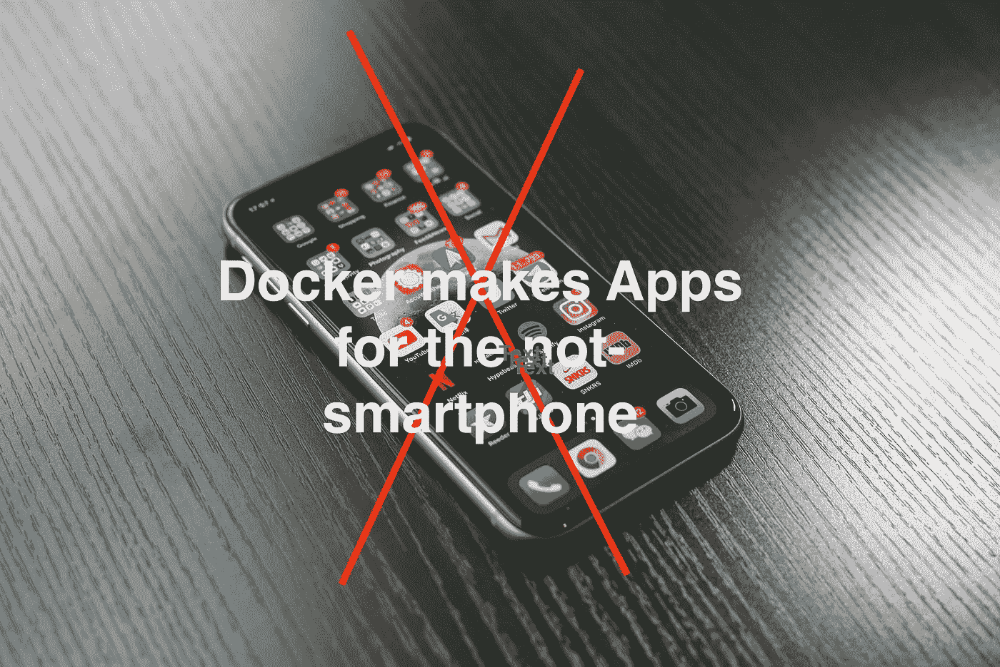
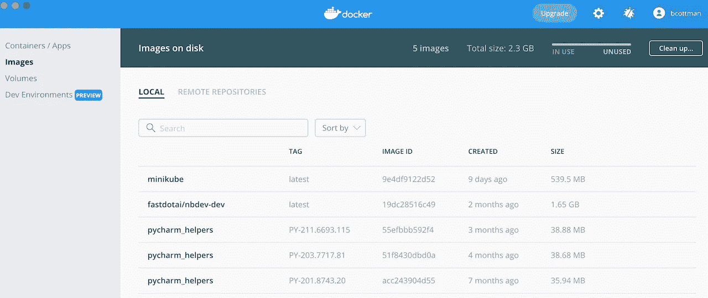
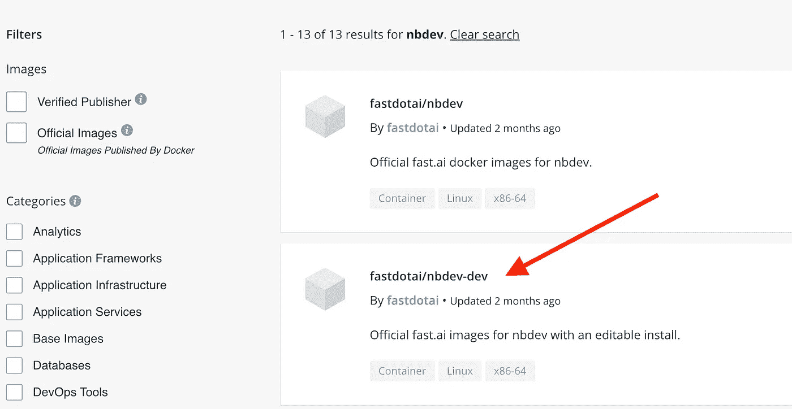
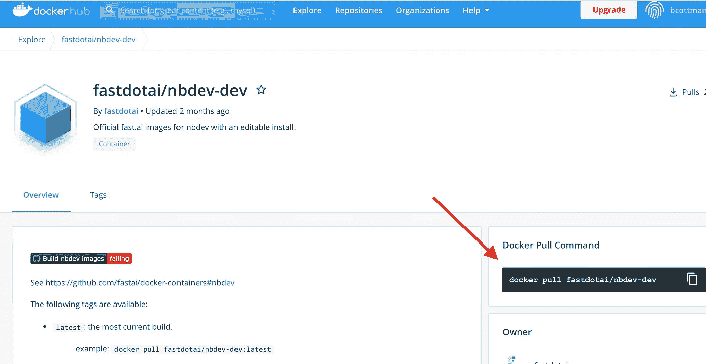
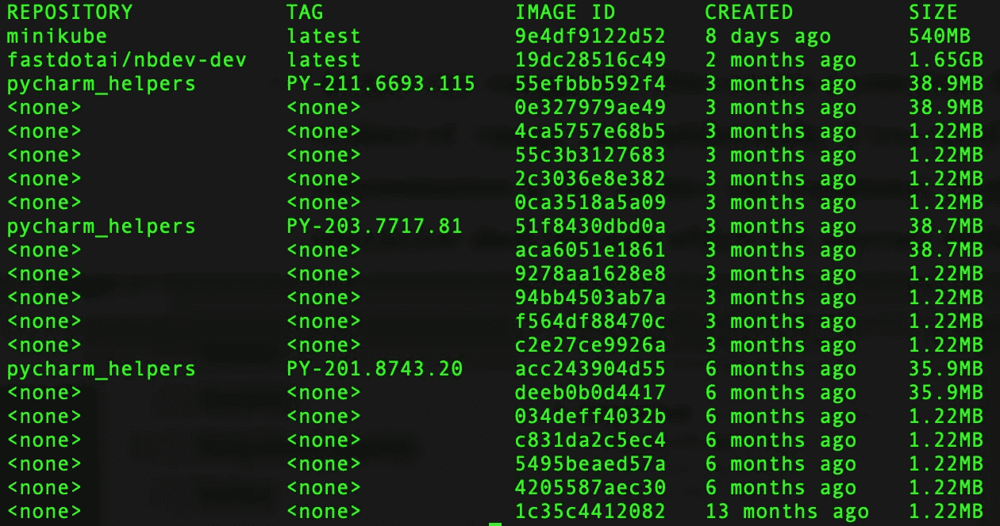
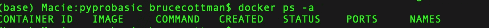
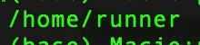
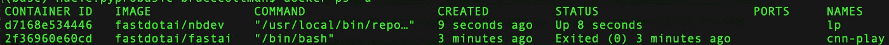
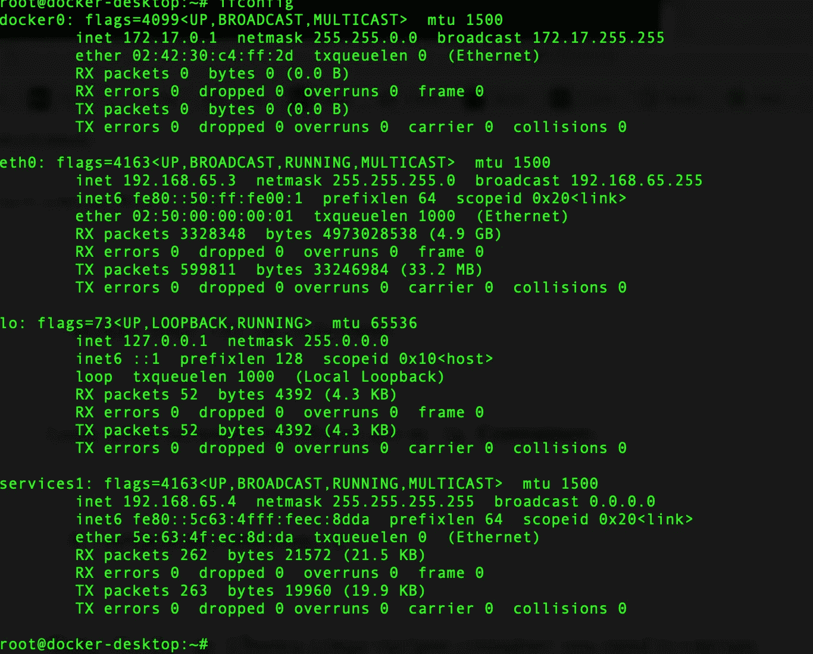

# 更好地使用 Docker 的 21 个技巧和 5 个概念

> 原文：<https://towardsdatascience.com/twenty-one-techniques-and-five-concepts-for-better-docker-usage-9ee135dccdc9?source=collection_archive---------31----------------------->

## Docker 是为你的非智能手机电脑设计的应用软件。



乔纳斯·李在 [Unsplash](https://unsplash.com/s/photos/mobile-application?utm_source=unsplash&utm_medium=referral&utm_content=creditCopyText) 上的照片

# 起初

你已经编程几年了，你的沙箱，你的本地开发机器，被许多不同的库、框架，也许还有一两个病毒的下载搞得乱七八糟。

以上描述了我 2008 年的生活。下面的艰巨任务详细描述了我当时生活中的巨大 PIA(你要靠自己来解决这个缩写词):

1.  从 Python 2.x 升级到 3.x
2.  支持用 Python 2.x 编写的生产服务，即使你想升级到 Python 3.x，也不被允许；
3.  将 Linux OS 服务器升级到下一个主要版本以及相关的工具、框架、服务和库层；
4.  尝试一个与您当前的工具、框架、服务和库相冲突的新包；
5.  需要一个现在被不同名字调用的包的依赖，或者最坏的情况是依赖不再存在；
6.  损坏，可能是操作系统驱动程序，因此需要重新安装，因为重新启动没有解决问题；
7.  最后但同样重要的是，我最大的 PIA(需要我去看医生)是超过五年的 Linux 服务器，它们有硬件故障、备份和/或不完整的文档，或者更糟的是，从未被验证为可重现。

我生命中最大的七个“问题”(BPIAIML)看起来像是系统管理员的待办事项清单或者 DevOps 大师的梦想成真。作为一名架构师和几个产品和项目的经理，我向你保证，它们是我需要解决的最大问题。

## 我们在跑之前需要先走一走。

> DevOps 是未来的解决方案。—匿名

DevOps 是未来的解决方案。—匿名

我们几乎所有人都使用智能手机。让智能手机如此有价值的是名为 Apps 的应用程序。一些有用的应用程序预装在智能手机上，而其他应用程序我们免费或收取少量费用下载。

Docker 支持笔记本电脑、台式机、服务器、云和混合云上的应用。

**Dockerfile** 是我的应用的构建蓝图。Docker **镜像**是从 **Dockerfile 规范**(构建蓝图)中产生的 App 指令。Docker **容器**是围绕 Docker **映像**创建应用程序的运行时虚拟环境包装器。

像应用程序一样，Docker **Images** 是免费的，如果它们包含开放源代码，即 Linux、Jupyter、Rust、Python、Tensorflow、Spark、Kafka、NGINX，这是一个越来越长的列表，可以从公共存储库中下载。

我决定使用 Docker 作为我们处理 SBPIAIML 的宏伟解决方案的一个解决方案。

## Docker 如何解析七个 BPIAIML？

每一个和开发人员交谈过的人都以某种形式听说过，“它在我的机器上工作。”

当我没有现在这么成熟的时候，我的第一反应是，“你被解雇了！”

现在，我说，“哦，太好了。把你的 docker 文件和单元测试发给我。我会努力找出我做错了什么，然后回来找你。”

通常会发生一两个事件，但不总是发生:

1.  开发人员将 docker 文件和单元测试发送给我，或者:
2.  开发人员开夜车创建 Dockerfile 文件和单元测试，然后发给我。

## 我们码头之旅的真正开始。

我建议您从我们旅程的起点开始:

[](https://levelup.gitconnected.com/our-enterprise-docker-solution-for-migration-to-the-cloud-d7bb9d1a796b) [## 我们面向云迁移的企业 Docker 解决方案

### 这是一个关于我们第一次推出 Docker 的故事，它发生在我以前作为承包商工作过的一家公司。代码，作为…

levelup.gitconnected.com](https://levelup.gitconnected.com/our-enterprise-docker-solution-for-migration-to-the-cloud-d7bb9d1a796b) 

我假设你已经安装了 Docker。如果没有，现在就可以，请转到此处:

[](https://docs.docker.com/engine/install/) [## 安装 Docker 引擎

### Docker Engine 可在多种 Linux 平台、macOS 和 Windows 10 上通过 Docker Desktop 获得，并作为…

docs.docker.com](https://docs.docker.com/engine/install/) 

## Docker 是如何工作的？

为了解释 Docker 是如何工作的，我首先更正式地定义了我们在这篇博客文章中多次引用的四个基本 Docker 术语。

一个**映像**就是一大块[虚拟环境](https://stackoverflow.com/questions/50974960/whats-the-difference-between-docker-and-python-virtualenv)二进制指令。按照 **Dockerfile** 指定的二进制指令对图像进行分层。一个例子是 Ubuntu 20.04、 [nbdev](https://nbdev.fast.ai/example.html#Important-Notes-about-show_doc:) 和 Jupyter notebook 实例的层。

**层**按顺序应用于基础图像，以创建最终图像。

一个 **Dockerfile** 是一个**图像的蓝图。**蓝图由文本文件中的一系列 Docker 命令组成。

> `Dockerfile`是一个文本文档，包含用户可以在命令行上调用的所有命令，以组合一个图像。— [文档参考](https://docs.docker.com/engine/reference/builder/)

Docker **容器**是围绕 Docker **映像实例的运行时虚拟环境包装器。**

***注意*** *: Docker 可以自动为你生成一个容器名，或者你可以在* `*Docker run ...*`的时候给容器命名

**DockerHub (Image) Registry** :您可以将公共(或私有)Docker 映像放在这个共享存储库(repo)中。要将您的一张图片发布到公共回购平台，需要一个 [Docker 登录帐户](https://hub.docker.com/)。如果你不推送图像，它会留在本地的私人回购中。

您可以使用 Docker 桌面查看本地**容器、**本地和提取的**图像、**和其他我们尚未讨论的重要 Docker 实体。



我为这些术语道歉。似乎任何一门学科，比如计算机科学，医学，或者物理学，90%是术语，10%是概念。我接受它，因为在讨论概念之前，你需要定义概念中的术语。

当我们讨论概念的伪哲学时，你需要深入了解 Docker **图像**和 Docker **容器**之间的区别。

我知道我不得不多次回顾 Docker **图像**和 Docker **容器**的定义。我通过将一个**容器**包含一个**图像来简化我的生活。**

一个**容器**可以做更多的事情，但是除非我想分拆我自己的 Docker 公司，否则我不需要知道 Docker 架构或者内部工作方式。

见鬼，我可能比你慢一点。不要让我劝阻你深入研究 Docker 内部。你可以利用你的时间做一些最糟糕的事情。

我们将在博客文章的后面详细讨论所有这些术语和 Docker 命令。

# 不是，不是在这里发明的

*不要发展自己的形象*，至少在需要 Docker I **mage** 的时候。

Docker Hub 上有超过 800 万张图片。很有可能，你会在 Docker Hub 上找到你需要的东西，避免自己动手制作。

即使你没有找到你想要的，你可能会找到一些相近的东西。通过查看其他人的代码，使用学习软件的古老艺术(IMHO，这很好)，您将找到 other 文件和其他来源的链接。

您应该检查您想要的容器是否在:

 [## 码头枢纽

### 编辑描述

hub.docker.com](https://hub.docker.com/search?q=&type=image) 

我根据类别、操作系统和机器架构进行过滤搜索。此外，我在搜索框中输入一个或多个术语来改进我的搜索。


在超过 800 万个容器中优化搜索—图片来源:作者桌面快照。

我的示例搜索 *nbdev* 图像的结果是:



图片来源:作者桌面快照。

如果我点击容器名`fastdotai/nbdev-dev:`



图片来源:图片:图片:作者桌面快照。

我使用 docker hub `fastdotai/nbdev-dev`中的 docker 映像，方法是使用以下命令:

```
docker pull fastdotai/nbdev-dev
```

您必须创建一个本地副本，以便在创建容器时不引用全局中心副本。

您不希望造成网络瓶颈，并且您希望知道**容器**是由同一个**映像**构成的。你努力追求速度和再现性。

# 列出所有可用的 Docker 图像和容器

`docker images -a`列出本地储存在您电脑上的所有图像。该列表中包括您使用`docker pull <image-mame>`绘制的图像和中间图像(**图层**)。

```
docker images -a
```



CLI docker images -a. Image 的输出:作者桌面快照。

`docker ps`列出你电脑上所有正在运行的容器。

```
docker ps -a
```



我的沙箱上没有运行 Docker 容器。图:作者桌面快照。

# docker 运行选项是 Docker 的核心

对我来说，Docker 和 java 的目标是一样的，关键的区别在于 Docker 实现了。

> 调试一次，随处运行—匿名

对我来说，Docker 和 java 的目标是一样的，关键的区别在于 Docker 实现了。

调试一次，随处运行—匿名

以上可能有些言过其实。出于我的目的，上面的引用对 Linux、Windows、Macintosh、Kubernetes 和云供应商的许多变体都有效。

理解命令 Docker run 操作对于指定 Docker **容器**如何与外部环境通信至关重要。

实际上，你的“外部环境”要么是一台本地机器(你的沙箱)，要么是几台联网的机器，通常是一个云，或者更好的是一个分布式操作系统，比如 [Kubernetes](https://kubernetes.io/) 。

```
docker run [OPTIONS] <image-name> [COMMAND] [ARG...]
```

我在这篇博客文章中展示了各种形式的有用的`[OPTIONS]` n。

## 完成后移除 Docker 容器

`--rm`退出时自动移除**容器**并释放其正在使用的内存。当我们运行一个**容器**时，我们几乎总是使用这个选项，因为我们觉得这最接近于模仿你的智能手机上的应用程序行为。

```
docker run --rm <image-name>
```

## 装入容器

所有的 Docker **镜像**都有一个 Linux 基础层。当您运行 Docker 容器时，您可以附加并运行大多数 shell 命令。例如，您可以列出**容器的**工作目录中的文件:

```
docker exec -t <container name/ID> bash -c "ls -al"
```

或者脱离背景:

```
docker exec -t -d <container name/ID> bash -c "ls -al"
```

为了调试一个**容器**，我们启动一个交互式会话:

```
docker exec -it <container name/ID> bash
```

***注意*** *:您可以通过输入* `*exit*` *来结束或终止您的会话。*

***注意*** *:以上命令对于监控和您可能想要在运行的* ***容器*** *上执行的其他任务非常有用。*

注意:有很多关于“边车模式”的抽象讨论上面的命令是实现 Docker 容器“sidecar”的方法之一(IMHO，最好的方法之一。)

## 将 Docker 容器目录树映射到本地目录树。

请记住，当我们讨论“本地”时，我们指的是外部主机环境。有时候我可能没有做到应有的一致，也可能把“本地”说成是“外部”环境。

我们可以覆盖(忽略)Dockerfile 指定的`volume`或`workdir`命令技术:

```
docker run -v $PWD:<local-directory-root> -w <local-directory-root> <container name/ID># Example
docker exec -it -v $PWD:<local-directory-root> -w <local-directory-root> nbdev bash
```

在前面的命令中，您将当前的“本地”目录`$PWD,`挂载到了**容器的**卷中(即`-v`标志)。您导致名为`<local-directory-root>`的目录成为**容器**(`-w`标志)的`/workdir`。)结果是**容器**与`$PWD,`中的`/workdir`一起启动，该目录是您启动时所在的目录。

我们发现上面的技术经常被使用。

如果您愿意，可以使用以下命令查看 Docherfile `workdir`规范:

```
docker exec <container name/ID> pwd
# Example
docker exec lp pwd
```



图:作者桌面快照。

## 将 Docker 网络和端口映射到您的“本地”网络。

记住，一个 Docker **容器**为 Docker **映像**创建了一个小小的封装宇宙，一个[虚拟环境](https://stackoverflow.com/questions/50974960/whats-the-difference-between-docker-and-python-virtualenv)。

通过执行以下命令，您可以在 Docker 包安装后看到 Docker 网络:

```
docker network ls
```

一开始你会看到三个网络。


图:作者桌面快照。

将`lp` **容器**作为 Linux 守护进程运行，然后使用以下命令列出所有“本地”**容器**:

```
docker pull  fastdotai/nbdev:latest
docker run -d --name lp --net=host fastdotai/nbdev# List running containers
docker ps -a
```



图:作者桌面快照。

我们通过使用 Docker 命令创建一个“sidecar”来查看`lp` **容器**的内部:

```
docker exec -it lp /bin/bash
```

看看`lp` **容器中有哪些网络接口:**

```
root@docker-desktop:~# ifconfig
```



图像:作者桌面快照

注意网络接口`docker0:`和`eth0:`是相同的。选项`-net=host`将 Docker **容器**虚拟环境网络接口映射到“本地”或主机网络接口。

***注意*** *:在* `*lp*` *Ubuntu Linux 变种* ***容器*** *上你需要运行一个 root 用户 sidecar 并执行；*

```
docker exec -u root -t -i lp /bin/bash
root@docker-desktop:~# apt-get update
root@docker-desktop:~# apt-get install net-tools
```

在执行`ifconfig.`之前

现在我们已经用完了，请将容器移走。

```
docker container rm lp
```

# 清理码头建筑的混乱

每次创建 Docker **图像时，**Docker 文件都会导致旧的**层**变得多余。这些冗余的**层**消耗内存和交换空间。使用 Docker 命令删除这些层:

```
docker system prune
```

为什么 Docker 没有垃圾收集器？我不知道。我确信通过一些研究我可以找到答案。上面的 Docker 命令在你做的时候警告你，对我来说就够了。

我们从未遇到过运行`docker system prune.`的问题，但是，如果我们在频繁更改 docker 文件时不使用`docker system prune`，我们就会耗尽“本地”内存。

## 检查所有 Docker 运行选项

您可以对这个 docker `run` 命令应用许多其他标志，以实现更加定制的容器创建过程。

运行下面的命令，以获得与此命令一起运行的更多选项。

```
docker run -it <image ID> --help
```

# 摘要

你可能已经注意到我已经讨论了 Dockerfile 文件的丰富主题。我也没有讨论 Docker-compose，但是我会在未来的博客文章中讨论这个问题。)在此之前，我可以说我们使用 Docker-compose 从微服务构建服务。

在这篇博客文章中，我主要关注 Docker run 命令和必要的辅助管理 Docker 命令。

我被允许分享我们迄今为止的旅程。当我们做出重大改变时，将会有更新。

编码快乐！