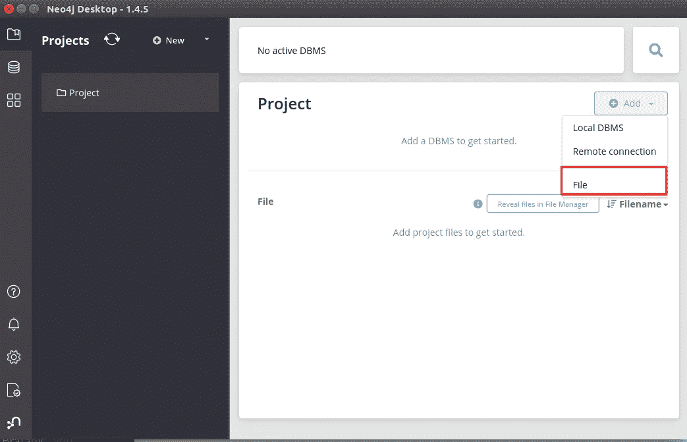
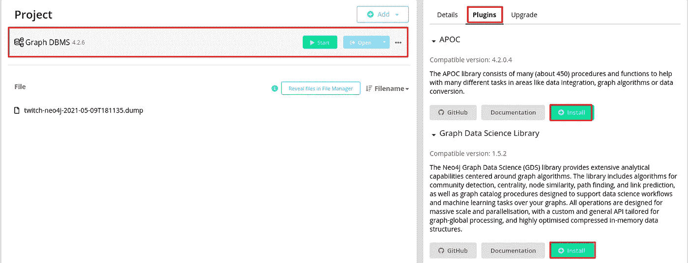
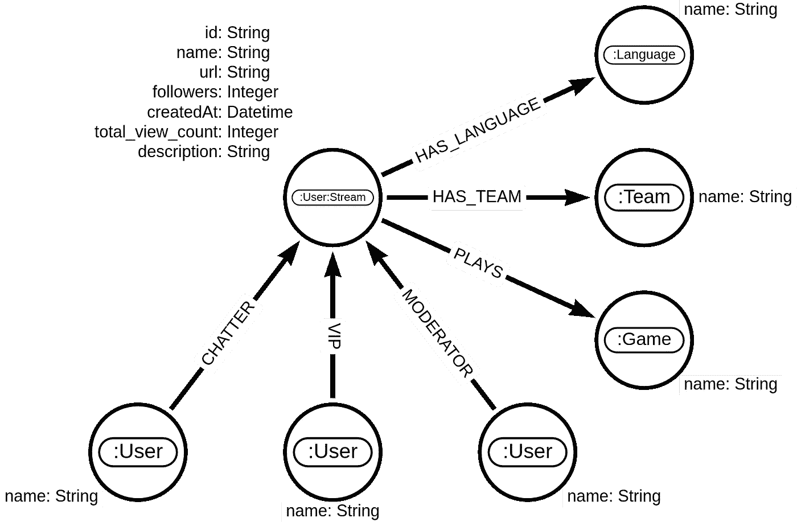

# Twitchverse:使用 Neo4j 图形数据科学对 Twitch 宇宙的网络分析

> 原文：<https://towardsdatascience.com/twitchverse-a-network-analysis-of-twitch-universe-using-neo4j-graph-data-science-d7218b4453ff?source=collection_archive---------8----------------------->

## 通过实例了解如何使用图论和算法从关联数据中获得有价值的见解

图表数据科学侧重于分析数据中的联系和关系，以获得有价值的见解。每天都会产生海量的数据，但是数据点之间的联系往往在数据分析中被忽略。随着图形数据科学工具的兴起，分析联系的能力不再局限于像谷歌这样的大型科技公司。在这篇博文中，我将介绍如何在您的计算机上设置 [Neo4j Graph Data Science](https://neo4j.com/developer/graph-data-science/) 环境，并带您完成您的(第一次)网络分析。我们将使用 Twitch 网络数据集。在我的[前一篇博文](/twitchverse-constructing-a-twitch-knowledge-graph-in-neo4j-78f03276c1f7)中，我已经展示了如何从[官方 Twitch API](https://dev.twitch.tv/docs/api/) 获取信息并将其存储到 Neo4j graph 数据库中。您可以选择直接从 Twitch API 获取信息，或者加载我已经准备好的 [Neo4j 数据库转储](https://drive.google.com/file/d/1ZR_SBEyEmOmxd6v-02kOARlnbq-VVpl_/view?usp=sharing)。数据库转储中的数据是在 2021 年 5 月 7 日至 10 日之间擦除的。

## Neo4j 图形数据科学环境

首先你需要下载安装 [Neo4j 桌面应用](https://neo4j.com/download/)。打开 Neo4j 桌面应用程序后，您应该会看到以下屏幕:


Neo4j 桌面应用。图片由作者提供。

要跟踪这篇博文并获得相同的结果，您应该加载我准备的数据库转储。从[这个链接](https://drive.google.com/file/d/1ZR_SBEyEmOmxd6v-02kOARlnbq-VVpl_/view?usp=sharing)下载，然后添加到下图所示的 Neo4j 桌面环境中。简单说明一下，数据库转储有 1.6GB 大，包含 1000 万个节点，所以要确保有足够的可用磁盘。



向 Neo4j 桌面项目添加文件。图片由作者提供。

如图所示，点击**添加**按钮，选择**文件**选项。这应该需要几秒钟，然后文件名应该出现在文件选项卡下。要恢复数据库转储，请将鼠标悬停在文件上，然后单击右上角的三个点。接下来，选择**从转储创建新的 DBMS**选项。


从数据库转储创建新的 DBMS。图片由作者提供。

在下一个屏幕中，您需要定义密码并选择 Neo4j 数据库版本。我建议你总是使用最新的数据库版本。目前，版本 4.2.6 是最新的。


选择密码和数据库版本。图片由作者提供。

数据库恢复应该只需要几秒钟。现在，在开始网络分析之前，我们只需安装 APOC 和图形数据科学插件。幸运的是，我们只需几次点击就可以安装这两个插件。



安装 APOC 和 GDS 插件。图片由作者提供。

要安装插件，点击**项目**选项卡下创建的数据库实例。通过单击选择创建的数据库后，右侧会出现一个新的选项卡。选择**插件**标签，点击**安装**按钮，安装 **APOC** 和**图形数据科学**库。

最后但并非最不重要的一点是，在处理像我们正在处理的这种稍微大一点的图形时，增加堆内存是明智的。您可以通过单击创建的数据库的三个点并选择**设置来定义堆分配。**


Neo4j Desktop 中数据库实例的访问设置。图片由作者提供。

在设置中，搜索下面两行并增加堆内存分配。

```
dbms.memory.heap.initial_size=4G
dbms.memory.heap.max_size=4G
```

默认的堆内存分配是 1GB，在本例中，我将它增加到 4GB。我建议您也这样做，以避免在执行一些图形算法时出现 OOM 错误。

既然已经加载了数据库转储并安装了必要的插件，那么就可以开始启动数据库实例了。我已经准备了一个 [Jupyter 笔记本，里面有这篇博文中将要执行的所有 Cypher 查询](https://github.com/tomasonjo/blogs/blob/master/twitch_analysis/Twitch%20analysis.ipynb)，但是您也可以将 Cypher 查询复制到 Neo4j 浏览器环境中。

## 抽动网络模式

我们将从 Twitch 网络模型的简短回顾开始。



抽动网络的图形模式。图片由作者提供。

Twitch 社交网络由用户组成。这些用户中的一小部分通过直播流广播他们的游戏或活动。在我们的图表模式中，使用实时流的用户被标记为二级标签 **Stream** 。我们知道他们属于哪个团队，他们在流上玩哪些游戏，以及他们用哪种语言呈现他们的内容。我们还知道他们在抓取的时候有多少追随者，有史以来的历史观看次数，以及他们何时创建了他们的用户帐户。另一方面，我们知道哪些用户参与了流媒体工具的聊天。我们可以区分在流中聊天的用户是普通用户(CHATTER 关系)、流的版主(版主关系)还是流的 VIP。

请记住，数据库转储中的数据是在 2021 年 5 月 7 日和 10 日之间收集的，因此只有在那个周末流式传输的 streamer 才会显示在数据库中。类似地，只有在那个周末聊天的用户才会出现在网络中。

我们将首先使用 *apoc.meta.stats* 过程计算数据库中的节点数。执行以下 Cypher 查询，按标签检查节点数。

```
CALL apoc.meta.stats()
YIELD labels
```

*结果*


apoc.meta.stats 程序的结果。图片由作者提供。

我们可以观察到图中几乎所有的节点都是用户。有 1050 万用户，其中只有大约 6000 人是流媒体用户。这些彩带已经播放了 594 场比赛，用 29 种不同的语言播出。

## 探索性图形分析

在深入研究图形算法之前，我喜欢先熟悉手边的图形。
我们将通过执行几个 Cypher 查询来执行探索性的图形分析，以了解有关网络的更多信息。这篇博文中的所有条形图都是在 [Seaborn 库](https://seaborn.pydata.org/)的帮助下创建的。我准备了一个 [Jupyter 笔记本](https://github.com/tomasonjo/blogs/blob/master/twitch_analysis/Twitch%20analysis.ipynb)，里面包含了所有的代码，可以帮助你理解这篇博文。首先，我们将根据历史观看次数检索前十名。

```
MATCH (u:Stream)
WHERE exists(u.total_view_count)
RETURN u.name as streamer,
       u.total_view_count as total_view_count
ORDER BY total_view_count DESC 
LIMIT 10;
```

*结果*


前十名的所有时间观看计数飘带。图片由作者提供。

在我被 Twitch 领域的专家攻击之前，我想指出，我们只分析了在 5 月 7 日和 10 日之间直播的 Twitch 流。可能有其他具有更高的总观看计数的流。在我们的图表中，前三个有史以来最高观看次数的飘带似乎是一个飘带团队，而不是一个个体。我不熟悉提到的溪流。我只知道 esl_csgo 几乎全天候播放《反恐精英:全球攻势》。接下来，我们将调查关注人数最多的前十条横幅。

```
MATCH (u:Stream)
WHERE exists(u.followers)
RETURN u.name as streamer,
       u.followers as followers
ORDER BY followers DESC 
LIMIT 10;
```

*结果*


十大跟风。图片由作者提供。

有趣的是，我们得到了一组与前一个查询完全不同的 streamers。除了裹尸布，他在有史以来的浏览量类别中排名第四，在最高粉丝数中排名第二。当一个流上线时，每个关注者都会收到一个通知。当 Rubius 上线时，几乎无法想象有 900 万人收到通知；当 Pokimane 开始播放时，几乎无法想象有 800 万人收到通知。我很想知道这些溪流已经存在了多久。我们将按照用户创建日期合计流的数量。

```
MATCH (u:Stream)
WHERE exists(u.createdAt)
RETURN u.createdAt.year as year, 
      count(*) as countOfNewStreamers
ORDER BY year;
```

*结果*


按年份对创建的流进行计数。图片由作者提供。

这里我需要再补充一条免责声明。我们是按照用户帐户创建的日期而不是他们第一次开始流式传输的日期进行聚合的。不幸的是，我们没有第一次流的日期。从结果来看，至少有一些彩带已经在 Twitch 上工作了十年。另一个令人震惊的事实，至少对我来说。我们可以离开飘带，调查一下大多数飘带都玩哪些游戏。请注意，一个流注可以玩多个游戏，因此他们可能会被计入多个游戏中。我们的数据是在周五和周日之间收集的，所以流民可能更喜欢在周五玩 Valorant，在周日玩扑克。

```
MATCH (g:Game)
RETURN g.name as game,
       size((g)<--()) as number_of_streamers
ORDER BY number_of_streamers DESC
LIMIT 10
```

*结果*


大多数彩带玩的游戏。图片由作者提供。

到目前为止，最受欢迎的是聊天类别。聊天类别流行的原因可能是因为它用于所有不玩特定视频游戏的流。这可能包括从烹饪节目到“现实生活”流的任何内容，在“现实生活”流中，流手拿着相机在世界各地行走。不然看来生化危机村，GTA V，英雄联盟才是最受流光欢迎的游戏。

大多数横幅属于一个或两个团队。我们可以调查哪些团队拥有最高的成员数，以及团队成员广播的所有游戏。

```
MATCH (t:Team)
WITH t, size((t)<--()) as count_of_members
ORDER BY count_of_members DESC LIMIT 10
MATCH (t)<-[:HAS_TEAM]-(member)-[:PLAYS]->(game)
RETURN t.name as team,
       count_of_members,
       collect(distinct member.name) as members, 
       collect(distinct game.name) as games
```

*结果*


g 燃料团队在 2021 年 5 月 7 日至 10 日的周末有 64 名成员。其成员涵盖了 Twitch 上 34 个不同的游戏类别。在我们深入网络分析之前，让我们检查一下哪些用户是大多数流的重要用户。

```
MATCH (u:User)
RETURN u.name as user, size((u)-[:VIP]->()) as number_of_vips
ORDER BY number_of_vips DESC LIMIT 10;
```

*结果*


VIP 数量最多的用户。图片由作者提供。

我敢说 Nightbot 和 Supibot 都是机器人。让机器人成为贵宾似乎有点奇怪。我一直认为机器人是聊天的主持人，有能力删除带有链接的消息等。我们还可以检查哪些用户正在调节最高数量的流。

```
MATCH (u:User)
RETURN u.name as user, size((u)-[:MODERATOR]->()) as number_of_mods
ORDER BY number_of_mods DESC LIMIT 10;
```

*结果*


在不同的流上具有最高数量的版主角色的用户。图片由作者提供。

正如所料，拥有最高版主角色数的前十名用户最有可能是机器人，其中 Nightbot 最受欢迎。

## 用户网络分析

您可能还记得，在我们的图表中，1000 万用户中只有大约 6000 人是流媒体用户。如果我们从这个角度来看，只有 0.06%的用户是流媒体用户。我们数据库中的其他用户是在其他 streamers 的广播中聊天的用户。到目前为止，我们在探索性图形分析中完全忽略了它们。也就是说，直到现在。图形数据科学侧重于分析网络中实体之间的连接。是时候戴上图表数据科学的帽子，研究网络中用户之间的关系了。作为对图结构的一个简单提醒，让我们设想一个用户网络的小子图。

```
MATCH (s:Stream)
WITH s LIMIT 1
CALL {
    WITH s
    MATCH p=(s)--(:Stream)
    RETURN p
    LIMIT 5 UNION WITH s
    MATCH p=(s)--(:User)
    RETURN p
    LIMIT 5
}RETURN p
```

*结果*


单个流的示例用户网络。图片由作者提供。

正如在[之前的博客文章](/twitchverse-constructing-a-twitch-knowledge-graph-in-neo4j-78f03276c1f7)中提到的，流媒体工具的行为就像普通用户一样。他们可以主持其他广播，可以参与他们的聊天，或获得 VIP 身份。这就是促使图模型决定用二级标签流将流表示为常规用户的原因。我们不希望图中的两个节点代表一个真实的实体。

首先，我们将评估节点度分布。节点度就是每个节点拥有的关系的数量。这里，我们正在处理一个有向网络，因为关系方向具有语义值。如果 Aimful 是 Itsbigchase 流的版主，这并不自动意味着 Itsbigchase 是 Aimful 流的版主。在处理有向网络时，可以将节点度分布分为入度分布和出度分布，入度分布用于计算传入关系，出度分布用于计算传出连接。首先，我们将检查出度分布。

```
MATCH (u:User)
WITH u, size((u)-[:CHATTER|VIP|MODERATOR]->()) as node_outdegree
RETURN node_outdegree, count(*) as count_of_users
ORDER BY node_outdegree ASC
```

*结果*


用户网络的外向度分布。图片由作者提供。

双对数图显示了出度分布。两个轴都有对数刻度。在总共一千万用户中，大约有六百万用户只有一个外向关系，这意味着他们只在单个流中聊天。绝大多数用户的传出连接少于 10 个。几个用户有超过 100 个外发链接，但我大胆猜测他们很可能是机器人。一些数学家可能会考虑遵循[幂律分布](https://en.wikipedia.org/wiki/Power_law)的出度。现在，我们来看看入学位分布。我们已经知道，只有飘带的入度大于 0。只有广播其流的用户才能让用户参与他们的聊天。因此，大约 99.999%的用户的入度值为 0。你几乎可以把这个网络视为一个[二分图](https://en.wikipedia.org/wiki/Bipartite_graph#:~:text=In%20the%20mathematical%20field%20of,the%20parts%20of%20the%20graph.)，除了在飘带之间也有关系。我们将只为拖缆可视化入度分布。

```
MATCH (u:Stream)
WITH u, size((u)<-[:CHATTER|VIP|MODERATOR]-()) as node_indegree
RETURN node_indegree, count(*) as count_of_users
ORDER BY node_indegree ASC
```

*结果*


用户网络的入度分布。图片由作者提供。

观察到入度分布也遵循幂律分布是非常有趣的。大多数飘带在周末有不到 1000 个活跃的聊天者，而一些飘带有超过 15000 个活跃的聊天者。

## 图形数据科学图书馆

现在是时候执行一些图形算法了。[Neo4j Graph Data Science](https://neo4j.com/docs/graph-data-science/current/)library(GDS)拥有 50 多种图形算法，从集中到社区检测和节点嵌入算法。首先，我们需要更新 GDS 图书馆的工作方式。

> 为了尽可能高效地运行算法，Neo4j 图形数据科学库使用专门的内存图形格式来表示图形数据。因此，有必要将 Neo4j 数据库中的图形数据加载到内存图形目录中。加载的数据量可以通过所谓的图形投影来控制，图形投影还允许例如在节点标签和关系类型上过滤，以及其他选项。

*引自* [*官方文件*](https://neo4j.com/docs/graph-data-science/current/introduction/) *。*

GDS 库在专门的内存图形格式上执行图形算法，以提高图形算法的性能和规模。使用[本地或 cypher 投影](https://neo4j.com/docs/graph-data-science/current/management-ops/)，我们可以将数据库中存储的图形投影为内存中的图形格式。在执行任何图形算法之前，我们必须将存储的图形视图投影为内存中的图形格式。我们可以过滤我们想要投影的图形部分。不需要添加将不被用作图算法的输入的节点和关系。我们将从规划所有用户和流节点以及它们之间可能的关系开始，它们是 CHATTER、版主和 VIP。

```
CALL gds.graph.create('twitch', 
  ['User', 'Stream'], 
  ['CHATTER', 'VIP', 'MODERATOR'])
```

## 弱连通分量

弱连接组件算法(WCC)用于在给定网络中寻找不同的岛或节点组件。当您忽略关系方向时，一个节点可以到达同一组件中的所有其他节点。


样本图中的可视化弱连通分量。图片由作者提供。

节点 Thomas、Amy 和 Michael 形成弱连通分量。如上所述，WCC 算法忽略了关系方向，实际上将网络视为无向网络。

使用下面的 Cypher 查询在我们之前在内存中投影的 Twitch 网络上执行弱连接组件算法。当我们只对算法结果的高级统计感兴趣时，使用算法的*统计*方法。

```
CALL gds.wcc.stats('twitch')
YIELD componentCount, componentDistribution
```

*结果*


WCC 算法在整个投影用户图上的结果。图片由作者提供。

有趣的是，用户网络仅由一个相连的组件组成。例如，您可以在观看日语流的用户和观看匈牙利语流的用户之间找到一条无向路径。从图中移除机器人并重新运行 WCC 算法可能会很有趣。我有一种预感，Nightbot 和其他 bot 有助于将网络的不同部分连接成一个单一的连接组件。

有了当前内存中的图形投影，我们还可以在算法执行时过滤节点或关系。在下一个例子中，我选择只考虑流节点和它们之间的连接。

```
CALL gds.wcc.stats('twitch', {nodeLabels:['Stream']})
YIELD componentCount, componentDistribution
```

*结果*


仅考虑图中的流节点时 WCC 算法的结果。图片由作者提供。

通过 WCC 算法的这种变化，我们可以有效地查看流之间的聊天通信。只考虑流节点，因此，只有流节点之间的关系被用作 WCC 算法的输入。streamer 网络中共有 1902 个独立组件。最大的组件包含大约 65%的所有流节点。然后，我们主要处理单节点组件，其中一个流在数据被抓取的特定周末没有在其他流的广播中聊天。

## PageRank

PageRank 可能是最著名的图算法之一。它用于通过考虑节点的入站关系以及链接到它的节点的重要性来计算节点重要性。PageRank 最初是 Google 用来计算网站重要性的，但是可以用在很多不同的场景中。

使用下面的 Cypher 查询在整个用户网络上执行 PageRank 算法。

```
CALL gds.pageRank.stream('twitch')
YIELD nodeId, score
WITH nodeId, score
ORDER BY score
DESC LIMIT 10
RETURN gds.util.asNode(nodeId).name as user, score
```

*结果*


PageRank 算法在整个用户网络上的结果。图片由作者提供。

如果你在其他时候使用了 Twitch API，结果可能会有很大的不同。在该分析中，仅考虑了 5 月 7 日和 10 日之间的聊天参与度。我的假设是，具有最高 PageRank 分数的流很可能具有参与他们聊天的其他流的最高计数。我们可以通过在网络的 streamer 子集上运行 PageRank 算法来轻松验证这一假设。

```
CALL gds.pageRank.stream('twitch', {nodeLabels:['Stream']})
YIELD nodeId, score
WITH nodeId, score
ORDER BY score
DESC LIMIT 10
WITH gds.util.asNode(nodeId) as node,score
RETURN node.name as streamer,
       score,
       size((node)<--(:Stream)) as relationships_from_streamers,
       size((node)<--(:User)) as relationships_from_users
```

*结果*

流子图上 PageRank 算法的结果。

当我们考虑所有用户或者当我们仅考虑 Twitch 网络的流时，按 PageRank 分数排名的前十个流几乎是相同的。我发现令人惊讶的是，Yassuo 在第一位只有 16 个来自其他流媒体工具的入站关系和 22000 个来自普通用户的关系。我大胆猜测，从 PageRank 得分来看，Yassuo 广播中聊天的横幅本身也很重要。

```
MATCH (s:Stream{name:"yassuo"})<--(o:Stream)
RETURN collect(o.name) as other_streamers
```

*结果*


亚索直播流里聊天的飘带结果。图片由作者提供。

似乎我的假设有一些优点。在亚索之流聊天的飘带中有 loltyler1，trainwreckstv，benjyfishy。这些飘带也被 PageRank 评为前 10 名。关系的数量并不重要，质量也很重要。

## 社区检测

我们要看的最后一类图算法是社区检测类。社区检测或聚类算法用于推断给定网络的社区结构。社区被模糊地定义为网络中的节点组，它们彼此之间的连接比与其他节点的连接更紧密。我们可以尝试检查整个用户网络的社区结构，但这并不能产生一个漂亮的结果网络可视化。首先，我们将从内存中释放现有的项目网络。

```
CALL gds.graph.drop("twitch")
```

我有时喜欢看象棋或扑克彩带。让我们分析一个包含扑克和象棋飘带的子图的社区结构。为了方便我们进一步的查询，我们将首先用一个额外的节点标签来标记相关的节点。

```
MATCH (s:Stream)-[:PLAYS]->(g:Game)
WHERE g.name in ["Chess", "Poker"]
SET s:PokerChess
```

总共有 63 条彩带在他们的频道上播放国际象棋或扑克。让我们快速想象一下 streamer 网络，以便更好地了解它的外观。


棋牌飘带网。图片由作者提供。

很明显，我们正在处理一个大的连接组件和大多数孤立的节点。如果您只打算运行单个图表算法，可以使用匿名图表功能，在该功能中，您可以在一个步骤中设计并执行一个图表算法。这里，我们将使用 Louvain 模块性算法来推断这个子图的社区结构。我们也将此网络视为无向网络。我会说，如果一个流人参与另一个流人的聊天，他们可能是朋友，通常，友谊关系是双向的。这次我们将把 Louvain 模块性算法的结果存储回存储的图中，这样我们就可以在可视化中使用社区结构信息。

```
CALL gds.louvain.write({
    nodeProjection:'PokerChess',
    relationshipProjection:{
        ALL:{orientation:'UNDIRECTED', type:'*'}
    },
    writeProperty:'louvain_chesspoker'
})
```

我们可以在 [Neo4j Bloom 应用程序](https://neo4j.com/product/bloom/)中检查社区结构算法的结果。


棋牌飘带子图的社区结构。图片由作者提供。

节点颜色表示节点属于哪个社区。我忽略了没有参与其他流聊天的流，所以没有孤立的节点。我必须再次强调，我们只是在看 Twitch 网络的 3 天快照，所以结果可能并不完美，因为一些 streamers 喜欢周末休息等等。

现在，我想向您展示在 Neo4j 中您可以做的最后一件很酷的事情。我们可以检查哪些飘带共享它们的观众，而不是看哪些飘带相互影响。我们的数据库中没有所有的观众，但我们有在 streamers 的广播中聊天的观众。首先，我们将标记有不止一个传出关系的用户。这将有助于我们加快观众比较过程。

```
CALL apoc.periodic.iterate("
    MATCH (u:User)
    WHERE NOT u:Stream AND size((u)-->(:Stream)) > 1 
    RETURN u",
    "SET u:Audience",
    {batchSize:50000, parallel:true}
)
```

在我们可以运行社区检测算法之前，我们需要推断一个新的网络来描述哪些流共享它们的观众。首先，我们必须投影一个内存中的图形。

```
CALL gds.graph.create('shared-audience', 
  ['PokerChess', 'Audience'],
  {CHATTERS: {type:'*', orientation:'REVERSE'}})
```

接下来，我们将使用[节点相似度算法](https://neo4j.com/docs/graph-data-science/current/algorithms/node-similarity/)来推断共享受众网络。节点相似性算法使用[JAC card 相似性系数](https://en.wikipedia.org/wiki/Jaccard_index)来比较一对节点的相似程度。我们将假设，如果两个飘带共享至少 5%的观众，我们将在它们之间创建一个关系。算法的变异模式将结果存储回内存中的投影图。这样，我们可以将一个算法的结果作为另一个图算法的输入。

```
CALL gds.nodeSimilarity.mutate('shared-audience',
 {similarityCutoff:0.05, topK:15, mutateProperty:'score', mutateRelationshipType:'SHARED_AUDIENCE'})
```

最后，我们可以在扑克和象棋流之间的共享观众网络上运行社区检测算法 Louvain。

```
CALL gds.louvain.write('shared-audience', 
       { nodeLabels:['PokerChess'],
         relationshipTypes:['SHARED_AUDIENCE'], 
         relationshipWeightProperty:'score',
         writeProperty:'louvain_shared_audience'})
```

我将在 Neo4j Bloom 中可视化 streamers 之间共享观众的社区结构的结果。


基于共享观众关系的扑克和象棋横幅的社区结构。图片由作者提供。

**结论**

我希望这篇博文能让你对图形数据科学产生兴趣。如果您想让我写一个特定的用例或数据集，请告诉我。如果您在图形数据科学库代码方面需要一些帮助，您可以随时使用[Neo4j Graph Algorithms Playground](https://neo4j.com/developer/graph-data-science/neuler-no-code-graph-algorithms/)应用程序，它将为您生成执行图形算法所需的代码。

和往常一样，代码可以在 [GitHub](https://github.com/tomasonjo/blogs/blob/master/twitch_analysis/Twitch%20analysis.ipynb) 上获得。