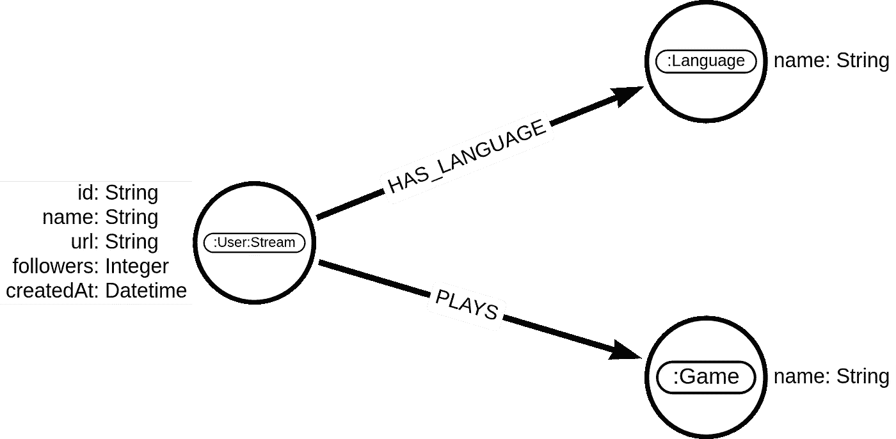
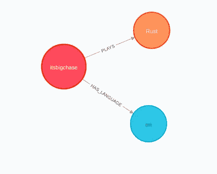
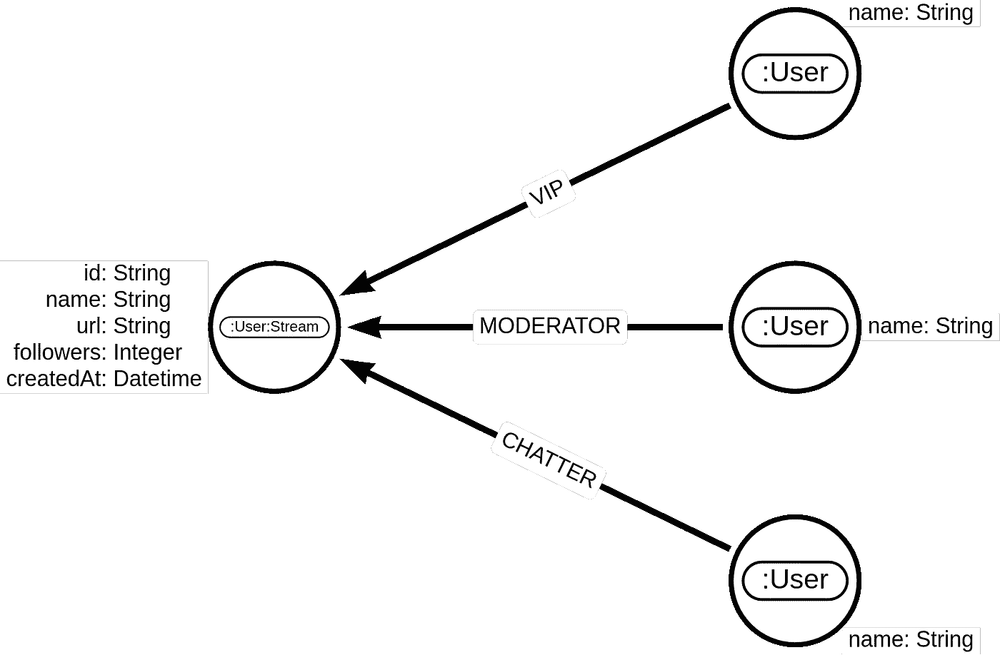
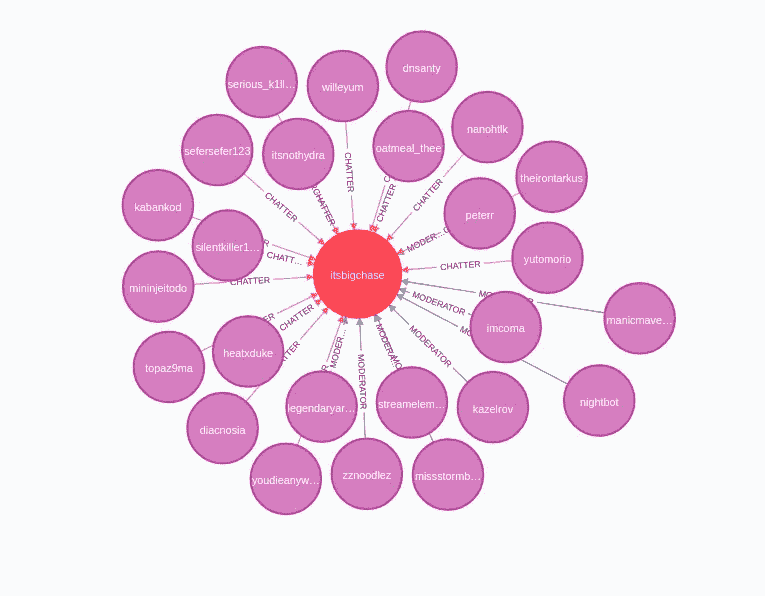
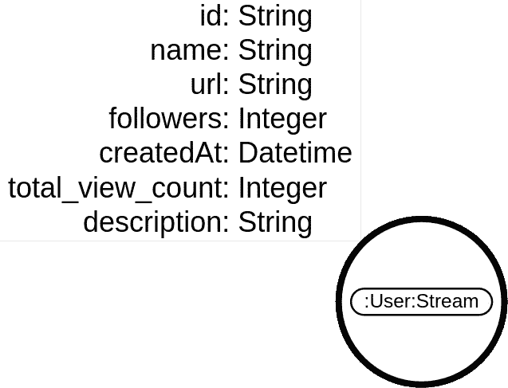
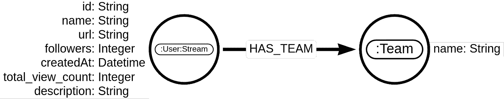
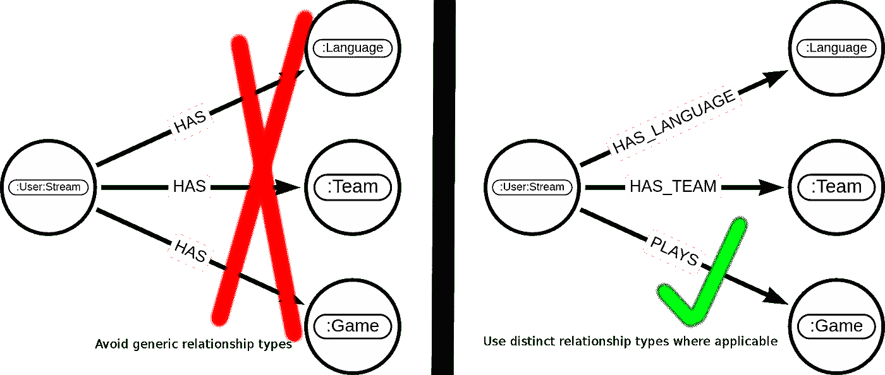

# Twitchverse:在 Neo4j 中构建 Twitch 知识图

> 原文：<https://towardsdatascience.com/twitchverse-constructing-a-twitch-knowledge-graph-in-neo4j-78f03276c1f7?source=collection_archive---------21----------------------->

## 了解如何在 Neo4j 中设计和构建描述 Twitch 宇宙的知识图

我从 Twitch 帖子上的可视化公共数据中获得了 [**见解的灵感。作者使用**](/insights-from-visualizing-public-data-on-twitch-a73304a1b3eb) **[Gephi](https://gephi.org/) 对 Twitch 网络进行图形分析，并将结果可视化。Twitch 是一个在线平台，允许用户通过直播分享他们的内容。Twitch streamers 通过与粉丝共享他们的屏幕来广播他们的游戏或活动，粉丝可以听到和观看他们的直播。我想知道如果我们使用图形数据库而不是 Gephi 来存储网络信息，我们可以进行什么样的分析。这篇博文将向你展示如何在 [Neo4j](https://neo4j.com/) 中设计和构建知识图。数据将通过官方的 [Twitch API](https://dev.twitch.tv/docs/api/) 获取。**

## 环境设置

你需要 Twitch API 的证书来关注这篇博文。如果你已经在 Twitch 上创建了一个用户，你可以在 [Twitch 令牌生成器站点](https://twitchtokengenerator.com/)上获得访问令牌和客户端 id，这是获得凭证最简单的方法。一旦你完成了这个步骤，你应该准备好**客户端 id** 和**访问令牌**(记住，访问令牌不是客户端秘密)。

接下来，您需要访问 Neo4j 数据库实例。最直接的解决方案是使用 Neo4j 沙箱，Neo4j 数据库的免费云实例。如果选择此路线，请选择使用空白沙盒项目。如果你愿意，你也可以在本地安装 [Neo4j 桌面](https://neo4j.com/download/)。

## 导入关于当前热门观看的流的信息

首先，我们将从 Twitch API 导入关于当前直播流的信息。API 文档可从[这里](https://dev.twitch.tv/docs/api/reference#get-streams)获得。我们可以获取当前直播的 1000 个观看次数最多的流的数据。API 响应包含以下信息:

*   流媒体工具名称和 id
*   他们正在玩的游戏
*   溪流的语言

想想我们应该如何将这些信息存储为图表。我们用哪些信息作为节点，哪些作为关系？回答你的一些问题，随着时间的推移，用户可以玩很多游戏，使用很多语言。此外，流可以表现得像普通用户一样，订阅其他流，在他们的聊天中交谈等。通常情况下，需要不止一次的图建模过程迭代才能得到正确的结果。下面的图模型是我的第二次迭代。



图形模型来存储有关 streamers 的信息。图片由作者提供。

我已经使用 [arrows 应用程序](https://arrows.app/)绘制了这篇博文中的所有图表。

如你所见，streamer 只是一个 Twitch 用户，他也广播他们的内容。我已经决定为 Twitch 网络中的所有用户使用一个*用户*标签，并为也进行流传输的用户添加一个二级*流*标签。我们知道一个流有多少追随者，在哪里可以找到这个流，以及用户是什么时候被创建的。我们将这些附加信息存储为节点属性。

语言和游戏信息以[分类节点](https://medium.com/neo4j/graph-data-modeling-categorical-variables-dd8a2845d5e0)的形式存储。分类节点用于存储关于值数量有限的变量的信息。在我们的例子中，所玩的游戏和语言具有有限的价值。用户可以与游戏节点有一个或多个关系。也许在周五，他们更喜欢玩 Valorant，周日他们喜欢玩扑克。我们的图模型忽略了这个信息的时间成分。我们也不存储流玩家玩游戏的次数作为关系权重。我们忽略这两个数据点，因为我们必须优化数据收集过程来提取这些信息。

在继续之前，请确保在 Neo4j 中定义惟一的约束，以优化导入查询的性能。

```
CREATE CONSTRAINT ON (s:Stream) ASSERT s.name IS UNIQUE;
CREATE CONSTRAINT ON (u:User) ASSERT u.name IS UNIQUE;
CREATE CONSTRAINT ON (g:Game) ASSERT g.name IS UNIQUE;
CREATE CONSTRAINT ON (l:Language) ASSERT l.name IS UNIQUE;
CREATE CONSTRAINT ON (t:Team) ASSERT t.id IS UNIQUE;
```

我从事 Neo4j 数据库工作已经有五年了。大约一两个月后，我了解到 [APOC 库](https://neo4j.com/labs/apoc/)是一个必须与 Neo4j 数据库结合使用的插件。它具有许多实用功能，可以帮助您立即解决您的问题。我最喜欢的 APOC 手术从一开始就是，现在仍然是`apoc.load.json`手术。它允许打开 JSON 文件，更重要的是，从任何返回 JSON 的 API 端点获取数据。仅使用 Cypher，您可以抓取各种 API 端点，并在没有任何外部工具的情况下构建知识图。多牛逼啊！它还支持请求中的自定义头和有效负载。在[文档](https://neo4j.com/labs/apoc/4.1/import/load-json/)中了解更多关于`apoc.load.json`程序的信息。

为了导入关于 streamers 的信息，您需要附近有 Twitch API **client_id** 。streams 端点支持分页，并允许导出多达 1000 个活动流，每个请求最多 100 个流。端点有一个可用于分页的*偏移量*参数。为了用递增的偏移量参数执行十个请求，我们使用

```
UNWIND range(0, 900, 100) as offset
```

该语句将对偏移量的每个值执行请求。range 子句与 Python 中的 range 函数非常相似。我们告诉它，我们想要创建一个从 0 开始到 900 结束的列表，步长为 100。

如果我们将分页、请求和存储响应放在一个 Cypher 语句中，我们将得到下面的查询:

```
WITH $client_id as client_id
//prepare pagination
UNWIND range(0,900,100) as offset
//Make an API request
WITH "https://api.twitch.tv/kraken/streams/?limit=100&offset=" + toString(offset) AS url, client_id
CALL apoc.load.jsonParams(url,{Accept: "application/vnd.twitchtv.v5+json", `Client-ID`:client_id},null) YIELD value
//Iterate over results in the response
UNWIND value.streams as stream
//Store streamer information
MERGE (s:User{name:stream.channel.name})
SET s.followers = stream.channel.followers,
    s.url = stream.channel.url,
    s.createdAt = datetime(stream.channel.createdAt),
    s:Stream,
    s.id = stream.channel.`_id`
//Store game information
MERGE (g:Game{name:stream.game})
MERGE (s)-[:PLAYS]->(g)
//Store language information
MERGE (l:Language{name:stream.channel.language})
MERGE (s)-[:HAS_LANGUAGE]->(l);
```

现在，您的 Neo4j 数据库中应该有关于 1000 条 streamers 的信息。为了检查该图，我们可以看一下数据库中的单个流。运行以下 cypher 查询来获取单个流的游戏和语言信息:

```
MATCH (s:Stream)
WITH s LIMIT 1
MATCH p=()<-[:HAS_LANGUAGE]-(s)-[:PLAYS]->()
RETURN p
```

您可以在 Neo4j 浏览器中可视化结果。您应该会看到类似下图的内容。



单个流、其语言和他们玩的游戏的网络可视化。图片由作者提供。

## 导入关于聊天者的信息

在 Twitch 上，用户可以通过在聊天中输入评论来与 streamers 互动。幸运的是，Twitch 有一个 API 端点，允许我们检索关于特定流的聊天者的信息。这个 API 端点不需要任何授权。如果你想知道谁是 *botezlive* 流中的聊天者，你可以通过打开下面的链接获得这些信息:

```
http://tmi.twitch.tv/group/user/botezlive/chatters
```

关于 chatter 的信息存储在三个独立的数组中，指示 chatter 是流的 VIP、流的版主还是普通用户。还有 global_mod，和 admin 数组返回，但是据我所见都是空的，我们就忽略了。

在导入关于 chatters 的信息之前，让我们考虑一下应该如何定义图模型。从 API 端点响应中，我们了解到我们可以区分 chatter 是版主、VIP 还是普通用户。我们希望在我们的知识图中存储用户、版主和 VIP 之间的这种差异。我用不同的关系类型来表示这种区别。



颤振信息的图形模型。图片由作者提供。

我第二喜欢的 APOC 手术是`apoc.periodic.iterate`手术。它允许我们批量处理交易。这在处理大型数据结构时非常有用。在我们的例子中，单个拖缆可以有数千个抖动，如果我们检索 1000 个拖缆的抖动信息，我们可以处理大量数据。`apoc.periodic.iterate`过程接受两个带有可选配置图的 Cypher 语句。第一个 Cypher 语句返回我们想要迭代的数据列表。第二条语句从第一条 Cypher 语句中获取信息，通常将信息存储到 Neo4j 中。在配置图中，我们可以定义批量大小。批量大小表示单个事务中应该添加多少次迭代。在[文档](https://neo4j.com/labs/apoc/4.1/graph-updates/periodic-execution/)中了解更多关于 APOC 配料的信息。

如果我们把它们放在一起，我们可以返回`apoc.periodic.iterate`过程的第一个 Cypher 语句中的所有 streamers。在第二条语句中，我们创建了一个对 Twitch API 端点的请求，并存储了结果。我使用了值为 1 的 *batchSize* 参数来批处理每个请求，并在单独的事务中存储响应。

```
// Import mods/vip/chatters for each stream
CALL apoc.periodic.iterate(
   // Return all stream nodes
  'MATCH (s:Stream) RETURN s',
  'WITH s, "http://tmi.twitch.tv/group/user/" + s.name + "/chatters" as url     
  //Fetch chatter information  
  CALL apoc.load.json(url) YIELD value     
  WITH s, value.chatters as chatters     
  // Store information about vips
  FOREACH (vip in chatters.vips | 
          MERGE (u:User{name:vip}) 
          MERGE (u)-[:VIP]->(s))
  //Store information about moderators
  FOREACH (mod in chatters.moderators | 
          MERGE (u:User{name:mod}) 
          MERGE (u)-[:MODERATOR]->(s))
  //Store information about regular users
  FOREACH (chatter in chatters.viewers | 
          MERGE (u:User{name:chatter}) 
          MERGE (u)-[:CHATTER]->(s))',
{batchSize:1})
```

您可以结合获取前 1000 个活动流来重复此查询，以收集关于 Twitch chatter 网络的更多信息。要检查信息存储是否正确，可以执行以下 Cypher 查询:

```
MATCH (s:Stream)
WITH s LIMIT 1
MATCH p=(s)<-[:MODERATOR|VIP|CHATTER]-()
RETURN p LIMIT 25
```

如果您在 Neo4j 浏览器中可视化该查询的结果，您应该会看到类似于下面的可视化内容:



导入 chatter 网络的结果。图片由作者提供。

## 导入有关 streamers 的详细信息

有一个单独的 Twitch API 端点，我们可以使用它来获取关于每个流的更多详细信息，比如总视图计数生存期。API 端点参考可在[此链接](https://dev.twitch.tv/docs/api/reference#get-users)上获得。我们已经学习了如何结合`apoc.load.json`和`apoc.periodic.iterate`过程从 API 端点获取信息。

我们应该如何存储附加描述和总历史视图计数信息？它们不是分类变量，每个流只有一个值。我认为将它们存储为节点属性是最有意义的。



将总视图计数和描述存储为节点属性。图片由作者提供。

如上所述，我们结合了`apoc.periodic.iterate`和`apoc.load.json`过程来从 Twitch API 端点获取这些信息。

```
CALL apoc.periodic.iterate(
  'MATCH (s:Stream) RETURN s',
  'WITH s, 
        "https://api.twitch.tv/helix/users?login=" + s.name as url, 
        "Bearer <access token>" as auth, $client_id as client_id
   CALL apoc.load.jsonParams(url,
       {Authorization: auth, `Client-ID`:client_id},null)
   YIELD value
   SET s.id = value.data[0].id, 
       s.total_view_count = value.data[0].view_count,
       s.createdAt = datetime(value.data[0].created_at),
       s.description = value.data[0].description',
{batchSize:1})
```

## 导入 streamer 团队信息

每个 streamer 可以属于 Twitch 上的零个、一个或多个团队。这是我们将在这篇博文中导入的最后一个信息。我将让您稍微思考一下我们应该如何存储一个 streamer 属于哪个团队的信息。我可以给你一个提示，它属于分类变量范畴。每个流可以属于零个、一个或多个团队。Twitch 上的团队数量有限。



Twitch 团队信息的图模型。图片由作者提供。

您可以在图形建模过程中看到重复的模式。需要注意的一点是，您应该尽可能使用不同的关系类型，这一点没有明确提到。您希望避免像 *HAS、*这样的通用关系类型，尤其是当它在许多不同的场景中使用时。



图片由作者提供。

现在，你应该已经熟悉了`apoc.periodic.iterate`和`apoc.load.json`程序。同样，我们将使用与之前相同的 cypher 查询结构从 Twitch API 端点检索数据。这里，只有端点 URL 和我们存储响应的方式发生了变化。将`apoc.periodic.iterate`与值为 1 的 **batchSize** 参数一起使用的另一个好处是，即使任何 API 请求失败，它也不会终止 Cypher 查询。Neo4j 是一个 ACID 数据库，它会等到整个事务成功后再提交数据。由于我们将每个 API 请求分解到一个单独的事务中，所以我们不会遇到这样的问题:如果一千个请求中只有一个失败，我们就不会将任何信息存储到数据库中。例如，对于大约 1–2%的请求，此端点会返回一个错误。当我们使用参数为 1 的 *batchSize* 时，我们会忽略这些错误。

```
CALL apoc.periodic.iterate(
  'MATCH (s:Stream) 
   WHERE exists (s.id) and NOT (s)-[:HAS_TEAM]->()
   RETURN s',
   'WITH $client_id as client_id,
         "Bearer <access token>" as auth, s
    WITH s, 
         "https://api.twitch.tv/helix/teams/channel?broadcaster_id=" + toString(s.id) as url, 
         client_id, 
         auth
    CALL apoc.load.jsonParams(url,
         {Authorization: auth, `Client-ID`:client_id},null)
    YIELD value
    WITH s, value.data as data
    WHERE data IS NOT NULL
    UNWIND data as team
    MERGE (t:Team{id:team.id})
    ON CREATE SET t.name = team.team_display_name,
                  t.createdAt = datetime(replace(trim(split(team.created_at,"+")[0]), " ", "T"))        
    MERGE (s)-[:HAS_TEAM]->(t)',
{batchSize:1})
```

## 摘要

希望你已经学会了如何借助 APOC 程序在 Neo4j 中有效地刮 API 端点。一步一步地，我们将额外的信息导入到我们的图表中，最终得到了一个描述 Twitch 宇宙的知识图表。


抽动知识图图式。图片由作者提供。

在我的下一篇博客文章中，我将演示如何使用 Cypher 查询语言和图算法来分析这个图。敬请期待！

*p.s .如果你想玩 Twitch 图而不用自己导入数据，我准备了一个* [*Neo4j 数据库转储*](https://drive.google.com/file/d/1ZR_SBEyEmOmxd6v-02kOARlnbq-VVpl_/view?usp=sharing) *包含 1000 万个节点和 2000 万个关系。数据是在 2021 年 5 月 7 日到 9 日之间收集的。*