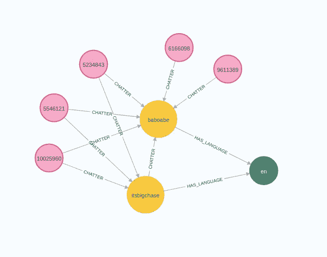
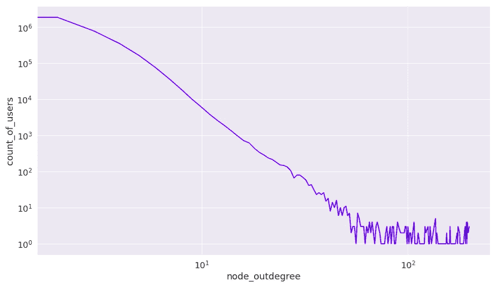
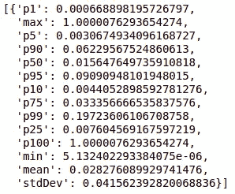
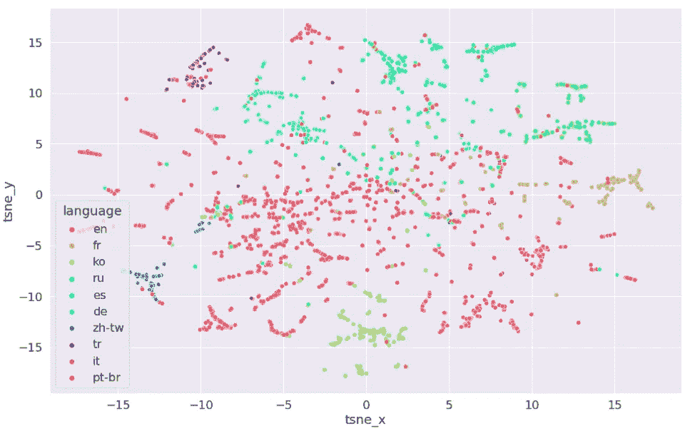
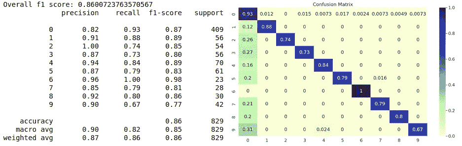
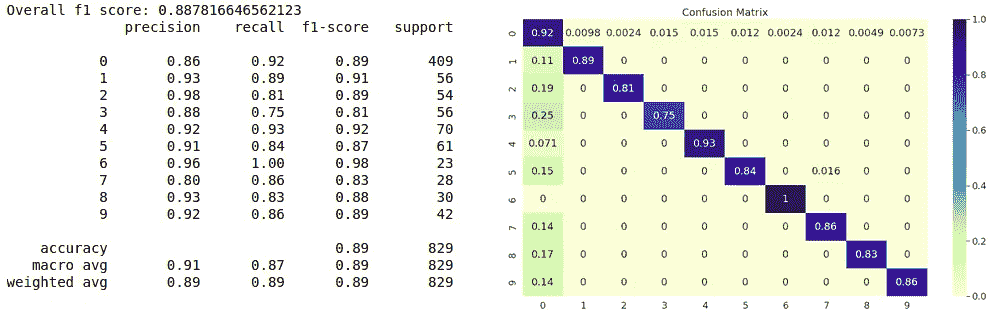
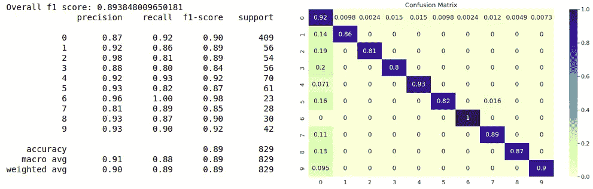
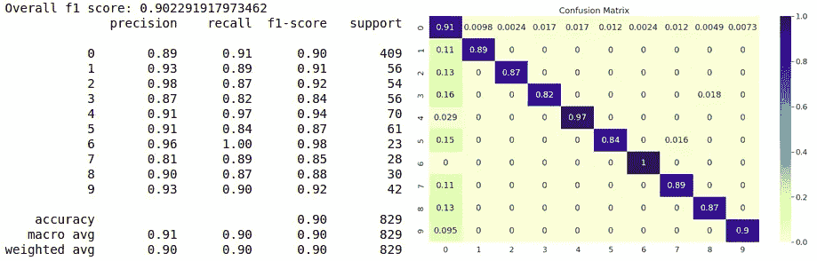
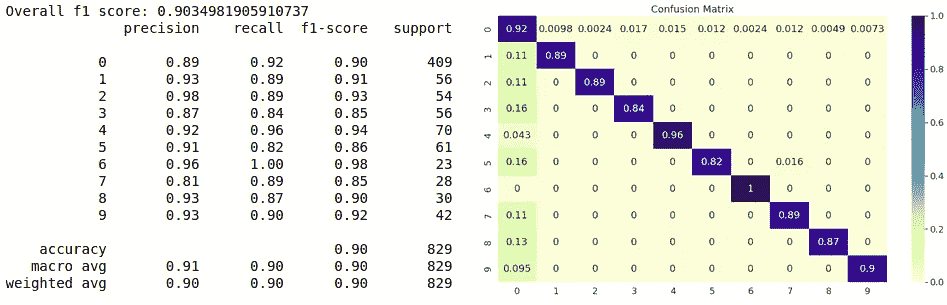

# Twitchverse:为节点分类任务使用 FastRP 嵌入

> 原文：<https://towardsdatascience.com/twitchverse-using-fastrp-embeddings-for-a-node-classification-task-bb8d34aa690?source=collection_archive---------27----------------------->

## 通过使用 FastRP 嵌入算法提取关系的值，以产生用于下游节点分类任务的特征

这是我的 Twitchverse 系列的第三篇文章。前两个是:

1.  [Twitchverse:在 Neo4j 中构建 Twitch 知识图](/twitchverse-constructing-a-twitch-knowledge-graph-in-neo4j-78f03276c1f7)
2.  [Twitchverse:使用 Neo4j 图形数据科学对 Twitch 宇宙进行网络分析](/twitchverse-a-network-analysis-of-twitch-universe-using-neo4j-graph-data-science-d7218b4453ff)

别担心。这篇文章是独立的，所以如果你不感兴趣的话，你不需要检查前面的文章。然而，如果你对我如何构建 Twitch 知识图和执行网络分析感兴趣，可以去看看。你也可以在 Neo4j 中加载[数据库转储](https://drive.google.com/file/d/10ItwlJdzLzNOYg7yRASVqkiG7XByV8EA/view?usp=sharing)，所有代码都可以作为 [Jupyter 笔记本](https://github.com/tomasonjo/blogs/blob/master/twitch_analysis/Twitch%20classification.ipynb)获得。

## 议程

在这篇博文中，我展示了如何使用节点嵌入算法 [FastRP](https://arxiv.org/pdf/1908.11512.pdf) 作为 ML 分类器的输入。这个想法是基于共同聊天网络来预测流媒体播放的语言。我们将假设，如果用户在多个流中聊天，则这些流很可能以相同的语言广播。然后，我们将使用 FastRP 嵌入来为我们的分类模型设计特征。概括地说，这篇文章可以分为以下几个步骤:

1.  数据清理
2.  推断共同聊天网络
3.  FastRP 嵌入
4.  评估分类准确性

## 图形模型


抽动图模式。图片由作者提供。

我们的 Twitch 知识图由流媒体和在广播中聊天的用户组成。还有一些关于流媒体的额外元数据，如语言和他们玩的游戏。



用户在流中聊天的示例子图。每个流有一个指定的语言。图片由作者提供。

这里有一个在流(黄色)中聊天的用户(紫色)的小子图。示例中的两条飘带都以英语(绿色)广播。Twitch 的一个特例是 streamer 可以像普通用户一样，通过在聊天中发表评论来参与其他 streamer 的广播。我们可以观察到在两个流中都聊过的三个用户。两条飘带之间的对话越多，它们就越有可能使用同一种语言。

## 数据清理

我们将从探索数据集开始。让我们先来看看这些语言以及有多少飘带在广播中使用它们。

```
MATCH (l:Language)
RETURN l.name as language,
       size((l)<--()) as numberOfStreams
ORDER BY numberOfStreams
DESC
```

*结果*

在我们的图表中总共有 30 种不同的语言。由于样本量小，我们不得不在分类任务中排除一些语言。我决定排除所有少于 100 条的语言。

```
MATCH (l:Language)
WHERE size((l)<--()) < 100
MATCH (l)<--(streamer)
SET streamer:Exclude
RETURN distinct 'success' as result
```

接下来，我们将检查是否有任何飘带用一种以上的语言广播。

```
MATCH (s:Stream)
WHERE size((s)-[:HAS_LANGUAGE]->()) > 1
MATCH (s)-[:HAS_LANGUAGE]->(l)
RETURN s.name as streamer, collect(l.name) as languages
```

*结果*

只有一位流送员分配了一种以上的语言。Gige 用英语和匈牙利语广播。我们已经排除了匈牙利属于的所有少于 100 个 streamers 的语言，所以我们在进一步的分析中将忽略 Gige。

现在，我们将查看知识图中的用户。绘制节点出度分布是有意义的。在这种情况下，out-degree 通知我们用户聊天的流的数量。

```
MATCH (u:User)
WHERE NOT u:Exclude
WITH u, size((u)-[:CHATTER|VIP|MODERATOR]->()) as node_outdegree
RETURN node_outdegree, count(*) as count_of_users
ORDER BY node_outdegree ASC
```

*结果*



节点外向度分布。图片由作者提供。

这个折线图是用 [Seaborn 库](https://seaborn.pydata.org/index.html)可视化的。在我们的数据库中有大约 5000 个 streamers，所以最大可能的出度是 5000。这些数据是在三天的时间内获取的。我大胆猜测，在超过 1000 个流中聊天的用户极有可能是机器人。我选择 200 作为实际的阈值，因此超过三天在 200 个流中交谈的用户将被忽略。我认为这已经很慷慨了。要达到这个门槛，你每天必须聊天超过 60 次。

```
MATCH (u:User)
WHERE NOT u:Exclude
WITH u, size((u)-[:CHATTER|VIP|MODERATOR]->()) as node_outdegree
WHERE node_outdegree > 200
SET u:Exclude
```

最活跃的版主也极有可能实际上是机器人。

```
MATCH (u:User)
WHERE NOT u:Exclude
RETURN u.name as user, size((u)-[:MODERATOR]->()) as mod_count
ORDER BY mod_count DESC LIMIT 10
```

*结果*

看来我的假设是正确的。大多数高度活跃的版主的名字中都有一个机器人。我们也将排除那些在获取数据的三天内参与超过 10 个流的版主。

```
MATCH (u:User)
WHERE NOT u:Exclude
WITH u, size((u)-[:MODERATOR]->()) as mod_count
WHERE mod_count > 10
SET u:Exclude
```

## 列车测试数据分割

在我们进行训练测试数据分割之前，让我们快速刷新每种语言有多少数据点。

```
MATCH (l:Language)<-[:HAS_LANGUAGE]-(s:Stream)
WHERE NOT s:Exclude
RETURN l.name as language, count(*) as numberOfStreams
ORDER BY numberOfStreams DESC
```

*结果*

到目前为止，最常用的语言是英语。接下来是西班牙语、德语和俄语。出于某种原因，Twitch 决定区分英语和英国英语。我们将不会在分类任务中进行这种区分，并将它们视为相同。相反，我们将把语言写成节点属性，把英语和英国英语合并成一个类别。

```
MATCH (s:Stream)-[:HAS_LANGUAGE]->(l:Language)
WHERE NOT s:Exclude
SET s.language = CASE WHEN l.name = 'en-gb' THEN 'en' ELSE l.name END
```

我们将使用每种语言 80%的数据点作为训练集，剩下的 20%用于测试。

```
MATCH (s:Stream)
WHERE NOT s:Exclude
WITH s.language as language, s
ORDER BY s.name
WITH language, count(*) as count, collect(s) as streamers
WITH language, streamers, toInteger(count * 0.8) as training_size
UNWIND streamers[..training_size] as train_data
SET train_data:Train
```

为了更容易再现，我添加了按名称排序的行。当然，如果您愿意，可以使用任何随机函数来分割训练测试数据集。

## 推断共同聊天网络

这里，我们将开始使用 [Neo4j 图形数据科学库](https://neo4j.com/docs/graph-data-science/current/)。如果你需要快速复习如何使用 GDS 图书馆，我建议你查看一下 [Twitchverse 网络分析博客帖子](/twitchverse-a-network-analysis-of-twitch-universe-using-neo4j-graph-data-science-d7218b4453ff)。您应该知道，GDS 库使用一种特殊的内存图形来优化图形算法的性能。


经 GDS 文档许可复制的图像。

我们有两个选项来投影内存中的图形。这里，我们将使用 [Cypher 投影功能](https://neo4j.com/docs/graph-data-science/current/management-ops/cypher-projection/#cypher-projection)。Cypher projection 是一种更灵活的投影内存中图形的方式，但是加载性能代价很小。我已经写了一篇关于使用 Cypher projections 的详尽的博客，但是现在，知道我们使用第一个 Cypher 语句来投影节点和第二个 Cypher 语句来投影内存图的关系就足够了。

```
CALL gds.graph.create.cypher("twitch",//node projection
"MATCH (u:User) 
 WHERE NOT u:Exclude 
 RETURN id(u) as id, labels(u) as labels, 
        coalesce(u.followers,0) as followers,
        coalesce(u.total_view_count,0) as total_view_count",//relationship projection
"MATCH (s:User)-->(t:Stream)
 WHERE NOT s:Exclude AND NOT t:Exclude
 RETURN id(t) as source, id(s) as target",
{validateRelationships:false})
```

在第一个语句中，我们已经投影了所有没有用 Exclude secondary 标签标记的用户节点。添加节点标签允许我们在算法执行时过滤节点。这将使我们能够在计算 FastRP 嵌入时只过滤流节点。我们还包括了*跟随器*和 *total_view_count* 节点属性。在第二个语句中，我们投射了用户和 streamers 之间的所有关系。这些关系指示哪些用户在特定流媒体工具的广播中聊天。

为了推断流之间的共同聊天网络，我们将使用[节点相似性算法](https://neo4j.com/docs/graph-data-science/current/algorithms/node-similarity/)。节点相似性算法使用 Jaccard 相似性分数，根据共享 chatters 的数量来比较一对节点的相似程度。


节点相似度算法示意图。图片由作者提供。

如前所述，一对飘带越是相同，我们就越会认为它们相似。我们将结果关系命名为 **SHARED_AUDIENCE** ，这正是我们在本例中所做的，评估 streamers 的共享受众。节点相似性算法有两个非常重要的超参数需要调整:

*   TopK:一个节点的存储关系数。将存储相似性得分最高的 K 个关系。
*   SimilarityCutoff:出现在结果中的相似性得分的下限。分数低于 similarityCutoff 的任何关系将在结果中被自动忽略。

我总是喜欢首先使用算法的 **stats** 模式来评估相似性得分分布。

```
CALL gds.nodeSimilarity.stats("twitch")
YIELD similarityDistribution
RETURN similarityDistribution
```

*结果*



节点相似度分布结果。图片由作者提供。

我们得到百分位值形式的分布。平均来说，一对流媒体共享大约 3%的用户。只有 10%的流媒体共享超过 6%的用户。平均来说，彩带没有分享很多他们的观众。这可能有点失真，因为数据仅在 3 天内检索，并且仅考虑了参与聊天的用户。我们将把 **similarityCutoff** 参数保留为默认值 1E-42，这是一个非常小的数字，但比 0 稍大。当一对拖缆共享至少一个用户时，将考虑它们之间的关系。现在，我们必须决定 **topK** 值。topK 参数会严重影响生成的单部分投影的密集或稀疏程度。经过反复试验，我决定使用 topK 值 25。

```
CALL gds.nodeSimilarity.mutate("twitch", 
  {topK:25, mutateProperty:'score', mutateRelationshipType:'SHARED_AUDIENCE'})
```

## FastRP 嵌入

> F ast 随机投影，简称 FastRP，是随机投影算法家族中的一种节点嵌入算法。这些算法在理论上得到 Johnsson-Lindenstrauss 引理的支持，根据该引理，可以将任意维的 *n* 个向量投影到 *O(log(n))* 维中，并且仍然近似保持点之间的成对距离。事实上，以随机方式选择的线性投影满足此属性。

*抄自* [*文献*](https://neo4j.com/docs/graph-data-science/current/algorithms/fastrp/#algorithms-embeddings-fastrp-introduction) *。*

如果您想了解更多用于计算节点嵌入的底层数学知识，我建议您查看文档。节点嵌入算法计算图中节点的固定大小向量或嵌入表示。当我们想要在下游机器学习工作流中使用网络功能时，这非常有用。

通过使用下面的 Cypher 查询，我们可以很容易地检索节点的 FastRP 嵌入。

```
CALL gds.fastRP.stream(
  "twitch",
  {nodeLabels:['Stream'], relationshipTypes:['SHARED_AUDIENCE'],
   relationshipWeightProperty:'score', embeddingDimension: 64}
) YIELD nodeId, embedding
WITH gds.util.asNode(nodeId) as node, nodeId, embedding
RETURN nodeId, embedding, node.language as language, CASE WHEN node:Train then 'train' else 'test' END as split
```

用 t-SNE 散点图来可视化结果节点嵌入是非常常见的。以下可视化代码以 [Jupyter 笔记本](https://github.com/tomasonjo/blogs/blob/master/twitch_analysis/Twitch%20classification.ipynb)的形式提供。



语言着色嵌入的 TSNE 结果。图片由作者提供。

数据点根据其语言进行着色。仅仅通过观察散点图，很明显节点嵌入很好地捕捉了流的语言。好像只有英语有点遍地，其他小语种形成可爱的集群。

## 分类任务评估

最后，让我们检查一下基于 FastRP 嵌入的广播语言预测有多好。我们已经在前面的步骤中完成了 train-test 分割，所以剩下唯一要做的事情就是导出那些嵌入，并将它们输入到分类模型中。在这个例子中，我们将使用随机森林分类器。我准备了一个助手函数，它将接受一个 cypher 查询，并返回一个分类报告和混淆矩阵作为输出。

现在，我们可以继续输入与上面相同的查询来生成分类报告。

```
CALL gds.fastRP.stream(
  "twitch",
  {nodeLabels:['Stream'], relationshipTypes:['SHARED_AUDIENCE'],
   relationshipWeightProperty:'score', embeddingDimension: 64}
) YIELD nodeId, embedding
WITH gds.util.asNode(nodeId) as node, nodeId, embedding
RETURN nodeId, embedding, node.language as language, CASE WHEN node:Train then 'train' else 'test' END as split
```

*结果*



分类报告和混淆矩阵。图片由作者提供。

在没有对 FastRP 或随机森林算法超参数进行任何微调的情况下，我们得到 86%的 f1 分数。太棒了。看来我们的假设是正确的，即聊天者通常在共享同一种语言的流中聊天。通过检查混淆矩阵，我们可以观察到该模型仅在英语和小语种之间进行了错误分类。例如，该模型从未错误地将朝鲜语归类为葡萄牙语。这是有道理的，因为英语是互联网的语言，所以每个人都可以说至少他们的母语和一点英语。

现在，我们将尝试优化 FastRP 算法的超参数，以实现更高的精度。

**关系权重**

我在前面的查询中使用了关系权重，因为我们可以从节点相似性算法中获得它们。我们可以用**参数**输入它们。在试验了这些设置之后，我注意到忽略关系权重属性会产生更好的结果。

```
CALL gds.fastRP.stream(
  "twitch",
  {nodeLabels:['Stream'], relationshipTypes:['SHARED_AUDIENCE'],embeddingDimension: 64}
) YIELD nodeId, embedding
WITH gds.util.asNode(nodeId) as node, nodeId, embedding
RETURN nodeId, embedding, node.language as language, CASE WHEN node:Train then 'train' else 'test' END as split
```

*结果*



分类报告和混淆矩阵。图片由作者提供。

现在，没有任何东西暗示忽略关系权重总是会产生更好的结果。您应该在数据集上进行测试，并比较结果以做出最终决定。

**嵌入尺寸**

嵌入尺寸超参数定义输出向量或嵌入的大小。我在[文档](https://neo4j.com/docs/graph-data-science/current/algorithms/fastrp/#_embedding_dimension)中找到了一些通用指南:

> 最佳嵌入维数取决于图中节点的数量。由于嵌入可以编码的信息量受到其维数的限制，所以较大的图往往需要较大的嵌入维数。典型值是 2 的幂，范围在 128-1024 之间。值至少为 256 时，在 105 个节点的图表中会得到较好的结果，但通常增加维度会改善结果。然而，增加嵌入维数会线性增加内存需求和运行时间。

尽管我们的图很小，只有 5000 条流，我还是决定测试不同嵌入维度参数的结果。似乎将嵌入维数参数增加到 512 会产生更好的结果。

```
CALL gds.fastRP.stream(
  "twitch",
  {nodeLabels:['Stream'], relationshipTypes:['SHARED_AUDIENCE'],
   embeddingDimension: 512}
) YIELD nodeId, embedding
WITH gds.util.asNode(nodeId) as node, nodeId, embedding
RETURN nodeId, embedding, node.language as language, CASE WHEN node:Train then 'train' else 'test' END as split
```

*结果*



分类报告和混淆矩阵。图片由作者提供。

**迭代权重**

我们可以调整的下一个超参数是迭代权重。[文档](https://neo4j.com/docs/graph-data-science/current/algorithms/fastrp/#_iteration_weights)声明如下:

> 迭代权重参数控制两个方面:迭代次数，以及它们对最终节点嵌入的相对影响。该参数是一个数字列表，指示每个数字的一次迭代，其中该数字是应用于该迭代的权重。

在对迭代权重参数进行了一些试验之后，我发现使用下面的值可以进一步提高精确度。

```
CALL gds.fastRP.stream(
  "twitch",
  {nodeLabels:['Stream'], relationshipTypes:['SHARED_AUDIENCE'],
   embeddingDimension: 512,
   iterationWeights:[0.1, 0.5, 0.9, 1.0, 1.0]}
) YIELD nodeId, embedding
WITH gds.util.asNode(nodeId) as node, nodeId, embedding
RETURN nodeId, embedding, node.language as language, CASE WHEN node:Train then 'train' else 'test' END as split
```

*结果*



分类报告和混淆矩阵。图片由作者提供。

**归一化权重**

另一个可以优化的参数是归一化权重。[文档](https://neo4j.com/docs/graph-data-science/current/algorithms/fastrp/#_normalization_strength)再次声明:

> 归一化强度用于控制节点度数如何影响嵌入。使用负值会降低高度邻居的重要性，而使用正值会增加它们的重要性。最佳归一化强度取决于图和嵌入将用于的任务。

在我们的例子中，试图优化这个参数是没有意义的，因为所有节点都应该具有完全相同的 25 度。如果您还记得，我们使用了 topK 值为 25 的节点相似性算法，这意味着每个节点都将连接到它的前 25 个邻居。

**使用节点属性**

FastRP 算法可以扩展到也考虑节点属性。我注意到，如果我们将**追随者**的数量考虑在内，分类的准确性会稍微增加。看起来追随者计数可能有助于区分英语和其他语言。我猜英国横幅有更多的追随者，但这只是一种直觉。

```
CALL gds.beta.fastRPExtended.stream(
  "twitch",
  {nodeLabels:['Stream'], relationshipTypes:['SHARED_AUDIENCE'],
   embeddingDimension: 512, featureProperties: ['followers'],
   iterationWeights:[0.1, 0.5, 0.9, 1.0, 1.0]}
) YIELD nodeId, embedding
WITH gds.util.asNode(nodeId) as node, nodeId, embedding
RETURN nodeId, embedding, node.language as language, CASE WHEN node:Train then 'train' else 'test' END as split
```

*结果*



分类报告和混淆矩阵。图片由作者提供。

## 结论

我们只使用了网络功能，没有使用其他功能，却获得了高达 90%的 f1 分数。我认为这非常棒，并有助于解决其他任务，从而查看数据点之间的关系可能会提供非常准确的结果。

和往常一样，代码可以在 [GitHub](https://github.com/tomasonjo/blogs/blob/master/twitch_analysis/Twitch%20classification.ipynb) 上获得。