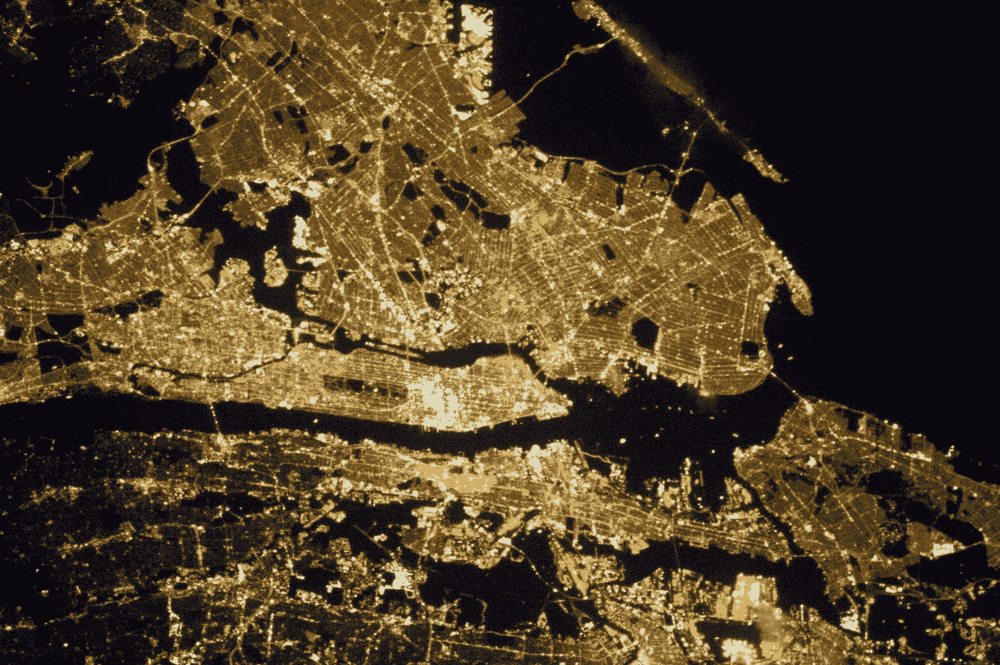
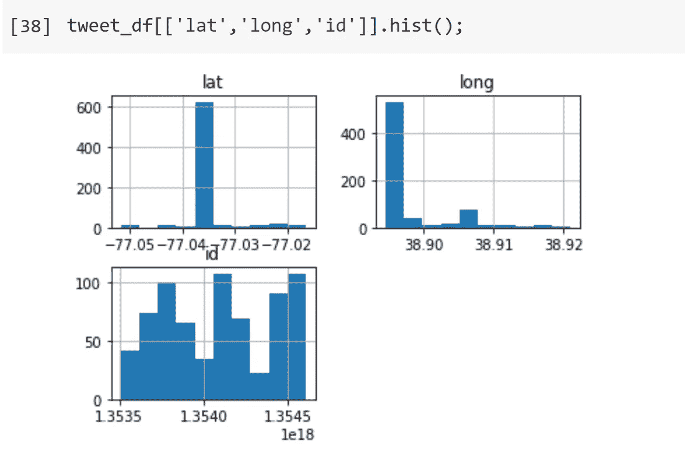
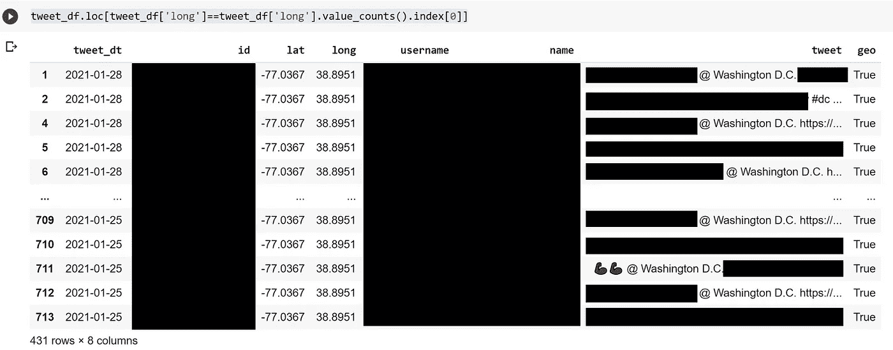
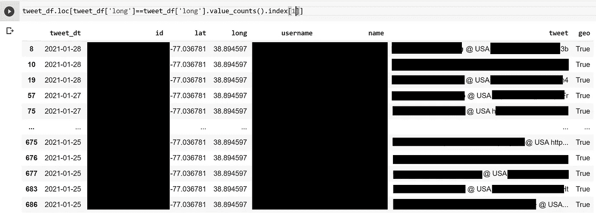
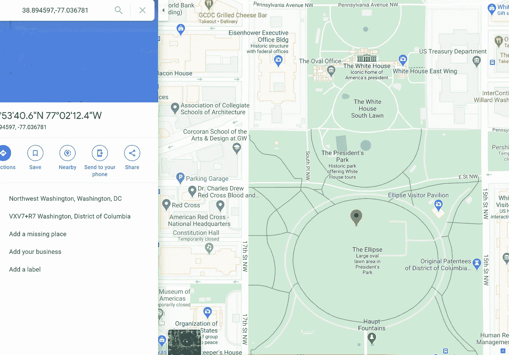
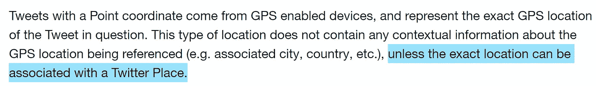

# Twitter 位置分析

> 原文：<https://towardsdatascience.com/twitter-location-analysis-c488c967a41f?source=collection_archive---------13----------------------->

## 每天发送超过 5 亿条推文，有可能跟踪社会运动模式吗？



大纽约市都会区| [美国宇航局](https://www.nasa.gov/multimedia/imagegallery/image_feature_2480.html)

推特是一个令人印象深刻的数据来源，推特上有如此多的关于社会情绪的信息。事实上，一些工作已经表明，聚合的推文数据可以作为社会[幸福](https://cdanfort.w3.uvm.edu/research/2011-hedonometer-arxiv.pdf)的一个衡量标准！Twitter 的字符限制很短，但却非常流行，听起来像是真实反映社会思想的完美结合。

除了文本方面，推文还可以包含重要的位置信息。某些用户同意与 Twitter 分享他们的推文位置。这潜在地增加了另一层信息。在不久的将来，添加多个实时信息层，如交通流量、事件、来自智能城市基础设施的信号等，对于跟踪日益复杂的社会非常有益。

我写这篇文章的最初目标是从推文中提取位置信息，并分析它们在不同人群中的代表性。毕竟，如果推文是商业案例中社会或客户的一个指标，那么对来自不同社会经济背景的不同人群进行适当采样是很重要的。我会通过比较推文分布和人口普查数据来做到这一点。在实现这个简单目标的过程中，我只走了一部分。事实证明，存在一些问题，因为只有很少一部分用户同意分享他们的详细位置，Twitter 根据推文文本分配位置坐标。

# Tweepy 提取推文位置

Tweepy 是 Twitter API 的 Python 包装器。首先让我们加载 python 中的包

```
import sys
import os
import re
import tweepy
from tweepy import OAuthHandler
from textblob import TextBlob
import numpy as np
import pandas as pd
from datetime import datetime, timedelta
from IPython.display import clear_output
import matplotlib.pyplot as plt
% matplotlib inline
```

接下来，我们将使用 Tweepy 来验证用户凭证。

```
# Authenticateauth = tweepy.AppAuthHandler(consumer_key, consumer_secret)
api = tweepy.API(auth, wait_on_rate_limit=True,
wait_on_rate_limit_notify=True)if (not api):
    print (“Can’t Authenticate”)
    sys.exit(-1)
```

现在，让我们在我们想要的位置内过滤这些推文。Twitter 提供了几种方法来做到这一点——一个最大长度为 25 英里的边界框或一个最大半径为 25 英里的指定位置，反映了我们想要搜索推文的区域。

```
tweet_lst=[]
geoc=”38.9072,-77.0369,1mi”
for tweet in tweepy.Cursor(api.search,geocode=geoc).items(1000):
    tweetDate = tweet.created_at.date()
    if(tweet.coordinates !=None):tweet_lst.append([tweetDate,tweet.id,tweet.
        coordinates[‘coordinates’][0],
        tweet.coordinates[‘coordinates’][1],
        tweet.user.screen_name,
        tweet.user.name, tweet.text,
        tweet.user._json[‘geo_enabled’]])
tweet_df = pd.DataFrame(tweet_lst, columns=['tweet_dt', 'id', 'lat','long','username', 'name', 'tweet','geo'])
```

我使用了 Tweepy Cursor 对象，它考虑到了 Twitter 的每页最多 100 个结果的限制，并通过分页解决了这个问题。在第一次试验中，我限制了 1000 条距离 DC 华盛顿中心 1 英里以内的推文，以及那些具有特定经度/纬度信息的推文。

# 更深入地了解位置

在 1000 个结果中，714 个具有不同的位置信息。但是让我们看得更深一点。



纬度、经度和身份证直方图|塞犍陀·维韦克

有趣的是，只有 80 个不同的纬度/经度对，但每个 tweet 和 Twitter 用户 ID 都是不同的。所以有些奇怪的事情正在发生，所有这些用户都在完全相同的位置是没有意义的。以下是数据框，过滤最常见的经纬度对:



数据集中最常见的推文位置|塞犍陀·维维克

如果你注意到了，你会发现很多推文的文本中都有@华盛顿·DC。Twitter 默认在 DC 的一个中心位置发布任何包含@ Washington DC 的推文。



数据集中第二常见的推文位置|塞犍陀·维韦克

有趣的是，当我过滤第二个最常见的位置时，我再也看不到它了，但我确实看到了包含@ USA 的文本！根据推特，美国是一个稍微低于白宫的地方，在一个公园里！



@美国|塞犍陀·维维克的位置

通过更仔细地查看 Twitter 文档:



Twitter [开发者](https://developer.twitter.com/en/docs/tutorials/filtering-tweets-by-location)文档

虽然我想要样本用户的坐标来进行总体移动性分析，但 Twitter 从推文中的位置标签给了我信息。在 DC 最常见的标签是“华盛顿 DC”，其次是“美国”等。另一个问题是，当我将搜索范围扩大到 25 英里的半径时，我在 1000 条推文中获得了 0 条坐标信息，这可能是因为 Twitter 为引用 DC 热门地点的推文分配坐标的方式，而不是远离 DC 中心的那些英里。

下面是详细说明代码的 Google Colab 笔记本:

<https://colab.research.google.com/drive/1X9Om4lNGVRG2_LMCndVGErq8UgMKsK1C?usp=sharing>  

总之，Twitter 提供了巨大的潜力来分析社会模式，包括情绪，流动性和异常现象。然而，当涉及到地理空间分析时，由于数据的稀疏性和提供的位置含义的模糊性，存在一些限制-位置是否代表发出推文的设备的实际位置，或者它们是否对应于推文中引用的地点。

虽然 Twitter 开发人员可以对 Twitter API 进行改进，但对于大规模共享敏感位置数据的隐私问题肯定存在。就我个人而言，我愿意分享我的位置数据，以便进行有益于社会的大规模分析。但是当 Twitter 应用程序问我时，我犹豫了——因为潜在的未知伤害。我们正处于一个类似于当年核能的阶段。粒度数据具有提升社会效益的潜力。同时，作为一个社会，我们需要继续讨论如何实现这些好处，同时防范数据泄露和详细信息的滥用。

*如果你喜欢这篇文章，请跟我来——我经常在复杂系统、物理学、数据科学和社会的界面上写作*