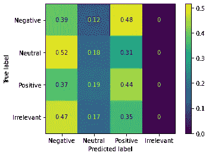

# 基于 Keras 和 NLTK 的 Twitter 情感分析

> 原文：<https://towardsdatascience.com/twitter-sentiment-analysis-with-keras-and-nltk-48189967f190?source=collection_archive---------6----------------------->

## 我们如何学会发现与各种在线实体相关的推文的情感？

社交媒体代表了人们在任何时候都可以获得的关于人们的无穷无尽的信息。困难在于如何利用这些丰富的信息。

在 [Unsplash](https://unsplash.com?utm_source=medium&utm_medium=referral) 上[视觉](https://unsplash.com/@visuals?utm_source=medium&utm_medium=referral)拍摄的照片

文本包含了很多信息，我们作为人类很容易提取。然而，对于计算机来说，这要困难得多，因为理解自然语言需要庞大的知识库和上下文。理解这种自然语言会带来巨大的好处，尤其是在情感分析方面。例如，一家公司可能希望利用社交媒体来了解公众对其产品的意见，以了解是否需要改进或公关变化(记住相关偏差，如[自我选择偏差](https://en.wikipedia.org/wiki/Self-selection_bias))。

# 数据集

Kaggle [1]上的[“Twitter 情绪分析”](https://www.kaggle.com/jp797498e/twitter-entity-sentiment-analysis)数据集是大约 74，000 条推文的集合，它们涉及的实体或公司，以及指定的情绪。有了这个数据集，我们可以尝试训练一个分类模型，根据对给定实体或公司的情感对进一步的推文进行分类。

下面给出了该数据集的一个示例。可以看到，有一些错误的数据点，例如标有“积极”的推文，推文的文本只写着“曾经”。这些推文可能会导致分类错误，但由于推文整体长度较短，它们会留在数据集中。

此项目的数据集的前几行示例。

这个数据集涵盖了几个不同的“实体”。一个容易(但不准确，不可靠！)对推文进行分类的方法是查看每个实体最常见的情绪，并预测该情绪！然而，这确实挫败了机器学习和试图理解推文中语言的意义。在接下来的部分，我们将探索一些策略来更好地理解推文中的文字，看看我们是否能比这种猜测做得更好。

# 基础数据丰富

## 一键编码

在处理 Tweet 文本之前，我们可以通过我们的模型轻松地将实体类编码成可用的数据。这可以通过一键编码轻松完成，因为数据集中只包含 32 个不同的实体，这样就增加了 32 个新列。这可以通过“get_dummies()”函数使用已经用于托管数据集本身的 [Pandas](https://pandas.pydata.org/) 模块轻松实现:

熊猫一键编码。

通过一键编码，我们允许自己从 Tweet 描述的实体中获得一些洞察力。我们的模型现在将把总体情绪与实体本身联系起来，除了 Tweet 的文本之外还将使用它。

## 预先训练的情感分析

在我们自己分析文本之前，我们可以采取的一个步骤是使用预先训练的模型来获得对原始文本的一些洞察。这些用于情感分析的预训练模型通常是在比我们将要使用的数据集大得多的数据集上训练的，并且可能从我们构建的模型中提取不同的见解。我们在这种情况下使用的预训练模型是 TextBlob，它是基于 NLTK 构建的。这个模型接受原始文本输入，有两个输出，极性和主观性。我们可以使用下面的代码片段将这些数据提取到新列中:

下面是我们如何用 TextBlob 做预建的情感分析(基于 NLTK！)

# 更多涉及丰富(文本处理)

语言处理项目的下一步是从文本中提取特征，以便机器学习模型可以更好地理解它。这包括停用词删除、标记化和词干化等步骤。

## 拆分文本

这是我们将文本拆分成其组成部分的步骤，组成部分通常对应于单个单词。这分两点完成，首先是为了我们可以执行其他步骤，然后是最终确定我们的数据。

## 停止单词删除

这一步包括删除所有实际上不传达任何信息的常用词。这些词的例子可能包括“the”、“and”和“it”。这些词一般存在于所有自然语言中，并不给出文本情感的任何信息。在大多数情况下，我们可以使用 NLTK 的停用词列表`stopwords.words()`，但是我们可能想要根据问题的上下文向该列表添加词。

## 堵塞物

词干是一个稍微复杂一点的话题，涉及到将单词简化为词干。一个单词的词干可以说是它的基本形式。例如，在这一步中，“Drive”和“Driving”都应还原为它们的词干“Drive”。在实践中，这些单词通常被简化为词干“Driv ”,将其解释为人类很奇怪，但仍然是有效的词干，因为两个单词都被简化为同一个词干。当这个奇怪的词干也是文本中出现的一个单词时，可能会出现问题，但这种情况通常很少，不会成为我们模型的主要问题。

我们实际上并没有在这个模型中实现词干来支持引理满足。

## 引理满足

引理满足是一种目的类似于词干提取的方法，但在某些情况下可能更有效。这种方法试图使用单词的上下文来将它们转换成常见的形式。比如，lemmatisation 要把“是”、“是”、“是”都转换成“是”。不幸的是，lemmatisation 的真正实现通常不能很好地执行，尽管在这种情况下，我们更喜欢它而不是词干。

## 将文本转换成可用的格式

不幸的是，我们的模型不能只接受字符串作为输入，而是要求我们以某种方式对文本进行编码。这可以通过多种方式实现，本文将探讨其中的两种方法。

**文字袋 NLP**

我们在这里考虑的第一种方法是最简单的，叫做“单词袋”NLP。此方法不考虑单词的位置，并且仅在给定字符串的任何位置包含单词时才进行编码。我们可以用 Keras 的 tokenizer，通过`texts_to_matix()`方法来做到这一点。这为我们提供了一个矩阵，每一列对应一个给定的单词，每一行包含一个指示器，显示该行的文本是否包含该单词。该矩阵中的列数由测试的字数决定，该字数在定义标记器时确定。

**符号化**

在标记化中，我们专注于保持单词的顺序。我们可以使用 Keras 的 tokeniser 的`texts_to_sequences()`方法来实现这一点。这个方法生成一个整数序列，每个唯一的整数对应于 Tweet 中此时使用的单词。唯一整数的数量由标记器的语料库大小定义，该大小在定义标记器时确定。如果使用的单词之一不在语料库中，则忽略它。通常我们会选择一个相对较大的语料库，所以我们只会错过那些我们无论如何都难以理解的生僻字的信息。

标记化的下一步是填充序列，使它们具有相同的长度，生成大小一致的矩阵输入到我们的模型中。

## 丢弃数据

然后，包含 Tweet 文本的列被删除，因为有用的信息已经被提取并转换成有用的格式

# 分类

对于本项目中的分类，由于模型输入的数量和类型都很大，因此使用了通过 TensorFlow 中的 Keras 构建的神经网络。我们使用两种不同的神经网络结构，对应于对文本数据进行编码的不同方法。这就是“单词袋”方法和“标记化 LSTM”方法，这两种方法在下面都有更详细的描述。

## 单词袋 NLP

对于第一种，也是最简单的方法，我们执行单词袋 NLP。通过这种方法，我们可以从密集(全连接)层构建一个简单的多层神经网络。有了这个，我们就可以使用我们所掌握的所有数据(一次性编码和预先训练的情感分析)，来尝试预测情感。

我们定义以下模型来获取我们生成的所有数据。致密层允许相邻层中任何神经元之间的数据传输，而脱落层是为了防止权重增长过大。

在这里，我们构建了一个基本的 Keras [2]神经网络——由一系列密集层组成。

将来自该数据集的所有训练数据插入到该模型中，并在以相同方式编辑的测试数据上运行，我们得到以下混淆矩阵，显示分类的准确性:

混淆矩阵显示了正确(和不正确)分类的测试用例的比例。图片作者。

该矩阵显示了每个可能标签的分类准确度。我们可以看到，该模型在预测负面情绪方面表现最佳，91%的预测正确。这给我们留下了 84.5%的总体准确率——还不错！

## 象征化 LSTM

这种更复杂的方法使用 LSTM 神经网络，其中我们使用嵌入和双向层来尝试学习上下文中单词的含义(双向)，而不是对包含这些单词的句子进行分类。这在情感方面是有用的，例如短语“不错！”传达了与“坏”这个词完全不同的意思。

然而不幸的是，这种方法只能接受标记化的文本序列作为输入，而不能接受任何其他派生的数据。

我们也以不同的方式构建这个神经网络。该网络包含 3 种类型的层:

*   嵌入层
*   双向 LSTM
*   稠密的

**嵌入**

嵌入层是我们网络的一个非常重要的部分，它允许我们根据周围其他单词的上下文来学习单词的意思。实际上，这一层将每个单词放入一个向量空间，我们将学习这个向量空间的位置以及它周围可能使用的单词。

[在这里了解更多关于嵌入图层的信息](https://machinelearningmastery.com/use-word-embedding-layers-deep-learning-keras/) [3]

**双向 LSTM**

双向层是对传统递归神经网络(RNNs)的改进，在这种网络中，数据以给定的顺序传递，因此我们可以从文本中单词的顺序进行学习。在双向层中，这发生在两个方向上，所以我们可以尝试在向前和向后的上下文中学习单词的意思。我们在这个网络中使用 LSTMs(长短期记忆节点),这样我们的网络可以“记住”以前的上下文，也可以“忘记”不相关的信息。对于文本处理等应用，LSTMs 比传统的 rnn 工作得更好，因为它们通过允许渐变不变地通过来解决渐变消失的问题。

**密集**

网络的最后一层是密集层。这仅仅意味着这一层中的所有节点都连接到前一层中的所有节点，从而可以包括来自任何 LSTM 单元的输入。我们使用 softmax 输出函数和这里的 4 个节点来生成每个潜在输出(每个可能的情感)的概率。

**模型建造**

用于该分析的神经网络模型构造如下，嵌入层馈入两个双向 LSTM 层，输出密集层。

一种更复杂的双向 LSTM 神经网络的构造。受塞尔吉奥·维拉洪达的文章【4】的启发

那么，这个模型在使用同样的数据时表现如何呢？因为这是一个更先进和最新的方法，我们应该期待更好的性能，对不对？不幸的是，这里的情况并非如此:

同一数据集 LSTM 分类的混淆矩阵。图片作者。

发生了什么事？为什么我们的准确率这么低？

这有几个潜在的原因。首先，我们实际上不知道训练数据中的推文是如何分类的。也许使用了一个单词袋类型分类器，这意味着我们只能复制它。接下来的步骤可能是检查训练和测试数据，看看是否是这种情况，并看看模型在编辑的数据上是否表现得更好。

此外，我们应该知道我们的模型的局限性。双向 LSTM 模型通常需要较长的文本部分来学习单词的上下文，这在推文中是不可能的。双向 LSTM 模型真正出彩的地方是在较长的文本部分，对于评论分类等任务，它的表现要比词袋分类器好得多。因此，我们通常不期望这种模型在 Tweets 上有很好的表现，因为缺乏上下文，单词袋通常可以做得很好。

# 结论

事实证明，我们可以用“标准的”单词袋分类器对推文进行相当好的分类。我们可以推测，这在很大程度上是由于推文中缺乏上下文，这意味着更复杂的句子结构难以出现。

如果我们与分类器中提到的实体之一有联系，我们可能希望设置它来自动检测人们对我们的产品或服务的意见！这可以为人们的想法提供真正有价值的见解，而不必再手动收集数据。

研究更高级的方法，如预训练的 BERT(来自变压器的双向编码器表示)模型，可能会产生比我们在这里得到的更好的结果！如果你想改进这个模型，BERT 很可能是你开始的地方！

# 代码库

这个项目的代码库可以在 GitHub [这里](https://github.com/Cameron-Watts/Twitter_Sentiment_Analysis)找到，或者在下面的链接:【https://github.com/Cameron-Watts/Twitter_Sentiment_Analysis】T2

# 参考

[1]激情-nlp，Twitter 情绪分析，[第二版] (2021)，[https://www . ka ggle . com/jp 797498 e/Twitter-entity-情操-分析](https://www.kaggle.com/jp797498e/twitter-entity-sentiment-analysis)。

[2] Chollet，f .等人，Keras (2015)，[https://github.com/fchollet/keras](https://github.com/fchollet/keras)。

[3] J. Brownlee，[如何用 Keras 使用 Word 嵌入层进行深度学习](https://machinelearningmastery.com/use-word-embedding-layers-deep-learning-keras/) (2017)，[https://machinelingmastery . com/Use-Word-Embedding-Layers-Deep-Learning-Keras/](https://machinelearningmastery.com/use-word-embedding-layers-deep-learning-keras/)。

[4] S. Virahonda，[关于深度学习和 Keras 的情感分析的简单教程](/an-easy-tutorial-about-sentiment-analysis-with-deep-learning-and-keras-2bf52b9cba91) (2020)，[https://towards data science . com/An-easy-tutorial-about-sensation-Analysis-with-Deep-Learning-and-Keras-2bf 52 b 9 CBA 91](/an-easy-tutorial-about-sentiment-analysis-with-deep-learning-and-keras-2bf52b9cba91)