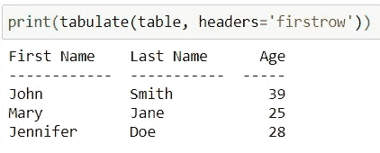
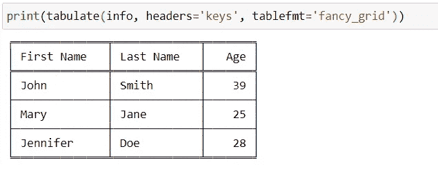

# Python 中需要了解的两个很酷的函数

> 原文：<https://towardsdatascience.com/two-cool-functions-to-know-in-python-7c36da49f884?source=collection_archive---------1----------------------->

## 了解如何使用 Python 中的 tqdm 制作表格和显示进度条


埃菲社在 [Unsplash](https://unsplash.com?utm_source=medium&utm_medium=referral) 上拍摄的照片

Python 中有一些特定的函数可以执行独特的功能，很多 Python 程序员可能不知道。知道它们可能不是绝对重要的，但是它们可以执行一些有用的功能。

在本文中，我们将简要讨论两个这样的函数: ***制表*** 和 ***tqdm*** 。

## 用制表软件创建表格

***制表*** 函数位于**制表**库中，可用于在 Python 中创建格式良好的表格。

我们首先安装制表库:

```
pip install tabulate
```

然后在我们的代码中导入 ***制表*** 函数:

```
from tabulate import tabulate
```

***制表*** 功能可以将许多不同的东西转换成易于阅读的纯文本表格，如*列表列表*、*可重复项字典*和*其他*。

例如，如果我们有下面的*列表列表*:

```
**table** = [['First Name', 'Last Name', 'Age'], ['John', 'Smith', 39], ['Mary', 'Jane', 25], ['Jennifer', 'Doe', 28]]
```

我们可以使用 ***制表*** 函数将其转换成可读性更好的纯文本表格:

```
print(tabulate(**table**))
```


由于列表的*列表中的第一个列表包含列名作为其元素，我们可以通过将*‘first row’*作为 ***headers*** 参数的参数传递来将其设置为列名或标题名:*

```
print(tabulate(**table**, headers='firstrow'))
```



***制表*** 函数还包含一个 ***tablefmt*** 参数，它允许我们使用伪图形来改善表格的外观:

```
print(tabulate(**table**, headers='firstrow', tablefmt='fancy_grid'))
```


我们可以使用下面的*iterables 字典*创建上面的相同表格:

```
**info** = {'First Name': ['John', 'Mary', 'Jennifer'], 'Last Name': ['Smith', 'Jane', 'Doe'], 'Age': [39, 25print(tabulate(**info**, headers='keys', tablefmt='fancy_grid'))
```



如果我们在表中有丢失的值，我们可以通过为 ***missingval*** 参数传递一个参数来填充它们。

*更全面的概述了* ***制表*** *功能:*

</how-to-easily-create-tables-in-python-2eaea447d8fd>  

## 使用 tqdm 显示进度条

***tqdm*** 函数，来自 **tqdm** 库，允许我们用 Python 显示智能进度条。

我们首先安装 **tqdm** :

```
pip install tqdm
```

然后我们在代码中导入 ***tqdm*** 函数:

```
from tqdm import tqdm
```

要使用 ***tqdm*** 函数来显示 Python 循环的进度条，我们只需用***tqdm***(**iterable**)包装任何可迭代对象。

让我们来看一个朱庇特笔记本中的例子:


> 我们用 ***tqdm*** 函数包装了 **iterable** ，在本例中是 range 对象。在 Jupyter 笔记本单元格下方可以看到进度条。当循环的**运行时，显示*{已用时间}<{剩余}时间*，以及每秒迭代次数。**

我们还可以使用***【tqdm】***来显示进度条，这些进度条带有遍历一个 iterable 的函数，比如**映射**、**过滤**和**减少**函数。

</three-functions-to-know-in-python-4f2d27a4d05>  

如果您在 Jupyter Notebook 中工作，您可以从 **tqdm.notebook** 子模块中导入 ***tqdm*** 函数，它提供了一个更具视觉吸引力的进度条，其中包括一些颜色提示(蓝色表示正常，绿色表示已完成，红色表示错误/中断，浅蓝色表示无预计到达时间) **:**

```
from tqdm.notebook import tqdmdef add(**num**):
    return reduce(lambda x,y: x+y, tqdm(range(**num**+1))) if type(**num**) == int else 0
```


如果你喜欢阅读这样的故事，并想支持我成为一名作家，考虑注册成为一名媒体成员。每月 5 美元，你可以无限制地阅读媒体上的故事。如果你用我的 [*链接*](https://lmatalka90.medium.com/membership) *报名，我会赚一小笔佣金。*

<https://lmatalka90.medium.com/membership>  

*我希望你喜欢这个关于* ***制表*** *和****tqdm****函数的简短教程。感谢您的阅读！*