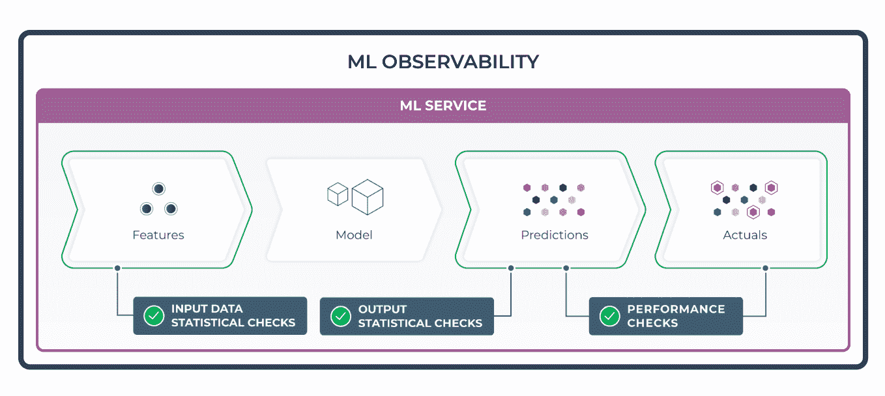
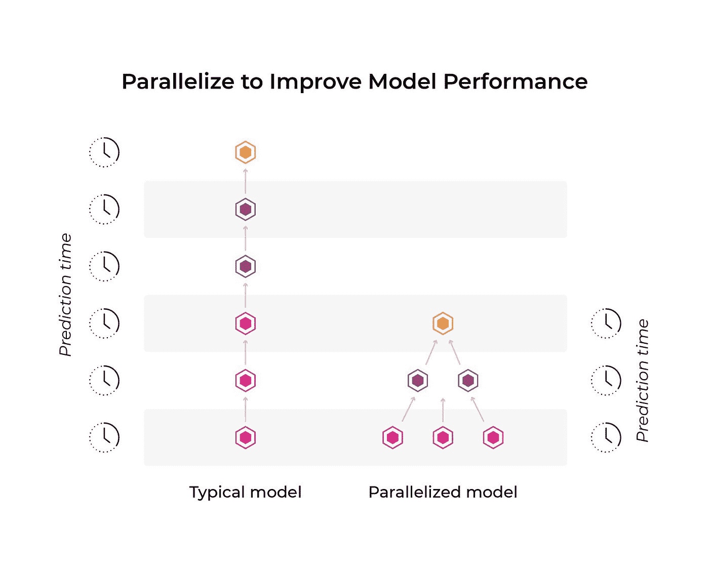

# ML 服务级性能监控的两个要素

> 原文：<https://towardsdatascience.com/two-essentials-for-ml-service-level-performance-monitoring-2637bdabc0d2?source=collection_archive---------20----------------------->

## *优化 ML 服务延迟和 ML 推理延迟的指南*

在过去的十年中，对机器学习重新产生兴趣的浪潮鼓励了无数的研究人员试图用最先进的机器学习技术来解决问题。感觉就像每个月都有一些论文发表，用机器学习的新方法来解决以前不可能完成的任务；然而，在研究实验室之外，使用机器学习来提供新体验的应用也出现了爆炸式增长。

在生产机器学习的过程中，该领域已经发现了一系列工程团队正在努力解决的新问题。为了让一个 ML 系统成功，仅仅理解进出 ML 系统的数据或监控其性能是不够的。当被视为一个整体服务时，ML 应用程序也必须通过其整体服务性能来衡量。

在这篇文章中，我们将通过分解如何测量和改进服务级 ML 性能来讨论这个经常被忽视的领域。

作者图片

让我们从分解我们所说的 ML 系统的服务水平性能开始。本质上，我们将要讨论两个重要的度量:服务性能和模型性能。

**ML 服务延迟**是将模型加载到内存中、收集必要的数据以及计算模型进行预测所需的特征所花费的时间。服务性能还包括用户意识到模型做出的决定所花费的时间。

**最大似然推理延迟**是指一旦你的模型得到输入，它做出预测所需的时间。

在实时系统中，这两个指标都会增加用户感知的应用程序延迟。因此，不仅要监控这些服务级别性能指标，还要在减少应用程序延迟方面取得切实进展，这一点非常重要。

让我们首先来看看您可能希望监控和改进哪些方面，以使您的服务更具性能。

## 优化 ML 服务延迟

*输入特征查找*

在模型甚至可以做出预测之前，所有的输入特征必须由 ML 系统的服务层收集或计算。一些特征将由调用者传入，而其他特征可能从数据存储中收集或实时计算。

例如，预测客户对广告做出反应的可能性的模型可能会获取该客户的历史购买信息。当客户自己查看页面时，他们不会提供这些信息，但是模型服务会查询数据仓库来获取这些信息。采集输入要素通常可分为两组:

1.  **静态特征**:不太可能快速变化，可以提前存储或计算的特征。例如，可以提前计算客户的历史购买模式或偏好。
2.  **实时计算特征**:需要在动态时间窗口内计算的特征。例如，在预测食品配送的 ETAs(预计到达时间)时，您可能需要知道在过去的一个小时内有多少其他订单。

实际上，模型通常混合使用静态和实时计算特征。监控每个特性所需的查找和转换对于跟踪 ML 系统中延迟的来源非常重要。请务必记住，输入要素查找阶段的服务级别性能仅与最慢的要素一样好。

*预计算预测*

在某些用例中，可以通过预计算预测、存储预测并使用低延迟读取数据存储来提供预测，从而减少预测延迟。例如，流媒体服务可能会提前计算并存储对其服务的新用户的推荐。

这种类型的离线批量评分作业可以极大地减少服务环境中的延迟，因为在调用模型之前就已经完成了大部分工作。

例如，像网飞这样的流媒体服务所使用的推荐系统可以预先计算出你在不使用该服务时可能喜欢的电影或电视节目，这样当你下次登录时，你会很快看到一些个性化的内容，而不会出现漫长的加载屏幕。

## 优化 ML 推理延迟

*降低复杂性*

既然我们已经了解了服务性能，那么让我们把注意力转向如何监控和改进您的推理延迟。

优化模型预测延迟的一种方法是降低模型的复杂性。降低复杂性的一些示例可以是减少神经网络中的层数、减少决策树中的级别，或者修剪模型中任何不相关或未使用的部分。

在某些情况下，这可能是对模型功效的直接权衡。例如，如果决策树中有更多级别，则可以从数据中捕获更复杂的关系，从而提高模型的整体有效性。但是，减少决策树中的级别可以减少预测延迟。

平衡模型的功效(准确度、精确度、 [AUC](https://arize.com/blog/what-is-auc/) 等)。)及其所需的操作约束，对于部署任何模型都很重要。这对于嵌入在更受限的移动设备上的模型变得尤其相关。

*并行化*

除了降低模型的复杂性之外，您还可以做一些事情来提高模型在生产中的性能，那就是重新设计您的模型，使其更具并行性。如果模型的一部分不依赖于模型的另一部分的输出，为什么不同时运行这两个部分呢？

作者图片(阿里泽·艾)

cloud-ML 行业正在转向高度可扩展的按需云，它允许你利用专业计算机的足球场来运行你的模型。同样，移动处理器正在将其芯片的很大一部分专用于机器学习加速器，这允许开发人员利用其模型推理管道的并行特性。

如果您有能力在预测时将更多的核心投入到问题中，那么您可以利用模型的并行特性来加快预测时间。如果您不研究如何以更平行的方式重新设计您的模型，您可能会放弃性能。

## 外卖食品

虽然传统的[模型监控](https://arize.com/model-monitoring/)对于衡量和改进你的机器学习应用程序至关重要，但它并不能捕捉到用户如何体验你的应用程序的全貌。*服务水平性能指标很重要，*对于您的用例来说，将您的准确性提高 1%而导致 500 毫秒回归的更改可能不值得！

如果您看不到您对系统所做的每一个更改所做出的权衡，您将会慢慢地将您的模型埋葬在一堆小的性能退化中，最终形成一个缓慢而笨拙的产品。不要担心:有许多技术可以诊断性能问题，并最终提高您的模型的服务级别性能，但首先您必须开始关注毫秒。

# 联系我们

如果这篇博客引起了你的注意，并且你渴望了解更多关于[机器学习可观察性](https://arize.com/platform-overview/)和[模型监控](https://arize.com/model-monitoring/)，请查看我们的其他[博客](https://arize.com/blog/)和关于 [ML 监控](https://arize.com/ml-monitoring/)的资源！如果您有兴趣加入一个有趣的 rockstar 工程团队，帮助模型成功生产，请随时[联系](https://arize.com/contact/)我们，并在此处[找到我们的空缺职位](https://arize.com/careers/)！