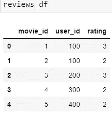
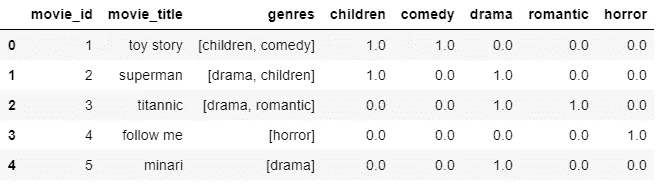
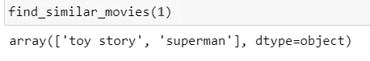
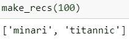
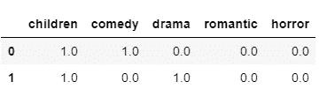
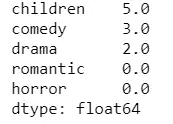
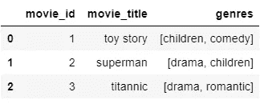
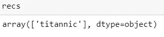

# 基于内容的推荐系统的两个例子

> 原文：<https://towardsdatascience.com/two-examples-of-a-content-based-recommendation-system-with-the-most-efficient-array-functions-93899113a890?source=collection_archive---------19----------------------->

## 基于内容、加权的基于内容的数字函数

照片来自[米哈尔·马特隆在 Unsplash](https://unsplash.com/@michalmatlon)

今天我想讨论两个基于内容的推荐系统的例子，以及我从中学到的一些有效的数组函数。这两个例子是

**1:基于项目内容推荐**

**2:基于加权内容推荐**

我使用一个简单的电影集作为例子，希望将重点放在主要过程上，而忽略其他过程和特殊情况。让我们开始吧。

## 数据集准备:

使用以下代码生成两个数据集:movie_df 和 review_df

这两个表为:

**方法一:基于电影内容，当内容相似度大于 0 时，为每个用户做推荐。**

在这里，我们可以用于电影的内容只有类型。对于基于内容的推荐系统技术来说，以列表格式保存风格并不是最佳选择，我们将使用 One Hot 编码技术将风格列表转换为一个向量，其中每一列对应于一个可能的特征值。

每种类型都用“，”分隔，所以我们只需调用 split 函数

**步骤 1:计算电影-电影相似度矩阵:**

点积显示了电影之间的相似性。

**第二步:寻找相似电影**:这里的标准是如果有关系那么选择推荐为小数据集。

我给出的标准是，如果两部电影相关(点积大于 0)，值不重要。下面还给出其他标准，这些标准只选择相似性的最高值。

**np.where()** 显示项目在表格中的位置(索引)。

对 movie_id =1 进行测试:

与《玩具总动员》类似的电影是《超人》，其类型是儿童。结果在意料之中。

然后得到一个电影名称列表，如果电影的名称是一个列表:

**第三步:为特定用户做推荐:**

对 user_id=100 进行测试

两部都是剧，因为用户 100 也评论过剧《超人》，所以推荐有道理。

**方法 2:基于加权含量**

方法 1 很容易理解，但似乎没有使用评级信息。现在我想整合信息来计算加权流派。

例如，我想根据用户的评分来构建加权流派。让我们选择 user_id=100。

**步骤 1:过滤掉用户 100 评价的电影，只得到流派:**

**第二步:获取该用户的加权流派:**

**第三步:获得推荐(也包括用户评论)**

该 rec_movies 显示了加权流派≥0.5 的所有推荐电影，但也包括用户已经评论过的电影。

**第四步:过滤已评论的电影**

在这种情况下，由于用户 100 的 minari 的加权流派是 0.2，所以它被排除在推荐之外。

**概要:**

*   从这两个案例中，我们可以看到，没有评论的体裁是不会被推荐的，这是基于内容的推荐系统的特点。它对用户来说是高度个性化的。
*   在某种程度上，推荐系统就像一门艺术，你也可以创建自己的标准来适应你的目标，就像在这个故事中，我展示了不同的标准，甚至是相同的方法。
*   有一些我认为在处理推荐系统时非常有效的数组函数，我想在这里再次总结一下:
*   1) **np.setdiff1d()** :这个函数可以找出两个数组的区别。即使你有一个列表，你也可以把它转移到一个数组中使用。
*   2)**NP . dot(NP . transpose())**:这个点积不仅可以用于项本身，还可以用于得到加权项。
*   3) **np.where()** :这里我用它来查找物品的位置(索引)。
*   当然，你也可以把它们推广到其他情况，而不仅仅是推荐系统。由于限制，我没有足够的时间来展示这些函数是如何高效的，我将在本故事中详细解释它们[。](https://annie-wangliu.medium.com/the-most-5-efficient-functions-used-in-recommendation-system-data-processing-2cda1a809441)

感谢您的阅读。