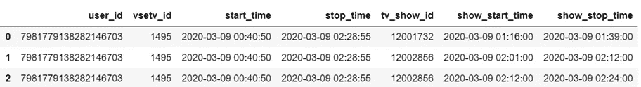
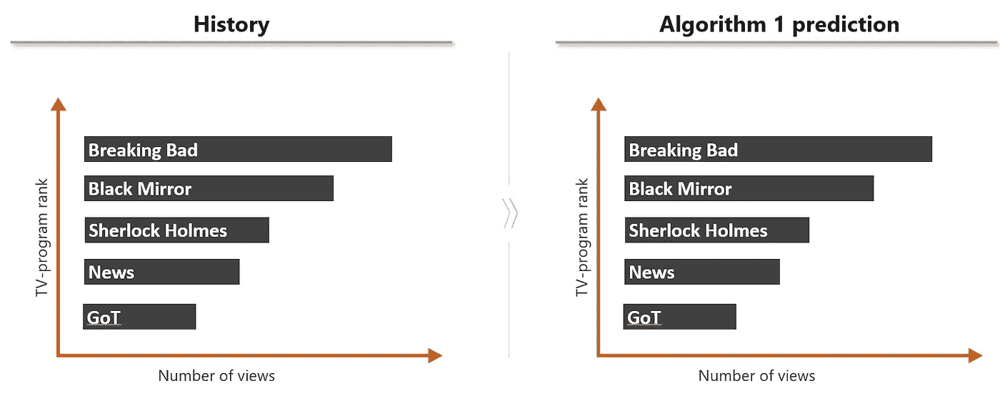
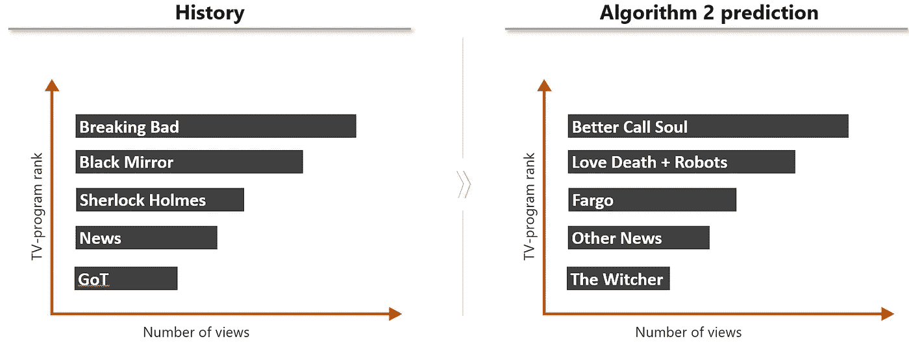
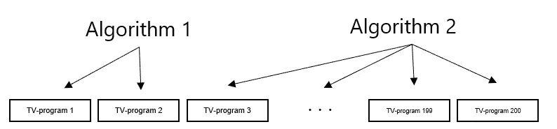
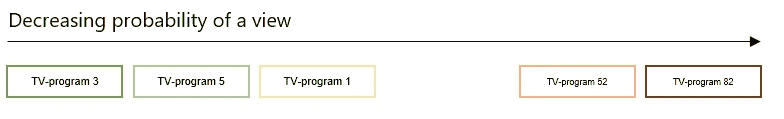

# 🥈双层推荐系统方法论:一个获奖的解决方案

> 原文：<https://towardsdatascience.com/two-layered-recommender-system-methodology-a-prize-winning-solution-c4bdb815b156?source=collection_archive---------26----------------------->

## 了解如何将简单的算法结合到强大的推荐引擎中

丹尼斯·简斯在 [Unsplash](https://unsplash.com?utm_source=medium&utm_medium=referral) 拍摄的照片

2020 年 11 月 14 日至 22 日举行了一场[电影挑战赛](https://cinema.wechallenge.it/ru)黑客马拉松。它致力于为在线剧院 [sweet.tv](https://sweet.tv/ru) 创造解决方案。参与者可以从三个项目中选择一个:

1.  挑战 1——电影推荐系统；
2.  挑战 2——电视节目推荐系统；
3.  项目竞赛。

我设法为挑战 2 创造了一个获奖的解决方案，并决定分享我的方法。

**📃任务**

任务是根据每个用户的观看历史来预测他最喜欢的 5 个电视节目。如果用户观看了电视节目的 80%以上并且没有更换频道，则认为该电视节目被观看了。

使用 [Kaggle](https://www.kaggle.com/) 确定解决方案的准确性。[在这里](https://www.kaggle.com/c/sweettv-tv-program-recommender/overview)你可以查看更详细的任务描述、数据和最终排行榜。

给了 20 周的用户日志来训练我们的模型(从 3 月初到 7 月底)和一些关于电视节目的附加信息。Kaggle 用了 12 周的时间进行公共/私人测试，用户各占一半。还有测试日期的电视节目时间表。

浏览日志(*作者图片)*

组织者使用 [MAP@5](https://habr.com/ru/company/econtenta/blog/303458/) metric 检查了模型的准确性，我也将其用于本地维持验证:

使用平均精度@K 绘制@ k 度量图(*图片由作者提供)*

**⚒方案**

第 1 部分—基本算法

**算法 1。假设——用户将继续观看相同的电视节目。**

算法 1 示例(*作者图片)*

这个基线解决方案非常简单:我们需要根据观看次数计算前 5 名的节目:

*   如果用户一次观看了电视节目总长度的 50%以上，则电视节目被视为已观看；
*   通过将来不在电视节目中的节目过滤结果；
*   如果用户一生中总共观看的电视节目少于 5 个，请在他的预测中填入最受欢迎的电视节目。

该解决方案在保持数据上进行本地验证，Kaggle **MAP@5 的精度= 0.41296** 。

➕简单快速的解决方案，良好的基线精度。

➖算法没有考虑用户可能的偏好，也不能预测用户没有看过的电视节目。

**算法二。**假设——用户会观看与他喜欢的电视节目相似的电视节目。

算法 2 示例(*图片作者)*

推荐任务的一个经典例子。为了解决这个问题，我创建了一个用户和电视节目的矩阵，并训练了一个协作过滤模型。然后我们只对每个用户进行前 5 个预测。我使用了 [LightFM](https://github.com/lyst/lightfm) 来创建带有 WARP metric 的模型，并对维持数据进行了轻微的超参数调整。

➕算法基于相似用户考虑可能的用户偏好，这保证了预测不限于先前观看的节目。

➖精度比第一种方法稍低一些(可能有一种方法可以提高它，但是调整的时间有限)。另一个缺点是很难使用电视节目和用户参数，尽管 LightFM 库为其提供了功能。

第 2 部分—第二层模型

**方法论。到目前为止，我们只使用了观看电视节目的事实，所以我们需要一种使用更多参数和一些机器学习的方法。**

为了解决这个问题并提高解决方案准确性，经常使用第二层模型，该模型根据查看概率对相关项目进行优先级排序。在这项任务中，我采用了以下方式:

*   使用基本算法(来自本教程的第 1 部分)为每个用户生成相关的电视节目(大约 200 个就可以了)。前 N 项我们从算法 1 得到，因为它的准确率更高。其余 M 项(200 — N = M)从 LigthFM 的算法 2 中得到；

为一个用户生成相关程序(N = 200)(*作者的图像)*

*   收集特征来训练助推模型，更多信息在下面；
*   训练二进制分类 [LightGBM](https://lightgbm.readthedocs.io/en/latest/) 模型——哪些相关的电视节目用户观看了维持数据；
*   对于测试数据，还收集特征并使用训练模型来为每个用户区分电视节目的优先级；

基于相关节目的观看概率对其进行排序(*图片由作者提供)*

*   为每个用户获取前 5 个相关的和可能观看的项目；

**增加二层模型精度的日志。**

作为基本特征，我用不同的参数记录了用户观看电视节目的次数:节目时间的 30%，50%，80%。我还添加了基于观看次数的电视节目排名。导致了 **MAP@5 = 0.43128** 。

使用频道号和节目类别(分类特征) **MAP@5 = 0.43302。**

加上用户观看电视节目的频率、自用户被创建以来的时间、自最后一次观看以来的时间，得到 **MAP@5 =0.43565。**

使用 LightFM 库中的电视节目排名和 user _ bias/item _ bias 特征给出了 **MAP@5 =0.43823。**

描述电视节目时间表将如何改变(时间减少/增加)的特征给出了 **MAP@5 =0.44075。**

使用 [hyperopt](https://github.com/hyperopt/hyperopt) 对 LightGBM 模型进行超参数搜索，将精度提高到 **MAP@5 =0.44173。**

过滤节目，只保留那些被观看 10 次以上的节目，减少了数据量，去除了不相关的项目，精度提高到 **MAP@5 =0.44203。**

就是这样！在最终的公共排行榜上，这个解决方案在决赛前一直名列第一，但在最后一天，一个团队最终战胜了我的解决方案。经过私人测试，我的解决方案停留在第二位，与第一位相差很小，与第三位相差很大，精确度 **MAP@5 =0.42905。**

热门功能—用户观看时间、LightFM 的用户功能、日程更改。

如果你感兴趣，这里的代码是**。**

****🔮改进方法****

*   **根据观看的时间和日期对用户档案进行细分。将其与电视节目时间表相结合，进一步个性化推荐。**
*   **使用更复杂的第二层模型，比如 LambdaRank 而不是二进制分类(LightGBM 中也有)。**
*   **当新用户没有观看历史时，解决冷启动问题。我们可以找到相似的用户，并结合他们的口味来预测相关的电视节目(改进 LightFM 方法)。**

****⭐有趣的事实****

*   **比赛只持续了 4 天，所以我只能尝试基本的假设和易于实现的特性；**
*   **本地抵制验证与 Kaggle 排行榜高度相关，因此在私下测试后几乎没有任何变动。**