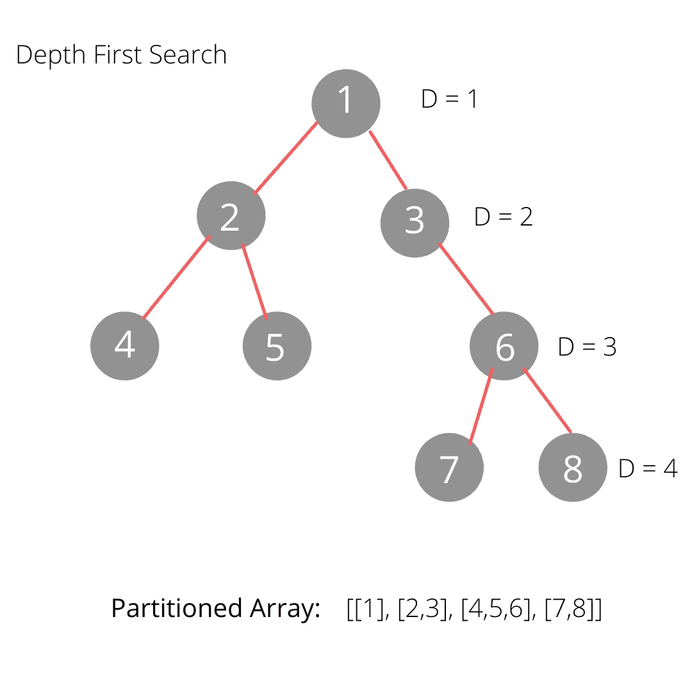
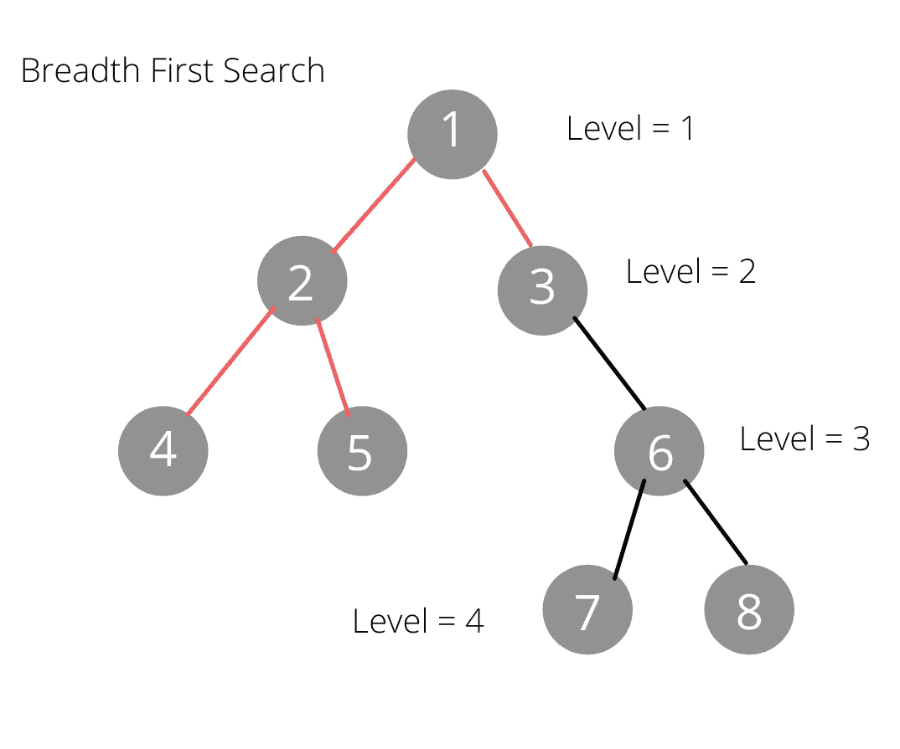

# 两个最著名的编码面试问题解释

> 原文：<https://towardsdatascience.com/two-of-the-most-famous-coding-interview-questions-9746a4111011?source=collection_archive---------1----------------------->

## 大科技公司最喜欢的两个用简单英语简化的编码面试问题。

如果你进入 IT 行业，热爱编码，你大概知道什么是编码面试，成功通过面试需要做多少工作，更不用说准备面试本身了。对于那些不知道的人来说，这实质上就像是进行一次测试。面试官给了你一个特殊的问题，你必须想出一个解决方案。有时候，编码面试很容易，但大多数时候，它们属于中等难度到极其困难的范围。当然，当你去像亚马逊和谷歌这样更著名的公司面试时，编码面试是具有挑战性的。人们在面试前花几个月的时间练习和学习不同的方法来处理不同的面试问题，以便在面试中有一个解决方案的想法。你几乎可以说这就像给一所大学进行入学考试或 SAT 考试。申请的名校越多，考试越复杂，录取越有挑战性。因此，需要提前做更多的准备。

然而，当人们在面试前几个月就开始练习时，是什么让面试编码问题变得如此复杂和有趣呢？除了通过练习来获得对自己编码能力的信心，大多数程序员练习他们的编码面试问题，因为在面试中，面试者会寻找一个有效的解决方案。当我说高效时，我指的是在性能方面，或者换句话说，时间和空间复杂性方面。时间复杂度是一个表达式，它总结了程序的性能以及计算机完成或运行所编写的任务需要多长时间。类似地，空间复杂性也是如此。然而，这是一个总结运行任务需要多少内存的表达式。

如果你想了解更多关于时间和空间复杂性的知识，请点击德克萨斯大学的数据结构讲座 [*复杂性分析*](https://www.cs.utexas.edu/users/djimenez/utsa/cs1723/lecture2.html#:~:text=Time%20complexity%20is%20a%20function,of%20input%20to%20the%20algorithm.&text=Space%20complexity%20is%20a%20function,of%20input%20to%20the%20algorithm.) *。*

本质上，当您遇到一个需要许多“子任务”来创建一个成功的“主任务解决方案”的问题时，保持时间和空间的复杂性可能是一个挑战，因为需要考虑多个过程。此外，就解决方案的有效性而言，公司喜欢清晰简洁的解决方案。我的意思是，这些解决方案并没有被过度设计。比方说吧；我们在解一道数学题。写下不必要的注释和段落，说明我们为什么要做每一步(比如加法)，会让解决方案变得凌乱不堪，塞满了信息，难以理解和阅读(假设我们的解决方案很长)。同样的事情也适用于编码。面试官寻找开箱即用的解决方案，可以在任何给定的输入下保持相同的性能(当然，面试官还会考虑更多因素，但这些只是基本因素)。虽然，就像效率一样，当有大问题需要解决时，包括各种要编程的“子任务”,保持代码的整洁和简洁是很困难的，因为自然地，会有很多关于解决方案和解决方案的多个过程的解释要向面试官做(这是受访者考虑的另一个因素，接收者能多好地解释他们的代码)。但是，这就是为什么程序员不断地练习几个月来为面试做准备。毕竟，成千上万的开发人员在大型科技公司和初创企业工作，这意味着在任何公司成功编写面试代码都不是不可能的。

就像学校里的科目和数学里的单元一样，我们可以把问题分成不同的科目。编码问题中的一个流行主题字面上叫做“流行的编码面试问题”它们被称为流行的编码面试问题，因为许多开发人员在大公司见过它们。在本文中，我将讨论我个人最喜欢的编码面试问题之一，也是最流行的关于树的编码问题之一，它是最大宽度和深度。起初，这听起来很容易解决，但这个问题引起许多开发人员(这也是它受欢迎的原因)和我的原因是因为它的抽象解决方案。有多种方法可以创建高效和有效的算法，这真正考验了开发人员的思考和解决问题的能力。比如像谷歌、亚马逊等公司。之前已经有过这些面试问题，所以知道如何解决是一个很重要的问题。当你想一想，为什么这个问题在每个开发者的雷达下是有意义的；可以让他们亮一盏灯，强调自己解决问题的能力。

二叉查找树图片的最大深度和宽度图|作者

面试问题本身很容易理解。给定一棵树，求其最大宽度和深度。虽然从概念上理解问题的要求很简单，但是需要一点时间(几分钟而不是几秒钟)来头脑风暴如何编码一个合适的解决方案。我的解决方案有点古怪，但我让两种算法在一天结束时线性工作。我所说的古怪是指，根据定义，宽度优先搜索算法在横向计算节点时效果最好，深度优先搜索算法在试图计算树的高度时效果最好。因此，您可能知道什么算法应该用于什么问题。通常，宽度优先搜索算法将最好地找到树的最大宽度，而深度优先搜索算法将最好地找到最大深度。这两种算法在性能上都是线性时间运行的，这意味着我们不必考虑二叉树遍历的其他复杂算法。然而，对于我的解决方案，我反其道而行之。为了找到树的最大宽度，我使用了深度优先搜索算法，并且对于最大深度，宽度优先遍历。虽然我的解决方案可能看起来与“公认的一般解决方案”相反，但我确实将我的两个算法都保持在线性时间。

BFS 和 DFS 算法可视化|作者图片

因为我首先提到了最大宽度，所以我将从更深入地谈论我对那个问题的解决方案以及我如何利用最大深度来获得优势开始。

最大宽度解决方案

首先，使用深度优先算法，通过递归遍历树的深度，我得到了每个节点的每条路径的所有不同排列。然后，我将每个排列添加到一个单独的数组中，因为我们将假设数组的每个索引代表一个特定的级别。例如，设`[a,b,c]`是我们深度优先搜索算法返回的某个排列的数组。我们可以将每个索引视为树的某个级别:

作者级别视觉|图像索引

我们这样做是因为我们的深度优先搜索算法返回了遍历路径的深度。因此，如果算法遍历每个深度一直到叶节点，则每个路径必须在表示每个级别的每个索引方面是对称的。

注意两个返回数组的索引是相同的

我们也可以用我们的第二个函数`.width_counter()`来证明这一点。将所有排列格式化为一个 2D 数组，然后我们基于相似的索引拆分每个列表中的每个元素。例如，索引 0 处的所有元素都将放在索引 0 处的列表中，然后索引 1 处的所有元素都将放在索引 1 处的列表中，依此类推。这被称为*分割*，这是一个先进的计算机科学概念，我们根据特定条件分割一个数组或一系列值。在分区过程之后，我们将看到一个返回的数组，其中的子数组包含基于索引排序的元素。我们可以通过简单地比较树形图和列表中的元素来仔细检查返回的数组是否正确。如果树的每一层都有与该索引中的每个列表相同的节点(再次假设索引是级别)，我们知道我们做得对，因为我们的数组只是一个格式不同的树。

请注意每个子数组与作者的每个级别|图像是如何相似的

我们算法中寻找最大深度的最后一步是比较 2D 数组中每个数组的长度，最大的数组(长度最大的数组)将是最宽的级别。在这种情况下，因为我们正在比较 2D 数组中的每个索引，所以我们只是简单地返回索引。这仍然给出了正确的答案，因为我们前面提到的定义是，级别与每个置换数组的索引相同。就整体性能而言，我们设法在`O(n)`时刻保持深度优先搜索算法不变，在`O(n^2)`时刻保持`.width_counter()`不变，因为嵌套迭代创建了一个 2D 数组。

转到我们的最大深度解决方案，我们找到最大深度的方法非常类似于最大宽度的第一个解决方案。然而，如前所述，我们没有使用 dfs，而是使用 bfs 来跟踪我们的深度。我们首先使用面包优先搜索的原因是为了计算由于算法的横向移动行为而向下一层的次数。

作者图片

这个解决方案很酷的一点是，不像第一个解决方案那样寻找最大宽度来比较每一层，我们不比较任何数组或任何路径。相反，我们采用遍历方法。

当你看到我的解决方案时，它真的没有任何特别之处——它只是原始深度优先搜索算法的修改版本。它不是遍历树直到它满足特定的目标值，而是遍历树直到它的队列为空。此外，为了保持深度的精确计数，当我们接近一个父索引时，我们只给`counter`(保存深度计数的变量)加 1。为了知道我们是否到达了一个父索引，我们使用二叉树的基本定义，即:*每个父节点在最大值*处必须有两个子节点。因此，在我们的迭代过程中，只有当我们在第一次迭代过程中位于根节点上(将根节点包括在我们的计数中)或者当弹出它的最近值后队列的长度等于 2 时，我们才给`counter`加 1。另一种更稳定的查找父索引的方法是将每个节点追加到一个数组中。使用堆等式找到父索引`index // 2`，我们可以准确地跟踪哪些节点是父节点。因此，我们可以再次迭代该树，并在每次遇到使用等式找到的父节点之一时将 1 加到`counter` 。这是一个伟大的解决方案；然而，与我们的仅修改 dfs 算法的简单解决方案(在线性时间运行)相比，备选解决方案将在二次时间运行。

查看我的 Github 解决方案和它们的测试用例:[https://github.com/GEEGABYTE1/Width-Depth-Tree-Problems](https://github.com/GEEGABYTE1/Width-Depth-Tree-Problems)

面试问题是我最喜欢参加的考试之一。虽然我只是一个将学习和开发各种问题的解决方案作为激情的高中开发者和爱好者，但面试问题确实提高了我的整体解决问题的能力。此外，当你找到正确的解决方案时，你得到的满足感是无与伦比的。就我个人而言，每当我解决一个面试问题或竞争性编码问题时，我都会激动不已！然而，像最大深度和最大宽度这样的问题稍微复杂一些，这可能需要一些思考和解决问题的技巧。起初，你不会想到一个解决方案，但这就是为什么它如此有趣，在所有开发者中如此受欢迎。之所以如此具有挑战性，并不是因为它需要高超的编码技能(这是成功解决面试问题的一个很大的误解)；相反，这些类型的问题具有挑战性，因为它们是抽象的。换句话说，可以有多种解决方案，这鼓励开发人员进行更多的创新思考！我仍在努力培养解决问题的能力以及新的计算机科学概念。尽管如此，我还是会继续写关于我的目标进展和我遇到的新的有趣的面试问题的文章！