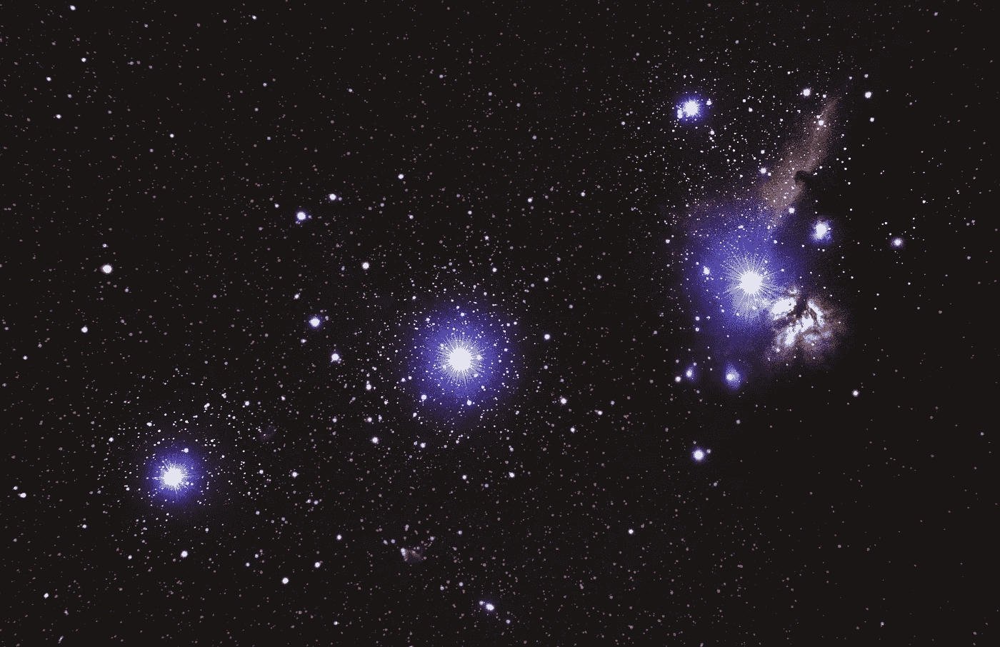
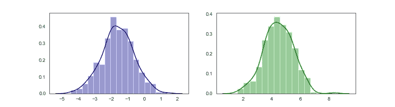
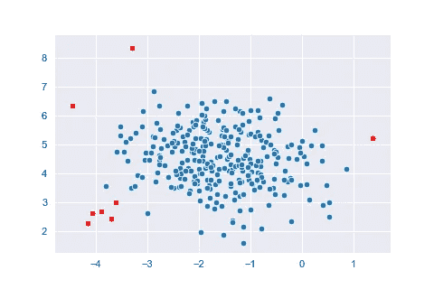
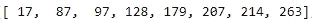
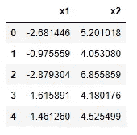
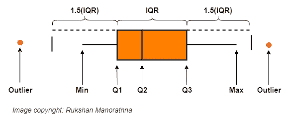
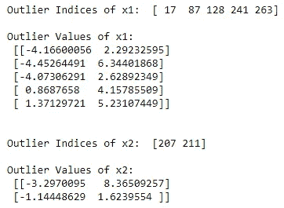
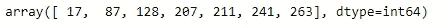
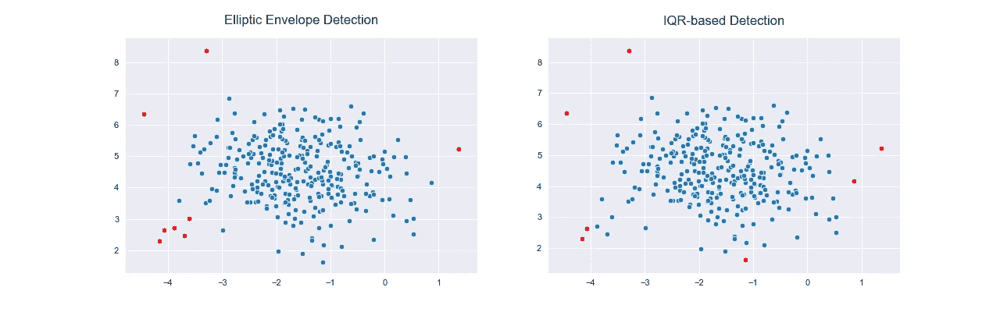
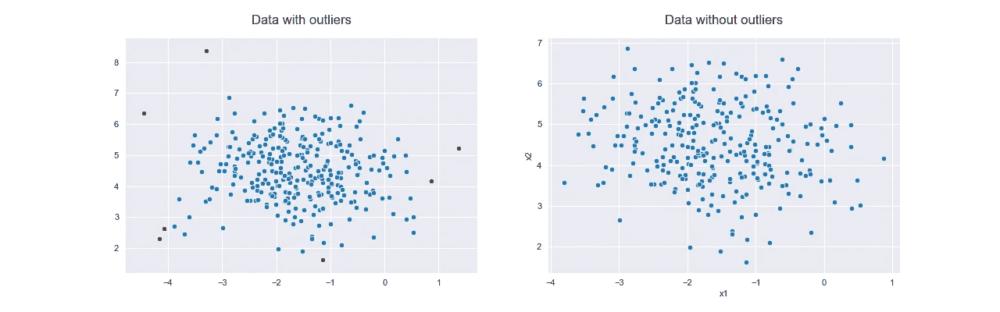

# 2021 年你应该知道的两种离群点检测技术

> 原文：<https://towardsdatascience.com/two-outlier-detection-techniques-you-should-know-in-2021-1454bef89331?source=collection_archive---------2----------------------->

## 基于椭圆包络和 IQR 的检测



亚历山大·安德鲁斯在 [Unsplash](https://unsplash.com/) 上拍摄的照片

离群值是与其他数据点显著不同的异常数据点。离群点检测是一件棘手的事情，应该小心进行。**椭圆包络**和 **IQR** 是常用的离群点检测技术。椭圆包络是基于机器学习的方法，而基于 IQR 的检测是统计方法。它们各有利弊。因此，我们不能说哪一个是最好的。最好的策略是将这两种技术结合起来，看看整体结果。

在本文中，我们将讨论椭圆包络和 IQR 技术背后的直觉，并将它们结合在一起以获得更好的结果。还将使用 Python 和 Scikit-learn 讨论这些技术的实现。不要忘记阅读本文末尾的“要点”部分。在那里，你会学到一些特殊的概念和策略时，使用椭圆包络和 IQR 技术。

[这篇文章包括所有的东西:理论，代码，可视化和想法！]

我们开始吧！

# 椭圆形信封

这种方法的主要假设是数据应该是*(***高斯分布*** 数据集)。椭圆形信封背后的直觉非常简单。我们根据一些标准在数据点周围画一个椭圆，并将椭圆内的任何数据点分类为内点(绿色的)，将椭圆外的任何观察结果分类为外点(红色的)。*

**

*椭圆形信封背后的直觉(图片由作者提供)*

*椭圆包络线方法将所有观测视为一个整体，而不是单个特征。虽然这种方法背后的直觉非常简单，但实现起来有些棘手。在 Scikit-learn 中，椭圆包络方法是通过**椭圆包络()**函数实现的。这里，我们需要指定**污染**超参数——一个我们不知道的值。它表示数据集中异常值的比例。这个超参数的值的范围是从 0 到 0.5(默认值是 0.1)。如果我们认为数据中会有很多异常值，我们可以将**污染**设置为一个更大的值。不知道数据集中异常值的确切比例是使用这种方法的主要限制。*

## *履行*

*为了实现椭圆包络方法，我们将首先使用 sci kit-learn**make _ blobs()**函数创建一个模拟数据集。然后我们将数据可视化，并检查正态性假设。*

*让我们写代码吧！*

***第一步:制作模拟数据集***

*这里，我们使用 Scikit-learn**make _ blobs()**函数来创建一个模拟数据集。该函数创建高斯分布数据集。这里，出于可视化的目的，我们只为 **X** 选择两个特征。没有 **y** 。*

*等待加载 Python 代码(代码片段 1)*

***第二步:可视化数据***

*等待加载 Python 代码(代码片段 2)*

**

*两个特征之间的散点图(图片由作者提供)*

*数据中似乎有一些异常值。*

***第三步:检查数据的正态性***

*我们可以为每个特征创建直方图来检查正态性假设。*

*等待加载 Python 代码(代码片段 3)*

**

*两个特征的直方图(图片由作者提供)*

*我们的数据是正态分布的。因此我们可以应用 **EllipticEnvelope()** 函数来检测异常值。*

***步骤 4:应用椭圆包络来检测异常值***

*我们的数据集中似乎只有很小一部分异常值。因此，我们可以将**污染**设置为较小的值，如 0.025。*

*等待加载 Python 代码(代码片段 4)*

**

*检测到异常值的散点图(图片由作者提供)*

*椭圆信封对象的 **fit_predict()** 方法( ***elpenv*** )对于内点返回 1，对于离群点返回-1。我们可以使用 **np.where()** 函数提取异常值。红色的数据点是异常值。以下指数值的观察值是异常值。*

```
*outlier_index*
```

**

*作者图片*

***第五步:获取没有异常值的数据集***

*现在，我们创建一个不包含异常值的熊猫数据框。我们可以使用该数据集进行进一步分析。*

*等待加载 Python 代码(代码片段 5)*

**

*作者图片*

# *基于 IQR 的检测*

*基于 IQR 的检测是一种统计方法。这种技术适用于单个特征，而不是像在椭圆包络中那样适用于整个观测。基于 IQR 的检测背后的直觉也很简单。首先，我们计算数据的第一个四分位数(Q1)和第三个四分位数(Q3)。然后我们得到这两个四分位数的差值。这种差异被称为 IQR(四分位数间距)。*

*   *IQR = Q3-Q1*
*   *下限= Q1–1.5(IQR)*
*   *上限= Q3+1.5(IQR)*

**

*作者图片*

*任何小于下限或大于上限的值都是异常值。*

## *履行*

*等待加载 Python 代码(代码片段 6)*

**

*作者图片*

*每个特征的异常值指数非常有用。我们可以使用所有要素的异常值索引的联合来从数据集中提取和移除异常值。我们可以得到如下的联合。*

*等待加载 Python 代码(代码片段 7)*

**

*作者图片*

*接下来，我们将数据可视化在散点图上，并将基于 IQR 的检测与椭圆包络进行比较。*

*等待加载 Python 代码(代码片段 8)*

**

*基于 IQR 的检测和椭圆包络的比较(图片由作者提供)*

*我们可以看到两种方法在检测异常值时的一些差异。*

*我们还可以使用 ***index_union*** 从数据集中移除离群值。*

*等待加载 Python 代码(代码片段 9)*

**

*有异常值和无异常值的数据(图片由作者提供)*

*我们还可以制作箱线图来显示有无异常值的数据。*

*等待加载 Python 代码(代码片段 10)*

**

*包含和不包含异常值的每个要素的箱线图(图片由作者提供)*

# *关键要点*

*今天，我们在检测异常值方面做得很好。我们已经讨论了两种流行的技术，**椭圆包络**和**基于 IQR 的检测**。它们各有利弊。这两种技术背后的直觉很容易理解。椭圆包络基于机器学习，IQR 基于统计。椭圆包络很容易用 Scikit-learn **椭圆包络()**函数实现，但要满足正态性假设。椭圆包络线方法将所有观测视为一个整体，而不是单个特征。椭圆包络的主要缺点是我们不知道**污染**超参数的精确值。猜测该值的最佳方法是首先进行基于 IQR 的检测，并计算数据集中异常值的数量。由于您知道观察值的总数，因此您可以获得异常值比例的近似值。这是**污染**超参数的值。这就是我们如何将两种技术结合在一起！*

*顺便说一下，基于 IQR 的检测不容易实现。你必须写一些高级的 Python 代码。但是在基于 IQR 的检测中，我们不需要检查正态性的假设，也不需要知道数据集中异常值的比例。所以，它们是这种技术的优点。这种技术适用于单个特征，而不是像在椭圆包络中那样适用于整个观测。我们可以使用返回的异常值索引的联合来从数据集中提取和移除异常值*

*这就是检测异常值背后的故事。但是，我们还没有完成。如何处理异常值？这和检测异常值是一样的吗？不。如果我们检测到异常值，我们下一步应该做什么？我们应该移除它吗？我们应该保留它吗？或者我们应该用一个相关的值来代替它？这取决于特定分析问题的领域知识。一个离群值背后可能有一个有趣的故事。所以，如果你发现了，试着说出这个故事。由于人为错误，可能存在一些异常值。在这种情况下，您可以将它们从数据中删除。*

*关于离群值的最后几句话— **“处理离群值时要格外小心，除非你知道它们背后的故事！总是将多种技术结合起来检测异常值，因为没有单一的最佳技术。如果可能，始终绘制数据以检查假设和最终输出。”***

*今天的帖子到此结束。我的读者可以通过下面的链接注册成为会员，以获得我写的每个故事的全部信息，我将收到你的一部分会员费。*

*【https://rukshanpramoditha.medium.com/membership】报名链接:*

*非常感谢你一直以来的支持！下一个故事再见。祝大家学习愉快！*

*特别感谢 Unsplash 上的 **Alexander Andrews** ，为我提供了这篇文章的封面图片。*

*[鲁克山普拉莫迪塔](https://medium.com/u/f90a3bb1d400?source=post_page-----1454bef89331--------------------------------)
**2021–03–20***