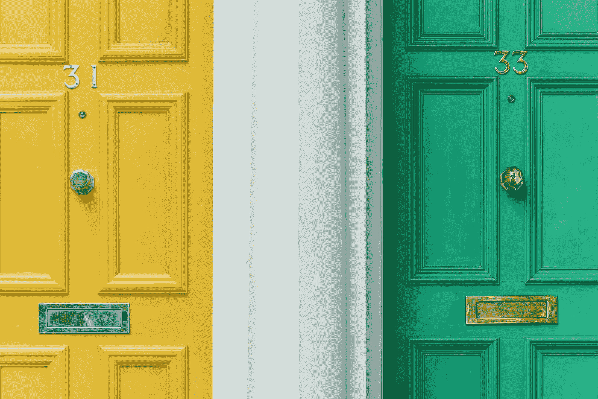
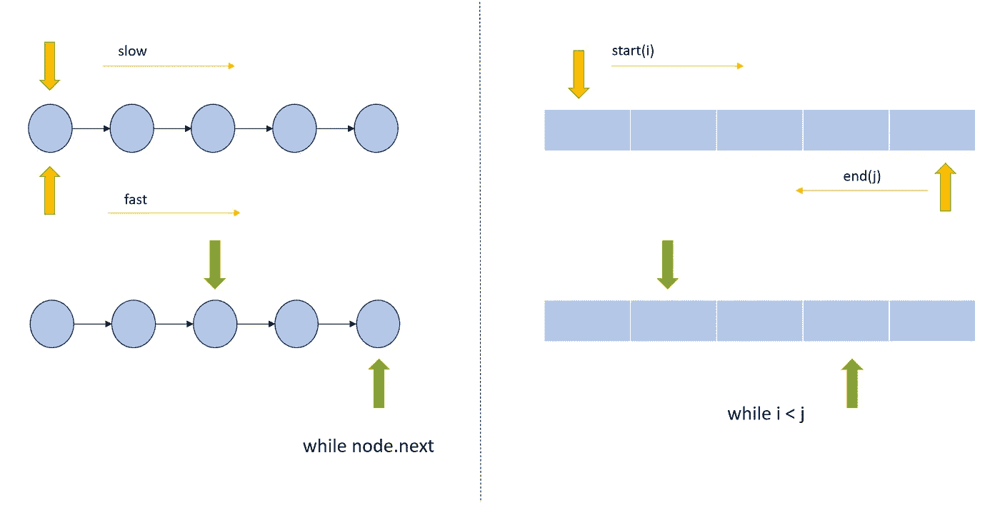
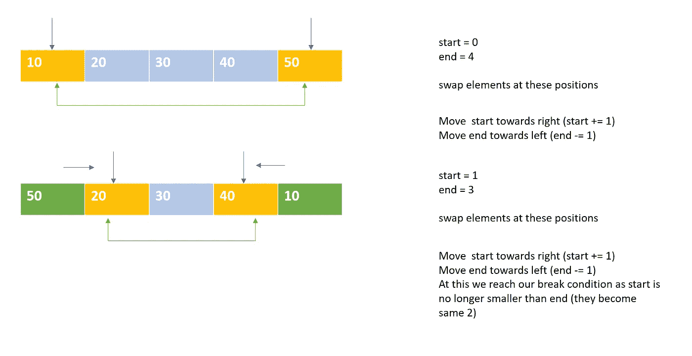
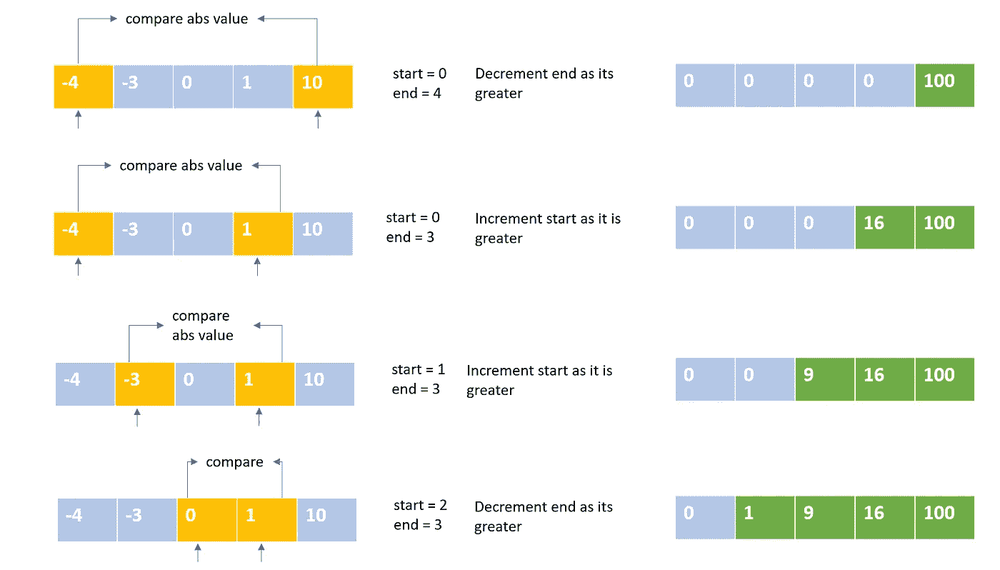
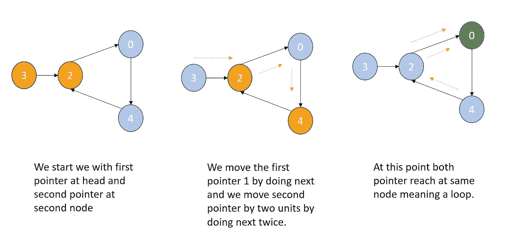
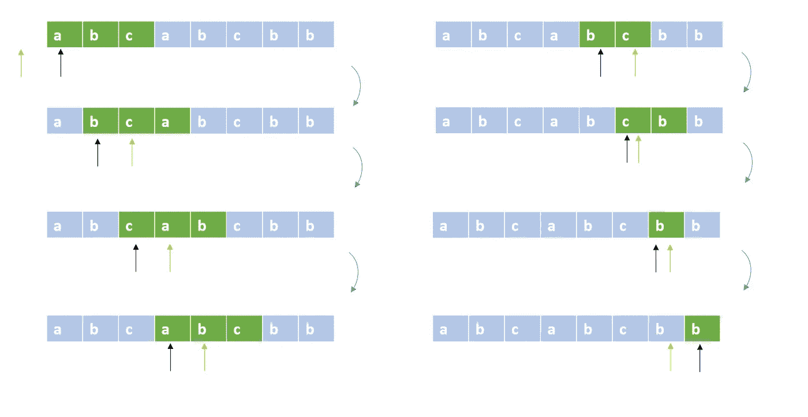
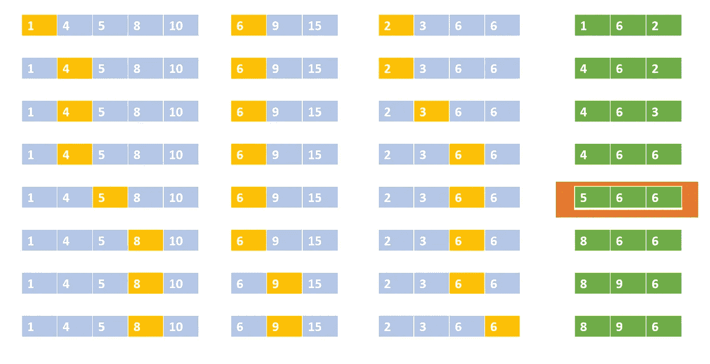
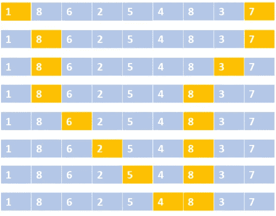

# 双指针方法— Python 代码

> 原文：<https://towardsdatascience.com/two-pointer-approach-python-code-f3986b602640?source=collection_archive---------3----------------------->



由[克里斯蒂安·斯塔尔](https://unsplash.com/@woodpecker65?utm_source=unsplash&utm_medium=referral&utm_content=creditCopyText)在 [Unsplash](https://unsplash.com/collections/8283874/relay?utm_source=unsplash&utm_medium=referral&utm_content=creditCopyText) 拍摄的照片

> 两个人一起行动总比一个人好。

两点算法是任何编程面试中最常被问到的问题之一。这种方法通过利用数据的某种顺序(不一定是排序)来优化运行时。这种方法通常用于在排序数组中搜索对。这种方法适用于恒定空间。

> 在这种技术中，指针表示索引或迭代属性，如节点的 next。

## 双指针方法的步骤:



作者图片

如上图所示，双指针方法有三个主要步骤:

**指针初始化** —起始点。指针可以在任何地方，这取决于我们要达到的目标。在图片的左边，我们有两个指针从相同的位置开始，即链表的开始。在图的右边，我们在最末端有指针，一个在起始索引，另一个在最后一个索引。

**指针移动—** 这将决定我们如何向解决方案靠拢。指针可以向同一个方向移动(上图中的左边)，也可以向相反的方向移动(上图中的右边)。同样在图片的左侧，我们有不同的指针增量(顶部(慢速)1 个单位，底部(快速)2 个单位)。

**停止条件—** 这决定了我们何时停止。在左边部分，我们继续前进，直到到达下一个元素为 None 的节点。在右边的例子中，我们继续，直到我们的起点小于终点。

*注意:滑动窗口是双指针方法的另一种变体。*

下面通过解决一些问题来看看我们是如何运用上述逻辑的。

## **问题№1**

原地反转一个数组。



作者图片

**用 Python 实现:**

```
def reverseArray(array):
    start, end = 0, len(array)-1
    while start< end:
        array[start], array[end] = array[end] , array[start]
        start += 1
        end -= 1

array = [10, 20, 30, 40, 50]      
reverseArray(array)
print(array)
```

## 问题 2

给定一个按非递减顺序排序的整数数组，返回按非递减顺序排序的每个数字的平方数组。



作者图片

**用 Python 实现:**

```
def sortedSquares(nums):
    n = len(nums)
    start, end = 0, n-1
    res = [0]*n
    idx = n-1

    while end > -1 and idx >-1:
        if abs(nums[start]) > abs(nums[end]):
            res[idx] = nums[start] * nums[start]
            start +=1
        else:
            res[idx] = nums[end] * nums[end]
            end -= 1
        idx -= 1

    return res
```

## 问题 3

在链表中查找循环:



作者图片

**用 Python 实现:**

```
class ListNode:
    def __init__(self, x):
        self.val = x
        self.next = None

    def __repr__(self):
        return str(self.val)def hasCycle(head):

    if not head or not head.next:
        return False

    p1 = head
    p2 = head.next

    while p2:
        p2 = p2.next 
        if p2:
            p2 = p2.next 
        if not p2:
            return False

        p1 = p1.next

        if p1==p2:
            return Truelt = [ListNode(item) for item in [3,2,0,-4]]head = lt[0]
head.next = lt[1]
lt[1].next= lt[2]
lt[2].next = lt[3]
lt[3].next = lt[1]

print(hasCycle(head))
```

*注:*上述问题中没有节点排序。

## 问题№4

给定一个字符串`s`，求不含重复字符的最长子串的长度。



作者图片

**用 Python 实现:**

```
def lengthOfLongestSubstring(s):
    seen, n = set(), len(s)
    right, res = -1, 0
    for left in range(n):
        print(left, right, s[left: right+1], seen)
        while right + 1 < n and s[right+1] not in seen:
            right += 1
            seen.add(s[right])
        res = max(res, right - left + 1)
        print( s[left: right+1])
        if right == n - 1:
            break
        seen.discard(s[left])
    return res

print(lengthOfLongestSubstring("abcabcbb"))
```

## 问题 5

给定三个大小不一定相同的排序数组 A、B 和 C。计算任意三元组 A[i]，B[j]，C[k]的最大值和最小值之间的最小绝对差，使得它们分别属于数组 A，B 和 C，即 minimize (max(A[i]，B[j]，C[k))—min(A[I]，B[j]，C[k])



作者图片

**用 Python 实现:**

```
def solve(A, B, C):
    i , j, k = 0, 0, 0
    m, n, p = len(A), len(B), len(C)
    min_diff = abs(max(A[i], B[j], C[k]) - min(A[i], B[j], C[k]))
    while i < m and j < n and k < p:
        curr_diff = abs(max(A[i],B[j],C[k])-min(A[i],B[j],C[k]))
        if curr_diff < min_diff:
            min_diff = curr_diff
        min_term = min(A[i], B[j], C[k])
        if A[i] == min_term:
            i += 1
        elif B[j] == min_term:
            j += 1
        else:
            k += 1
    return min_diffA = [1,4,5,8,10]
B = [6,9,15]
C = [2,3,6,6]
print(solve(A, B, C))
```

## 第六个问题

给定`n`个非负整数`a1, a2, ..., an`，其中每个代表坐标`(i, ai)`上的一个点。`n`画垂直线，使线`i`的两个端点在`(i, ai)`和`(i, 0)`。找出两条线，它们和 x 轴一起形成一个容器，这样容器中的水最多。



作者图片

**用 Python 实现:**

```
def maxArea(height):
    l, r, max_area  = 0, len(height)-1, 0
    while l<r:
        base = r-l
        if height[r] >= height[l]:
            h = height[l]
            l+=1
        else:
            h = height[r]
            r-=1
        print(l,r)
        if h * base > max_area:
            max_area = h * base
    return max_area
```

*注意:*在最后一个问题中，数组没有排序，但双指针方法仍然适用。

这种技术可以扩展到两个以上的指针。

## 问题 7

给定三个整数数组`arr1`、`arr2`、`arr3`、**按照**严格递增**的顺序对**排序，返回一个排序后的数组，其中只有**、**三个数组中出现过的整数**全部**。

我们从三个指针开始，增加小于三个元素的最大值的指针。

```
def arraysIntersection(arr1, arr2, arr3):
    i, j, k = 0, 0, 0
    p, q, r = len(arr1), len(arr2), len(arr3)
    res = []
    while i < p and j < q and k < r:
        if arr1[i] == arr2[j] == arr3[k]:
            res.append(arr1[i])
            i += 1 
            j += 1
            k += 1
            continue min_next_possible = max(arr1[i], arr2[j], arr3[k]) if arr1[i] < min_next_possible:
            i += 1
        if arr2[j] < min_next_possible:
            j += 1
        if arr3[k] < min_next_possible:
            k += 1
    return res
```

希望这有助于并鼓励你尝试这种技术，如果你还没有这样做的话。更多练习问题见下文:

**同方向运动问题:**

> 查找任何相邻子数组大小 k 的最大值
> 从排序数组中移除重复项
> 合并排序数组

**反方向运动问题:**

> 两个和 II
> 有效回文
> 移零
> 移除排序数组中的重复元素

快乐编码。