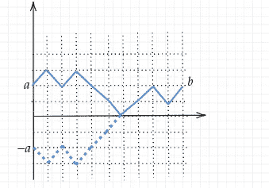
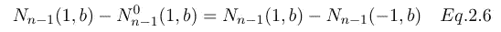

# 随机漫步的两个问题

> 原文：<https://towardsdatascience.com/two-problems-with-the-random-walk-c58ce77d7524?source=collection_archive---------11----------------------->

## 赌徒的破产和伯特兰投票问题

模拟随机行走的 10000 步(图片由作者提供)

> **赌徒的毁灭**:一个赌徒最初有 **k** 美元，她想赢得 **b** 美元在一个公平的赌博游戏中，如果她赢了，她得到一美元，如果她输了，她失去一美元。她在失去一切之前赢得 **b** 美元的概率有多大？
> 
> **贝特朗选票** : A 和 B 是一张选票上的两个候选人，选举结束时，A 得 A 票，B 得 B 票，其中 a > b .投票时 A 一直领先 B 的概率是多少。

这两个问题之间有一个重要的联系——这两个问题都可以翻译成随机行走的语言，随机行走在各个领域都起着重要的作用，比如物理、金融、计算机科学等等。

用随机游走来描述，第一个问题变成:**从值 *k (k > 0)* ，** **随机游走在到达 *b*** 之前不降到零的概率。第二个变成**从 0 开始，** **随机游走在到达 *b*** 之前不归零的概率。它们看起来非常相似，但实际上，它们是使用不同的技术解决的。

随机漫步的想法很简单，如下图所示。在每一步中，我们可以选择向上或向下。如果随机行走是建立在一条线上，在每一步中，我们可以选择向右或向左。也可以证明(非常严谨)正态分布可以这样导出。

图 0.1(图片由作者提供)

形式上，随机游走被定义为序列{Xᵢ: 1 ≤ i < ∞}. Each Xᵢ is a random variable with the alternative distribution. If we consider the unbiased case, we have P(Xᵢ = 1) = 1/2 = P(Xᵢ = -1). At the nth step, the value of the random walk is Sₙ, which is calculated as

Eq. 0.2

obviously, if we start from 0, then

Eq 0.3

# Problem I — Gambler's ruin

To solve the first problem: **给定 S₀ = *k* ，在随机游走达到值 *b* 之前，它不会到达零的概率是多少？**

我们将使用的这种技术称为*第一步分析*。

正如这个技巧的名字所暗示的，首先，我们需要思考第一步之后会发生什么:如果在一开始，随机游走上升，那么在第二步，随机游走从 *k+1* 开始，访问零的概率较低；相反，如果随机游走上升，那么在第二步中它将从 *k-1* 开始，并且访问零的概率更高。这意味着我们可以为函数 Pₖ(Z 找到一个**递归关系**，它表示随机游走从 *k* 开始到达零的概率。z 是零被访问的事件。

我们用 D 来表示随机漫步向下走一步，向上走一步。根据全概率定律，在第一步之后，我们有

情商。1.1

其中 P(Z|U)表示随机游走不下降到零的概率，假设随机游走在第一步中上升。P(Z|D)是类比定义的。为了使符号更通用，我们重写了等式。1.1 作为

情商。1.2

其中 Pₖ(Z 的含义)与前面提到的相同。注意，在 Eq 中没有关于哪一步的信息。1.2.我们只对随机游走相对于起点值归零的概率感兴趣。利用下面的递归关系，我们可以进一步处理方程。1.2

那些递归关系说的很简单——如果在当前步骤中随机游走从 k 开始，那么在下一步中它将从 k+1 开始；如果它在当前步骤中下降，在下一个步骤中，它将从 k-1 开始，如图 1.5 所示

图 1.5(作者图片)

为了使符号更简洁，我们用 pₖ来表示 Pₖ(Z).情商。1.2 现在变成了

情商。1.6 是二阶差分函数(不是“微分”函数，因为随机游走是离散过程，这里不涉及微分)。来自 Eq。1.7，我们可以看到增量是不变的。这意味着，{pₖ}是一个等差数列

获得情商后。1.8，我们已经快完成了。如果找到用 *k* 和 *b* 表示 **p₀** 和 **m** (提醒:b 是随机游走的目标值)的方法，我们就有解了(经过一些琐碎的修改)。但这并不难。有了下面的边界条件，我们就可以立即得到解。

(图片由作者提供)

因此，p₀是从边界条件直接获得的。使用替换后，我们得到 m = -1/b，并且

等式 1.9 在到达 b 之前，从 k **到零**的随机游走的概率

这意味着随机游走在到达 b 之前没有降到零的概率是 **k/b** 。

*问题一概述*

在赌徒的破产问题中，赢一美元和输一美元分别对应着随机游走的上升和下降。目标是在破产前赢得 b 美元。我们可以看到解 k/b 是有道理的:初始资金越多，赢的概率就越高——如果你一开始资金很少，赢的概率几乎为零。

# 问题二——伯特兰的选票

我们将*统计轨迹*来解决第二个问题:**从 0 开始，随机游走在到达 *b 之前不归零的概率是多少？***

这种方法的核心思想是，在随机行走领域，每个事件都可以用一组轨迹来表示。因此，事件的概率是两个这样的集合的大小的比例(轨迹的计数)。为了让后面的事情更清楚，我们引入下面的符号。

(图片由作者提供)

我们用 *n* 表示总步数，用 *r，l* 分别表示向上和向下的步数，因为它们对应于一条线上的左右步数。首先，我们将看一个简单的子任务，**有多少条轨迹，从(0， *a* )到(n， *b* )？**这可以通过一个例子得到最好的理解。

图 2.1(作者图片)

图 2.1 显示了一个例子，其中，在 10 个步骤中，随机游走从(0，3)到(10，7)。要发现的最重要的事情是*为了从 a 到 b(不失一般性，我们假设 b > a)，必须有 b-a 更多的步骤向上*。这意味着 *r-l = b-a* 。在图 2.1 中，随机游走在 10 步中向上走了 4 步—向上 7 步和向下 3 步满足要求。同样，总共有 n 个步骤，因此 *r + l = n* 。有了这两个方程， *r* 和 *l* 可以唯一确定。解完这个方程组后，我们得到

因为 r 和 l 对于这个信息是唯一的，我们也可以看到

情商。2.4

现在很容易解决子任务。我们可以利用[二项式系数](https://en.wikipedia.org/wiki/Binomial_coefficient) : *从(0，a)到(n，b)的轨迹数等于从 n 步中选择 r 步向上(或者等价地，向下)的可能方式*。因此我们得到

这是一个重要的结论，以后会用到。另一个重要的陈述是反射原理，它说

**反射原理**

这个很容易验证:考虑集合 X 和 Y，其中 X 是从(0，a)到(n，b)访问 0 的所有轨迹的集合，Y 是从(0，-a)到(n，b)的所有轨迹的集合。这两组之间存在双射，因为在第一次到达零点之前，X 中的每个轨迹都被映射到 Y 中围绕 X 轴的镜像轨迹*。从 Y 到 x 的映射也是如此，如下图所示*

镜像轨迹。(图片由作者提供)

在所有这些准备工作之后，我们现在转向关键陈述——投票定理，从中我们可以很容易地得到 Bertrand 投票问题的解决方案。选票定理说

选票定理。(图片由作者提供)

这个定理可以直接证明。因为在第一步中，随机漫步必须向上，所以目标是

从(0，0)到(n，b)不重访零的轨迹数

利用反射原理，我们得到

从这里，我们插入 Eq。2.5，其余的将用代数方法证明

因此，从(0，0)到(n，b)的随机游走不归零的概率是

情商。2.8

*问题二总结*

在投票中，我们认为 A 的一票为 1，B 的一票为-1。投票结束，结果是 *a* 票给 A， *b* 票给 B，所以总共有 *a+b* 票，对应的是随机行走中的 *a+b* 步( *n=a+b* )。而 A 和 B 的分数差就是 *a-b* 。如果我们将其转化为随机行走，这个场景对应于从 *(0，0)* 到 *(a+b，a-b)* 。使用我们在本节中得到的结果(等式。2.8)，解决方法是 *(a-b)/(a+b)* 。

*结论*

在这篇文章中，我们将介绍离散数学中两个众所周知的问题，这两个问题都可以通过随机漫步来解决。它们是赌徒的毁灭和伯特兰的选票问题。这两个问题被映射成两个在随机游走方面看起来非常相似的问题，但是它们被不同地解决了。在这篇文章中，我们使用第一步分析解决了赌徒的破产问题，并通过计算轨迹解决了 Bertrand 投票问题。希望这篇文章有助于理解这两个问题，并对随机漫步有更深入的了解。

资源:

[1]斯蒂尔，J. M. (2001 年)。 [*随机微积分与金融应用*](https://link.springer.com/book/10.1007/978-1-4684-9305-4) (第一卷)。纽约:斯普林格。

[2] Grimmett，g .，& Stirzaker，D. (2020 年)。 [*概率和随机过程*。](https://books.google.cz/books?hl=en&lr=&id=gfLuDwAAQBAJ&oi=fnd&pg=PP1&dq=Probability+and+random+processes&ots=TUwQbZ5zYF&sig=89ABnGM7xWa_dT19RDpXQymPEGQ&redir_esc=y#v=onepage&q=Probability%20and%20random%20processes&f=false)牛津大学出版社。