# 用 Python 实现组间差异的双样本推断

> 原文：<https://towardsdatascience.com/two-sample-inference-for-the-difference-between-groups-with-python-de91fbee32f9?source=collection_archive---------11----------------------->

## 用 Python 实现大学统计

# 介绍

在一系列的每周文章中，我将会涉及一些重要的统计学主题。

目标是使用 Python 来帮助我们获得对复杂概念的直觉，从经验上测试理论证明，或者从零开始构建算法。在本系列中，您将会看到涵盖随机变量、抽样分布、置信区间、显著性检验等主题的文章。

在每篇文章的最后，你可以找到练习来测试你的知识。解决方案将在下周的文章中分享。

迄今发表的文章:

*   [伯努利和二项随机变量与 Python](/bernoulli-and-binomial-random-variables-d0698288dd36)
*   [用 Python 从二项式到几何和泊松随机变量](/geometric-and-poisson-random-variables-with-python-e5dcb63d6b55)
*   [用 Python 实现样本比例的抽样分布](/sampling-distributions-with-python-f5a5f268f636)
*   [Python 的置信区间](/confidence-intervals-with-python-bfa28ebb81c)
*   [使用 Python 进行显著性测试](/significance-or-hypothesis-tests-with-python-7ed35e9ac9b6)
*   [用 Python 进行组间差异的双样本推断](/two-sample-inference-for-the-difference-between-groups-with-python-de91fbee32f9)
*   [分类数据的推断](/inference-for-categorical-data-9f3c6034aa57)
*   [高级回归](/advanced-regression-f74090014f3)
*   [方差分析— ANOVA](/analysis-of-variance-anova-8dc889d2fc3a)

像往常一样，代码可以在我的 [GitHub](https://github.com/luisroque/College_Statistics_with_Python) 上找到。

# 比较人口比例


图 1:2021 年葡萄牙地方选举将于同年 9 月 26 日举行；[来源](https://unsplash.com/photos/T9CXBZLUvic)。

假设波尔图市的一名候选人对比较投票给他的男女比例感兴趣。在那个周末，一项新的民意调查得出了以下信息:在 1000 名男性样本中，62%的人回答说将投票给他，在 1000 名女性样本中，57%的人回答说将投票给他。实际上，这是两种伯努利分布，我们可以用参数来定义:

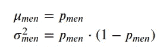

```
from scipy.stats import bernoulli, norm
import numpy as np
import seaborn as sns
import math
import matplotlib.pyplot as plt
from graphviz import Digraph# Theoretical parameters for men
p1 = 0.65
n1=1000
n = n1

μ_1 = p1
var_1 = p1*(1-p1)

dist_men = np.concatenate((np.ones(int(p1*n)), np.zeros(int(n-(p1*n)))))
sns.histplot(dist_men);
```

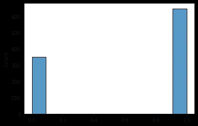

图 2:男性选民的伯努利分布。

```
# Theoretical parameters for women
p2 = 0.58
n2 = n

μ_2 = p2
var_2 = p2*(1-p2)

dist_women = np.concatenate((np.ones(int(p2*n)), np.zeros(int(n-(p2*n)))))
sns.histplot(dist_women);
```

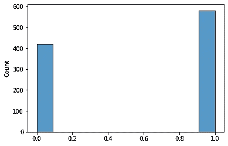

图 3:女性选民的伯努利分布。

我们想弄清楚男性和女性投票给候选人的方式是否有显著的不同。实际上，我们希望得出该差异的 95%置信区间。

因为样本量足够大，我们可以假设正态分布可以近似样本比例的抽样分布。在以前的文章中，我们已经看到了这些发行版的一些属性:

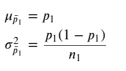

请注意，他们从原始分布中抽取了 1000 个样本来创建投票，然后计算该样本的平均值。这个过程相当于从样本比例的抽样分布中抽取一个样本。

```
# Sampling distribution of sample proportion for men

mu = p1
variance = p1*(1-p1)/n
sigma = math.sqrt(variance)
x = np.linspace(mu - 3*sigma, mu + 3*sigma, 100)
sns.lineplot(x = x, y = norm.pdf(x, mu, sigma));
```

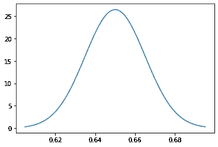

图 4: `Sampling distribution of sample proportion for men.`

```
# Sampling distribution of sample proportion for women

mu = p2
variance = p2*(1-p2)/n
sigma = math.sqrt(variance)
x = np.linspace(mu - 3*sigma, mu + 3*sigma, 100)
sns.lineplot(x = x, y = norm.pdf(x, mu, sigma));
```

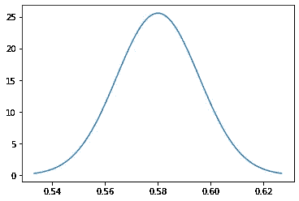

图 5: `Sampling distribution of sample proportion for women.`

事实上，我们对男性和女性的个体分布并不感兴趣。我们感兴趣的是它们的差异，所以让我们创建

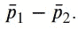

为此，我们需要定义它的参数:

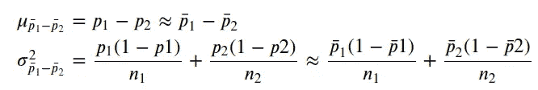

```
# Sampling distribution of sample proportion for the difference between men and women

mu = p1-p2
variance = p1*(1-p1)/n + p2*(1-p2)/n
sigma = math.sqrt(variance)
x = np.linspace(mu - 3*sigma, mu + 3*sigma, 100)
sns.lineplot(x = x, y = norm.pdf(x, mu, sigma));
```

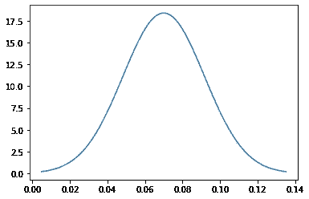

`Figure 6: Sampling distribution of sample proportion for the difference between men and women.`

我们要计算的置信区间表明 p1-p2 有 95%的可能性在内

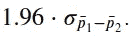

```
# Calculating the number of standard deviations required for a 95% interval

norm.ppf(0.975)1.959963984540054
```

让我们计算一下我们的间隔。

```
np.sqrt(variance) * norm.ppf(0.975)0.042540701104107376
```

现在我们知道有 95%的可能性比例的真实差异在样本比例的实际差异的 0.04254 以内。

```
print(f'The 95% CI is: [{np.round(p1-p2 - np.sqrt(variance) * norm.ppf(0.975), 3)},{np.round(p1-p2 + np.sqrt(variance) * norm.ppf(0.975), 3)}]')The 95% CI is: [0.027,0.113]
```

候选人可以得出结论，男性投票给他的可能性比女性高 95%。请注意，值 0(无差异)不包含在间隔中。

# 比较人口比例的假设检验

我们的方法可以更直接。我们可以定义一个假设检验来评估，事实上，这是否是一个差异。

我们首先定义我们的零假设，它代表无差异的场景。相反，我们的另一种假设认为存在差异。

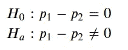

因此，我们想计算

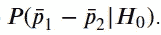

如果这个概率小于为该问题定义的显著性水平，我们将拒绝我们的零假设，并接受男性和女性投票给候选人的差异。换句话说，假设真正的比例是相等的，我们想知道得到像抽样比例的差值一样极端的东西的概率。我们可以将 z 值定义为，

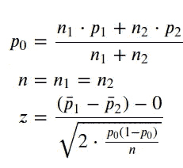

```
p0 = (n1*p1+n2*p2)/(n1+n2)
z = ((p1 - p2) - 0) /(np.sqrt(2*(p0*(1-p0)/n)))
z3.2167337783899304
```

现在，我们可以将 z 统计量与显著性水平为 5%的临界值进行比较。

```
z_critical = norm.ppf(0.975)
z_critical1.959963984540054z > z_criticalTrue
```

我们的 z 统计值大于临界值。换句话说，假设我们的零假设，有 5%的机会对大于临界值的 z 统计量进行采样。在这种情况下，我们拒绝 h0，这意味着我们接受投票给候选人的男女之间的差异。

# 实验的统计显著性

在一项旨在研究假新闻对参与度的影响的实验中，一组 500 人被随机分配到两个不同的组。随机分组后，每个人都收到了一部只有社交媒体应用的智能手机，他们可以用它来关注朋友的新闻和更新。

第一组每天至少收到两次假新闻，而第二组没有。30 天后，测量花在社交媒体应用上的时间。实验的指导者发现，第一组每天花在应用上的平均时间比第二组多大约 12 分钟。

```
gra = Digraph()

gra.node('a', '500')
gra.node('b', '#1\n Fake news')
gra.node('c', '#2\n No fake news')
gra.edges(['ab', 'ac'])gra
```

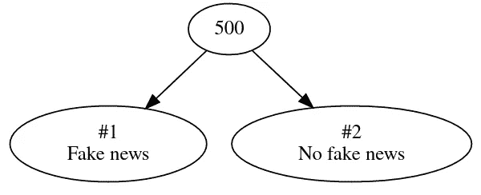

图 7:实验研究的设计，其中 250 人被随机分配到治疗组，250 人被随机分配到对照组。

```
g1 = np.random.normal(3, 1, size=250)
g2 = np.random.normal(2.2, 1, size=250)print('Group 1: ' + str(np.round(g1.mean(),1)) + 'h')
print('Group 2: ' + str(np.round(g2.mean(),1)) + 'h')Group 1: 3.0h
Group 2: 2.2h
```

为了理解这一结果的意义，我们需要将结果重新随机化成两个新组，并测量新组的平均值之间的差异。我们重复模拟 200 次。

```
groups_ind = np.zeros((200, 500))
for i in range(200):
    groups_ind[i] = (np.random.choice(np.arange(500, dtype=np.int32), size=500, replace=False))groups_ind = groups_ind.astype('int32')g = np.concatenate((g1,g2))g1_rand = g[groups_ind][:,:250]
g2_rand = g[groups_ind][:,250:]

g1_rand_mean = g1_rand.mean(axis=0)
g2_rand_mean = g2_rand.mean(axis=0)

diff_g = g1_rand_mean - g2_rand_meansns.histplot(diff_g);
```

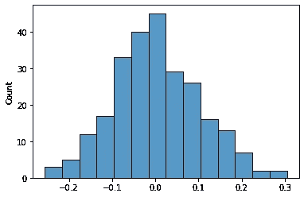

图 8:200 次模拟后，将结果重新随机分为两个新组，各组平均值之间的差异。

我们可以看到，差异大于 0.2 的次数非常少。但它有统计学意义吗？

```
diff_g[diff_g>=0.2].shape[0]/diff_g.shape[0]0.024
```

假设在实验开始前建立了 5%的显著性水平。在这种情况下，我们看到我们的结果在统计上是显著的，因为在 200 次模拟中观察到 12 分钟差异的概率只有 2.4%。如果这是偶然的，那 200 年中只会发生 6 次。

# 结论

本文介绍了如何应用置信区间和假设检验来比较两个总体样本之间的差异。这给了我们一种方法来理解这些差异是否真的有统计学意义。我们将这些想法应用到一个实验中，该实验使用模拟和再随机化来测试治疗组和对照组之间的差异。

保持联系: [LinkedIn](https://www.linkedin.com/in/luisbrasroque/)

# 练习

你将在下周的文章中找到答案。

1.  医生假设，疫苗接种前后因新冠肺炎而住院的平均时间发生了变化。将 1000 名患者随机分为治疗组和对照组。治疗组已经注射了疫苗，而对照组没有注射。结果显示，治疗组的平均住院时间比对照组少 10 天。下表总结了 1000 次数据重新随机化的结果。根据数据，治疗组的平均值比对照组的平均值小 10 天或更多的概率是多少？从实验结果中你能得出什么结论(假设 5%的显著性水平)？

```
diff = [[-17.5,1],
[-15.0, 6],
[-12.5, 15],
[-10.0, 41],
[-7.5, 82],
[-5.0, 43],
[-2.5, 150],
[0., 167],
[2.5, 132],
[5.0, 127],
[7.5, 173],
[10.0, 38],
[12.5, 18],
[15.0, 6],
[17.5, 1]]
```

## 上周的答案

1.  根据去年的一项大型民意调查，波尔图大约 85%的房屋都接入了高速互联网。Marco 想知道这一比例是否发生了变化，他随机抽样调查了 80 栋房子，发现其中 75 栋可以接入高速互联网。他想用这个样本数据来检验这个比例是否真的发生了变化。假设推断条件满足，考虑到 1%的显著性水平，您对拥有高速互联网的房屋比例会得出什么结论？

```
p_0 = 0.85
p = 75/80
n = 80
α = 0.01

z = (p-p_0)/np.sqrt(p_0*(1-p_0)/n)
z2.191785018798024p_value = (1-norm.cdf(z))*2 # see that Marco wants to check if the proportion changed, so it is a two-tail testif p_value < α:
    print("Reject H0")
else:
    print("Fail to Reject H0")Fail to Reject H0
```

2.玛尔塔拥有一家水果店，每周都会收到西瓜。供应商声称它们应该重 1 公斤。Marta 决定对随机抽取的 100 个西瓜进行称重，发现平均重量为 850 克，标准偏差为 200 克。她想用这个样本数据来测试平均值是否小于供应商声称的平均值，如果是这样，就重新协商他们的合同。假设推断的条件满足，Marta 应该怎么做(考虑 5%的显著性水平)？

```
μ_0 = 1
μ = 0.850
s = 0.2
n = 100
α = 0.05

t_star = (μ-μ_0)/(s/np.sqrt(n))
t_star-7.500000000000001p_value = t.cdf(t_star, df=n-1)if p_value < α:
    print("Reject H0")
else:
    print("Fail to Reject H0")Reject H0
```

Marta 应该与供应商重新谈判合同，因为西瓜重 1 公斤的说法在 5%的显著性水平上是不真实的。