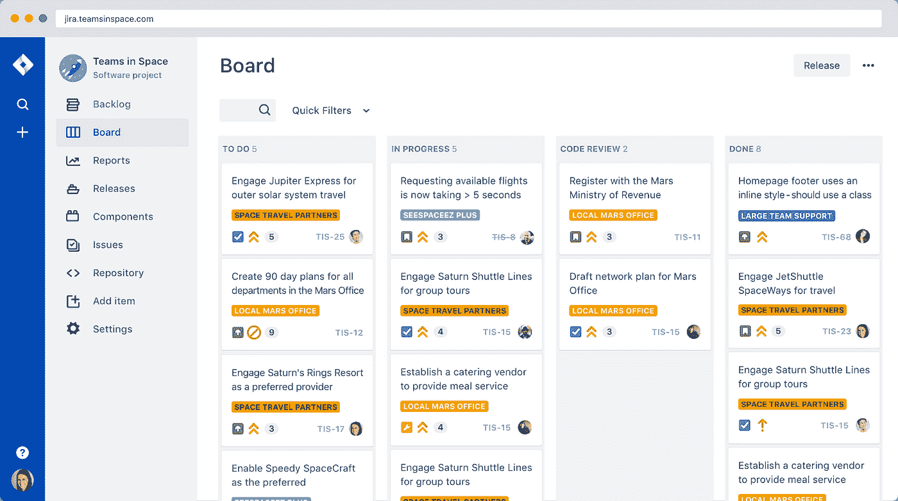
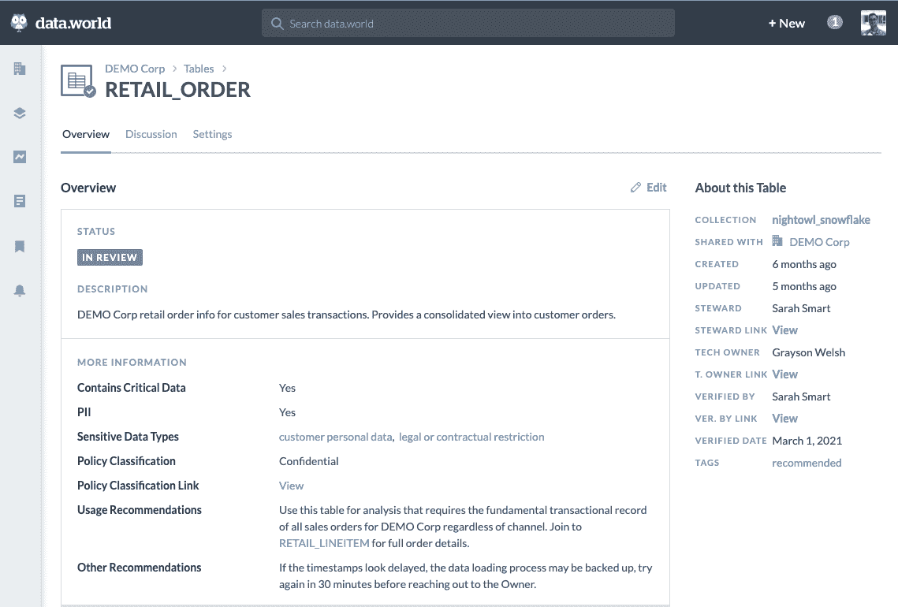

# 为了数据和分析工作，你需要从敏捷中偷两个简单的东西

> 原文：<https://towardsdatascience.com/two-simple-things-you-need-to-steal-from-agile-for-data-and-analytics-work-d3130050f0e5?source=collection_archive---------30----------------------->

## 同行评审和完成的定义:小变化，大影响

穆里洛·维维亚尼在 [Unsplash](https://unsplash.com/s/photos/dog-training?utm_source=unsplash&utm_medium=referral&utm_content=creditCopyText) 上拍摄的照片

将软件开发生命周期的各个方面应用于数据科学、工程和分析是目前非常流行的趋势——这是一件好事。无论您是在谈论[将数据转换视为代码](https://blog.getdbt.com/analytics-engineers-operate-with-leverage/)、[采用数据操作](https://www.datakitchen.io/what-is-dataops/)和敏捷数据治理实践、[考虑数据即产品](https://medium.com/@itunpredictable/data-as-a-product-vs-data-as-a-service-d9f7e622dc55)，还是在考虑[数据网格](https://medium.com/agile-lab-engineering/data-mesh-explanation-a207fac61341)架构(本质上是将微服务基础应用于数据和分析堆栈)，世界正在转向*最终*将数据和分析视为团队运动。但如果你想赢得这个游戏，你需要找到让玩家一起互动和协作的方法，捕捉知识，让更多人更容易玩。

有一股疯狂的热潮要从软件开发社区的成功中汲取经验，尤其是在围绕数据科学和分析促进更好的协作和团队合作方面。伟大的艺术家偷窃，作为一个写了很多关于[敏捷数据治理](https://data.world/resources/what-is-data-governance/)的人，我也这么做！

但是，并不是每个人都赞同这样的想法，如果我们都像软件工程师和产品经理那样做，我们就会得救。人们指出围绕数据隐私、偏见、有效性和其他问题的非常有效的问题，这些问题使得分析和数据科学的输出比典型的敏捷软件项目更加敏感。同样清楚的是，涉及数据和分析的工作通常在组织中的关键决策中达到高潮，这些决策涉及比典型的软件项目更广泛的利益相关者。

从赞成的一面来看，包容的、迭代的、真正涉及整个项目的利益相关者的敏捷实践有可能以真正有意义的方式将数据生产者(数据工程师和管理者)和消费者(数据科学家和分析师)聚集在一起。这有助于形成强大的数据驱动型文化，并极大地提高数据素养。

在我的日常工作中，我们构建一个[数据目录](https://data.world/blog/what-is-a-data-catalog/)平台，这个平台被像 Prologis 这样的企业使用，prolog is 是世界上最大的物流房地产公司。通过使用用例驱动的敏捷方法开发其分析和数据治理实践，Prologis 已经能够以真正具有变革性的方式部署它。

> 从历史上看，我们的组织采用自上而下的“煮沸海洋”的方法来进行数据治理，这种方法并不适合我们。我们知道，我们必须彻底改变我们的方法，把重点放在我们的用户经历最痛苦和恶化的地方。然后，我们允许真实世界的数据推动我们的数据治理计划的扩展。简而言之，通过基于业务用例对数据资产进行优先级排序，以迭代的方式专注于部署我们的数据目录，这是重新点燃员工对我们的治理计划的兴趣的关键。"
> 
> — Luke Slotwinski，Prologis 数据和分析副总裁

开展数据编目计划对你来说可能还不太可能，但如果我告诉你，敏捷中有两个简单的想法，你可以在今天实施，这将极大地提高你的数据和分析工作的质量，并开始促进共享理解和数据素养，会怎么样？这两个概念是同行评审和完成的定义。

# 同行审查

在软件开发中，代码(或同行)审查的想法比 Github 著名的“拉请求”功能要早得多，该功能允许工程师在作品发布前对彼此的作品进行评论。我第一次读到这种技术是在史蒂夫·麦康奈尔的[代码全集](https://www.amazon.com/Code-Complete-Practical-Handbook-Construction/dp/0735619670/ref=sr_1_1?dchild=1&keywords=code+complete&qid=1631031686&sr=8-1)——它最初于 1992 年出版！让一个队友复查你的工作，并对你可能错过的事情提出建议，这是一种简单的力量和美丽。对于特别复杂的代码，两位工程师可能会一行一行地检查，作者实时地向评审者解释它是如何工作的。这有一个额外的好处，即确保重要的知识转移，确保团队中不止一个人知道代码是如何工作的，并避免可怕的“总线因素 1”。

将这种风格的回顾作为你的过程的一部分是非常有效的。这样做的另一个好处(特别是因为我们现在几乎都生活在一个遥远的世界)是，在进行这些审查时捕获的评论可以极大地改进您的任何数据和分析文档工作，而几乎不需要额外的努力。需要注意的是，评审应该关注同行数据科学家或分析师如何完成分析，或者是一行一行的代码，或者是如何创建可视化。这不是涉众或最终用户验收测试。(在软件中，这类似于让用户点击原型，然后称之为完成)。

这一点怎么强调都不为过:同行评审者会发现你的技术中的错误，或者会有商业利益相关者根本不会有的建议(特别是如果分析恰好证实了一个信念或者先前持有的偏见)。在流程中增加这一步骤将对跨部门协作、整体数据素养产生积极影响，并对完成的分析或交付的数据模型的质量产生巨大影响。我建议你在谷歌上搜索“良好的代码阅读实践”( Good Code Read Practices )( T1 ),寻找大量关于如何做好这一点的文章，并思考如何将其应用于你公司的数据和分析最佳实践。

# 完成的定义

在同行评议会议中，真正能有所作为的是有一个很好的“完成的定义”。完成的[定义的概念来自软件开发领域的 Scrum 方法论，其思想是当用户故事完成时，你应该有一个简单而明确的清单来检查，以确保作为一名工程师(和评审者)，你已经击中了目标。拥有一份简单的清单，组织中的所有数据科学家、分析师和工程师都同意使用该清单来签署工作，可以显著提高数据工作的质量和一致性。](https://www.agilealliance.org/glossary/definition-of-done/)

然而，当谈到分析和数据工程工作的定义时，您可能需要对您的分析工作和数据建模工作有单独的定义。我们在这项工作中使用了几个定义，它们可能也是您的组织的良好起点:

## 数据科学和分析的完成定义

*   假设说得好
*   检查方法的偏倚
*   数据源被很好地定义
*   提交给数据工程的新数据源/建模
*   方法已被读取，并且可以在对等环境中复制和使用
*   轴、特征、域被很好地定义
*   记录结论和行动步骤
*   已审查合规性
*   公开征求意见或重新使用

## 数据建模完成的定义

*   编写数据字典
*   已链接的现有业务术语和相关指标
*   提交的新业务条款
*   已审核转换代码
*   坚持数据架构风格(Kimball、Data vault 等)
*   坚持不要重复自己的原则
*   编写的测试和数据配置文件得到了很好的记录/理解
*   已审查合规性
*   公开征求意见或重新使用

当我们在 data.world 采用 [dbt](https://www.getdbt.com/) 对我们的内部数据和分析进行建模时，完成这些定义(尤其是以数据建模为重点的定义)有助于建立我们完成分析工程工作的基线。这确保了即使我们学习了一个新工具，当我们回顾彼此的工作时，我们在寻找什么方面是一致的。当我们迁移到雪花时，这很容易使我们将新数据模型放入数据仓库的效率提高一倍。

# 采用实践

无论何时你采用一种新的实践，比如进行同行评审或有一个完成的定义来检查工作，重要的是将它们纳入你今天用来管理项目的工具中——你甚至不需要任何花哨的新数据或分析基础设施来做这件事。通常，仅仅调整像 JIRA 这样的软件过程工具来适应你的数据和分析实践就足够了。如果你正在围绕用户故事组织你的分析工作，在像 JIRA 这样的工具中增加一个“同行评审”步骤是非常容易的。使用 JIRA 的敏捷董事会很简单，并且已经包含了一个评审步骤:

作者图片

如果你实际上已经有了一个数据目录，给你的数据资产添加一个“In Review”标志也是非常有用的，并且可以同步到你的项目管理工具中。这些标志可以用来分配审查者，或者让消费者知道资产是否已经可以使用了。

作者图片

# 借助敏捷赢得数据和分析

在这篇文章的开始，我提到了我从敏捷软件开发原则中窃取并将其应用于数据和分析工作的历史。你知道吗？我将继续从敏捷中偷东西，因为我相信创造协作的、数据驱动的文化，在这种文化中，数据和分析的透明度和信任占主导地位。同行评审和遵循一个众所周知的数据和分析工作完成的定义是你今天可以采纳的非常有价值和简单的想法。没有哪两个变化更容易实现，或者对数据质量和组织内的共同理解有更大的积极影响。

我希望听到任何在您的数据和分析流程或治理工作流中采用这些或其他敏捷方法的人的意见！