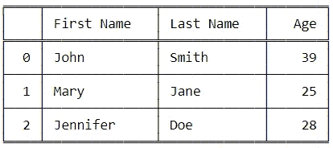
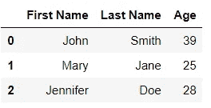
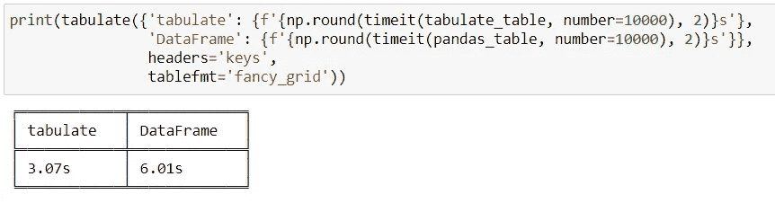

# 在 Python 中创建表的两种方法

> 原文：<https://towardsdatascience.com/two-ways-to-create-tables-in-python-2e184c9f9876?source=collection_archive---------5----------------------->

## Python 中制表和熊猫数据帧函数的性能比较


照片由 [Fotis Fotopoulos](https://unsplash.com/@ffstop?utm_source=medium&utm_medium=referral) 在 [Unsplash](https://unsplash.com?utm_source=medium&utm_medium=referral) 上拍摄

在之前的教程中，我们讨论了如何使用 ***制表*** 函数在 Python 中创建格式良好的表格。但是，我们也可以使用 pandas***data frame***函数创建一个 **DataFrame** 对象来显示表格(二维)数据。

毫无疑问，当需要对数据进行任何类型的统计分析或机器学习时，pandas **DataFrame** 对象是最佳选择。但是，当唯一的目标是将数据组织成可读性更好的格式时，这两个函数都可以用来实现。

如果我们处理大量数据，使用计算效率最高或执行时间最少的函数是有意义的。

因此，在本教程中，我们将利用 ***timeit*** 函数来比较 ***制表*** 和 ***数据帧*** 函数的效率。

## 导入功能

首先，我们将导入必要的函数，如下所示:

```
from tabulate import ***tabulate***
from pandas import ***DataFrame***
from timeit import ***timeit***
```

</become-a-more-efficient-python-programmer-3850c94b95a4>  

## 创建函数

然后我们将创建两个函数，一个使用 ***制表*** 函数，另一个使用熊猫 ***数据框*** 函数，来显示我们的表格数据。

在这两个函数中，下面的字典 **info** 将用于提供表格数据:

```
**info** = {'First Name': ['John', 'Mary', 'Jennifer'], 
        'Last Name': ['Smith', 'Jane', 'Doe'], 
        'Age': [39, 25, 28]}
```

## 使用制表的函数

```
def ***tabulate_table***():
    **info** = {'First Name': ['John', 'Mary', 'Jennifer'], 
            'Last Name': ['Smith', 'Jane', 'Doe'], 
            'Age': [39, 25, 28]}
    **table** = tabulate(**info**, headers='keys', showindex=True, tablefmt='fancy_grid')
```

> *我们传入* ***信息*** *作为* **制表** *函数的表格数据。我们选择字典中的*键*作为表格的标题，并使用* fancy_grid *表格格式。我们设置* **showindex** *为****True****因为一个熊猫****data frame****默认显示一个指数。*

***制表 _ 表格()*** 函数将创建以下表格:



*详细了解* ***制表*** *功能:*

</how-to-easily-create-tables-in-python-2eaea447d8fd>  

## 使用数据帧的函数

```
def ***pandas_table***():
    **info** = {'First Name': ['John', 'Mary', 'Jennifer'], 
            'Last Name': ['Smith', 'Jane', 'Doe'], 
            'Age': [39, 25, 28]}
    **table** = DataFrame(**info**)
```

***pandas_table()*** 函数将创建以下**数据帧**:



> 制表函数创建一个字符串对象，而数据帧函数创建一个熊猫数据帧对象。

## 表演

我们将使用 ***timeit*** 函数来测量每个函数运行 10，000 次所需的时间，如下所示:

```
print(f'Time for tabulate: {**timeit**(tabulate_table, number=10000)}s')
print(f'Time for DataFrame: {**timeit**(pandas_table, number=10000)}s')**Output:**
Time for tabulate: 3.357472500001677s
Time for DataFrame: 6.2918465999991895s
```

如上所述，与 ***DataFrame*** 函数相比， ***制表*** 函数创建表格的时间大约是前者的一半。因此，当我们的唯一目标是将表格数据显示成可读性更好的表格时，那么*是 pandas***data frame***的一个很好的替代品。*

**

*如果你喜欢阅读这样的故事，并想支持我成为一名作家，考虑注册成为一名媒体成员。每月 5 美元，你可以无限制地阅读媒体上的故事。如果你用我的 [*链接*](https://lmatalka90.medium.com/membership) *报名，我就赚一小笔佣金。**

*<https://lmatalka90.medium.com/membership> * 

**我希望你喜欢这个* ***制表*** *和* ***数据帧*** *函数之间的性能比较。感谢您的阅读！**