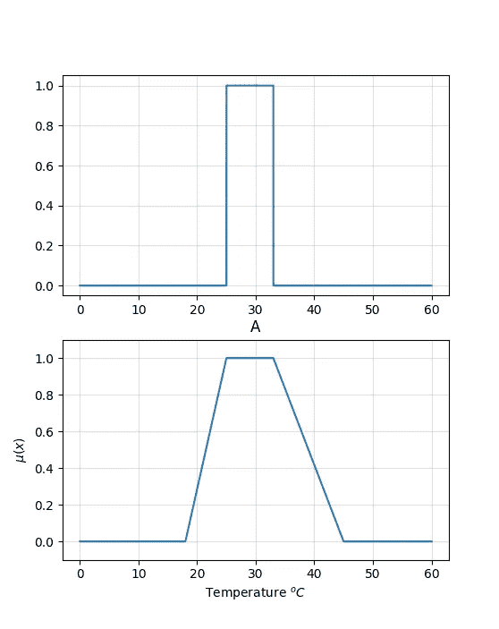
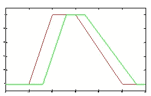
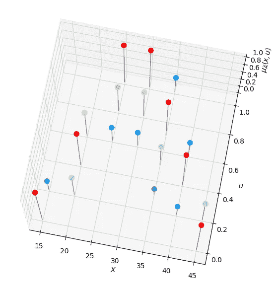
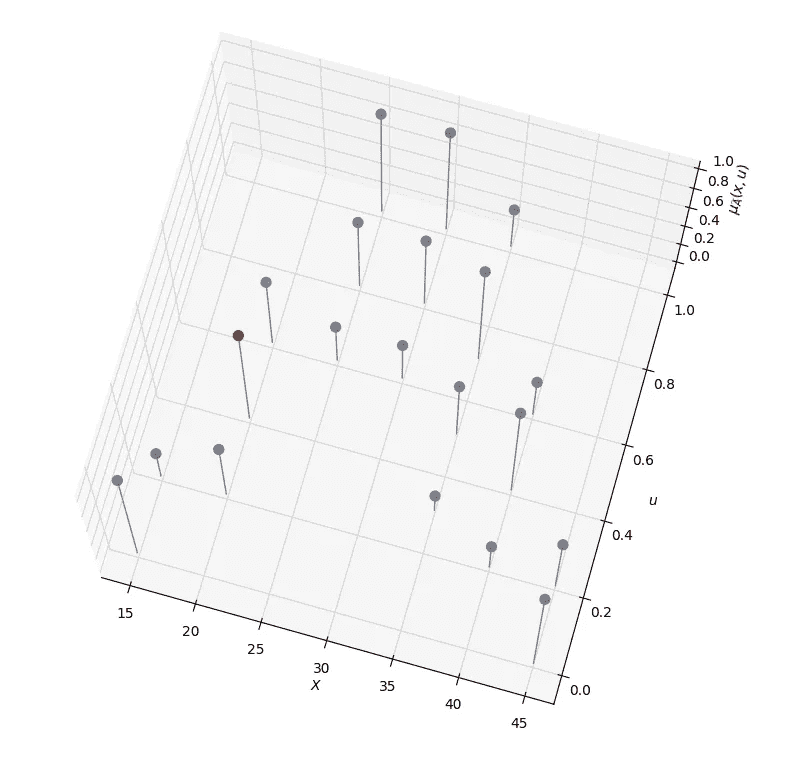
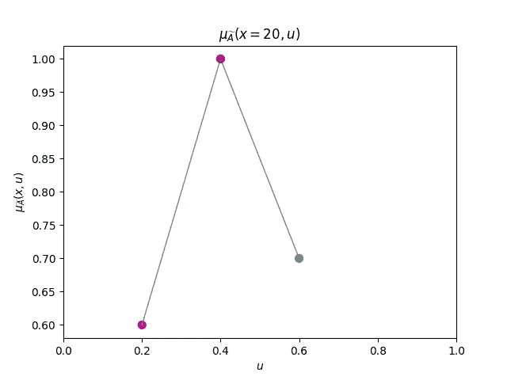
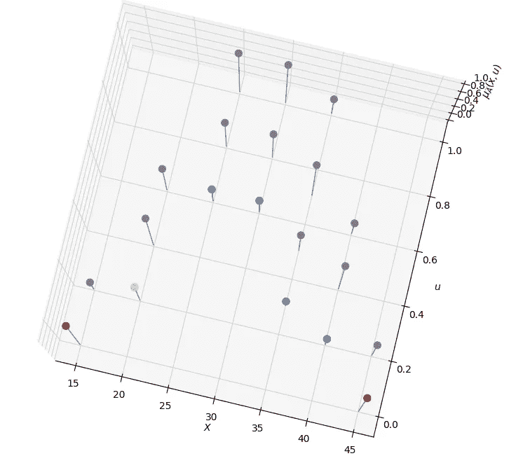
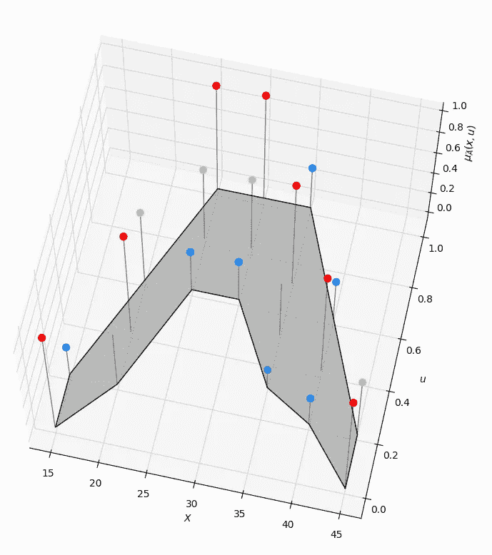
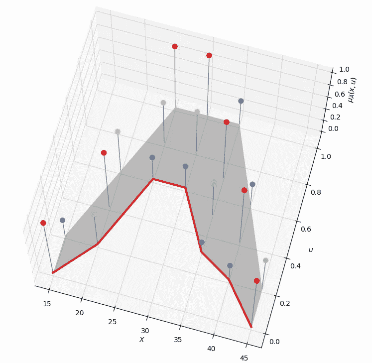
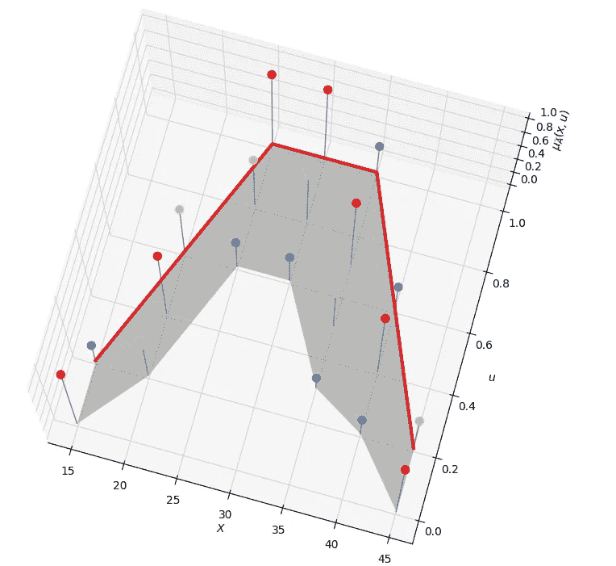

# 二型模糊集导论

> 原文：<https://towardsdatascience.com/type-2-fuzzy-sets-812c5b4d602d?source=collection_archive---------13----------------------->

## 熟悉 2 型模糊集和逻辑背后的一些基本概念


图片由 pixabay.com 拍摄

## 介绍

在[之前的一篇文章](/a-very-brief-introduction-to-fuzzy-logic-and-fuzzy-systems-d68d14b3a3b8)中，我们已经看到了当我们不能确定一个元素的成员是 0 还是 1 时，我们如何使用类型 1 的模糊集。当环境如此模糊，以至于我们很难将隶属度确定为[0，1]中的一个数字时，我们可以扩展这个概念。在这些情况下，2 型模糊集提供了必要的框架来形式化和处理这些信息。

这篇文章将着眼于 2 型模糊集背后的基本概念。我们将根据 Robert John 和 Jerry Mendel 的“Type-2 Fuzzy Sets made Simple”进行讨论，这可能是学习 Type-2 Fuzzy Sets 和逻辑的最佳论文。

## 什么是二型模糊集？

我们从重申模糊集理论背后的动机开始讨论。让我们假设今天的温度是 25 摄氏度，或 77 华氏度。我们能认为今天是个大热天吗？一个精确的温度计读数告诉我们关于一天的什么，我们应该如何根据这个读数来调节我们的行为？

美国国家海洋和大气管理局(NOAA)认为 26 至 32 度之间的范围为“小心”，并将温度范围进一步确定为“危险”和“极度危险”如果我们坚持这个定义，我们可以想象 NOAA 画的热天的界限。因此，我们可以得出结论，今天不会属于'热'天的范畴，也许在'温暖'或'略热'的一天。

用这种逻辑对一天进行分类将意味着任何低于 26 度和高于 32 度的温度都不会使这一天变得“热”。

如果我们从模糊的角度看待“热”天的概念，我们的推理将会改变。我们可以认为 20 度有点“热”，而 30 度肯定是“热”。另一方面，我们可以把四十度归类为超越‘热’的温度；也许它可以归入“炎热”一类。将“热”视为一个模糊的概念会将刚性边界转换为一条曲线，该曲线定义了不同类别中每个温度的不同等级。因此，温度可以是“温暖的”。“热”和“炎热”同时出现，尽管在每个类别中程度不同。



现在让两个不同的人画出他们对模糊集“热”的感知，并几乎肯定地要求他们使用梯形集来描述。我们将得到两个略有不同的定义。我们将看到，当我们要求更多的人提交他们的定义时，给定温度对集合“热”的隶属度将逐渐模糊，而描述隶属度的每个点将依次转化为三维函数中的模糊集合。结果是类型 2 的模糊集。

因此，第二类模糊逻辑是由概念对不同的人有不同的意义这一前提所激发的。



用于定义“热”温度概念的第二类模糊集(我们用 A 表示)如下所示:



## **二型模糊集**

2 型模糊集的隶属函数是三维的，具有

*   x 轴称为**主变量**
*   y 轴被称为由$u$表示的**二级变量**或**二级域**。我们注意到，该轴表示类型 1 集合中的隶属度，因此范围在**【0，1】**中。然而，在这种情况下，我们对每个主要变量值都有一个隶属度值范围。
*   z 轴被称为**隶属函数值** ( **二级**)，由下式表示

定义 2 型模糊集最直接的方法是考虑构成一个集合的三维空间中所有点的集合。因此，形式上，类型 2 集合也可以表示为:

其中二重积分符号表示连续论域的容许的 **x** 和 **u** 的并集(对于离散论域，使用二重求和符号代替)，

因此，我们可以将上面所示的类型 2 集合描述如下:

```
(1 / 0 + 0.3 / 0.2)/15 +(0.6 / 0.2 + 1 / 0.4 +0.7 / 0.6 )/20 +(0.4 / 0.6 + 0.7 / 0.8 +1 / 1 )/25 +(0.4 / 0.6 + 0.7 / 0.8 + 1 / 1 ) /30 +(0.2 / 0.3 + 0.6 / 0.5 + 1 / 0.7 +0.4 / 1 ) / 35 +(0.3 / 0.2 + 1 / 0.4 + 0.4 / 0.6 ) /40 +(1 / 0 + 0.6 / 0.2 ) / 45
```

此外，

被称为主要成员，将在下一节详细讨论。

## **垂直切片**

如果我们分离出一个主变量值，我们注意到我们得到一个称为垂直切片的 1 型模糊集。



因此，垂直切片是 1 型模糊集；

正式定义为:

由垂直切片产生的函数也被称为**次级隶属函数**，正式书写为

即

因此，在 **x=20** 处的次级隶属函数为:

```
0.6 / 0.2 + 1 / 0.4 +0.7 / 0.6
```

次隶属函数的**域**称为 **x** 的**主隶属度**。因此在上面的等式中

**是主隶属函数**

```
J_{20}= {.2, 0.4, 0.6}
```

二级隶属函数的**幅值**为**二级等级**。因此在上面的等式中， **f(u)** 是二级等级。

如果 **X** 和 **J** 是离散的:

关于中学年级，我们可以注意到

是二级成绩。

## **嵌入式 2 型套**

通过从集合中的每个次级隶属函数中取出单个元素，可以为离散的 X 和 U 创建一个**嵌入式类型 2 集合**。因此，如果 **X** 有 **N** 个元素，我们的 type-2 集合正好有一个元素来自

也就是

每个都有相关的等级

使得:



总共有

二型模糊集中的嵌入集

因此，所识别的嵌入式 2 型模糊集是:

```
1 / 0 / 15 + 0.6 / 0.2 / 20 + 0.4 / 0.6 / 25 + 0.4 / 0.6 /30 + 0.2 / 
```

我们还注意到，我们的集合包含 **2 x 3 x 3 x 3 x 4 x 3 x 2 = 1296** ，嵌入式 type-2 集合。

然后，我们还可以通过所有嵌入的 2 型模糊集的集合来表示 2 型模糊集，称为**波浪切片表示法**或**孟德尔-约翰表示法。**因此，波形切片表示为:

## **1 型模糊集**

1 型模糊集可以表示为 2 型模糊集。其类型 2 表示为:

**1** 的值意味着次级隶属函数在其定义域中只有一个值，即次级等级等于 1 的初级隶属。

## **足迹的不确定性**

第二类集合的 2D 支持称为**不确定性足迹(FOU)**

FOU 表示第二类集合中主要成员的不确定性。它是所有主要成员的联合。



阴影 FOU 意味着在第三维中的类型-2 模糊集的顶部的分布，其取决于二级等级的选择。当所有二型集的二级等级都等于 1 时，该集称为**区间二型模糊集**。

我们注意到，不确定性的足迹有上下限，称为上下隶属函数:

**下级隶属函数**



**上层隶属函数**



## 结论

在这篇文章中，我们讨论了 2 型模糊集作为一种更复杂的结构，我们可以解释用 1 型模糊集无法解释的模糊性。我们还研究了构成类型 2 集合的基本原则，不确定性和嵌入集合的足迹。在以后的文章中，我们将讨论如何将 1 型逻辑扩展到 2 型逻辑。

感谢本·胡伯尔曼