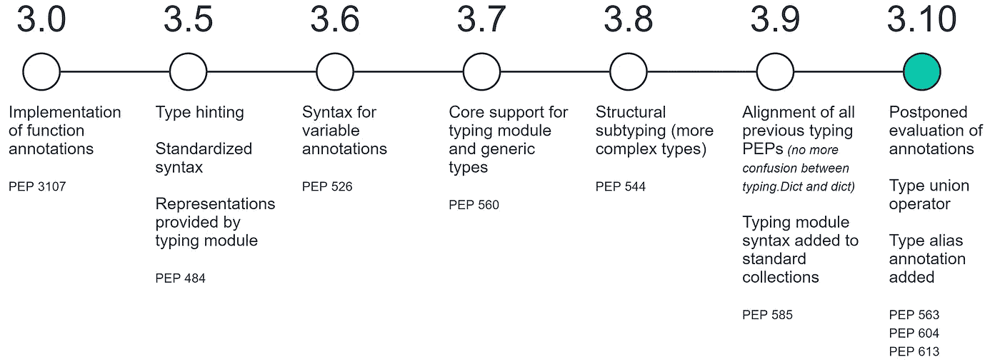
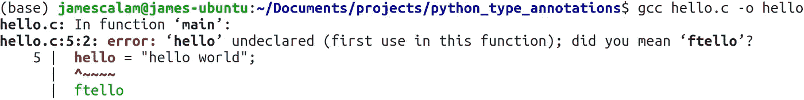
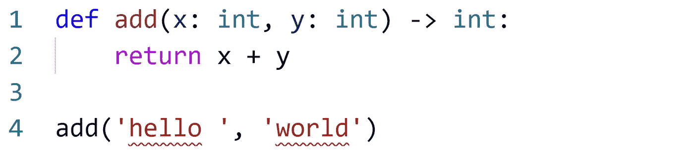
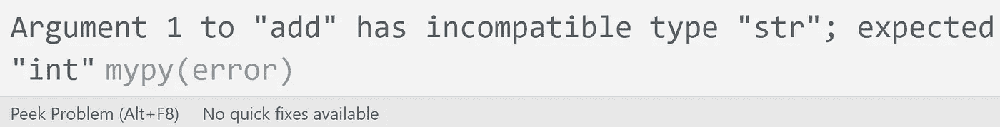
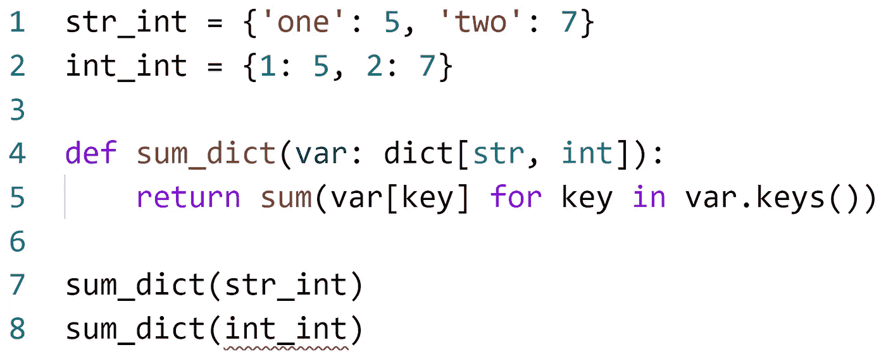
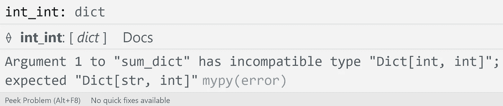

# Python 中的类型注释

> 原文：<https://towardsdatascience.com/type-annotations-in-python-d90990b172dc?source=collection_archive---------0----------------------->

## 编写额外的代码


作者图片

类型注释在 Python 中有着漫长而复杂的历史，可以追溯到 Python 3 的第一个版本，以及函数注释的最初实现。



从 Python 3.0 到现在类型注释的变化时间表。

从那以后，特性来了又去。类型提示的前景已经经历了几次大的变革——特别是 Python 的两个最新版本——3.9 和(即将到来的)3.10。

在本文中，我们将看看这些特性——以及我们如何在自己的代码中应用类型提示！

# 什么是类型注释？

类型注释——也称为类型*签名*——用于指示变量的数据类型以及函数和方法的输入/输出。

在许多语言中，数据类型是显式声明的。在这些语言中，如果你不声明你的数据类型，代码将不会运行。

让我们以 C 语言的 hello world 脚本为例:

```
#include<stdio.h>**int** main()
{
    **char** hello**[]** = "hello world!";
    printf("%s\n", hello);
    return 0;
}
```

这里我们定义了两种类型签名，`int`和`char`。这段代码可以完美地编译和运行。但是如果我们去掉我们的`char`签名会发生什么呢？



在变量定义中缺少类型签名 **char** 会给我们带来编译时的痛苦。

我们的代码不会工作。c 要求我们声明所有的变量数据类型。

Python 更加宽容——我们不需要在任何时候定义类型。

## 静态与动态

编程语言中有这些方法的名称。c 要求我们显式定义类型——它是一种静态类型化的语言。

另一方面，Python 是一种动态类型化的**语言，它对变量赋值的方法更加狂热。**

我们如何定义这两种方法？

*   **静态类型** —在编译时执行类型检查，并且*需要数据类型声明*。
*   **动态类型化** —在运行时执行类型检查，并且*不需要数据类型声明***。**

*这两种方法都有优点和缺点，但是静态类型语言的一个优点(适用于我们)是它使得代码非常明确。举两个例子来说明为什么这很有用:*

1.  *代码中明确定义了数据类型，消除了任何潜在的数据类型歧义。*
2.  *编写代码时，较小的输入错误和错误更容易识别，例如:*

```
*characters = 'am a'
character = 'I ' + characters + ' string'*
```

*第二个变量应该是`character**s**` 而不是`character`。在静态类型化语言中，这种拼写错误会引发错误，但对于动态类型化语言，则不会。*

**另一方面*，静态类型的代码被很多人认为过于冗长。使得代码的读写更加复杂。*

*实际上，这两种范式都不比另一种更好或更差。他们各有长处和短处。*

*现在对泛型类型注释已经说得够多了，那么 Python 类型注释呢？*

# *Python 的类型注释*

*Python 中的类型注释与我们的 C 示例中的成败攸关。它们是*可选的*语法块，我们可以添加它们以使代码更显式。*

*错误的类型注释只会在我们的代码编辑器中突出显示错误的注释—注释不会引发任何错误。*

*因此，如果不强制执行类型注释，为什么要使用它们呢？*

*正如我们已经谈到的，声明类型使我们的代码更显式，如果做得好，就更容易阅读——对我们自己和其他人来说都是如此。*

## *基础*

*从 Python 3.9 中，我们可以定义如下数据类型:*

*很酷吧？在第一行中，我们将`hello`初始化为字符串，然后为其分配`"hello world"`。*

*之后，我们定义了一个简单的函数，并声明了两个输入参数`x`和`y`的预期数据类型，甚至是函数返回的数据类型`-> **int**`。*

*现在，如果我们输入一个不正确的注释，会发生什么？*

*实际上，没什么重要的——记住，Python 并不*或*强制我们的类型注释。*

**

*我们的 Python linter 突出显示了我们的代码，提供了错误的警告。*

**

*将鼠标指针放在突出显示的代码上可以告诉我们，经过了一个 **str** ，在那里我们会得到一个 **int** 。*

**代替*，它们由第三方 IDEs 和短绒使用。因此，我们的第三方工具就会凸显出一个错误的诠释——它就像一个预警系统，告诉我们的逻辑并不完全正确。*

## *合并数据类型*

*除了基本数据类型`int`、`str`、`float`、`dict`等，我们还可以将它们组合起来创建更复杂的类型结构。*

*所以，鉴于两本字典:*

```
*str_int = {'one': 5, 'two': 7}
int_int = {1: 5, 2: 7}*
```

*我们可以将这两个对象定义为`dict`类型。要编写一个函数，期望其中任何一个字典作为输入，我们可以写:*

```
*def sum_dict(var: **dict**):
    return sum(var[key] for key in var.keys())*
```

*但是，我们想要指定的是，我们期望一个包含`str`类型的键和`int`类型的值的字典？好吧，我们可以重写我们的函数来精确地指定它。*

```
*def sum_dict(var: **dict[str, int]**):
    ...*
```

*现在，当在我们的 IDE 中将`str_int`和`int_int`输入到同一个函数中时，我们会发现`int_int`被高亮显示。*

**

*我们的 Python linter 强调了我们错误的输入类型。*

**

*将鼠标悬停在高亮显示的变量 **int_int** 上，会显示此警告消息。*

*我们的第一本字典`str_int`将顺利通过。然而，`int_int`返回**不兼容类型**警告。*

## *联合*

*在某些情况下，我们可能希望允许一组不同的类型用于一个单独的赋值。*

*例如，在我们之前的加法函数中，我们真的只允许整数吗？或者我们更愿意允许整数*或*浮动？*

*为了允许多种数据类型，我们可以使用类型联合运算符。Python 3.10 之前的版本如下:*

```
*from typing import Uniondef add(x: Union[int, float], y: Union[int, float]) -> Union[int, float]:
    return x + y*
```

*这里，我们允许使用`int`或`float`数据类型！使用 Python 3.10(完整版本是 2021 年 10 月)，我们可以用新的 union 操作符`|`替换`Union`:*

```
*def add(x: int | float, y: int | float) -> int | float:
    return x + y*
```

## *可选运算符*

*我们应该考虑的最后一种类型是`Optional`操作符。*

*当我们定义一个带有可选参数的函数时，我们可以使用`Optional`类型来指定。例如，我们可以向我们的`add`函数添加一个可选的**字符串参数:***

```
*from typing import Optionaldef add(x: int, y: int, op: **Optional[str]**) -> int:
    ...*
```

*这里，我们的类型注释将期望一个`None`值或者`str`数据类型。我们也可以用一个`Union`来写这个精确的逻辑:*

```
*def add(x: int, y: int, op: **Union[None, str]**) -> int:
    ...*
```

*产生完全相同的注释，允许使用`None`值或`str`数据类型。*

**

***add** 函数使用**可选的**操作符，而 **add2** 函数使用 **Union** 操作符和**None**——两者产生相同类型的注释。*

*以上是对 Python 中类型注释的介绍——如果应用得当，这是对 Python 生态系统的一个惊人的补充。*

*我希望你喜欢这篇文章。如果您有任何问题或建议，请通过 [Twitter](https://twitter.com/jamescalam) 或在下面的评论中告诉我。如果你对更多类似的内容感兴趣，我也会在 [YouTube](https://www.youtube.com/c/jamesbriggs) 上发布。*

*感谢阅读！*

*如果您有兴趣了解更多有趣的 Python 特性，请查看这篇关于 Python 3.10 中新的匹配案例声明的文章:*

*[](/switch-case-statements-are-coming-to-python-d0caf7b2bfd3) [## Python 中出现了 Switch-Case 语句

### 最新版本展示了新的逻辑

towardsdatascience.com](/switch-case-statements-are-coming-to-python-d0caf7b2bfd3)* 

*[🤖《变形金刚》NLP 课程 70%的折扣](https://bit.ly/nlp-transformers)*

***除另有说明外，所有图片均出自作者之手**