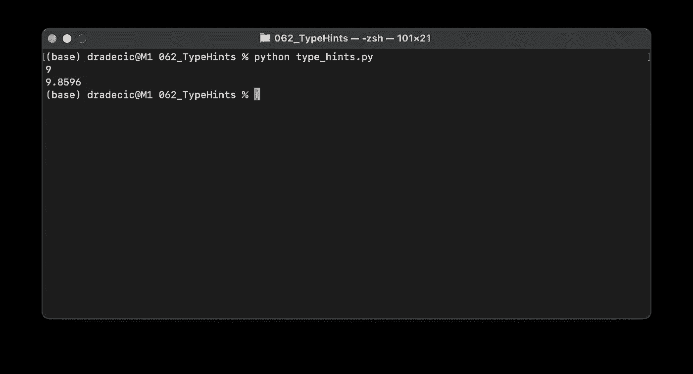
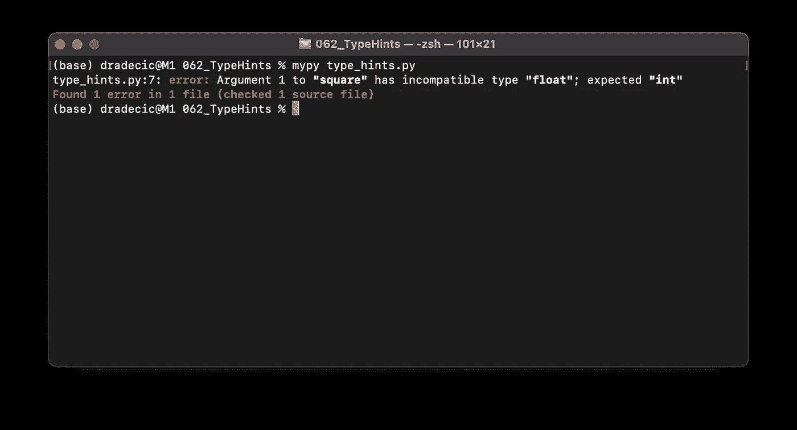

# 用 Python 输入提示——5 分钟内你需要知道的一切

> 原文：<https://towardsdatascience.com/type-hints-in-python-everything-you-need-to-know-in-5-minutes-24e0bad06d0b?source=collection_archive---------8----------------------->

## 在 Python 脚本中实现类型提示和静态类型检查。包括源代码。


照片由[Robbie Down](https://unsplash.com/@robbiedown?utm_source=unsplash&utm_medium=referral&utm_content=creditCopyText)on[Unsplash](https://unsplash.com/?utm_source=unsplash&utm_medium=referral&utm_content=creditCopyText)

Python 一直是一种动态类型语言，这意味着您不必为变量和函数返回值指定数据类型。PEP 484 引入了类型提示——一种让 Python 感觉静态类型化的方法。

虽然类型提示可以帮助您更好地构建项目，但它们只是提示，默认情况下不会影响运行时。然而，有一种方法可以在运行时强制进行类型检查，我们将在了解一些基础知识之后，在今天探索这种方法。

这篇文章的结构如下:

*   类型提示简介
*   注释变量
*   探索打字模块
*   在运行时强制类型检查
*   最后的想法

# 类型提示简介

如果您来自 C 或 Java 之类的语言，指定数据类型不会让人感到陌生。但是，如果你正在学习 Python，几乎没有在线课程和书籍提到数据类型规范来简化事情。

随着代码库变得越来越大，类型提示可以帮助调试和防止一些愚蠢的错误。如果你使用的是像 *PyCharm* 这样的 IDE，只要你使用了错误的数据类型，只要你使用了类型提示，你就会得到一条警告消息。

让我们从简单的开始，探索一个没有类型提示的函数:

```
def add_numbers(num1, num2):
    return num1 + num2print(add_numbers(3, 5)) # 8
```

这里没有什么突破性的东西，但是我故意声明了这样一个函数，因为整数和浮点数相加都可以。我们将在后面讨论如何用类型提示来指定这两者。

下面是如何向我们的函数添加类型提示:

*   在每个函数参数后添加一个冒号和一个数据类型
*   在函数后添加一个箭头(`->`)和一个数据类型，以指定返回的数据类型

就代码而言，您应该进行以下更改:

```
def add_numbers(num1: int, num2: int) -> int:
    return num1 + num2print(add_numbers(3, 5)) # 8
```

干净利落。如果你正在使用一个不应该返回任何东西的函数，你可以指定`None`作为返回类型:

```
def add_numbers(num1: int, num2: int) -> None:
    print(num1 + num2)add_numbers(3, 5) # 8
```

最后，您还可以设置参数的默认值，如下所示:

```
def add_numbers(num1: int, num2: int = 10) -> int:
    return num1 + num2print(add_numbers(3)) # 13
```

这一切都很好，但是如果我们决定用浮点数来调用`add_numbers()`函数呢？让我们检查一下:

```
def add_numbers(num1: int, num2: int) -> int:
    return num1 + num2print(add_numbers(3.5, 5.11)) # 8.61
```

如你所见，一切都还正常。默认情况下，添加类型提示没有运行时效果。像`mypy`这样的静态类型检查器可以解决这个“问题”,但是稍后会详细介绍。

接下来让我们探索变量注释。

# 可变注释

就像函数一样，您可以向变量添加类型提示。虽然很有帮助，但是对于简单的函数和脚本来说，变量的类型提示可能有点过于冗长。

让我们来看一个例子:

```
a: int = 3
b: float = 3.14
c: str = 'abc'
d: bool = False
e: list = ['a', 'b', 'c']
f: tuple = (1, 2, 3)
g: dict = {'a': 1, 'b': 2}
```

声明几个变量需要大量的输入。事情可能会变得更加冗长，但稍后会有更多内容。

您还可以在函数中包含变量的类型批注:

```
def greet(name: str) -> str:
    base: str = 'Hello, '
    return f'{base}{name}'greet('Bob')  # Hello, Bob
```

接下来，我们来探索一下内置的`typing`模块。

# 探索`typing`模块

Python 的`typing`模块可以让数据类型注释更加冗长。例如，您可以明确声明一个字符串列表、一个包含三个整数的元组以及一个以字符串为键、整数为值的字典。

方法如下:

```
from typing import List, Tuple, Dicte: List[str] = ['a', 'b', 'c']
f: Tuple[int, int, int] = (1, 2, 3)
g: Dict[str, int] = {'a': 1, 'b': 2}
```

让我们看看如何将这些包含到一个函数中。它将接受一个 floats 列表，并返回带有平方项的相同列表:

```
def squre(arr: List[float]) -> List[float]:
    return [x ** 2 for x in arr]print(squre([1, 2, 3])) # 1, 4, 9
```

如您所见，它也适用于整数。我们稍后会解决这个问题。在此之前，让我们探索一下类型提示中的一个重要概念——`Union`操作符。基本上，它允许您为变量和返回值指定多种可能的数据类型。

下面是前一个函数的实现:

从打字进口联盟

```
def square(arr: List[Union[int, float]]) -> List[Union[int, float]]:
    return [x ** 2 for x in arr]print(squre([1, 2, 3])) # 1, 4, 9
```

该函数现在可以无警告地接受和返回整数或浮点数列表。

最后，让我们探索如何在运行时强制进行类型检查。

# 在运行时强制类型检查

您可以使用`mypy` ( [文档](https://mypy.readthedocs.io/en/stable/))在运行时强制进行类型检查。在此之前，用`pip`或`conda`安装它:

```
pip install mypy
conda install mypy
```

接下来，让我们制作一个 Python 文件。我已经把我的命名为`type_hints.py`:

```
def square(number: int) -> int:
    return number ** 2if __name__ == '__main__':
    print(square(3))
    print(square(3.14))
```

该函数接受整数并对其求平方，至少根据类型提示是这样。在执行时，函数同时用整数和浮点数来计算。下面是使用默认 Python 解释器时发生的情况:



图片 1-使用默认的 Python 解释器(图片由作者提供)

现在用`mypy`:



图 2 —使用 mypy 静态类型检查器(图片由作者提供)

正如你所看到的，`mypy`像宣传的那样工作，所以需要的时候可以随意使用。

接下来让我们总结一下。

# 最后的想法

Python 中的类型提示可能是好事也可能是坏事。一方面，它们有助于代码组织和调试，但另一方面也会使代码变得愚蠢冗长。

为了折衷，我在函数声明中使用了类型提示——参数类型和返回值都是如此——但是对于其他任何东西，比如变量，我一般都避免使用它们。最后，Python 应该很容易编写。

你对类型提示有什么想法？请在下面的评论区告诉我。

喜欢这篇文章吗？成为 [*中等会员*](https://medium.com/@radecicdario/membership) *继续无限制学习。如果你使用下面的链接，我会收到你的一部分会员费，不需要你额外付费。*

[](https://medium.com/@radecicdario/membership) [## 通过我的推荐链接加入 Medium-Dario rade ci

### 作为一个媒体会员，你的会员费的一部分会给你阅读的作家，你可以完全接触到每一个故事…

medium.com](https://medium.com/@radecicdario/membership) 

# 了解更多信息

*   [2021 年学习数据科学的前 5 本书](/top-5-books-to-learn-data-science-in-2020-f43153851f14)
*   [如何使用 Cron 调度 Python 脚本——您需要的唯一指南](/how-to-schedule-python-scripts-with-cron-the-only-guide-youll-ever-need-deea2df63b4e)
*   [Dask 延迟—如何轻松并行化您的 Python 代码](/dask-delayed-how-to-parallelize-your-python-code-with-ease-19382e159849)
*   [如何使用 Python 创建 PDF 报告—基本指南](/how-to-create-pdf-reports-with-python-the-essential-guide-c08dd3ebf2ee)
*   [即使没有大学文凭也要在 2021 年成为数据科学家](/become-a-data-scientist-in-2021-even-without-a-college-degree-e43fa934e55)

# 保持联系

*   关注我的 [Medium](https://medium.com/@radecicdario) 了解更多类似的故事
*   注册我的[简讯](https://mailchi.mp/46a3d2989d9b/bdssubscribe)
*   在 [LinkedIn](https://www.linkedin.com/in/darioradecic/) 上连接