# Typer:使用 Python 在一行代码中构建强大的 CLI

> 原文：<https://towardsdatascience.com/typer-build-powerful-clis-in-one-line-of-code-using-python-321d9aef3be8?source=collection_archive---------14----------------------->

## 在命令行上轻松地向 Python 函数添加参数

# 动机

你有没有想过像下面这样在命令行上快速给 Python 脚本添加参数？

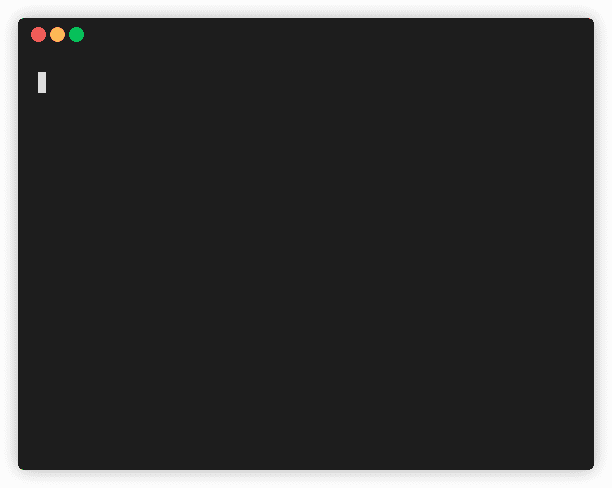

作者 GIF

能够从终端向 Python 脚本插入参数允许您和您的用户在不查看源代码的情况下轻松地试验不同的参数。

[argparse](https://docs.python.org/3/library/argparse.html#module-argparse) 允许你编写命令行界面，但是它的语法很长。

有没有一种方法可以在一行代码中创建命令行界面，如下所示？

这就是 Typer 派上用场的时候。

# Typer 是什么？

Typer 是一个基于 Python 的类型提示构建命令行界面(CLI)应用的库。它是由 FastAPI 的作者 Sebastián Ramírez 创建的。

Typer 书写简短，使用方便。要安装 Typer，请键入:

```
pip install typer
```

# 开始

要使用 Typer 为 Python 脚本创建 CLI，只需将`typer.run(your-Python-function)`添加到代码中。

将上面的文件命名为`get_started.py`。现在当你运行`python get_started.py --help`时，你应该会看到如下所示:

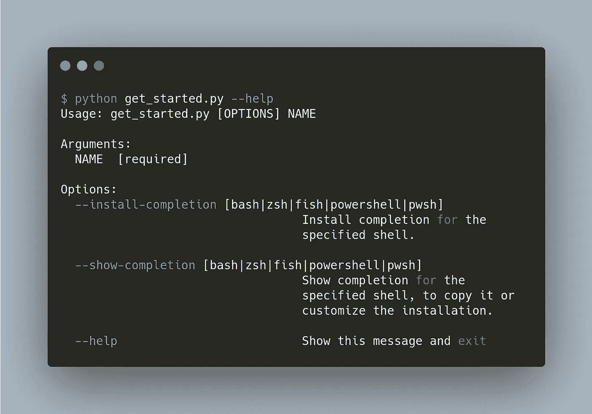

作者图片

通过查看帮助消息，我们知道应该向文件中添加什么参数。

现在尝试在`python get_started.py`旁边插入一个参数，看看我们会得到什么。

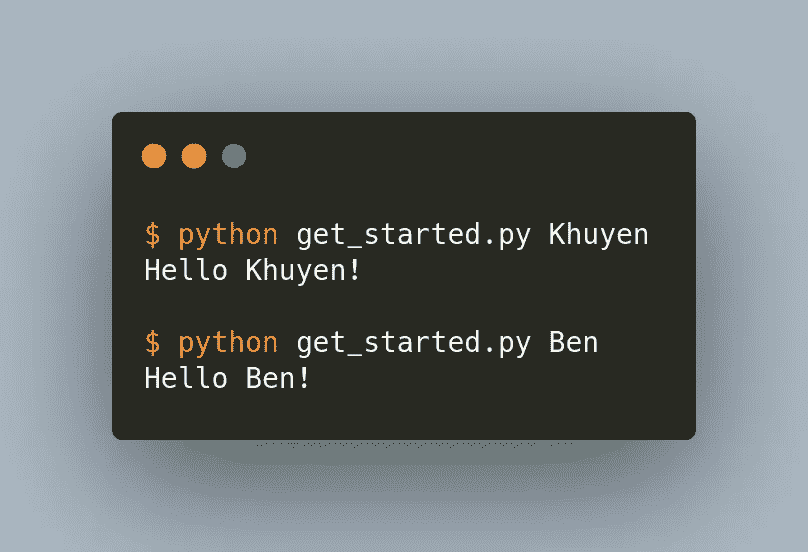

作者图片

酷！当我们改变参数时，输出也会改变。

## 帮助消息

要添加描述函数功能的帮助消息，只需向该函数添加一个 docstring。

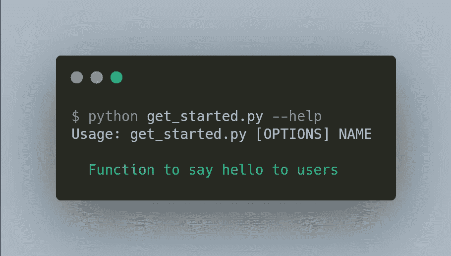

作者图片

# CLI 参数

## 没有默认值的 CLI 参数

好吧，酷。但是如果用户不明白`NAME`的意思呢？这时候`typer.Argument`就派上用场了。

您可以使用`typer.Argument(default_value, help)`向参数添加默认值和帮助消息。

因为参数`name`没有默认值，所以我们使用`...`作为默认值。

您应该会看到如下所示的帮助消息:

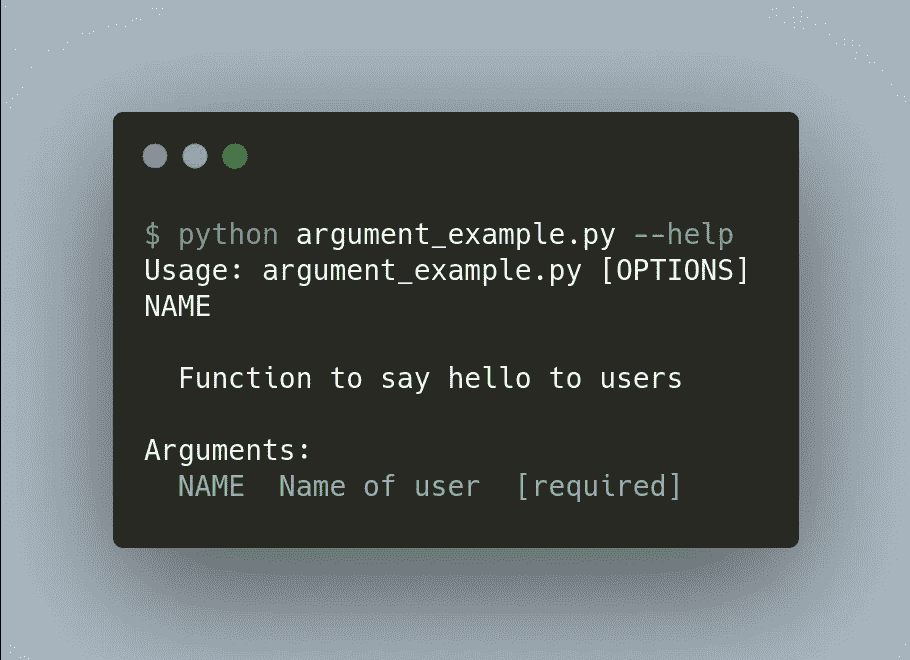

作者图片

请注意，参数`name`是必需的，因为没有默认值。

## 具有默认值的 CLI 参数

如果将默认值添加到参数`name`中，则不再需要该参数。

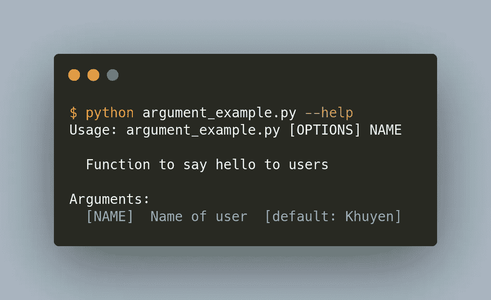

作者图片

现在您可以运行`python argument_example.py`而无需插入任何参数！

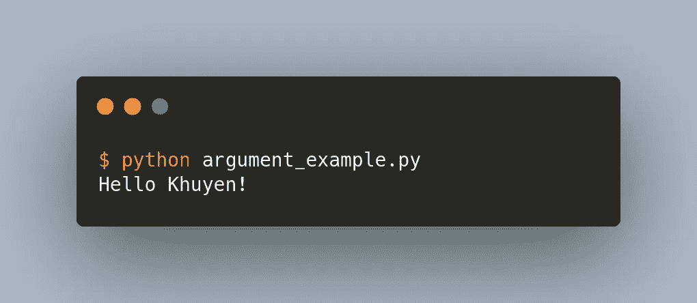

作者图片

## 带选项的 CLI 参数

如果我们希望用户从一个预定义的选项中进行选择，该怎么办？这可以通过使用 enum.Enum 来完成。

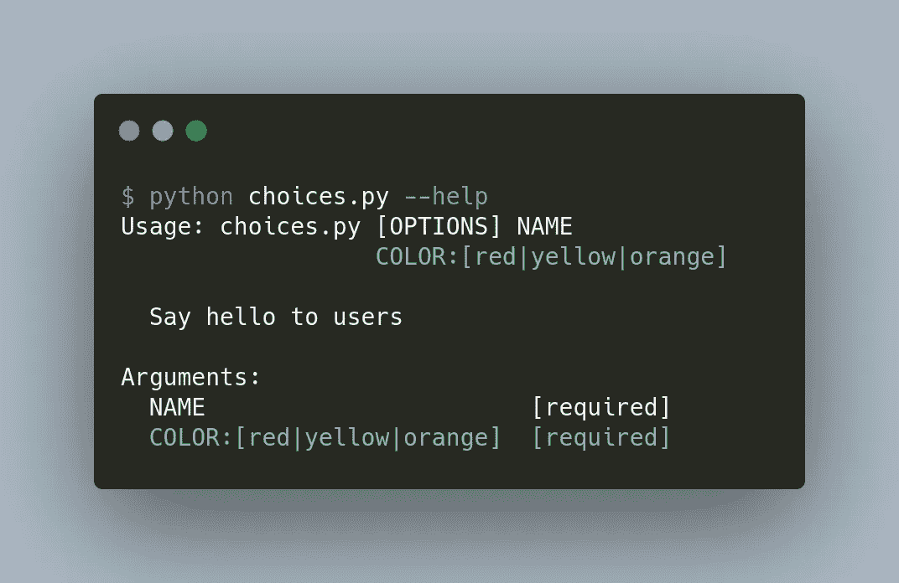

作者图片

不错！现在用户只能选择选项`red`、`yellow`或`orange`中的一个作为参数`color`的值。

# CLI 选项

在下面的代码中，`--is-user`和`--no-is-user`是 CLI 选项。

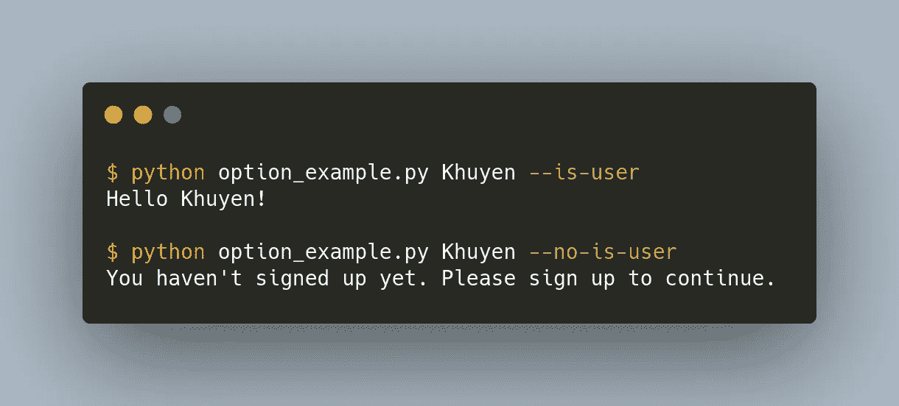

作者图片

虽然 CLI 参数是必需的，但 CLI 选项不是必需的，并且以`--`开始。

## 具有默认值的 CLI 选项

要将函数的参数转换成 CLI 选项，请使用`typer.Option`。

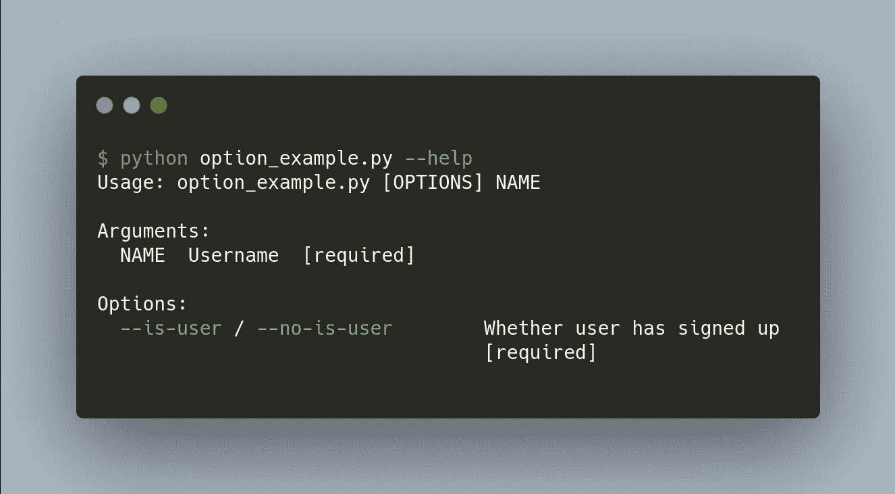

作者图片

酷！由于`--is-user`的数据类型是`bool`，CLI 选项`--no-is-user`也是自动生成的！

当我们使用不同的 CLI 选项时，我们可以看到不同的输出，如下所示。


作者图片

## 没有默认值的 CLI 选项

我们还可以使用带有默认值的 CLI 选项:

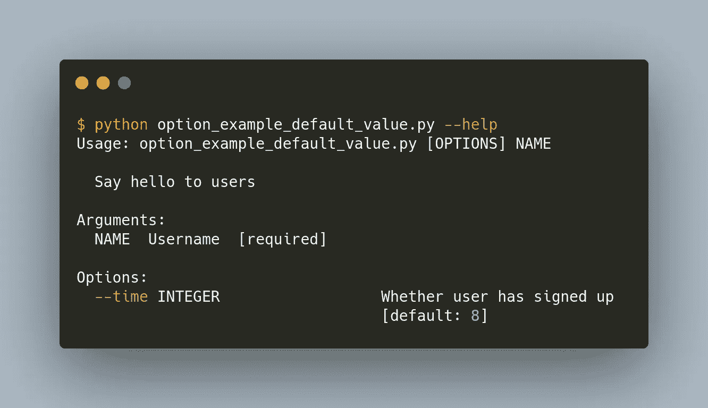

作者图片

现在，我们可以通过使用`--time=value`向 CLI 选项`time`中插入一个新值。

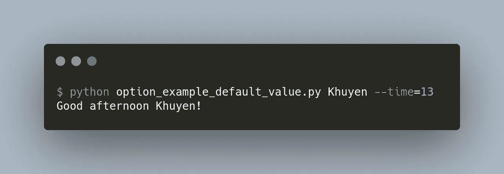

作者图片

注意，由于我们在函数`greeting`中将参数`time`指定为`int`，所以我们只能在`time`中插入一个整数。如果我们插入一个字符串，我们将得到一个错误。

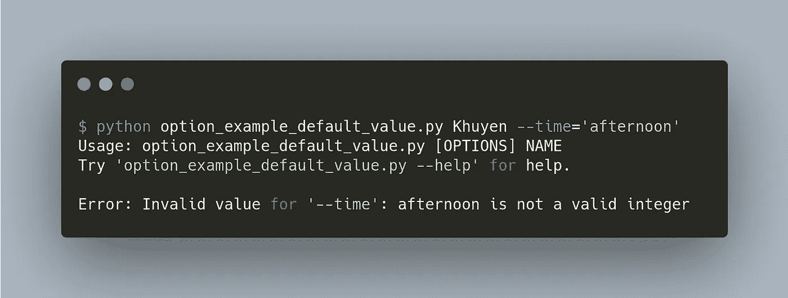

作者图片

## CLI 选项提示

您也可以要求用户使用`prompt=True`插入 CLI 选项。


作者 GIF

注意 Typer 自动把 CLI 选项变成合理的提示！如果您想定制提示，只需将`prompt=True`替换为`prompt=question`:

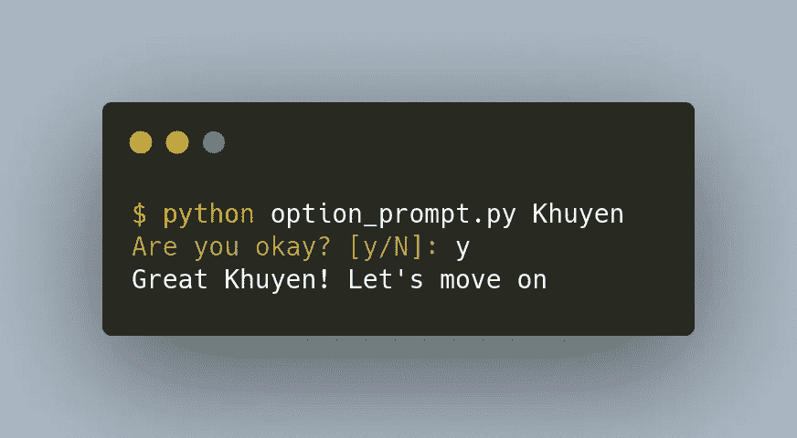

作者图片

# 回收

有时，用户可能会插入无效值。在将这些值用于我们的函数之前，有没有一种方法可以检查它们？

是的，这可以通过在`typer.Argument`或`typer.Option`中添加关键字参数`callback`来实现。

在下面的代码中，我们将函数`check_if_user_exists`传递给`callback`。这个函数检查用户名是否存在。如果用户名不存在，我们抛出一个`typer.BadParameter`异常。

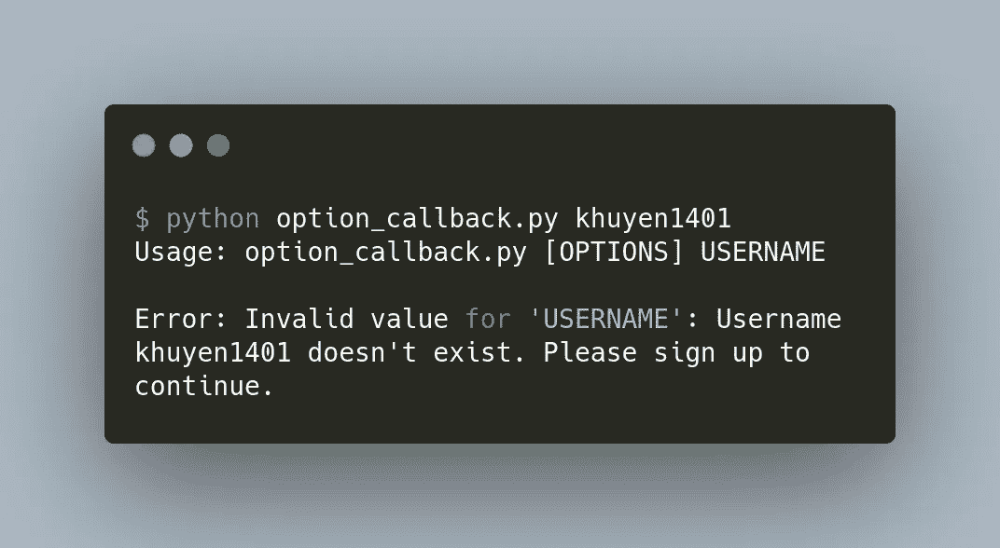

作者图片

# 多个命令

从终端向函数添加参数和选项很酷。但是如果我们在一个 Python 脚本中有不止一个函数呢？这时候装饰师`app.command()`就派上用场了。

在上面的代码中，我们:

*   创建一个名为`app`的新`typer.Typer()`应用程序
*   将`@app.command()`添加到我们想要创建命令的函数中
*   使用`app()`创建一个具有这些功能的 CLI 应用程序

现在`greeting`和`say-bye`都可以作为命令使用了！

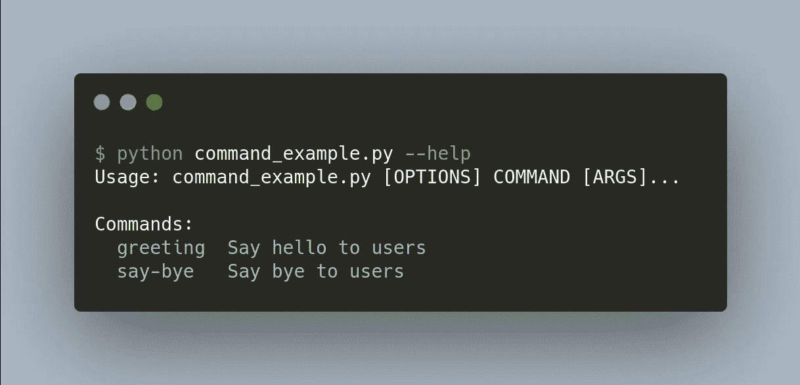

作者图片

只需执行`python file_name.py command`来使用特定的命令。

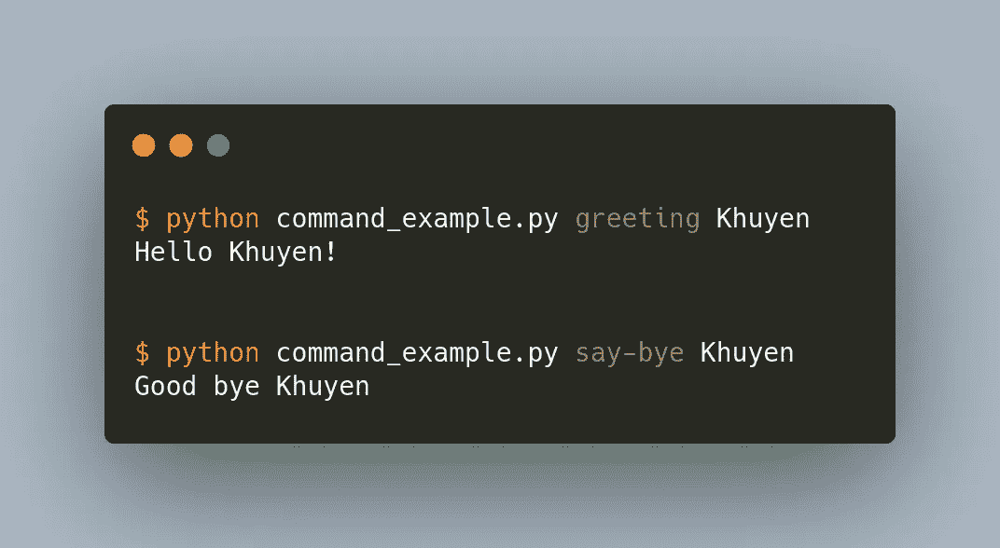

作者图片

多酷啊。

# 结论

恭喜你！您刚刚学习了如何使用 Typer 为您的 Python 脚本创建 CLI 应用程序。使用 Typer，您和您的用户可以毫不费力地将参数插入到 Python 脚本中。

既然为您的函数创建一个 CLI 应用程序只需要一行代码，为什么不试一试呢？

随意发挥，并在这里叉这篇文章的源代码:

<https://github.com/khuyentran1401/Data-science/tree/master/terminal/typer_examples>  

我喜欢写一些基本的数据科学概念，并尝试不同的算法和数据科学工具。你可以在 LinkedIn 和 Twitter 上与我联系。

如果你想查看我写的所有文章的代码，请点击这里。在 Medium 上关注我，了解我的最新数据科学文章，例如:

</2-tools-to-automatically-reload-when-python-files-change-90bb28139087>  </ptpython-a-better-python-repl-6e21df1eb648> [## Ptpython:更好的 Python REPL

towardsdatascience.com](/ptpython-a-better-python-repl-6e21df1eb648) </rich-generate-rich-and-beautiful-text-in-the-terminal-with-python-541f39abf32e> 