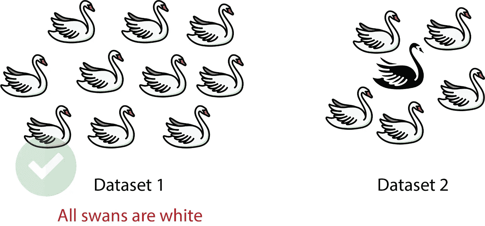

# 数据偏差的类型

> 原文：<https://towardsdatascience.com/types-of-biases-in-data-cafc4f2634fb?source=collection_archive---------5----------------------->

## 数据科学|统计学|机器学习

## 我们都应该知道数据中的偏差，以建立一个可靠而公平的机器学习模型

作者创造的形象

机器学习模型越来越多地用于决策或告知决策。例如，一个模型可能会影响批准贷款的决定，筛选求职申请的候选人简历等。这样的决定是至关重要的，我们需要确信我们的模型不会歧视种族、性别、年龄或任何这样的因素。许多机器学习模型往往包含无意的偏见，这可能导致不可靠和不公平的结果。建立和评估一个好的机器学习模型需要做的不仅仅是计算损失指标。在操作一个模型之前，分析你的训练数据，有时分析数据的来源以寻找偏差是很重要的。

在这篇文章中，我们将看看在训练数据中可能出现的不同类型的偏差。

**1。报告偏差:**

当一个数据集中只捕获了一部分结果或成果时，就会出现报告偏差(也称为选择性报告)，这通常只涵盖整个现实世界数据的一小部分。人们倾向于少报所有可获得的信息。

报告偏差的类型-

1.  **引用偏差**:当你的分析基于在其他研究的引用中发现的研究时出现。
2.  **语言偏见:**当你忽略了不是用你的母语发表的报告时就会出现。
3.  **重复发表偏倚**:当一些研究因为在多个地方发表而权重较大时，会出现重复发表偏倚。
4.  **定位偏差:**发生在某些研究比其他研究更难定位的时候。
5.  **发表偏倚**:当具有阳性发现的研究比具有阴性发现或无显著发现的研究更有可能被发表时出现。
6.  **结果报告偏倚**:当选择性报告某些结果时出现。例如，只有当公司在季度报告中公布正收益时，你才需要报告。
7.  **时滞偏差**:当一些研究需要数年才能发表时，就会出现时滞偏差。

## **2。自动化偏差**

自动化偏见是人类倾向于支持自动化系统产生的结果或建议，而忽略非自动化系统产生的矛盾信息，即使它是正确的。

点击阅读自动化偏差[的真实例子。](https://www.newyorker.com/science/maria-konnikova/hazards-automation)

## 3.选择偏差

当选择数据的方式不能反映真实世界的数据分布时，就会产生选择偏差。这是因为在收集数据时没有实现适当的随机化。

选择偏差的类型

1.  **抽样偏倚:**在数据收集过程中没有正确实现随机化时出现。
2.  **收敛偏差:**当数据没有以有代表性的方式选择时发生。例如，当你只通过调查购买了你的产品的顾客而不是另外一半来收集数据时，你的数据集并不代表没有购买你的产品的人群。
3.  **参与偏差:**由于数据收集过程中的参与差距，当数据不具有代表性时发生。

所以让我们假设苹果推出了新的 iPhone，三星在同一天推出了新的 Galaxy Note。你向 1000 人发出调查问卷，收集他们的评论。现在，您决定选择对您的调查做出回应的前 100 名客户，而不是随机选择回应进行分析。这将导致**抽样偏差**，因为前 100 名客户更有可能对产品充满热情，并有可能提供良好的评价。

接下来，如果你决定通过选择退出三星客户，只调查苹果客户来收集数据，你将在你的数据集中引入**收敛偏差**。

最后，您将调查发送给 500 名苹果和 500 名三星客户。400 名苹果客户回复，但只有 100 名三星客户回复。现在，该数据集将不能充分代表三星客户，并将计入**参与偏差**。

## 4.过度概括偏差

作者创造的形象

当您假定您在数据集中看到的内容就是您在任何其他旨在评估相同信息的数据集中看到的内容时，就会发生过度概括，而不管数据集的大小如何。

## 5.群体归因偏差

人们往往会因为群体中几个人的行为而对整个群体产生刻板印象。这种将个体的真实情况推广到他们所属的整个群体的倾向被称为群体归因偏差。

群体归因偏差的类型-

1.  **群体内偏见:**当你偏爱你个人所属的群体或与你有共同兴趣的群体成员时，就会产生这种偏见。例如，为数据科学家职位创建职位描述的经理认为，合适的申请人必须拥有硕士学位，因为他/她也有硕士学位(与其工作经验无关)。
2.  **群体外偏见:**当你对一个群体中你个人不属于的个体成员产生刻板印象时，就会产生这种偏见。例如，一位经理(拥有硕士学位)为一个数据科学家职位创建了一个职位描述，他认为没有硕士学位的申请人不具备该职位所需的足够专业知识。

## 6.隐性偏见

当基于个人经验做出的假设不一定适用于更普遍的情况时，就会产生隐性偏见。人们倾向于基于偏见和成见行事，而不是有意为之。

例如，来自北美的计算机视觉工程师将红色标记为危险。然而，红色在中国文化中是一种流行的颜色，象征着幸运、快乐和幸福。

隐性偏见的类型

1.  **确认偏差或实验者偏差:**是以确认或支持自己先前信念或经验的方式搜索信息的倾向。例如，您训练了一个模型，使用一些特征根据跑车的速度对它们进行排序。你的模型结果显示法拉利比福特快。然而，几年前你记得看了一部福特击败法拉利的电影，你相信福特比法拉利更快，所以你继续训练和运行模型，直到模型给出你相信的结果。

感谢您的阅读。如果您有更多问题，请通过 LinkedIn 联系我们。

<https://swapnilin.github.io/> 